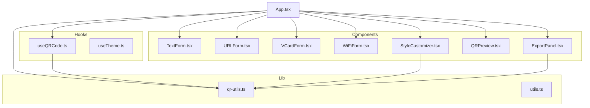
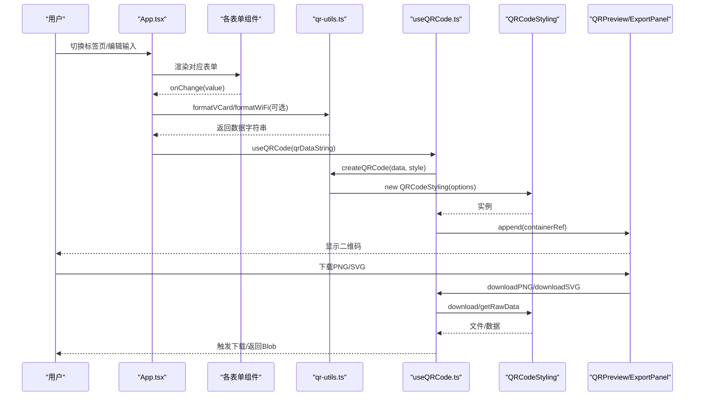
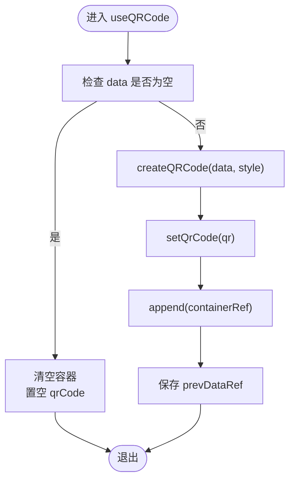
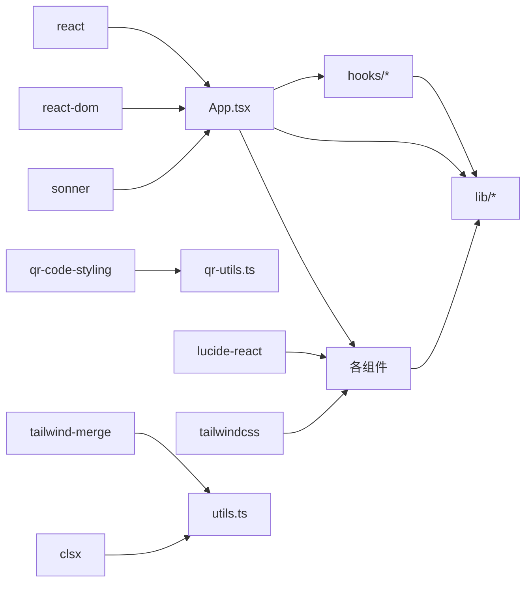

# API参考

<cite>
**本文引用的文件**
- [src/hooks/useQRCode.ts](file://src/hooks/useQRCode.ts)
- [src/hooks/useTheme.ts](file://src/hooks/useTheme.ts)
- [src/lib/qr-utils.ts](file://src/lib/qr-utils.ts)
- [src/lib/utils.ts](file://src/lib/utils.ts)
- [src/components/forms/TextForm.tsx](file://src/components/forms/TextForm.tsx)
- [src/components/forms/URLForm.tsx](file://src/components/forms/URLForm.tsx)
- [src/components/forms/VCardForm.tsx](file://src/components/forms/VCardForm.tsx)
- [src/components/forms/WiFiForm.tsx](file://src/components/forms/WiFiForm.tsx)
- [src/components/StyleCustomizer.tsx](file://src/components/StyleCustomizer.tsx)
- [src/components/QRPreview.tsx](file://src/components/QRPreview.tsx)
- [src/components/ExportPanel.tsx](file://src/components/ExportPanel.tsx)
- [src/App.tsx](file://src/App.tsx)
- [package.json](file://package.json)
</cite>

## 目录
1. [简介](#简介)
2. [项目结构](#项目结构)
3. [核心组件](#核心组件)
4. [架构总览](#架构总览)
5. [详细组件分析](#详细组件分析)
6. [依赖分析](#依赖分析)
7. [性能考虑](#性能考虑)
8. [故障排除指南](#故障排除指南)
9. [结论](#结论)
10. [附录](#附录)

## 简介
本API参考文档面向QR码生成器项目的开发者与使用者，系统性地梳理了公共接口与内部实现，涵盖：
- 工厂函数：createQRCode
- 数据格式化函数：formatVCard、formatWiFi
- 样式配置接口：QRStyleOptions 及其相关枚举与常量
- Hook API：useQRCode、useTheme
- 组件 Props 定义、事件处理与状态管理
- TypeScript 类型定义、接口继承关系与泛型使用
- 实际使用示例与错误处理策略

## 项目结构
项目采用基于功能分层的组织方式，主要模块如下：
- hooks：React Hooks，封装二维码生成与主题切换逻辑
- lib：通用工具与类型定义，包含二维码生成器与UI辅助函数
- components：表单组件、布局组件与业务组件（预览、导出、样式定制）
- App：应用入口与页面编排

图表来源
- [src/App.tsx:1-173](file://src/App.tsx#L1-L173)
- [src/hooks/useQRCode.ts:1-75](file://src/hooks/useQRCode.ts#L1-L75)
- [src/hooks/useTheme.ts:1-26](file://src/hooks/useTheme.ts#L1-L26)
- [src/lib/qr-utils.ts:1-151](file://src/lib/qr-utils.ts#L1-L151)
- [src/lib/utils.ts:1-7](file://src/lib/utils.ts#L1-L7)
- [src/components/forms/TextForm.tsx:1-28](file://src/components/forms/TextForm.tsx#L1-L28)
- [src/components/forms/URLForm.tsx:1-33](file://src/components/forms/URLForm.tsx#L1-L33)
- [src/components/forms/VCardForm.tsx:1-92](file://src/components/forms/VCardForm.tsx#L1-L92)
- [src/components/forms/WiFiForm.tsx:1-67](file://src/components/forms/WiFiForm.tsx#L1-L67)
- [src/components/StyleCustomizer.tsx:1-193](file://src/components/StyleCustomizer.tsx#L1-L193)
- [src/components/QRPreview.tsx:1-45](file://src/components/QRPreview.tsx#L1-L45)
- [src/components/ExportPanel.tsx:1-83](file://src/components/ExportPanel.tsx#L1-L83)

章节来源
- [src/App.tsx:1-173](file://src/App.tsx#L1-L173)
- [package.json:1-37](file://package.json#L1-L37)

## 核心组件
本节聚焦于对外公开的API与类型定义，便于快速查阅与集成。

- 工厂函数
  - createQRCode(data: string, style: QRStyleOptions): QRCodeStyling
    - 功能：根据数据字符串与样式配置创建二维码实例
    - 参数
      - data: string —— 二维码承载的数据字符串
      - style: QRStyleOptions —— 样式配置对象
    - 返回值：QRCodeStyling 实例
    - 错误处理：当 data 为空时，内部会清空容器并返回 null；调用方应确保传入有效数据
    - 使用示例路径：[src/hooks/useQRCode.ts:20-26](file://src/hooks/useQRCode.ts#L20-L26)

- 数据格式化函数
  - formatVCard(data: VCardData): string
    - 功能：将联系人信息格式化为 vCard 文本
    - 参数：VCardData 接口对象
    - 返回值：string（vCard 文本）
    - 使用示例路径：[src/App.tsx:54-56](file://src/App.tsx#L54-L56)
  - formatWiFi(data: WiFiData): string
    - 功能：将WiFi凭证格式化为WIFI:...字符串
    - 参数：WiFiData 接口对象
    - 返回值：string（WIFI配置）
    - 使用示例路径：[src/App.tsx:57-59](file://src/App.tsx#L57-L59)

- 样式配置接口
  - QRStyleOptions
    - 属性
      - fgColor: string —— 前景色
      - bgColor: string —— 背景色
      - dotStyle: QRDotStyle —— 码点样式
      - cornerSquareStyle: QRCornerSquareStyle —— 定位角样式
      - cornerDotStyle: QRCornerDotStyle —— 定位点样式
      - logoUrl: string | null —— 中心Logo地址
      - logoSize: number —— Logo占整体比例（0~1）
      - size: number —— 二维码尺寸（像素）
    - 默认值：defaultStyle
      - 颜色与样式默认值见 [src/lib/qr-utils.ts:103-112](file://src/lib/qr-utils.ts#L103-L112)
    - 可选项
      - dotStyleOptions：码点样式枚举集合
      - cornerSquareOptions：定位角样式枚举集合
      - cornerDotOptions：定位点样式枚举集合
      - exportSizes：导出尺寸集合
      - presetColors：预设配色集合
    - 使用示例路径：[src/components/StyleCustomizer.tsx:15-18](file://src/components/StyleCustomizer.tsx#L15-L18)

- Hook API
  - useQRCode(data: string)
    - 返回
      - style: QRStyleOptions
      - setStyle: (style: QRStyleOptions) => void
      - updateStyle: (updates: Partial<QRStyleOptions>) => void
      - containerRef: RefObject<HTMLDivElement>
      - qrCode: QRCodeStyling | null
      - downloadPNG(size: number): Promise<void>
      - downloadSVG(): Promise<void>
      - getBlob(size: number, format?: "png" | "svg"): Promise<Blob | null>
    - 行为：监听 data 与 style 的变化，自动渲染或更新二维码；支持下载与获取原始数据
    - 错误处理：当 data 为空时，清空容器并置空 qrCode
    - 使用示例路径：[src/hooks/useQRCode.ts:5-74](file://src/hooks/useQRCode.ts#L5-L74)
  - useTheme()
    - 返回
      - isDark: boolean
      - toggle: () => void
    - 行为：检测系统深色偏好并同步到 DOM，提供切换函数
    - 使用示例路径：[src/hooks/useTheme.ts:3-25](file://src/hooks/useTheme.ts#L3-L25)

章节来源
- [src/lib/qr-utils.ts:14-112](file://src/lib/qr-utils.ts#L14-L112)
- [src/lib/qr-utils.ts:114-151](file://src/lib/qr-utils.ts#L114-L151)
- [src/hooks/useQRCode.ts:5-74](file://src/hooks/useQRCode.ts#L5-L74)
- [src/hooks/useTheme.ts:3-25](file://src/hooks/useTheme.ts#L3-L25)
- [src/App.tsx:47-65](file://src/App.tsx#L47-L65)

## 架构总览
下图展示了从用户输入到二维码渲染与导出的端到端流程。

图表来源
- [src/App.tsx:47-65](file://src/App.tsx#L47-L65)
- [src/lib/qr-utils.ts:63-101](file://src/lib/qr-utils.ts#L63-L101)
- [src/hooks/useQRCode.ts:20-62](file://src/hooks/useQRCode.ts#L20-L62)
- [src/components/QRPreview.tsx:27-33](file://src/components/QRPreview.tsx#L27-L33)
- [src/components/ExportPanel.tsx:21-37](file://src/components/ExportPanel.tsx#L21-L37)

## 详细组件分析

### 工具与类型：qr-utils.ts
- 类型别名与接口
  - QRDataType: "url" | "text" | "vcard" | "wifi"
  - QRDotStyle、QRCornerSquareStyle、QRCornerDotStyle：来自第三方库的类型别名
  - QRStyleOptions：样式配置接口
  - VCardData、WiFiData：数据模型接口
- 工具函数
  - formatVCard：将联系人字段拼接为 vCard 文本
  - formatWiFi：将WiFi字段拼接为WIFI配置字符串
  - createQRCode：根据样式配置构造 QRCodeStyling 实例
  - defaultStyle：默认样式
  - 预设与枚举：dotStyleOptions、cornerSquareOptions、cornerDotOptions、exportSizes、presetColors
- 复杂度与性能
  - formatVCard/formatWiFi 为 O(n) 线性拼接，n为字段数量
  - createQRCode 为 O(1)，但渲染与下载涉及DOM与网络请求
- 错误处理
  - 当 data 为空时，useQRCode 内部清空容器并返回 null
  - getBlob 在无数据时返回 null
- 使用建议
  - 在调用 createQRCode 前确保 style 与 data 合法
  - 使用 defaultStyle 作为初始值，再通过 updateStyle 进行增量更新

章节来源
- [src/lib/qr-utils.ts:8-151](file://src/lib/qr-utils.ts#L8-L151)

### Hook：useQRCode
- 状态与副作用
  - 状态：style、qrCode、containerRef、prevDataRef
  - 副作用：监听 data 与 style，创建/更新二维码并插入容器
- 方法
  - updateStyle(updates: Partial<QRStyleOptions>): 更新样式（浅合并）
  - downloadPNG(size: number): 异步下载PNG
  - downloadSVG(): 异步下载SVG
  - getBlob(size: number, format?: "png" | "svg"): 异步获取Blob
- 错误处理
  - data 为空时清空容器并置空 qrCode
  - 下载/获取前检查 data 是否存在
- 性能优化
  - 使用 useCallback 包装下载与获取方法，避免重渲染导致的重复调用
  - 仅在 data 或 style 变化时重建二维码

图表来源
- [src/hooks/useQRCode.ts:11-29](file://src/hooks/useQRCode.ts#L11-L29)

章节来源
- [src/hooks/useQRCode.ts:5-74](file://src/hooks/useQRCode.ts#L5-L74)

### Hook：useTheme
- 功能：检测系统深色偏好，同步到 DOM 并提供切换函数
- 状态：isDark
- 方法：toggle()
- 注意：在 SSR 环境中需判断 typeof window

章节来源
- [src/hooks/useTheme.ts:3-25](file://src/hooks/useTheme.ts#L3-L25)

### 组件：表单组件
- TextForm
  - Props：value: string, onChange: (val: string) => void
  - 行为：多行文本输入，字符计数提示
- URLForm
  - Props：value: string, onChange: (val: string) => void
  - 行为：URL输入，带图标与提示
- VCardForm
  - Props：value: VCardData, onChange: (val: VCardData) => void
  - 行为：姓名、电话、邮箱、公司、职位、网站等字段输入
- WiFiForm
  - Props：value: WiFiData, onChange: (val: WiFiData) => void
  - 行为：SSID、加密方式、密码、隐藏网络开关；根据加密方式禁用密码输入

章节来源
- [src/components/forms/TextForm.tsx:4-27](file://src/components/forms/TextForm.tsx#L4-L27)
- [src/components/forms/URLForm.tsx:5-32](file://src/components/forms/URLForm.tsx#L5-L32)
- [src/components/forms/VCardForm.tsx:5-91](file://src/components/forms/VCardForm.tsx#L5-L91)
- [src/components/forms/WiFiForm.tsx:6-66](file://src/components/forms/WiFiForm.tsx#L6-L66)

### 组件：样式定制 StyleCustomizer
- Props：style: QRStyleOptions, onStyleChange: (updates: Partial<QRStyleOptions>) => void
- 功能
  - 预设配色选择
  - 自定义前景/背景色
  - 码点样式、定位角样式、定位点样式选择
  - Logo上传与大小调节
- 事件处理
  - 文件读取后通过 onStyleChange 更新 logoUrl
  - 通过 onStyleChange 更新颜色与样式

章节来源
- [src/components/StyleCustomizer.tsx:15-192](file://src/components/StyleCustomizer.tsx#L15-L192)

### 组件：二维码预览 QRPreview
- Props：containerRef: RefObject<HTMLDivElement>, hasData: boolean
- 行为：当有数据时显示容器并渲染二维码；否则显示占位提示

章节来源
- [src/components/QRPreview.tsx:4-44](file://src/components/QRPreview.tsx#L4-L44)

### 组件：导出面板 ExportPanel
- Props：hasData: boolean, onDownloadPNG: (size: number) => Promise<void>, onDownloadSVG: () => Promise<void>
- 功能：选择导出尺寸，触发PNG/SVG下载；内部状态 isExporting 控制按钮禁用
- 事件处理：handlePNG/handleSVG 包裹异步下载并统一处理加载状态

章节来源
- [src/components/ExportPanel.tsx:7-82](file://src/components/ExportPanel.tsx#L7-L82)

### 应用入口：App
- 状态管理
  - activeTab: QRDataType | "batch"
  - 各表单状态：urlData、textData、vcardData、wifiData
- 数据计算
  - qrDataString：根据 activeTab 计算最终数据字符串
  - vcard/wifi 需要通过 formatVCard/formatWiFi 转换
- 集成 useQRCode：接收 style 与下载方法
- UI 结构：Tab导航、输入卡片、样式定制、预览与导出面板

章节来源
- [src/App.tsx:24-173](file://src/App.tsx#L24-L173)

## 依赖分析
- 外部依赖
  - react、react-dom：框架基础
  - qr-code-styling：二维码渲染库
  - lucide-react：图标库
  - sonner：通知提示
  - tailwindcss/tailwind-merge/clsx：样式工具
- 内部依赖
  - hooks 依赖 lib（qr-utils）
  - 组件依赖 lib（utils、qr-utils）
  - App 统一调度表单、样式、预览与导出

图表来源
- [package.json:11-24](file://package.json#L11-L24)
- [src/lib/qr-utils.ts:1-6](file://src/lib/qr-utils.ts#L1-L6)
- [src/lib/utils.ts:1-7](file://src/lib/utils.ts#L1-L7)
- [src/App.tsx:1-22](file://src/App.tsx#L1-L22)

章节来源
- [package.json:11-24](file://package.json#L11-L24)

## 性能考虑
- 渲染优化
  - 使用 useMemo 计算 qrDataString，避免不必要的重渲染
  - useQRCode 内部仅在 data/style 变化时重建二维码
- 下载与导出
  - downloadPNG/downloadSVG 为异步操作，建议在用户交互后触发
  - getBlob 提供更细粒度的控制，适合批量导出或服务端处理
- 样式更新
  - updateStyle 使用 Partial 合并，避免全量替换导致的重绘
- 尺寸与质量
  - exportSizes 提供多种导出尺寸，建议根据用途选择合适分辨率

## 故障排除指南
- 二维码不显示
  - 检查 data 是否为空；当 data 为空时，容器会被清空且 qrCode 置空
  - 确认 containerRef 正确传递给 QRPreview
  - 参考：[src/hooks/useQRCode.ts:11-29](file://src/hooks/useQRCode.ts#L11-L29)
- 下载失败
  - 确保 hasData 为 true，且 data 存在
  - downloadPNG/downloadSVG 会在无数据时直接返回
  - 参考：[src/components/ExportPanel.tsx:21-37](file://src/components/ExportPanel.tsx#L21-L37)
- Logo 未生效
  - 确认 logoUrl 已通过 StyleCustomizer 设置
  - 当设置 logoUrl 时，错误纠正等级会提升至 H
  - 参考：[src/lib/qr-utils.ts:85-98](file://src/lib/qr-utils.ts#L85-L98)
- 深色模式未生效
  - useTheme 依赖浏览器环境，SSR 场景需判断 typeof window
  - 参考：[src/hooks/useTheme.ts:4-12](file://src/hooks/useTheme.ts#L4-L12)

章节来源
- [src/hooks/useQRCode.ts:11-29](file://src/hooks/useQRCode.ts#L11-L29)
- [src/components/ExportPanel.tsx:21-37](file://src/components/ExportPanel.tsx#L21-L37)
- [src/lib/qr-utils.ts:85-98](file://src/lib/qr-utils.ts#L85-L98)
- [src/hooks/useTheme.ts:4-12](file://src/hooks/useTheme.ts#L4-L12)

## 结论
本项目通过清晰的类型定义、简洁的Hook API与模块化的组件设计，提供了易用且可扩展的二维码生成能力。开发者可通过 QRStyleOptions 精细控制外观，借助 useQRCode 快速集成渲染与导出功能，并通过表单组件与样式定制面板构建完整的用户体验。

## 附录

### TypeScript 类型与接口概览
- QRStyleOptions：样式配置
- VCardData、WiFiData：数据模型
- QRDataType：数据类型枚举
- 预设与枚举：dotStyleOptions、cornerSquareOptions、cornerDotOptions、exportSizes、presetColors

章节来源
- [src/lib/qr-utils.ts:14-151](file://src/lib/qr-utils.ts#L14-L151)

### Hook API 使用示例路径
- useQRCode：[src/hooks/useQRCode.ts:5-74](file://src/hooks/useQRCode.ts#L5-L74)
- useTheme：[src/hooks/useTheme.ts:3-25](file://src/hooks/useTheme.ts#L3-L25)

### 组件 Props 与事件处理示例路径
- TextForm：[src/components/forms/TextForm.tsx:4-27](file://src/components/forms/TextForm.tsx#L4-L27)
- URLForm：[src/components/forms/URLForm.tsx:5-32](file://src/components/forms/URLForm.tsx#L5-L32)
- VCardForm：[src/components/forms/VCardForm.tsx:5-91](file://src/components/forms/VCardForm.tsx#L5-L91)
- WiFiForm：[src/components/forms/WiFiForm.tsx:6-66](file://src/components/forms/WiFiForm.tsx#L6-L66)
- StyleCustomizer：[src/components/StyleCustomizer.tsx:15-192](file://src/components/StyleCustomizer.tsx#L15-L192)
- QRPreview：[src/components/QRPreview.tsx:4-44](file://src/components/QRPreview.tsx#L4-L44)
- ExportPanel：[src/components/ExportPanel.tsx:7-82](file://src/components/ExportPanel.tsx#L7-L82)