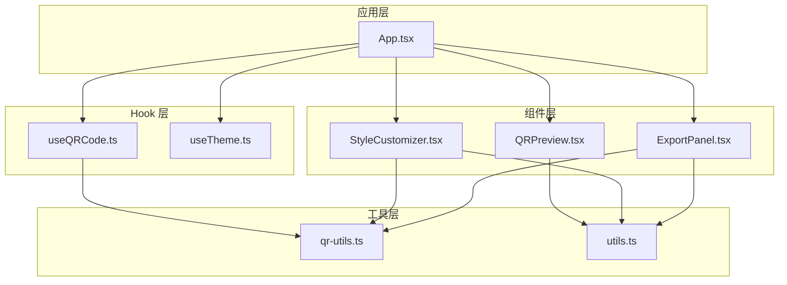
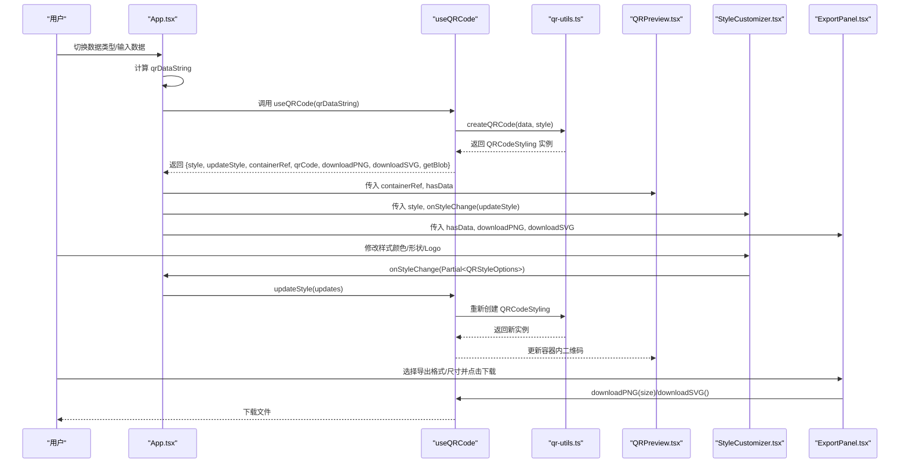
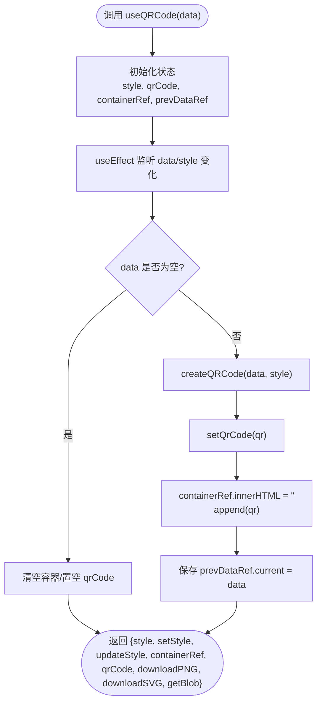
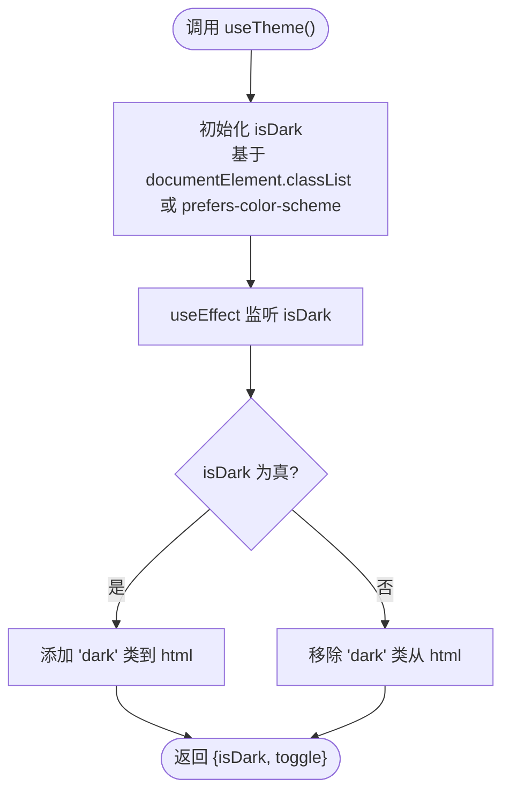
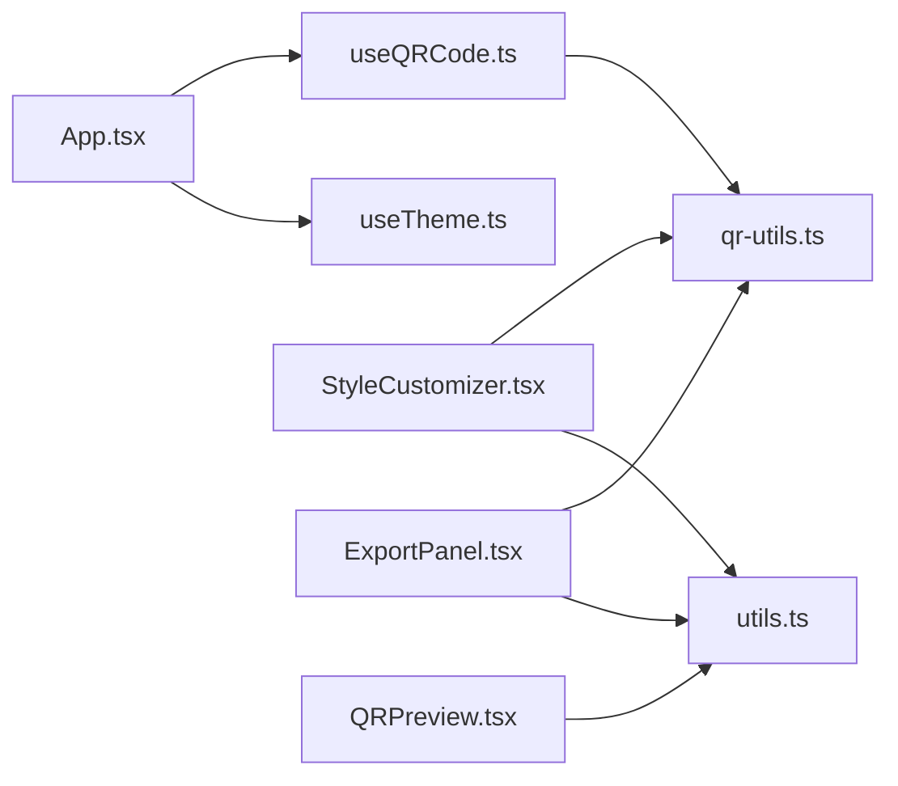

# Hook API

<cite>
**本文引用的文件**
- [useQRCode.ts](file://src/hooks/useQRCode.ts)
- [useTheme.ts](file://src/hooks/useTheme.ts)
- [qr-utils.ts](file://src/lib/qr-utils.ts)
- [utils.ts](file://src/lib/utils.ts)
- [App.tsx](file://src/App.tsx)
- [QRPreview.tsx](file://src/components/QRPreview.tsx)
- [StyleCustomizer.tsx](file://src/components/StyleCustomizer.tsx)
- [ExportPanel.tsx](file://src/components/ExportPanel.tsx)
</cite>

## 更新摘要
**变更内容**
- 更新了useQRCode Hook的getBlob方法文档，新增对Buffer和Uint8Array类型的增强支持
- 增强了getBlob方法的类型处理说明，包括SVG和PNG格式的Buffer数据处理能力
- 补充了Node.js环境下的数据类型兼容性处理说明

## 目录
1. [简介](#简介)
2. [项目结构](#项目结构)
3. [核心组件](#核心组件)
4. [架构总览](#架构总览)
5. [详细组件分析](#详细组件分析)
6. [依赖关系分析](#依赖关系分析)
7. [性能考量](#性能考量)
8. [故障排查指南](#故障排查指南)
9. [结论](#结论)
10. [附录](#附录)

## 简介
本文件系统性梳理并文档化本项目中的两个自定义 Hook：useQRCode 与 useTheme。重点覆盖：
- useQRCode 的状态管理（状态属性、事件处理器、生命周期方法）
- useTheme 的主题切换与样式管理能力
- 每个 Hook 的参数输入、返回值结构与典型使用场景
- Hook 组合使用的示例与最佳实践，帮助开发者在组件中正确使用这些 Hook 并进行状态更新

## 项目结构
本项目采用按功能分层的组织方式，Hook 位于 src/hooks，通用工具位于 src/lib，UI 组件位于 src/components，入口应用位于 src/App.tsx。整体结构清晰，便于维护与扩展。

**图表来源**
- [App.tsx:1-173](file://src/App.tsx#L1-L173)
- [useQRCode.ts:1-105](file://src/hooks/useQRCode.ts#L1-L105)
- [useTheme.ts:1-26](file://src/hooks/useTheme.ts#L1-L26)
- [qr-utils.ts:1-151](file://src/lib/qr-utils.ts#L1-L151)
- [utils.ts:1-7](file://src/lib/utils.ts#L1-L7)
- [QRPreview.tsx:1-45](file://src/components/QRPreview.tsx#L1-L45)
- [StyleCustomizer.tsx:1-193](file://src/components/StyleCustomizer.tsx#L1-L193)
- [ExportPanel.tsx:1-83](file://src/components/ExportPanel.tsx#L1-L83)

**章节来源**
- [App.tsx:1-173](file://src/App.tsx#L1-L173)

## 核心组件
本节对两个 Hook 进行概览式说明，包括职责、输入输出与典型用法。

- useQRCode
  - 职责：负责根据输入数据动态生成二维码，管理样式配置，提供下载与导出能力
  - 输入：字符串类型的数据源
  - 返回：包含样式对象、样式更新函数、容器引用、二维码实例以及下载/导出方法的对象
  - 典型场景：表单输入变化驱动二维码实时更新；样式定制面板联动更新；导出 PNG/SVG

- useTheme
  - 职责：检测并切换深色/浅色主题，持久化到根元素类名
  - 输入：无
  - 返回：包含当前主题状态与切换函数的对象
  - 典型场景：全局主题切换；与系统偏好联动；UI 组件根据主题渲染不同样式

**章节来源**
- [useQRCode.ts:9-105](file://src/hooks/useQRCode.ts#L9-L105)
- [useTheme.ts:3-25](file://src/hooks/useTheme.ts#L3-L25)

## 架构总览
下图展示了应用如何通过 useQRCode 与 useTheme 协作，结合多个 UI 组件完成从数据输入到二维码生成、样式定制与导出的完整流程。

**图表来源**
- [App.tsx:47-65](file://src/App.tsx#L47-L65)
- [useQRCode.ts:15-33](file://src/hooks/useQRCode.ts#L15-L33)
- [qr-utils.ts:63-101](file://src/lib/qr-utils.ts#L63-L101)
- [QRPreview.tsx:27-33](file://src/components/QRPreview.tsx#L27-L33)
- [StyleCustomizer.tsx:20-36](file://src/components/StyleCustomizer.tsx#L20-L36)
- [ExportPanel.tsx:13-37](file://src/components/ExportPanel.tsx#L13-L37)

## 详细组件分析

### useQRCode Hook 详解
- 参数输入
  - data: 字符串，作为二维码编码的数据源
- 状态属性
  - style: QRStyleOptions 类型，包含前景色、背景色、码点样式、定位角样式、定位点样式、Logo 地址、Logo 尺寸、尺寸等
  - qrCode: QRCodeStyling 实例或空，用于控制二维码渲染与导出
  - containerRef: 引用容器，用于挂载二维码 DOM
  - prevDataRef: 上次数据缓存，辅助判断是否需要重建二维码
- 事件处理器与生命周期方法
  - useEffect(data, style): 在数据或样式变化时，创建/更新二维码并在容器中渲染
  - updateStyle(updates): 合并部分样式更新，触发重渲染
  - downloadPNG(size): 以指定尺寸导出 PNG 文件
  - downloadSVG(): 以固定尺寸导出 SVG 文件
  - getBlob(size, format): 获取 PNG 或 SVG 的 Blob 数据，支持多种数据源类型处理
- 返回值结构
  - style: 当前样式对象
  - setStyle: 完全替换样式
  - updateStyle: 部分更新样式
  - containerRef: 容器引用
  - qrCode: 二维码实例
  - downloadPNG, downloadSVG, getBlob: 导出相关方法

**图表来源**
- [useQRCode.ts:9-33](file://src/hooks/useQRCode.ts#L9-L33)
- [qr-utils.ts:63-101](file://src/lib/qr-utils.ts#L63-L101)

**章节来源**
- [useQRCode.ts:9-105](file://src/hooks/useQRCode.ts#L9-L105)
- [qr-utils.ts:14-23](file://src/lib/qr-utils.ts#L14-L23)

#### 使用场景与最佳实践
- 在 App 中根据当前 tab 与表单输入计算 qrDataString，并将其传递给 useQRCode
- 将 containerRef 传给 QRPreview，确保二维码正确挂载
- 将 updateStyle 传给 StyleCustomizer，实现样式联动更新
- 将 downloadPNG/downloadSVG 传给 ExportPanel，支持导出
- 最佳实践
  - 使用 useMemo 计算 qrDataString，避免不必要的重渲染
  - 使用 updateStyle 进行细粒度样式更新，避免 setStyle 导致的全量替换
  - 在导出前检查 hasData，防止空数据导出
  - 在导出过程中禁用按钮，避免重复触发

**章节来源**
- [App.tsx:47-65](file://src/App.tsx#L47-L65)
- [QRPreview.tsx:27-33](file://src/components/QRPreview.tsx#L27-L33)
- [StyleCustomizer.tsx:20-36](file://src/components/StyleCustomizer.tsx#L20-L36)
- [ExportPanel.tsx:13-37](file://src/components/ExportPanel.tsx#L13-L37)

### useTheme Hook 详解
- 参数输入：无
- 状态属性
  - isDark: 布尔值，表示当前是否为深色主题
- 生命周期方法
  - useEffect(isDark): 根据 isDark 动态添加/移除根元素的 dark 类名
- 事件处理器
  - toggle(): 切换 isDark 状态
- 返回值结构
  - isDark: 当前主题状态
  - toggle: 主题切换函数

**图表来源**
- [useTheme.ts:3-25](file://src/hooks/useTheme.ts#L3-L25)

**章节来源**
- [useTheme.ts:3-25](file://src/hooks/useTheme.ts#L3-L25)

#### 使用场景与最佳实践
- 在应用根部调用 useTheme，确保主题状态与系统偏好一致
- 提供一个全局的切换按钮，调用 toggle 切换主题
- 结合 Tailwind 的 dark: 前缀，实现自动主题适配
- 注意在服务端渲染环境中对 window 的存在性进行判断

**章节来源**
- [useTheme.ts:4-12](file://src/hooks/useTheme.ts#L4-L12)

### getBlob 方法增强详解

**更新** 增强了 getBlob 方法，支持 PNG 和 SVG 格式的 Blob 生成能力，包括 Buffer、字符串和 Blob 等多种数据源的类型处理

- 方法签名
  - getBlob(size: number, format: "png" | "svg" = "png"): Promise<Blob | null>
- 参数说明
  - size: number - 导出尺寸大小
  - format: "png" | "svg" - 导出格式，默认为 "png"
- 返回值
  - Promise<Blob | null> - 成功时返回 Blob 对象，失败时返回 null
- 类型处理能力
  - SVG 格式支持：
    - 字符串类型：直接转换为 Blob，类型为 "image/svg+xml"
    - Blob 类型：直接返回原对象
    - Buffer 类型：使用 TextDecoder 解码后转换为 Blob
  - PNG 格式支持：
    - Blob 类型：直接返回原对象
    - Buffer 类型：转换为 Uint8Array 后创建 Blob
- 环境兼容性
  - 浏览器环境：支持 TextDecoder 和 Blob 构造函数
  - Node.js 环境：通过 ArrayBuffer 处理 Buffer 类型数据
- 错误处理
  - 空数据时返回 null
  - RawData 获取失败时返回 null

**更新** 增强了 Buffer 类型的处理能力，现在支持更广泛的二进制数据格式

**章节来源**
- [useQRCode.ts:60-92](file://src/hooks/useQRCode.ts#L60-L92)

#### 使用场景与最佳实践
- 在需要程序化处理二维码导出时使用 getBlob 方法
- 支持将 Blob 数据用于文件下载、Canvas 绘制或其他二进制处理
- 在服务端渲染环境中注意 Buffer 类型的处理
- 结合文件系统 API 进行自定义导出逻辑

**章节来源**
- [useQRCode.ts:60-92](file://src/hooks/useQRCode.ts#L60-L92)

## 依赖关系分析
- useQRCode 依赖 qr-utils.ts 中的 createQRCode 与默认样式 defaultStyle
- App.tsx 通过 useQRCode 与多个组件协作：QRPreview、StyleCustomizer、ExportPanel
- StyleCustomizer 与 ExportPanel 依赖 qr-utils.ts 中的样式选项与导出尺寸配置
- utils.ts 的 cn 工具被多个组件用于合并样式类名

**图表来源**
- [App.tsx:13-65](file://src/App.tsx#L13-L65)
- [useQRCode.ts:1-3](file://src/hooks/useQRCode.ts#L1-L3)
- [qr-utils.ts:1-151](file://src/lib/qr-utils.ts#L1-L151)
- [utils.ts:1-7](file://src/lib/utils.ts#L1-L7)

**章节来源**
- [App.tsx:13-65](file://src/App.tsx#L13-L65)
- [qr-utils.ts:14-23](file://src/lib/qr-utils.ts#L14-L23)

## 性能考量
- useQRCode
  - 仅在 data 或 style 变化时重建二维码，避免频繁创建
  - 使用 useCallback 包装导出与样式更新函数，减少子组件重渲染
  - 使用 containerRef 内容清空后再 append，避免重复挂载
  - getBlob 方法使用缓存的二维码实例，避免重复创建
- useTheme
  - 仅在 isDark 变化时操作根元素类名，开销极低
- App
  - 使用 useMemo 计算 qrDataString，避免不必要的重渲染
  - 将导出过程封装为异步函数并在 finally 中恢复按钮状态，提升交互体验

**章节来源**
- [useQRCode.ts:35-92](file://src/hooks/useQRCode.ts#L35-L92)
- [useQRCode.ts:15-33](file://src/hooks/useQRCode.ts#L15-L33)
- [App.tsx:47-65](file://src/App.tsx#L47-L65)

## 故障排查指南
- 二维码不显示
  - 检查 data 是否为空，空数据会清空容器并置空 qrCode
  - 确认 containerRef 正确传入 QRPreview，并且容器可见
- 样式更新无效
  - 确保使用 updateStyle 而非 setStyle，否则可能丢失其他样式字段
  - 检查传入的样式键是否属于 QRStyleOptions
- 导出失败
  - 确认 hasData 为真，导出函数会在无数据时直接返回
  - 检查浏览器是否允许下载，以及网络资源（如 Logo）可访问
  - 对于 getBlob 方法，确认 format 参数正确且数据源类型支持
- 主题切换无效
  - 确认根元素存在且可写，SSR 环境需判断 typeof window
  - 检查是否存在其他样式覆盖了 dark 类名
- getBlob 方法问题
  - 检查数据源类型是否为支持的 Buffer、字符串或 Blob
  - 在 Node.js 环境中确认 Buffer 类型数据的正确处理
  - 确认 RawData 获取成功，避免返回 null

**章节来源**
- [useQRCode.ts:15-22](file://src/hooks/useQRCode.ts#L15-L22)
- [QRPreview.tsx:27-33](file://src/components/QRPreview.tsx#L27-L33)
- [ExportPanel.tsx:21-37](file://src/components/ExportPanel.tsx#L21-L37)
- [useTheme.ts:4-12](file://src/hooks/useTheme.ts#L4-L12)

## 结论
- useQRCode 提供了完整的二维码生成、样式管理与导出能力，适合在表单与预览组件中组合使用
- useTheme 提供简洁的主题切换逻辑，易于与 UI 库的暗色模式配合
- 通过 useMemo、useCallback 与细粒度状态更新，可显著提升性能与用户体验
- getBlob 方法的增强使其更适合程序化处理和自定义导出需求，特别是在处理二进制数据时更加稳健
- 建议在实际项目中遵循本文档的最佳实践，确保 Hook 的正确使用与稳定运行

## 附录
- QRStyleOptions 字段说明
  - fgColor: 前景色
  - bgColor: 背景色
  - dotStyle: 码点样式
  - cornerSquareStyle: 定位角样式
  - cornerDotStyle: 定位点样式
  - logoUrl: Logo 地址（可空）
  - logoSize: Logo 尺寸比例
  - size: 二维码尺寸
- 默认样式 defaultStyle
  - 提供一组合理的默认配色与样式，便于快速上手
- 导出尺寸 exportSizes
  - 提供常见导出尺寸选项，便于用户选择
- getBlob 方法支持的格式
  - PNG: 图像格式，支持 Buffer 和 Blob 类型
  - SVG: 矢量格式，支持字符串、Blob 和 Buffer 类型

**章节来源**
- [qr-utils.ts:14-23](file://src/lib/qr-utils.ts#L14-L23)
- [qr-utils.ts:103-112](file://src/lib/qr-utils.ts#L103-L112)
- [qr-utils.ts:134-139](file://src/lib/qr-utils.ts#L134-L139)
- [useQRCode.ts:60-92](file://src/hooks/useQRCode.ts#L60-L92)