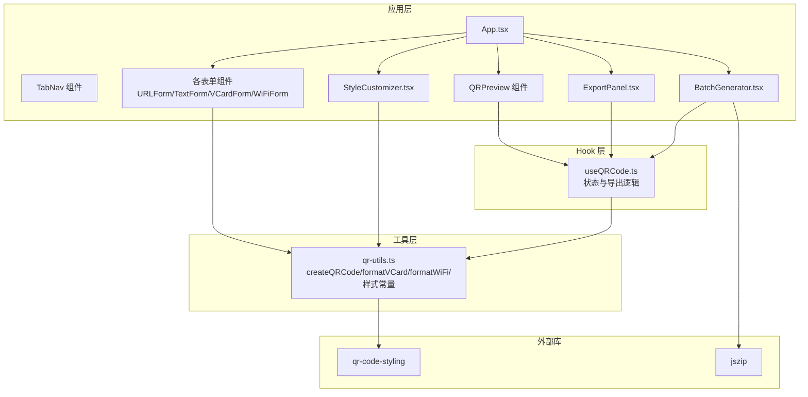
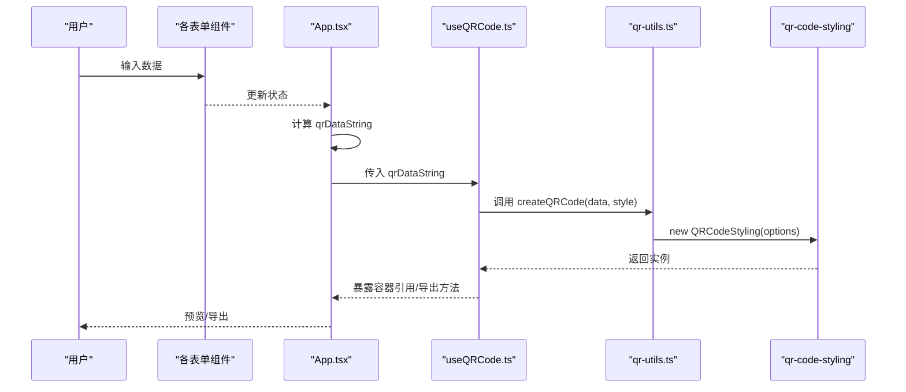
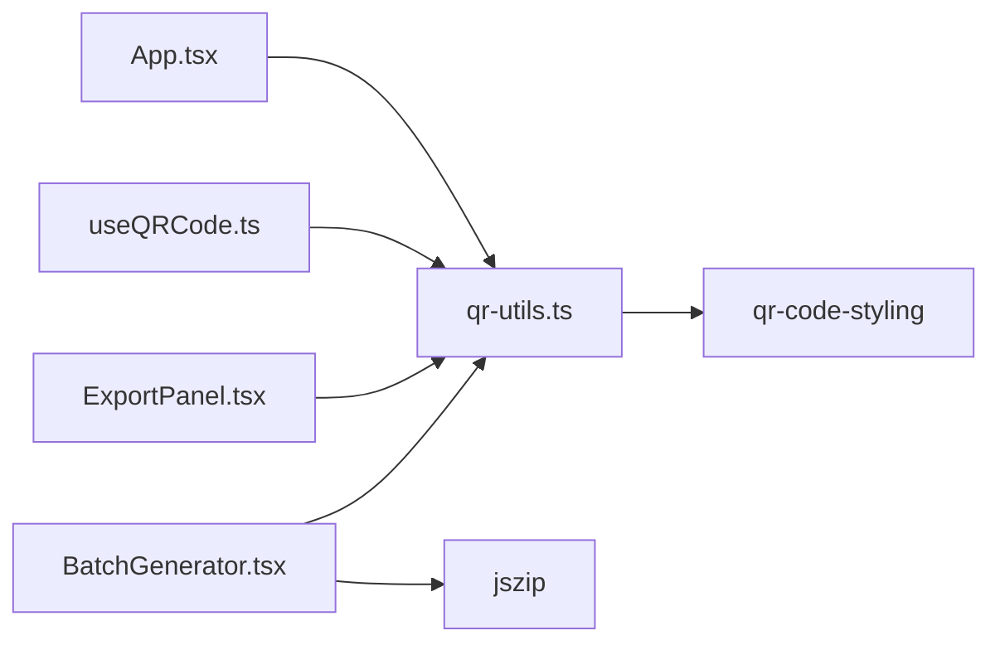

# 工厂函数

<cite>
**本文引用的文件**
- [qr-utils.ts](file://src/lib/qr-utils.ts)
- [useQRCode.ts](file://src/hooks/useQRCode.ts)
- [App.tsx](file://src/App.tsx)
- [VCardForm.tsx](file://src/components/forms/VCardForm.tsx)
- [WiFiForm.tsx](file://src/components/forms/WiFiForm.tsx)
- [ExportPanel.tsx](file://src/components/ExportPanel.tsx)
- [StyleCustomizer.tsx](file://src/components/StyleCustomizer.tsx)
- [BatchGenerator.tsx](file://src/components/BatchGenerator.tsx)
- [package.json](file://package.json)
</cite>

## 目录
1. [简介](#简介)
2. [项目结构](#项目结构)
3. [核心组件](#核心组件)
4. [架构总览](#架构总览)
5. [详细组件分析](#详细组件分析)
6. [依赖分析](#依赖分析)
7. [性能考虑](#性能考虑)
8. [故障排除指南](#故障排除指南)
9. [结论](#结论)
10. [附录](#附录)

## 简介
本文件聚焦于工厂函数的完整API文档，重点覆盖以下内容：
- createQRCode 工厂函数：参数说明、返回值类型、内部实现逻辑、错误处理机制与性能考量
- formatVCard 数据格式化函数：功能、参数要求、输出格式与使用示例
- formatWiFi 数据格式化函数：功能、参数要求、输出格式与使用示例
- 常见使用模式与最佳实践，包括在应用中的集成方式与导出流程

该系统基于 React + TypeScript 构建，使用 qr-code-styling 库进行二维码渲染，并通过自定义工厂函数统一管理二维码生成与样式配置。

## 项目结构
本项目采用按功能模块组织的结构，工厂函数位于通用工具层，业务组件负责数据输入与样式定制，导出与批量生成功能由独立组件提供。

图表来源
- [App.tsx:1-173](file://src/App.tsx#L1-L173)
- [qr-utils.ts:1-151](file://src/lib/qr-utils.ts#L1-L151)
- [useQRCode.ts:1-75](file://src/hooks/useQRCode.ts#L1-L75)
- [ExportPanel.tsx:1-83](file://src/components/ExportPanel.tsx#L1-L83)
- [StyleCustomizer.tsx:1-193](file://src/components/StyleCustomizer.tsx#L1-L193)
- [BatchGenerator.tsx:57-79](file://src/components/BatchGenerator.tsx#L57-L79)

章节来源
- [App.tsx:1-173](file://src/App.tsx#L1-L173)
- [qr-utils.ts:1-151](file://src/lib/qr-utils.ts#L1-L151)

## 核心组件
本节概述与工厂函数直接相关的类型、接口与常量，为后续API文档提供基础。

- 类型与接口
  - QRStyleOptions：二维码样式配置对象，包含前景色、背景色、码点样式、定位角样式、Logo 配置与尺寸等
  - VCardData：vCard 联系人信息结构
  - WiFiData：WiFi 连接凭证结构
  - QRDataType：支持的数据类型枚举（url/text/vcard/wifi）

- 工具常量
  - defaultStyle：默认样式配置
  - dotStyleOptions/cornerSquareOptions/cornerDotOptions：样式选项列表
  - exportSizes：导出尺寸选项
  - presetColors：预设色彩方案

章节来源
- [qr-utils.ts:8-151](file://src/lib/qr-utils.ts#L8-L151)

## 架构总览
工厂函数在应用中的调用链路如下：用户在表单中输入数据 -> 计算最终数据字符串 -> 通过 Hook 使用工厂函数创建二维码实例 -> 渲染到容器或导出为文件。

图表来源
- [App.tsx:46-65](file://src/App.tsx#L46-L65)
- [useQRCode.ts:5-29](file://src/hooks/useQRCode.ts#L5-L29)
- [qr-utils.ts:63-101](file://src/lib/qr-utils.ts#L63-L101)

## 详细组件分析

### createQRCode 工厂函数
- 函数签名与用途
  - 作用：根据给定的数据字符串与样式配置，创建并返回一个 QRCodeStyling 实例，用于渲染或导出二维码
  - 参数
    - data: string，待编码的原始数据字符串
    - style: QRStyleOptions，样式配置对象
  - 返回值
    - QRCodeStyling 实例，可调用 append/download/getRawData 等方法

- 关键实现逻辑
  - 将样式映射为 qr-code-styling 的 Options 结构，包括尺寸、边距、类型、码点与背景、定位角样式、纠错等级等
  - 当存在 logoUrl 时，启用图片嵌入并设置跨域、边距、大小与背景遮挡策略；同时将纠错等级提升至更高级别以保证二维码可读性
  - 最终通过 new QRCodeStyling(options) 返回实例

- 错误处理机制
  - 未显式抛出异常；若传入无效数据或样式，渲染阶段可能失败。建议在调用前确保 data 非空且 style 合法
  - 导出时如数据为空，导出函数会提前返回（参见 useQRCode.ts 中的下载与 getBlob 方法）

- 性能考虑
  - 仅在 data 或 style 变化时触发重新创建与渲染，避免重复计算
  - 导出时可按需调整 size，PNG 默认尺寸较小，SVG 默认较大以保证矢量清晰度
  - 批量导出时建议统一样式并复用实例，减少重复初始化开销

- 使用示例与常见模式
  - 单次渲染：传入当前数据字符串与样式，调用 append 渲染到 DOM 容器
  - 导出 PNG：调用 downloadPNG(size)，指定导出尺寸
  - 导出 SVG：调用 downloadSVG()，使用固定高分辨率
  - 获取 Blob：调用 getBlob(size, format)，用于内联显示或二次处理

章节来源
- [qr-utils.ts:63-101](file://src/lib/qr-utils.ts#L63-L101)
- [useQRCode.ts:5-75](file://src/hooks/useQRCode.ts#L5-L75)
- [ExportPanel.tsx:13-83](file://src/components/ExportPanel.tsx#L13-L83)
- [BatchGenerator.tsx:57-79](file://src/components/BatchGenerator.tsx#L57-L79)

### formatVCard 数据格式化函数
- 功能概述
  - 将 VCardData 结构转换为标准 vCard 文本格式，便于生成 vCard 类型的二维码
  - 输出遵循 vCard 3.0 规范，包含姓名、组织、职位、电话、邮箱、网站等字段

- 参数要求
  - VCardData 对象，至少需要 firstName 或 lastName 之一非空，否则不生成有效数据
  - 其他字段可选，存在时会被写入对应行

- 输出格式
  - 返回字符串，包含 BEGIN/END 标记与多行属性，每行以换行符分隔
  - 示例输出结构（不含具体值）：BEGIN:VCARD\nVERSION:3.0\nN:...;...\nFN:...\n[可选行...]\nEND:VCARD

- 内部实现逻辑
  - 以固定头部与版本行开始，拼接姓名与全名行
  - 条件追加组织、职位、电话、邮箱、网站等行
  - 以结束标记收尾并连接为单个字符串

- 错误处理机制
  - 未显式校验输入；若字段为空，对应行将被省略，不会影响整体输出
  - 建议在调用前确保必要字段非空，或在上层逻辑中判断是否生成有效数据

- 使用示例与最佳实践
  - 在 App.tsx 中，当 vCard 表单中存在姓名时才调用 formatVCard 生成数据字符串
  - 与 createQRCode 集成：先 formatVCard，再传入 createQRCode 生成二维码

章节来源
- [qr-utils.ts:42-56](file://src/lib/qr-utils.ts#L42-L56)
- [App.tsx:54-56](file://src/App.tsx#L54-L56)
- [VCardForm.tsx:1-92](file://src/components/forms/VCardForm.tsx#L1-L92)

### formatWiFi 数据格式化函数
- 功能概述
  - 将 WiFiData 结构转换为标准 WIFI 字段字符串，用于生成 WiFi 类型的二维码
  - 支持 WPA/WPA2、WEP、无密码三种加密方式，并可选择隐藏网络

- 参数要求
  - 必填：ssid、encryption、password（当加密方式非 nopass 时）
  - 可选：hidden（布尔值），决定是否添加隐藏网络标记

- 输出格式
  - 返回字符串，形如 WIFI:T:[加密];S:[SSID];P:[密码];[隐藏标记];，其中隐藏标记在 hidden 为 true 时出现

- 内部实现逻辑
  - 根据 hidden 布尔值动态拼接隐藏标记部分
  - 按固定顺序拼接加密类型、SSID、密码与隐藏标记，最后以分号结尾

- 错误处理机制
  - 未进行输入验证；建议在调用前确保 ssid 非空且加密方式合法
  - 若 password 缺失但加密方式非 nopass，将导致输出不符合预期

- 使用示例与最佳实践
  - 在 App.tsx 中，当 WiFi 表单中存在 SSID 时才调用 formatWiFi 生成数据字符串
  - 与 createQRCode 集成：先 formatWiFi，再传入 createQRCode 生成二维码

章节来源
- [qr-utils.ts:58-61](file://src/lib/qr-utils.ts#L58-L61)
- [App.tsx:57-58](file://src/App.tsx#L57-L58)
- [WiFiForm.tsx:17-67](file://src/components/forms/WiFiForm.tsx#L17-L67)

### 工厂函数与样式系统的协作
- 样式配置
  - QRStyleOptions 提供完整的样式控制，包括前景色、背景色、码点样式、定位角样式、Logo 与尺寸
  - defaultStyle 提供默认值，便于快速初始化
  - 样式选项列表（dotStyleOptions、cornerSquareOptions、cornerDotOptions）用于 UI 下拉选择
  - presetColors 提供常用配色组合，便于一键切换

- 样式更新与导出
  - StyleCustomizer.tsx 通过 onStyleChange 接收变更，更新 QRStyleOptions
  - useQRCode.ts 暴露 updateStyle 方法，结合 createQRCode 重新渲染
  - 导出面板 ExportPanel.tsx 提供 PNG/SVG 导出入口，内部调用 useQRCode.ts 中的下载方法

章节来源
- [qr-utils.ts:103-151](file://src/lib/qr-utils.ts#L103-L151)
- [StyleCustomizer.tsx:1-193](file://src/components/StyleCustomizer.tsx#L1-L193)
- [useQRCode.ts:31-73](file://src/hooks/useQRCode.ts#L31-L73)
- [ExportPanel.tsx:13-83](file://src/components/ExportPanel.tsx#L13-L83)

## 依赖分析
- 外部依赖
  - qr-code-styling：二维码渲染与导出的核心库
  - jszip：批量导出时用于打包多个二维码图像
  - react、react-dom：前端框架
  - 其他 UI 与工具库：用于界面与通知等

- 内部依赖关系
  - App.tsx 依赖 qr-utils.ts 中的格式化函数与类型
  - useQRCode.ts 依赖 qr-utils.ts 中的 createQRCode 与默认样式
  - ExportPanel.tsx 依赖 qr-utils.ts 中的导出尺寸选项
  - BatchGenerator.tsx 依赖 qr-utils.ts 中的默认样式与导出尺寸

图表来源
- [App.tsx:14-20](file://src/App.tsx#L14-L20)
- [useQRCode.ts:2-3](file://src/hooks/useQRCode.ts#L2-L3)
- [ExportPanel.tsx](file://src/components/ExportPanel.tsx#L3)
- [BatchGenerator.tsx:57-79](file://src/components/BatchGenerator.tsx#L57-L79)
- [qr-utils.ts:1-6](file://src/lib/qr-utils.ts#L1-L6)

章节来源
- [package.json:11-24](file://package.json#L11-L24)
- [qr-utils.ts:1-6](file://src/lib/qr-utils.ts#L1-L6)
- [useQRCode.ts:1-3](file://src/hooks/useQRCode.ts#L1-L3)

## 性能考虑
- 渲染与更新
  - useQRCode.ts 通过 useEffect 监听 data 与 style 的变化，仅在必要时重建 QRCode 实例并重新渲染，避免不必要的重绘
  - 建议在高频更新场景下合并状态变更，减少渲染次数

- 导出优化
  - PNG 导出默认使用适中尺寸，SVG 导出使用较高分辨率以保证矢量清晰度
  - 批量导出时建议统一尺寸与样式，避免重复初始化实例

- 资源加载
  - Logo 图片通过 FileReader 读取为 DataURL，注意大图可能导致内存占用上升
  - 导出时如数据为空，导出函数会提前返回，避免无效操作

[本节为通用性能建议，不直接分析特定文件]

## 故障排除指南
- 二维码无法渲染
  - 检查 data 是否为空；空数据会导致容器清空或实例未创建
  - 检查 style 配置是否合法（颜色、样式、尺寸等）

- 导出失败或空白
  - 确认 hasData 为真后再触发导出
  - 检查浏览器下载权限与弹窗拦截设置

- Logo 不显示
  - 确认 logoUrl 已正确设置，且图片可访问
  - 调整 logoSize 以适配二维码比例

- vCard/WiFi 数据无效
  - vCard：确保 firstName 或 lastName 至少一项非空
  - WiFi：确保 ssid 非空，且当加密方式非 nopass 时提供 password

章节来源
- [useQRCode.ts:11-29](file://src/hooks/useQRCode.ts#L11-L29)
- [ExportPanel.tsx:21-37](file://src/components/ExportPanel.tsx#L21-L37)
- [App.tsx:54-58](file://src/App.tsx#L54-L58)

## 结论
本工厂函数体系提供了简洁而强大的二维码生成能力：
- createQRCode 工厂函数统一了样式与数据的绑定，支持灵活的渲染与导出
- formatVCard 与 formatWiFi 函数分别针对联系人与 WiFi 数据提供标准化输出
- 通过 Hook 与组件的配合，实现了从数据输入到预览导出的完整工作流
- 在性能与可用性方面具备良好表现，适合在生产环境中使用

[本节为总结性内容，不直接分析特定文件]

## 附录

### API 参考速查
- createQRCode(data: string, style: QRStyleOptions): QRCodeStyling
  - 用途：创建二维码实例
  - 注意：data 非空，style 合法
- formatVCard(data: VCardData): string
  - 用途：生成 vCard 文本
  - 注意：至少提供 firstName 或 lastName
- formatWiFi(data: WiFiData): string
  - 用途：生成 WiFi 文本
  - 注意：ssid 非空；当加密方式非 nopass 时提供 password

### 常见使用模式
- 单次渲染：传入当前数据字符串与样式，调用 append 渲染到容器
- 导出 PNG：传入导出尺寸，调用 downloadPNG
- 导出 SVG：调用 downloadSVG
- 批量导出：遍历数据项，统一样式，逐个导出并打包

### 最佳实践
- 在上层逻辑中对必填字段进行校验，避免生成无效数据
- 合理设置尺寸与样式，平衡清晰度与文件体积
- 批量导出时统一尺寸与样式，减少重复初始化开销
- 使用默认样式作为起点，逐步微调以获得一致体验

[本节为通用指导，不直接分析特定文件]