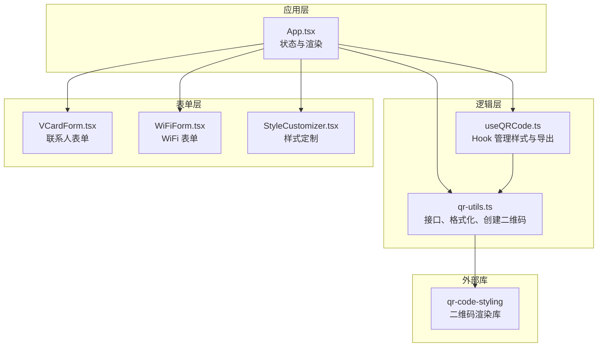
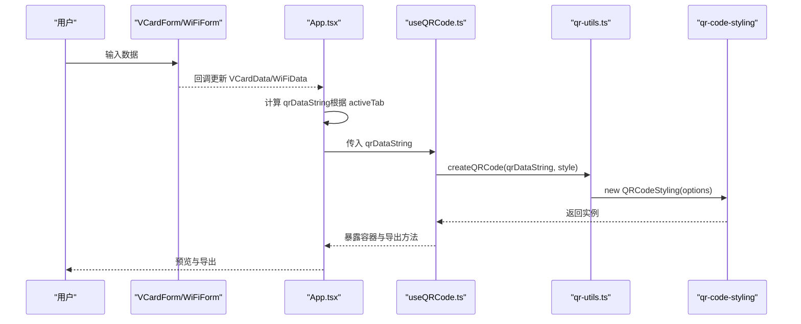
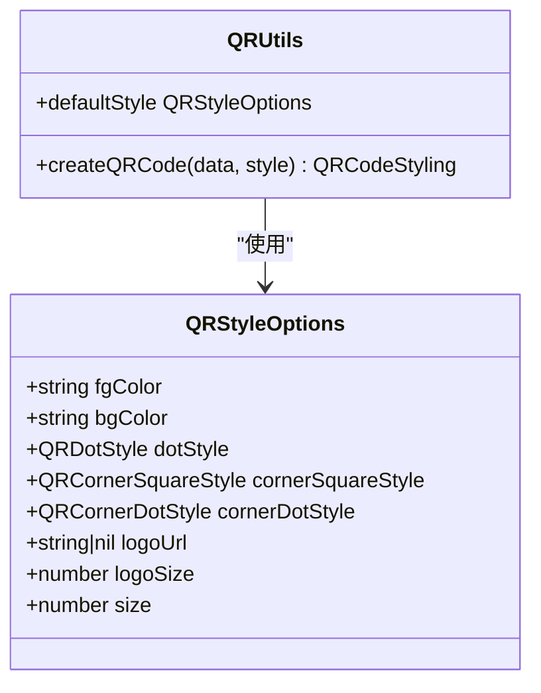
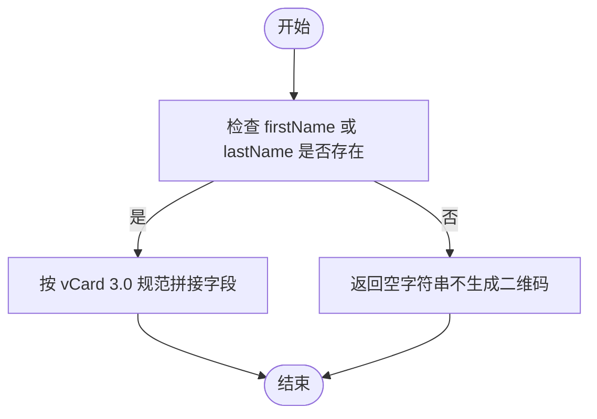
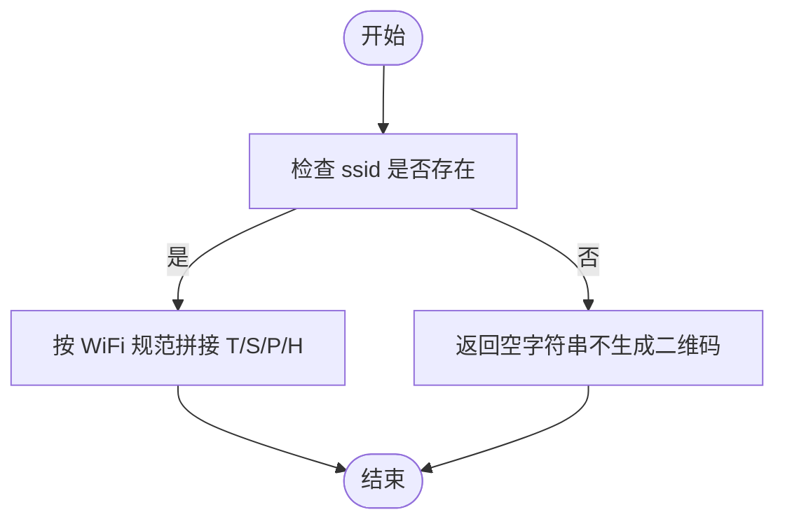
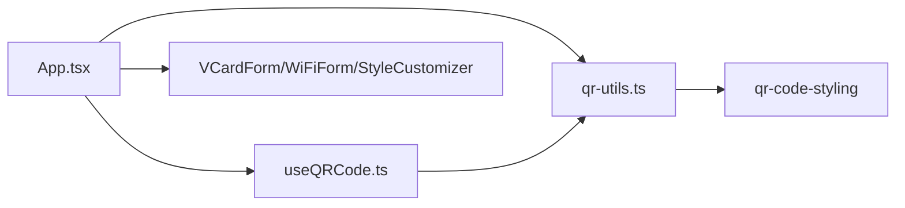

# 核心接口

<cite>
**本文引用的文件**
- [src/lib/qr-utils.ts](file://src/lib/qr-utils.ts)
- [src/hooks/useQRCode.ts](file://src/hooks/useQRCode.ts)
- [src/App.tsx](file://src/App.tsx)
- [src/components/forms/VCardForm.tsx](file://src/components/forms/VCardForm.tsx)
- [src/components/forms/WiFiForm.tsx](file://src/components/forms/WiFiForm.tsx)
- [src/components/StyleCustomizer.tsx](file://src/components/StyleCustomizer.tsx)
- [package.json](file://package.json)
</cite>

## 目录
1. [简介](#简介)
2. [项目结构](#项目结构)
3. [核心组件](#核心组件)
4. [架构总览](#架构总览)
5. [详细组件分析](#详细组件分析)
6. [依赖分析](#依赖分析)
7. [性能考虑](#性能考虑)
8. [故障排查指南](#故障排查指南)
9. [结论](#结论)
10. [附录：TypeScript 类型定义与示例](#附录typescript-类型定义与示例)

## 简介
本文件聚焦于项目中的核心接口与类型定义，包括：
- QRStyleOptions 样式配置接口
- VCardData 联系人数据接口
- WiFiData WiFi 凭证接口
- QRDataType 数据类型枚举

文档将从字段定义、数据类型、默认值与使用约束出发，并结合实际代码示例，说明这些接口在应用中的组合使用方式与最佳实践。

## 项目结构
本项目采用 React + TypeScript 构建，核心逻辑集中在 lib 层（qr-utils.ts）与 hooks 层（useQRCode.ts），UI 表单层负责数据输入与样式定制，App.tsx 统一调度数据与样式，最终通过 QRCodeStyling 渲染二维码。

图表来源
- [src/App.tsx:14-65](file://src/App.tsx#L14-L65)
- [src/hooks/useQRCode.ts:1-75](file://src/hooks/useQRCode.ts#L1-L75)
- [src/lib/qr-utils.ts:1-151](file://src/lib/qr-utils.ts#L1-L151)

章节来源
- [src/App.tsx:1-173](file://src/App.tsx#L1-L173)
- [src/hooks/useQRCode.ts:1-75](file://src/hooks/useQRCode.ts#L1-L75)
- [src/lib/qr-utils.ts:1-151](file://src/lib/qr-utils.ts#L1-L151)

## 核心组件
本节对四个核心接口进行逐项说明，涵盖字段、类型、默认值与约束。

- QRDataType（数据类型枚举）
  - 定义：支持 "url" | "text" | "vcard" | "wifi"
  - 用途：用于切换不同数据输入面板与生成策略
  - 使用约束：仅允许上述四个值；与各表单组件配合使用
  - 参考路径：[src/lib/qr-utils.ts:8](file://src/lib/qr-utils.ts#L8)

- QRStyleOptions（样式配置接口）
  - 字段与类型
    - fgColor: string（前景色）
    - bgColor: string（背景色）
    - dotStyle: QRDotStyle（码点样式）
    - cornerSquareStyle: QRCornerSquareStyle（定位角样式）
    - cornerDotStyle: QRCornerDotStyle（定位点样式）
    - logoUrl: string | null（Logo 地址或空）
    - logoSize: number（Logo 占比，范围建议参考样式定制组件）
    - size: number（二维码尺寸）
  - 默认值（来自 defaultStyle）
    - fgColor: "#6C3AED"
    - bgColor: "#FFFFFF"
    - dotStyle: "rounded"
    - cornerSquareStyle: "extra-rounded"
    - cornerDotStyle: "dot"
    - logoUrl: null
    - logoSize: 0.4
    - size: 300
  - 使用约束
    - 当设置 logoUrl 非空时，错误纠正等级会提升为 "H"
    - logoSize 建议在 0.2~0.5 区间调整
    - size 建议与导出尺寸匹配
  - 参考路径
    - [src/lib/qr-utils.ts:14-23](file://src/lib/qr-utils.ts#L14-L23)
    - [src/lib/qr-utils.ts:103-112](file://src/lib/qr-utils.ts#L103-L112)
    - [src/lib/qr-utils.ts:63-101](file://src/lib/qr-utils.ts#L63-L101)

- VCardData（联系人数据接口）
  - 字段与类型
    - firstName: string（名）
    - lastName: string（姓）
    - phone: string（电话）
    - email: string（邮箱）
    - organization: string（组织）
    - title: string（职位）
    - url: string（网站）
  - 默认值：空字符串
  - 使用约束
    - 生成 vCard 文本时，若 firstName 或 lastName 任一为空，则不生成二维码内容
    - 生成规则遵循 vCard 3.0 规范
  - 参考路径
    - [src/lib/qr-utils.ts:25-33](file://src/lib/qr-utils.ts#L25-L33)
    - [src/lib/qr-utils.ts:42-56](file://src/lib/qr-utils.ts#L42-L56)
    - [src/App.tsx:54-56](file://src/App.tsx#L54-L56)

- WiFiData（WiFi 凭证接口）
  - 字段与类型
    - ssid: string（网络名称）
    - password: string（密码）
    - encryption: "WPA" | "WEP" | "nopass"（加密方式）
    - hidden: boolean（是否隐藏网络）
  - 默认值
    - encryption: "WPA"
    - hidden: false
  - 使用约束
    - 当 encryption 为 "nopass" 时，密码输入框禁用
    - 生成规则遵循 WiFi 连接字符串规范
  - 参考路径
    - [src/lib/qr-utils.ts:35-40](file://src/lib/qr-utils.ts#L35-L40)
    - [src/lib/qr-utils.ts:58-61](file://src/lib/qr-utils.ts#L58-L61)
    - [src/components/forms/WiFiForm.tsx:11-15](file://src/components/forms/WiFiForm.tsx#L11-L15)
    - [src/components/forms/WiFiForm.tsx:51](file://src/components/forms/WiFiForm.tsx#L51)

章节来源
- [src/lib/qr-utils.ts:8-112](file://src/lib/qr-utils.ts#L8-L112)
- [src/App.tsx:30-44](file://src/App.tsx#L30-L44)
- [src/components/forms/WiFiForm.tsx:1-67](file://src/components/forms/WiFiForm.tsx#L1-L67)

## 架构总览
下图展示了数据从用户输入到二维码渲染的关键流程，以及接口间的协作关系。

图表来源
- [src/App.tsx:47-65](file://src/App.tsx#L47-L65)
- [src/hooks/useQRCode.ts:5-29](file://src/hooks/useQRCode.ts#L5-L29)
- [src/lib/qr-utils.ts:63-101](file://src/lib/qr-utils.ts#L63-L101)

## 详细组件分析

### QRStyleOptions 样式配置
- 设计要点
  - 以组合方式承载二维码外观参数，便于集中管理与局部更新
  - 通过 Partial 更新实现细粒度修改
- 关键函数
  - createQRCode：将样式映射为 QRCodeStyling 的 Options
  - defaultStyle：提供默认外观
- 使用建议
  - 导出时可临时覆盖 size，避免预览与导出尺寸不一致
  - 设置 logoUrl 时，注意错误纠正等级提升带来的体积与解析特性变化

图表来源
- [src/lib/qr-utils.ts:14-23](file://src/lib/qr-utils.ts#L14-L23)
- [src/lib/qr-utils.ts:63-112](file://src/lib/qr-utils.ts#L63-L112)

章节来源
- [src/lib/qr-utils.ts:14-112](file://src/lib/qr-utils.ts#L14-L112)
- [src/hooks/useQRCode.ts:31-33](file://src/hooks/useQRCode.ts#L31-L33)

### VCardData 联系人数据
- 设计要点
  - 字段覆盖常见联系人信息，便于生成标准 vCard 文本
  - 与 formatVCard 协作，保证输出符合规范
- 使用约束
  - 至少需要 firstName 或 lastName 其中之一非空，否则不生成二维码内容
- 示例路径
  - [src/App.tsx:54-56](file://src/App.tsx#L54-L56)
  - [src/lib/qr-utils.ts:42-56](file://src/lib/qr-utils.ts#L42-L56)

图表来源
- [src/App.tsx:54-56](file://src/App.tsx#L54-L56)
- [src/lib/qr-utils.ts:42-56](file://src/lib/qr-utils.ts#L42-L56)

章节来源
- [src/components/forms/VCardForm.tsx:1-92](file://src/components/forms/VCardForm.tsx#L1-L92)
- [src/App.tsx:30-44](file://src/App.tsx#L30-L44)
- [src/lib/qr-utils.ts:25-56](file://src/lib/qr-utils.ts#L25-L56)

### WiFiData WiFi 凭证
- 设计要点
  - 封装 WiFi 连接所需关键字段
  - 与 formatWiFi 协作，生成标准 WiFi 连接字符串
- 使用约束
  - 当 encryption 为 "nopass" 时，密码输入框禁用
- 示例路径
  - [src/components/forms/WiFiForm.tsx:17-66](file://src/components/forms/WiFiForm.tsx#L17-L66)
  - [src/lib/qr-utils.ts:58-61](file://src/lib/qr-utils.ts#L58-L61)

图表来源
- [src/App.tsx:57-58](file://src/App.tsx#L57-L58)
- [src/lib/qr-utils.ts:58-61](file://src/lib/qr-utils.ts#L58-L61)

章节来源
- [src/components/forms/WiFiForm.tsx:1-67](file://src/components/forms/WiFiForm.tsx#L1-L67)
- [src/App.tsx:39-44](file://src/App.tsx#L39-L44)
- [src/lib/qr-utils.ts:35-61](file://src/lib/qr-utils.ts#L35-L61)

### QRDataType 数据类型枚举
- 设计要点
  - 作为 Tab 切换与数据计算的统一入口
- 使用位置
  - App.tsx 中用于控制当前激活的数据输入面板
- 示例路径
  - [src/App.tsx:25](file://src/App.tsx#L25)
  - [src/lib/qr-utils.ts:8](file://src/lib/qr-utils.ts#L8)

章节来源
- [src/App.tsx:24-62](file://src/App.tsx#L24-L62)
- [src/lib/qr-utils.ts:8](file://src/lib/qr-utils.ts#L8)

## 依赖分析
- 内部依赖
  - App.tsx 依赖 qr-utils.ts 提供的接口与格式化函数
  - useQRCode.ts 依赖 qr-utils.ts 的 createQRCode 与 defaultStyle
  - 表单组件依赖对应接口类型进行数据绑定
- 外部依赖
  - qr-code-styling：二维码渲染核心库
  - react、react-dom：前端框架
  - lucide-react、tailwind 系列：UI 与样式

图表来源
- [src/App.tsx:14-20](file://src/App.tsx#L14-L20)
- [src/hooks/useQRCode.ts:2](file://src/hooks/useQRCode.ts#L2)
- [src/lib/qr-utils.ts:1-6](file://src/lib/qr-utils.ts#L1-L6)
- [package.json:11-24](file://package.json#L11-L24)

章节来源
- [src/App.tsx:1-173](file://src/App.tsx#L1-L173)
- [src/hooks/useQRCode.ts:1-75](file://src/hooks/useQRCode.ts#L1-L75)
- [src/lib/qr-utils.ts:1-151](file://src/lib/qr-utils.ts#L1-L151)
- [package.json:1-37](file://package.json#L1-L37)

## 性能考虑
- 渲染优化
  - 使用 useMemo 计算 qrDataString，避免不必要的重渲染
  - 仅在数据或样式变化时重建二维码实例
- 导出优化
  - PNG 导出前可临时调整 size，避免预览与导出尺寸不一致导致的重复计算
- 资源优化
  - Logo 图片建议在上传前压缩，合理设置 logoSize，避免过大图像影响渲染性能

## 故障排查指南
- 二维码空白
  - 检查 activeTab 对应的数据是否满足生成条件（如 vCard 至少提供姓名之一，WiFi 至少提供 SSID）
  - 参考路径：[src/App.tsx:54-58](file://src/App.tsx#L54-L58)
- Logo 不显示
  - 确认 logoUrl 非空且跨域设置为 "anonymous"
  - 参考路径：[src/lib/qr-utils.ts:90-98](file://src/lib/qr-utils.ts#L90-L98)
- 导出失败
  - 确保数据非空后再触发导出
  - 参考路径：[src/hooks/useQRCode.ts:35-62](file://src/hooks/useQRCode.ts#L35-L62)
- WiFi 无法连接
  - 检查 encryption 与 password 的组合是否正确，当选择 "nopass" 时密码字段应被禁用
  - 参考路径：[src/components/forms/WiFiForm.tsx:51](file://src/components/forms/WiFiForm.tsx#L51)

章节来源
- [src/App.tsx:54-58](file://src/App.tsx#L54-L58)
- [src/lib/qr-utils.ts:90-98](file://src/lib/qr-utils.ts#L90-L98)
- [src/hooks/useQRCode.ts:35-62](file://src/hooks/useQRCode.ts#L35-L62)
- [src/components/forms/WiFiForm.tsx:51](file://src/components/forms/WiFiForm.tsx#L51)

## 结论
本文系统梳理了 QRStyleOptions、VCardData、WiFiData 与 QRDataType 四个核心接口的字段、类型、默认值与使用约束，并结合实际代码展示了它们在应用中的组合使用方式。通过合理的数据流设计与样式配置，可以高效地生成高质量的二维码并支持多种数据类型与导出需求。

## 附录：TypeScript 类型定义与示例
以下示例展示如何在 TypeScript 中使用这些接口进行数据传递与配置管理。为避免直接粘贴代码，示例以“路径”形式给出，便于在项目中直接定位与参考。

- 接口与类型定义
  - QRStyleOptions：[src/lib/qr-utils.ts:14-23](file://src/lib/qr-utils.ts#L14-L23)
  - VCardData：[src/lib/qr-utils.ts:25-33](file://src/lib/qr-utils.ts#L25-L33)
  - WiFiData：[src/lib/qr-utils.ts:35-40](file://src/lib/qr-utils.ts#L35-L40)
  - QRDataType：[src/lib/qr-utils.ts:8](file://src/lib/qr-utils.ts#L8)

- 组合使用示例（路径）
  - 在 App.tsx 中声明并初始化数据状态：
    - [src/App.tsx:30-44](file://src/App.tsx#L30-L44)
  - 计算二维码数据字符串（根据 activeTab）：
    - [src/App.tsx:47-62](file://src/App.tsx#L47-L62)
  - 使用 useQRCode Hook 管理样式与导出：
    - [src/hooks/useQRCode.ts:5-73](file://src/hooks/useQRCode.ts#L5-L73)
  - 通过样式定制器更新样式：
    - [src/components/StyleCustomizer.tsx:20-192](file://src/components/StyleCustomizer.tsx#L20-L192)
  - 联系人表单与 WiFi 表单的数据绑定：
    - [src/components/forms/VCardForm.tsx:10-91](file://src/components/forms/VCardForm.tsx#L10-L91)
    - [src/components/forms/WiFiForm.tsx:17-66](file://src/components/forms/WiFiForm.tsx#L17-L66)

- 样式默认值与导出尺寸
  - 默认样式：[src/lib/qr-utils.ts:103-112](file://src/lib/qr-utils.ts#L103-L112)
  - 导出尺寸选项：[src/lib/qr-utils.ts:134-139](file://src/lib/qr-utils.ts#L134-L139)

- 外观定制与预设配色
  - 预设配色：[src/lib/qr-utils.ts:141-150](file://src/lib/qr-utils.ts#L141-L150)
  - 样式定制器交互：[src/components/StyleCustomizer.tsx:40-192](file://src/components/StyleCustomizer.tsx#L40-L192)