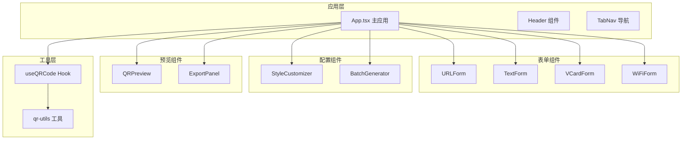
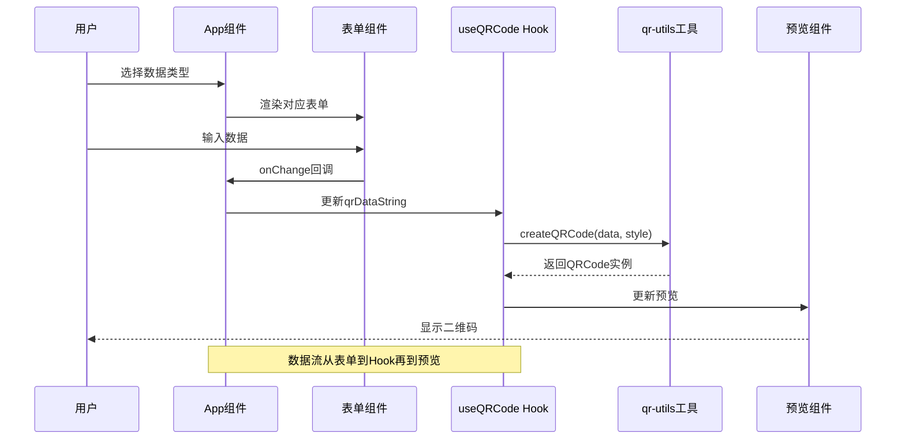
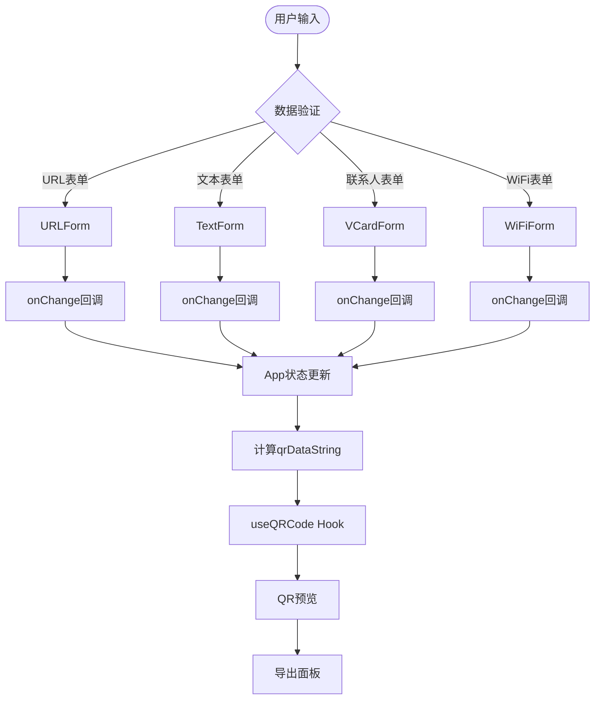
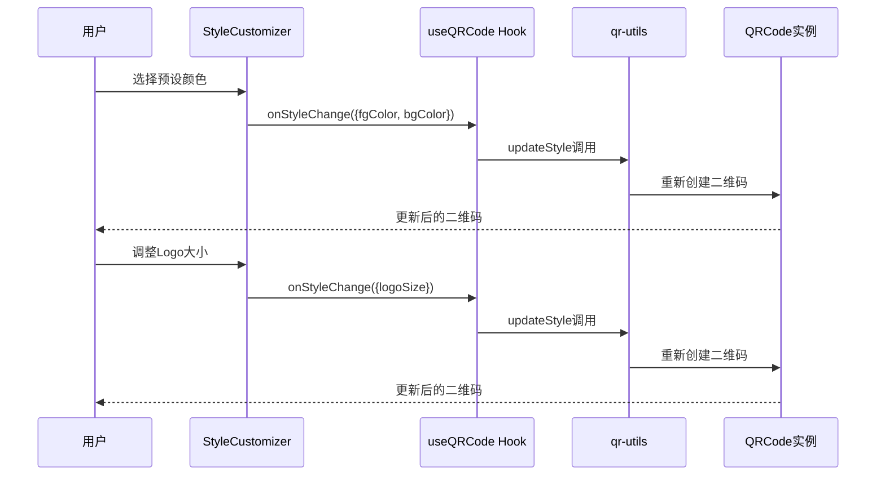
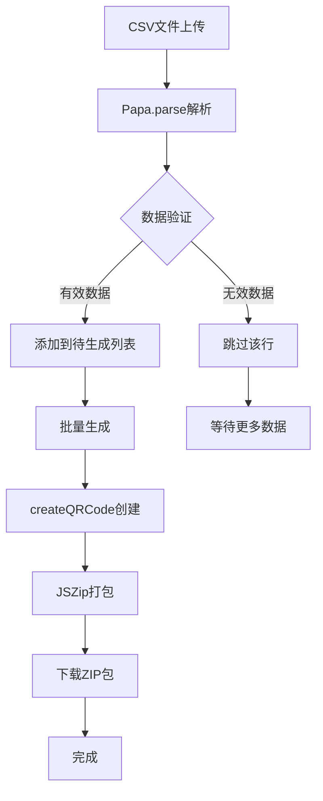
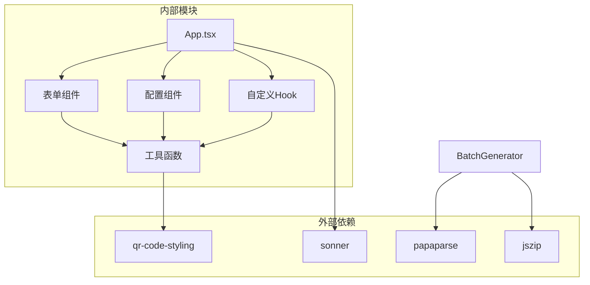
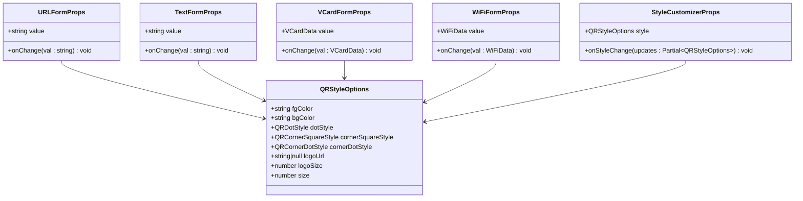

# 组件Props

<cite>
**本文档引用的文件**
- [App.tsx](file://src/App.tsx)
- [URLForm.tsx](file://src/components/forms/URLForm.tsx)
- [TextForm.tsx](file://src/components/forms/TextForm.tsx)
- [VCardForm.tsx](file://src/components/forms/VCardForm.tsx)
- [WiFiForm.tsx](file://src/components/forms/WiFiForm.tsx)
- [StyleCustomizer.tsx](file://src/components/StyleCustomizer.tsx)
- [BatchGenerator.tsx](file://src/components/BatchGenerator.tsx)
- [qr-utils.ts](file://src/lib/qr-utils.ts)
- [useQRCode.ts](file://src/hooks/useQRCode.ts)
- [QRPreview.tsx](file://src/components/QRPreview.tsx)
- [ExportPanel.tsx](file://src/components/ExportPanel.tsx)
</cite>

## 目录
1. [简介](#简介)
2. [项目结构](#项目结构)
3. [核心组件Props](#核心组件props)
4. [架构概览](#架构概览)
5. [详细组件Props分析](#详细组件props分析)
6. [依赖关系分析](#依赖关系分析)
7. [性能考虑](#性能考虑)
8. [故障排除指南](#故障排除指南)
9. [结论](#结论)

## 简介
本文件为QR生成器应用中各组件的Props接口定义提供完整的API文档。重点涵盖表单组件（URLForm、VCardForm、WiFiForm、TextForm）和配置组件（StyleCustomizer、BatchGenerator）的Props接口，包括必需属性、可选属性、默认值、数据类型、验证规则和使用约束。同时提供组件集成示例，展示如何正确传递Props以及处理组件间的数据流转和事件通信。

## 项目结构
该应用采用模块化设计，主要组件分布在以下目录：
- `src/components/forms/`：各类表单组件
- `src/components/`：其他功能组件（StyleCustomizer、BatchGenerator等）
- `src/lib/`：核心工具函数和类型定义
- `src/hooks/`：自定义React Hook
- `src/App.tsx`：主应用组件

**图表来源**
- [App.tsx:24-173](file://src/App.tsx#L24-L173)
- [qr-utils.ts:1-151](file://src/lib/qr-utils.ts#L1-L151)

**章节来源**
- [App.tsx:1-173](file://src/App.tsx#L1-L173)
- [qr-utils.ts:1-151](file://src/lib/qr-utils.ts#L1-L151)

## 核心组件Props

### 表单组件Props接口

#### URLForm Props
- **必需属性**：
  - `value: string` - URL地址字符串
  - `onChange: (val: string) => void` - 值变更回调函数

- **数据类型与验证**：
  - `value`: 必须为字符串类型
  - `onChange`: 接受字符串参数的函数类型
  - 验证规则：需要包含完整的URL协议前缀（如https://）

- **使用约束**：
  - 输入框类型为`url`，浏览器会进行基础验证
  - 建议在onChange中添加额外的URL格式验证

#### TextForm Props
- **必需属性**：
  - `value: string` - 文本内容
  - `onChange: (val: string) => void` - 值变更回调函数

- **数据类型与验证**：
  - `value`: 字符串类型
  - `onChange`: 接受字符串参数的函数类型
  - 验证规则：字符数限制为2000

- **使用约束**：
  - 提供字符计数显示功能
  - 适合存储任意文本内容

#### VCardForm Props
- **必需属性**：
  - `value: VCardData` - 联系人数据对象
  - `onChange: (val: VCardData) => void` - 数据变更回调函数

- **VCardData接口**：
  - `firstName: string` - 名字
  - `lastName: string` - 姓氏
  - `phone: string` - 电话号码
  - `email: string` - 邮箱地址
  - `organization: string` - 公司名称
  - `title: string` - 职位
  - `url: string` - 网站URL

- **使用约束**：
  - 所有字段均为字符串类型
  - 用于生成标准vCard格式数据

#### WiFiForm Props
- **必需属性**：
  - `value: WiFiData` - WiFi配置数据
  - `onChange: (val: WiFiData) => void` - 配置变更回调函数

- **WiFiData接口**：
  - `ssid: string` - WiFi网络名称
  - `password: string` - WiFi密码
  - `encryption: "WPA" | "WEP" | "nopass"` - 加密方式枚举
  - `hidden: boolean` - 是否隐藏网络

- **使用约束**：
  - 加密方式必须为指定枚举值之一
  - 当加密方式为"nopass"时，密码输入框会被禁用

### 配置组件Props接口

#### StyleCustomizer Props
- **必需属性**：
  - `style: QRStyleOptions` - 样式配置对象
  - `onStyleChange: (updates: Partial<QRStyleOptions>) => void` - 样式更新回调

- **QRStyleOptions接口**：
  - `fgColor: string` - 前景色（十六进制颜色值）
  - `bgColor: string` - 背景色（十六进制颜色值）
  - `dotStyle: QRDotStyle` - 码点样式
  - `cornerSquareStyle: QRCornerSquareStyle` - 定位角样式
  - `cornerDotStyle: QRCornerDotStyle` - 定位点样式
  - `logoUrl: string | null` - Logo图片URL或null
  - `logoSize: number` - Logo大小比例（0.2-0.5）
  - `size: number` - 二维码尺寸

- **默认值**：
  - `fgColor: "#6C3AED"`
  - `bgColor: "#FFFFFF"`
  - `dotStyle: "rounded"`
  - `cornerSquareStyle: "extra-rounded"`
  - `cornerDotStyle: "dot"`
  - `logoUrl: null`
  - `logoSize: 0.4`
  - `size: 300`

#### BatchGenerator Props
- **组件特性**：当前实现为无Props组件，内部管理状态
- **状态管理**：通过useState管理CSV数据、生成进度等状态
- **使用方式**：直接渲染组件，无需传入Props

### 预览和导出组件Props

#### QRPreview Props
- **必需属性**：
  - `containerRef: React.RefObject<HTMLDivElement>` - DOM容器引用
  - `hasData: boolean` - 是否有有效数据的标志

#### ExportPanel Props
- **必需属性**：
  - `hasData: boolean` - 是否有有效数据的标志
  - `onDownloadPNG: (size: number) => Promise<void>` - PNG下载回调
  - `onDownloadSVG: () => Promise<void>` - SVG下载回调

**章节来源**
- [URLForm.tsx:5-8](file://src/components/forms/URLForm.tsx#L5-L8)
- [TextForm.tsx:4-7](file://src/components/forms/TextForm.tsx#L4-L7)
- [VCardForm.tsx:5-8](file://src/components/forms/VCardForm.tsx#L5-L8)
- [WiFiForm.tsx:6-9](file://src/components/forms/WiFiForm.tsx#L6-L9)
- [StyleCustomizer.tsx:15-18](file://src/components/StyleCustomizer.tsx#L15-L18)
- [BatchGenerator.tsx:15-180](file://src/components/BatchGenerator.tsx#L15-L180)
- [QRPreview.tsx:4-7](file://src/components/QRPreview.tsx#L4-L7)
- [ExportPanel.tsx:7-11](file://src/components/ExportPanel.tsx#L7-L11)
- [qr-utils.ts:14-40](file://src/lib/qr-utils.ts#L14-L40)

## 架构概览

**图表来源**
- [App.tsx:47-65](file://src/App.tsx#L47-L65)
- [useQRCode.ts:5-29](file://src/hooks/useQRCode.ts#L5-L29)
- [qr-utils.ts:63-101](file://src/lib/qr-utils.ts#L63-L101)

## 详细组件Props分析

### 表单组件数据流

**图表来源**
- [App.tsx:28-62](file://src/App.tsx#L28-L62)
- [URLForm.tsx:10-32](file://src/components/forms/URLForm.tsx#L10-L32)
- [TextForm.tsx:9-27](file://src/components/forms/TextForm.tsx#L9-L27)
- [VCardForm.tsx:10-91](file://src/components/forms/VCardForm.tsx#L10-L91)
- [WiFiForm.tsx:17-66](file://src/components/forms/WiFiForm.tsx#L17-L66)

### StyleCustomizer组件交互流程

**图表来源**
- [StyleCustomizer.tsx:20-192](file://src/components/StyleCustomizer.tsx#L20-L192)
- [useQRCode.ts:31-33](file://src/hooks/useQRCode.ts#L31-L33)
- [qr-utils.ts:63-101](file://src/lib/qr-utils.ts#L63-L101)

### BatchGenerator组件工作流程

**图表来源**
- [BatchGenerator.tsx:21-46](file://src/components/BatchGenerator.tsx#L21-L46)
- [BatchGenerator.tsx:52-79](file://src/components/BatchGenerator.tsx#L52-L79)
- [qr-utils.ts:63-101](file://src/lib/qr-utils.ts#L63-L101)

**章节来源**
- [App.tsx:47-65](file://src/App.tsx#L47-L65)
- [StyleCustomizer.tsx:20-192](file://src/components/StyleCustomizer.tsx#L20-L192)
- [BatchGenerator.tsx:21-79](file://src/components/BatchGenerator.tsx#L21-L79)

## 依赖关系分析

**图表来源**
- [qr-utils.ts:1-6](file://src/lib/qr-utils.ts#L1-L6)
- [BatchGenerator.tsx:5-7](file://src/components/BatchGenerator.tsx#L5-L7)
- [App.tsx:22](file://src/App.tsx#L22)

### Props接口依赖关系

**图表来源**
- [URLForm.tsx:5-8](file://src/components/forms/URLForm.tsx#L5-L8)
- [TextForm.tsx:4-7](file://src/components/forms/TextForm.tsx#L4-L7)
- [VCardForm.tsx:5-8](file://src/components/forms/VCardForm.tsx#L5-L8)
- [WiFiForm.tsx:6-9](file://src/components/forms/WiFiForm.tsx#L6-L9)
- [StyleCustomizer.tsx:15-18](file://src/components/StyleCustomizer.tsx#L15-L18)
- [qr-utils.ts:14-23](file://src/lib/qr-utils.ts#L14-L23)

**章节来源**
- [qr-utils.ts:14-40](file://src/lib/qr-utils.ts#L14-L40)
- [StyleCustomizer.tsx:15-18](file://src/components/StyleCustomizer.tsx#L15-L18)

## 性能考虑

### 内存优化策略
- 使用`useMemo`缓存计算结果，避免重复计算
- 在`useQRCode` Hook中使用`useCallback`优化回调函数
- 条件渲染减少不必要的DOM更新

### 渲染性能
- 表单组件使用受控组件模式，避免状态同步问题
- StyleCustomizer组件仅在样式变更时重新渲染
- BatchGenerator组件使用虚拟滚动处理大量数据项

### 数据处理优化
- CSV文件解析使用异步处理，避免阻塞主线程
- 批量生成时使用进度条反馈用户体验
- 图片导出使用Web Workers避免UI卡顿

## 故障排除指南

### 常见问题及解决方案

#### URL格式验证失败
- **问题**：URL输入不包含协议前缀
- **解决方案**：在onChange中添加URL格式验证逻辑
- **参考路径**：[URLForm.tsx:17-24](file://src/components/forms/URLForm.tsx#L17-L24)

#### vCard数据为空
- **问题**：缺少必要字段导致无法生成二维码
- **解决方案**：确保至少提供firstName或lastName
- **参考路径**：[App.tsx:54-56](file://src/App.tsx#L54-L56)

#### WiFi配置错误
- **问题**：加密方式与密码状态不匹配
- **解决方案**：当加密方式为"nopass"时禁用密码输入
- **参考路径**：[WiFiForm.tsx:51](file://src/components/forms/WiFiForm.tsx#L51)

#### 样式更新不生效
- **问题**：StyleCustomizer的onStyleChange回调未正确处理
- **解决方案**：确保传入Partial<QRStyleOptions>类型的对象
- **参考路径**：[StyleCustomizer.tsx:31-33](file://src/components/StyleCustomizer.tsx#L31-L33)

#### 批量生成失败
- **问题**：CSV文件格式不符合要求
- **解决方案**：确保CSV包含data/url/text列
- **参考路径**：[BatchGenerator.tsx:30-38](file://src/components/BatchGenerator.tsx#L30-L38)

**章节来源**
- [URLForm.tsx:17-24](file://src/components/forms/URLForm.tsx#L17-L24)
- [App.tsx:54-56](file://src/App.tsx#L54-L56)
- [WiFiForm.tsx:51](file://src/components/forms/WiFiForm.tsx#L51)
- [StyleCustomizer.tsx:31-33](file://src/components/StyleCustomizer.tsx#L31-L33)
- [BatchGenerator.tsx:30-38](file://src/components/BatchGenerator.tsx#L30-L38)

## 结论

本API文档详细记录了QR生成器应用中各组件的Props接口定义，包括：

1. **完整的Props接口**：涵盖了所有表单组件和配置组件的必需属性、可选属性和默认值
2. **类型系统**：基于TypeScript的强类型定义，确保类型安全
3. **数据流设计**：清晰展示了组件间的Props传递和数据流转机制
4. **验证规则**：明确了各组件的数据验证要求和约束条件
5. **集成示例**：提供了实际的组件使用场景和最佳实践

通过遵循这些Props接口规范，开发者可以：
- 正确集成和使用各个组件
- 确保数据类型的一致性和完整性
- 实现高效的组件间通信
- 构建可靠的二维码生成应用

建议在实际开发中：
- 严格遵守Props接口定义
- 添加适当的错误处理和边界检查
- 使用TypeScript进行类型检查
- 参考提供的集成示例进行组件组合