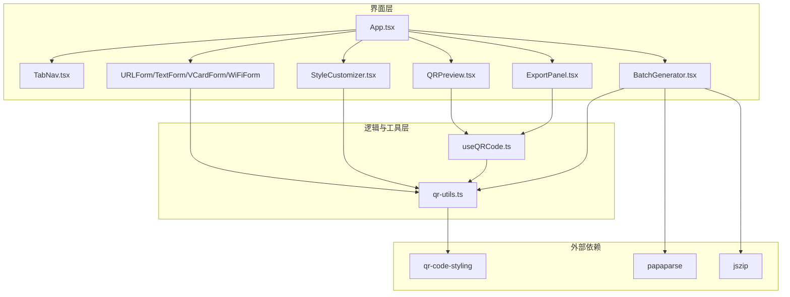
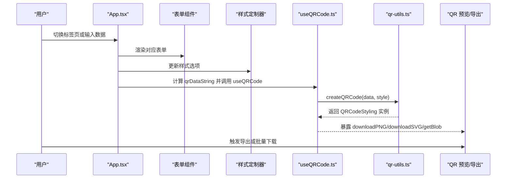
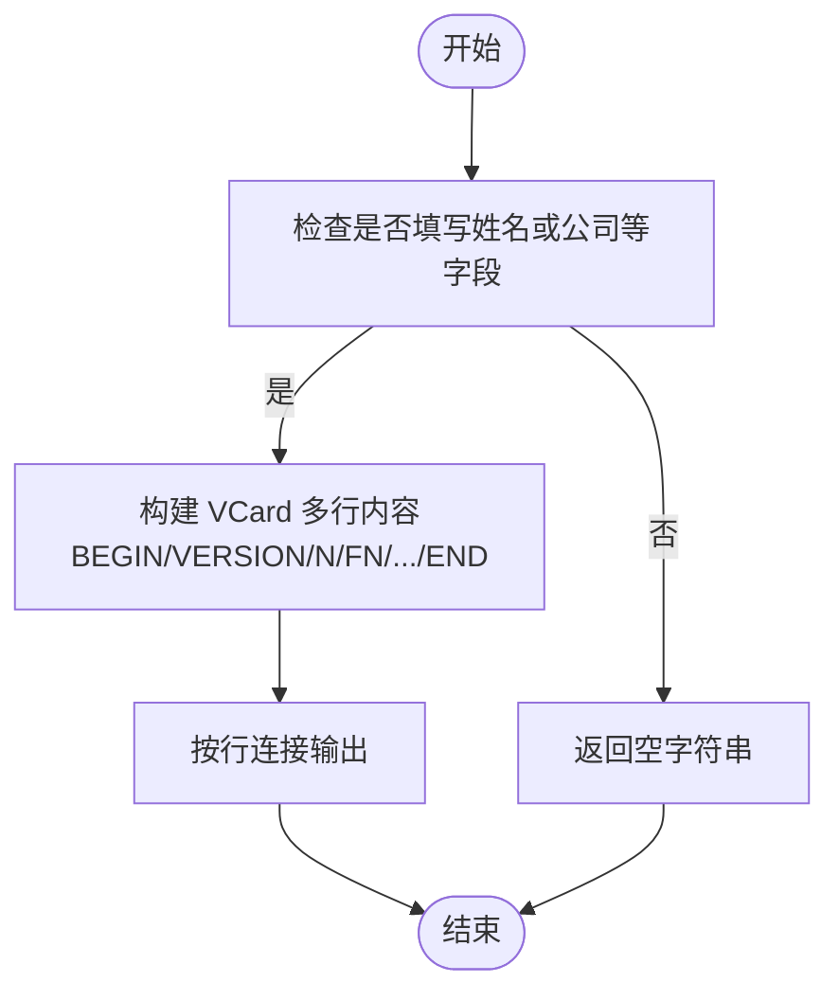
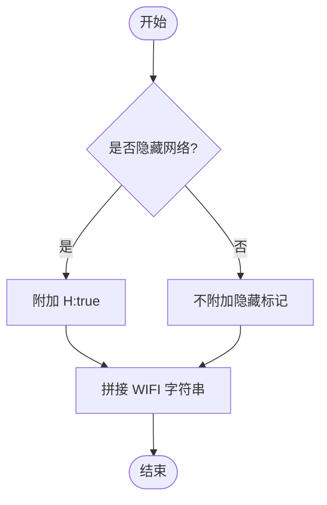
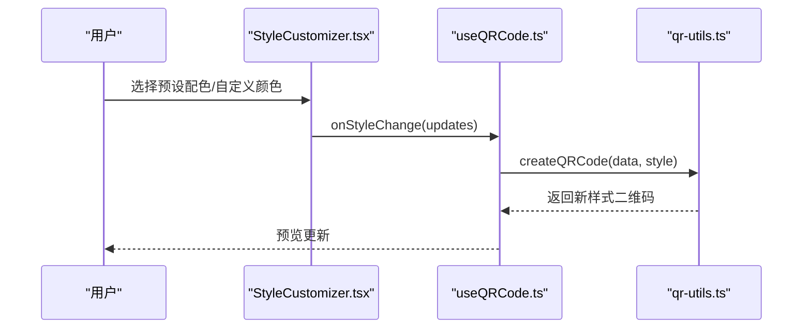
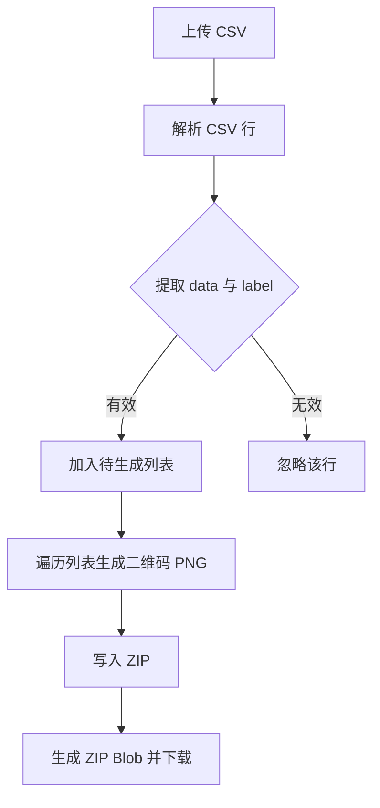
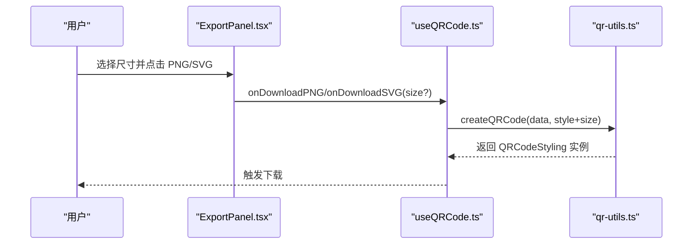
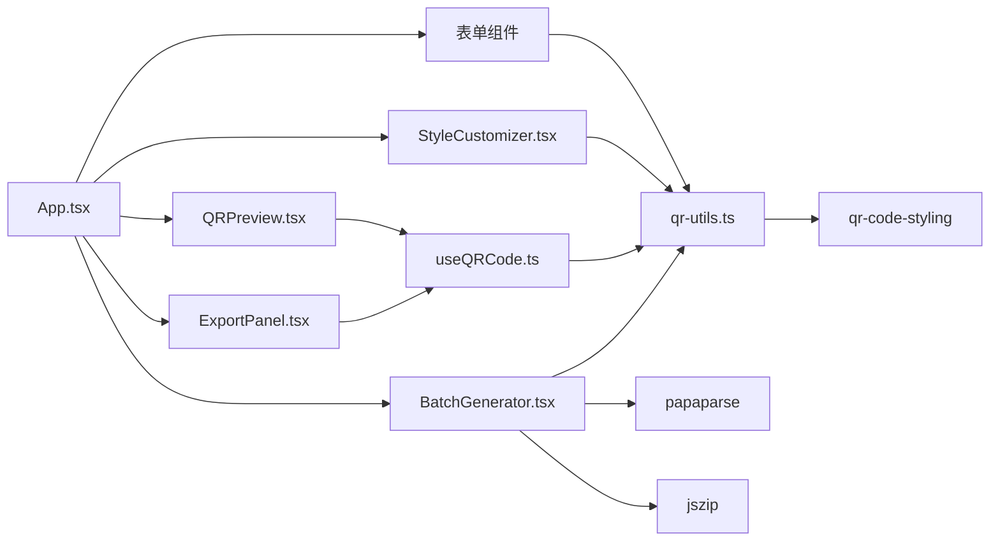

# 功能特性

<cite>
**本文引用的文件**
- [App.tsx](file://src/App.tsx)
- [TabNav.tsx](file://src/components/layout/TabNav.tsx)
- [URLForm.tsx](file://src/components/forms/URLForm.tsx)
- [TextForm.tsx](file://src/components/forms/TextForm.tsx)
- [VCardForm.tsx](file://src/components/forms/VCardForm.tsx)
- [WiFiForm.tsx](file://src/components/forms/WiFiForm.tsx)
- [StyleCustomizer.tsx](file://src/components/StyleCustomizer.tsx)
- [BatchGenerator.tsx](file://src/components/BatchGenerator.tsx)
- [ExportPanel.tsx](file://src/components/ExportPanel.tsx)
- [QRPreview.tsx](file://src/components/QRPreview.tsx)
- [useQRCode.ts](file://src/hooks/useQRCode.ts)
- [qr-utils.ts](file://src/lib/qr-utils.ts)
- [package.json](file://package.json)
</cite>

## 目录
1. [简介](#简介)
2. [项目结构](#项目结构)
3. [核心组件](#核心组件)
4. [架构总览](#架构总览)
5. [详细组件分析](#详细组件分析)
6. [依赖关系分析](#依赖关系分析)
7. [性能考量](#性能考量)
8. [故障排查指南](#故障排查指南)
9. [结论](#结论)
10. [附录](#附录)

## 简介
本文件系统性梳理 QR 码生成器的功能特性，覆盖以下方面：
- 多格式数据支持：URL、文本、VCard、WiFi 的输入表单与编码规则
- 样式定制系统：颜色方案、形状样式、Logo 集成与预设方案
- 批量处理：CSV 解析、批量生成流程与 ZIP 包下载机制
- 导出功能：PNG/SVG 格式支持与高分辨率设置
- 使用示例、参数配置与常见问题解决方案

## 项目结构
应用采用按功能分层的组织方式，核心入口负责状态管理与页面布局，各功能模块通过独立组件实现，样式与工具函数集中在 lib 层。

图示来源
- [App.tsx:1-173](file://src/App.tsx#L1-L173)
- [TabNav.tsx:1-47](file://src/components/layout/TabNav.tsx#L1-L47)
- [StyleCustomizer.tsx:1-193](file://src/components/StyleCustomizer.tsx#L1-L193)
- [BatchGenerator.tsx:1-180](file://src/components/BatchGenerator.tsx#L1-L180)
- [ExportPanel.tsx:1-83](file://src/components/ExportPanel.tsx#L1-L83)
- [QRPreview.tsx:1-45](file://src/components/QRPreview.tsx#L1-L45)
- [useQRCode.ts:1-75](file://src/hooks/useQRCode.ts#L1-L75)
- [qr-utils.ts:1-151](file://src/lib/qr-utils.ts#L1-L151)
- [package.json:11-24](file://package.json#L11-L24)

章节来源
- [App.tsx:1-173](file://src/App.tsx#L1-L173)
- [package.json:11-24](file://package.json#L11-L24)

## 核心组件
- 应用入口与路由：根据标签页切换渲染不同表单与功能区域，并计算当前二维码数据字符串
- 表单组件：分别处理 URL、文本、VCard、WiFi 的输入与校验
- 样式定制器：提供颜色、形状样式、Logo 上传与大小调节
- 预览与导出：实时渲染二维码并在指定尺寸下导出 PNG/SVG
- 批量生成：解析 CSV，批量生成 PNG 并打包为 ZIP 下载
- 工具与钩子：封装 QR 生成、样式选项、默认值与导出尺寸等

章节来源
- [App.tsx:24-173](file://src/App.tsx#L24-L173)
- [useQRCode.ts:1-75](file://src/hooks/useQRCode.ts#L1-L75)
- [qr-utils.ts:1-151](file://src/lib/qr-utils.ts#L1-L151)

## 架构总览
整体采用“状态驱动 + 组合组件”的前端架构。App 负责聚合状态与视图；useQRCode 提供二维码实例与导出能力；qr-utils 封装 QR 生成与样式常量；各表单组件负责数据输入；批量与导出组件负责离线处理与下载。

图示来源
- [App.tsx:47-65](file://src/App.tsx#L47-L65)
- [useQRCode.ts:35-62](file://src/hooks/useQRCode.ts#L35-L62)
- [qr-utils.ts:63-101](file://src/lib/qr-utils.ts#L63-L101)

## 详细组件分析

### 多格式数据支持
- URL 表单：输入完整 URL，包含协议前缀
- 文本表单：支持多行文本，字符计数提示
- VCard 表单：姓名、电话、邮箱、公司、职位、网站等字段，任一必填字段即可生成有效数据
- WiFi 表单：SSID、加密类型（WPA/WPA2、WEP、无密码）、密码（按加密类型启用/禁用）、隐藏网络开关

实现要点
- 数据字符串由 App 计算，依据当前标签页拼接或格式化
- VCard 与 WiFi 通过工具函数生成标准格式字符串
- 表单组件通过受控输入更新状态，触发重新计算

章节来源
- [URLForm.tsx:1-33](file://src/components/forms/URLForm.tsx#L1-L33)
- [TextForm.tsx:1-28](file://src/components/forms/TextForm.tsx#L1-L28)
- [VCardForm.tsx:1-92](file://src/components/forms/VCardForm.tsx#L1-L92)
- [WiFiForm.tsx:1-67](file://src/components/forms/WiFiForm.tsx#L1-L67)
- [App.tsx:47-62](file://src/App.tsx#L47-L62)
- [qr-utils.ts:42-61](file://src/lib/qr-utils.ts#L42-L61)

#### VCard 编码流程

图示来源
- [qr-utils.ts:42-56](file://src/lib/qr-utils.ts#L42-L56)

#### WiFi 编码流程

图示来源
- [qr-utils.ts:58-61](file://src/lib/qr-utils.ts#L58-L61)

### 样式定制系统
- 颜色方案：支持自定义前景色/背景色，提供一组预设配色一键应用
- 形状样式：码点样式、定位角样式、定位点样式三类，均提供多种内置选项
- Logo 集成：支持上传图片作为中心 Logo，可调节大小；当存在 Logo 时自动提升容错等级
- 默认尺寸与样式：提供默认尺寸与样式，确保开箱即用

章节来源
- [StyleCustomizer.tsx:1-193](file://src/components/StyleCustomizer.tsx#L1-L193)
- [qr-utils.ts:103-151](file://src/lib/qr-utils.ts#L103-L151)

#### 样式定制交互序列

图示来源
- [StyleCustomizer.tsx:20-36](file://src/components/StyleCustomizer.tsx#L20-L36)
- [useQRCode.ts:31-33](file://src/hooks/useQRCode.ts#L31-L33)
- [qr-utils.ts:63-101](file://src/lib/qr-utils.ts#L63-L101)

### 批量处理功能
- CSV 解析：支持 header=true、跳过空行；优先识别 data/url/text/content 列，label/name/title 可选
- 批量生成：逐条生成二维码，统一尺寸（默认 1024），收集为 ZIP
- ZIP 下载：异步生成 Blob，创建临时链接并触发下载

章节来源
- [BatchGenerator.tsx:1-180](file://src/components/BatchGenerator.tsx#L1-L180)
- [qr-utils.ts:103-112](file://src/lib/qr-utils.ts#L103-L112)

#### 批量生成流程

图示来源
- [BatchGenerator.tsx:21-79](file://src/components/BatchGenerator.tsx#L21-L79)
- [qr-utils.ts:63-101](file://src/lib/qr-utils.ts#L63-L101)

### 导出功能
- PNG 导出：支持 256/512/1024/2048 四档尺寸，按所选尺寸生成并下载
- SVG 导出：固定高分辨率（1024），便于矢量编辑与缩放
- 预览容器：实时渲染二维码，无数据时显示占位提示

章节来源
- [ExportPanel.tsx:1-83](file://src/components/ExportPanel.tsx#L1-L83)
- [useQRCode.ts:35-51](file://src/hooks/useQRCode.ts#L35-L51)
- [qr-utils.ts:134-139](file://src/lib/qr-utils.ts#L134-L139)
- [QRPreview.tsx:1-45](file://src/components/QRPreview.tsx#L1-L45)

#### 导出序列

图示来源
- [ExportPanel.tsx:21-37](file://src/components/ExportPanel.tsx#L21-L37)
- [useQRCode.ts:35-51](file://src/hooks/useQRCode.ts#L35-L51)
- [qr-utils.ts:63-101](file://src/lib/qr-utils.ts#L63-L101)

## 依赖关系分析
- 组件间耦合：App 作为中枢协调表单、样式、预览与导出；useQRCode 与 qr-utils 为纯函数与工具层，低耦合高内聚
- 外部依赖：qr-code-styling 负责二维码绘制；papaparse 负责 CSV 解析；jszip 负责 ZIP 打包
- 类型与常量：样式选项、默认值、导出尺寸、预设颜色集中于 qr-utils，便于全局复用

图示来源
- [App.tsx:1-173](file://src/App.tsx#L1-L173)
- [useQRCode.ts:1-75](file://src/hooks/useQRCode.ts#L1-L75)
- [qr-utils.ts:1-151](file://src/lib/qr-utils.ts#L1-L151)
- [BatchGenerator.tsx:1-180](file://src/components/BatchGenerator.tsx#L1-L180)
- [package.json:20-23](file://package.json#L20-L23)

章节来源
- [package.json:11-24](file://package.json#L11-L24)

## 性能考量
- 实时预览：仅在数据变化时重建二维码，避免频繁重绘
- 批量生成：逐条生成并累积至 ZIP，注意内存占用；建议控制单次批量数量
- 导出尺寸：高分辨率 PNG 体积较大，建议按需选择尺寸
- Logo 处理：大图上传会增加内存与渲染压力，建议使用合适尺寸

## 故障排查指南
- 无法生成二维码
  - 检查数据输入是否为空或格式错误（如 URL 缺少协议）
  - 确认样式选项合法（颜色值、尺寸范围）
- 导出失败或空白
  - 确保已有有效数据后再导出
  - SVG 导出固定尺寸，若需要更高分辨率请使用 PNG 的更大尺寸
- 批量下载无响应
  - 确认 CSV 列名正确（至少包含 data/url/text/content 其一）
  - 检查浏览器下载权限与弹窗拦截
- Logo 不显示
  - 确认已上传图片且未被移除
  - 调整 Logo 大小滑块，确保在合理区间（0.2–0.5）

## 结论
本项目以清晰的组件划分与工具抽象实现了完整的二维码生成与导出能力，覆盖多格式数据输入、灵活样式定制、批量处理与高分辨率导出。通过合理的状态管理与依赖解耦，既保证了易用性也兼顾了扩展性。

## 附录

### 使用示例与参数配置
- URL/文本/VCard/WiFi 表单
  - 在对应标签页输入数据，任一必填字段满足即可生成二维码
  - 参数参考：URL 必须包含协议；VCard 至少填写姓名之一；WiFi 需要 SSID，加密类型为 nopass 时可不填密码
- 样式定制
  - 颜色：支持十六进制或标准颜色值；可一键应用预设配色
  - 形状：选择码点、定位角、定位点样式
  - Logo：上传图片后可调节大小
- 导出
  - PNG：选择尺寸（256/512/1024/2048），点击导出
  - SVG：固定高分辨率导出，适合矢量编辑
- 批量生成
  - 上传 CSV，列名示例：data 或 url 或 text 或 content；可选 label 或 name
  - 点击“全部下载 (ZIP)”生成并下载压缩包

章节来源
- [URLForm.tsx:14-28](file://src/components/forms/URLForm.tsx#L14-L28)
- [TextForm.tsx:13-24](file://src/components/forms/TextForm.tsx#L13-L24)
- [VCardForm.tsx:10-91](file://src/components/forms/VCardForm.tsx#L10-L91)
- [WiFiForm.tsx:17-66](file://src/components/forms/WiFiForm.tsx#L17-L66)
- [StyleCustomizer.tsx:40-189](file://src/components/StyleCustomizer.tsx#L40-L189)
- [ExportPanel.tsx:47-78](file://src/components/ExportPanel.tsx#L47-L78)
- [BatchGenerator.tsx:89-111](file://src/components/BatchGenerator.tsx#L89-L111)
- [qr-utils.ts:134-151](file://src/lib/qr-utils.ts#L134-L151)