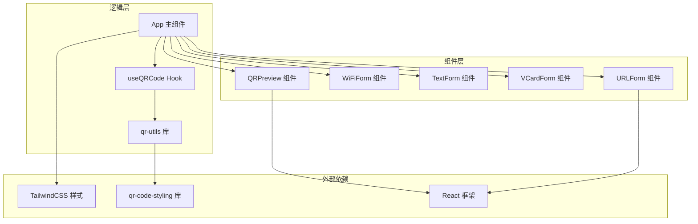
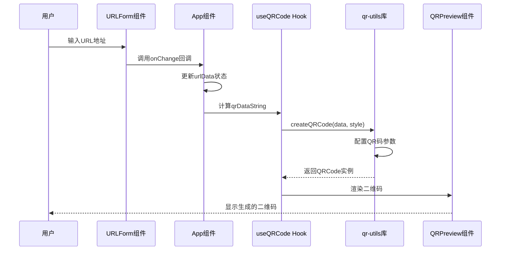
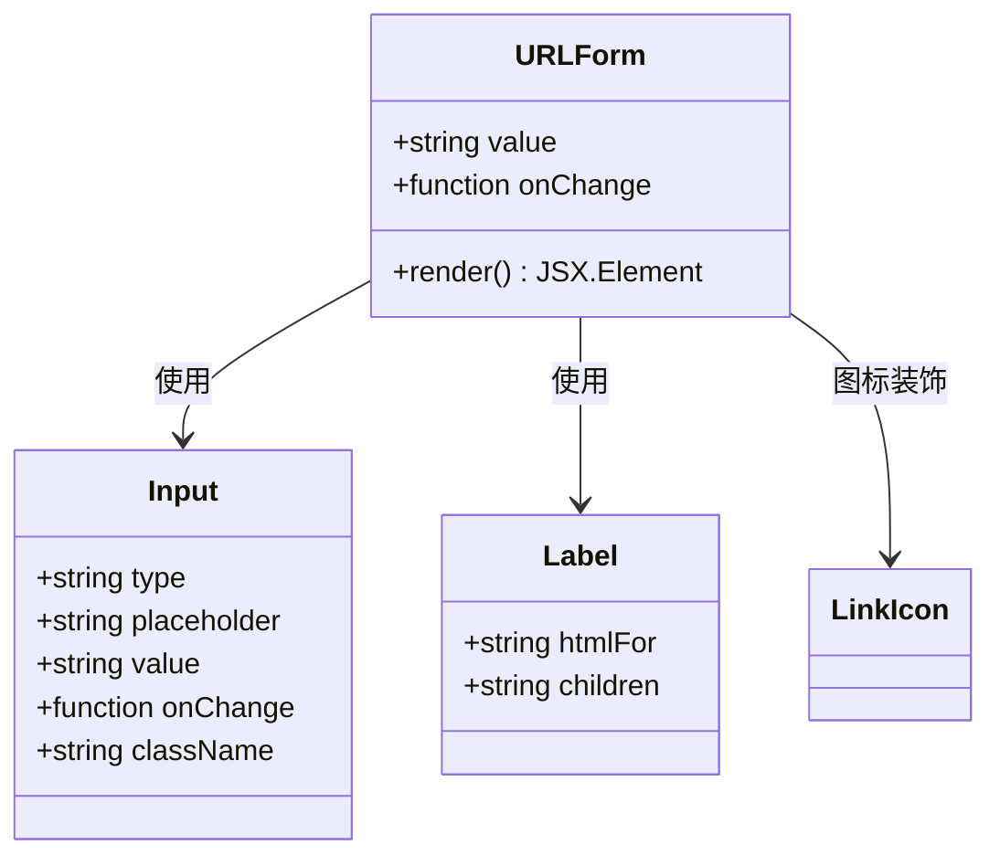
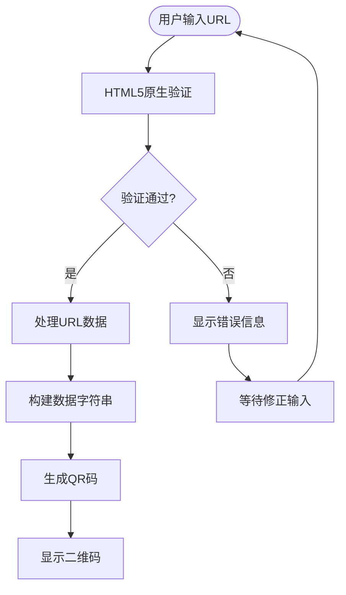
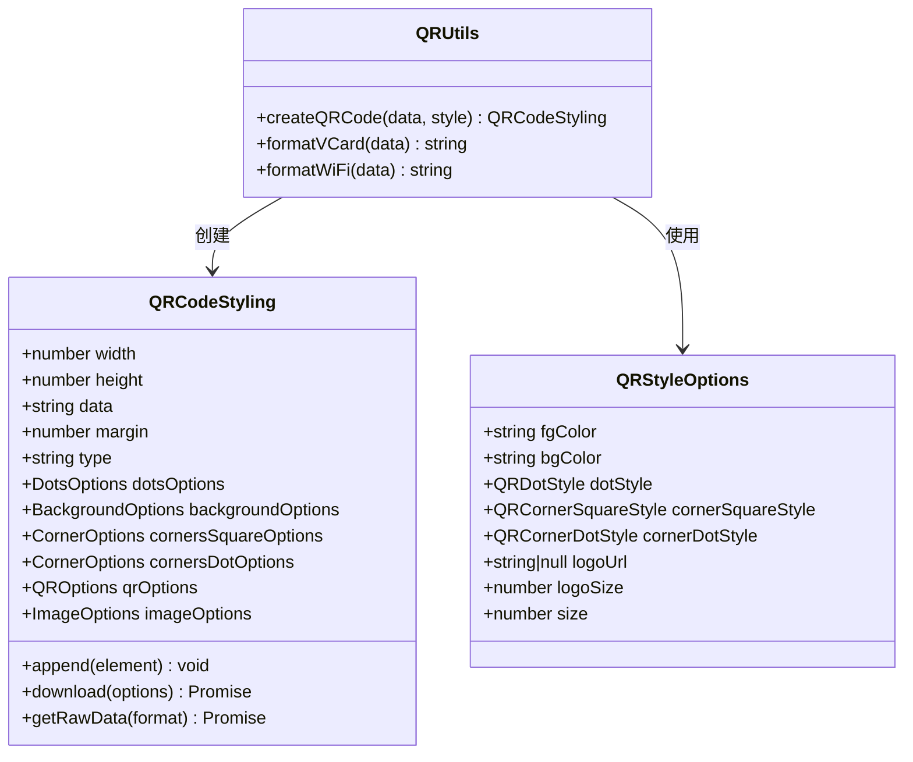
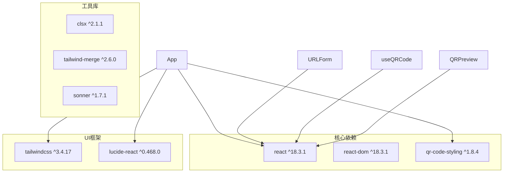
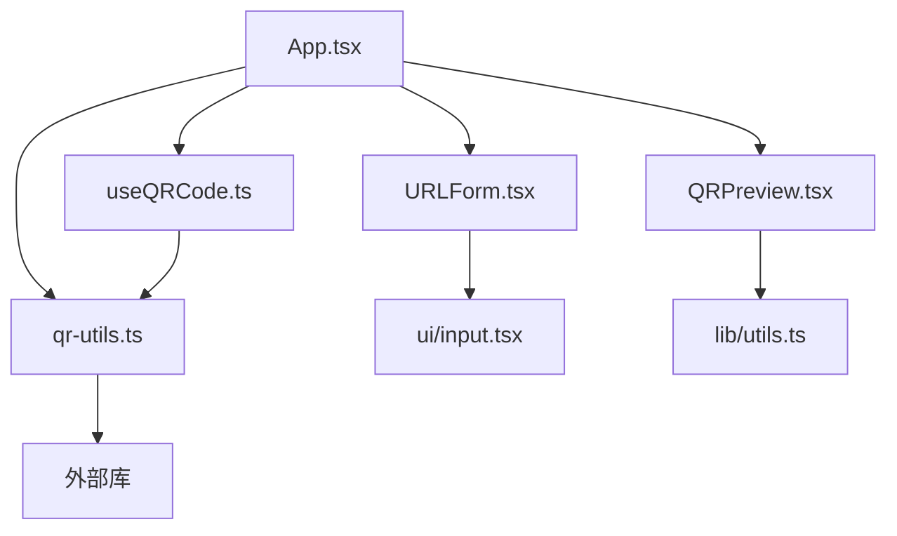

# URL数据格式

<cite>
**本文档引用的文件**
- [src/components/forms/URLForm.tsx](file://src/components/forms/URLForm.tsx)
- [src/App.tsx](file://src/App.tsx)
- [src/lib/qr-utils.ts](file://src/lib/qr-utils.ts)
- [src/hooks/useQRCode.ts](file://src/hooks/useQRCode.ts)
- [src/components/QRPreview.tsx](file://src/components/QRPreview.tsx)
- [src/components/ui/input.tsx](file://src/components/ui/input.tsx)
- [src/components/forms/VCardForm.tsx](file://src/components/forms/VCardForm.tsx)
- [package.json](file://package.json)
</cite>

## 目录
1. [简介](#简介)
2. [项目结构](#项目结构)
3. [核心组件](#核心组件)
4. [架构概览](#架构概览)
5. [详细组件分析](#详细组件分析)
6. [依赖关系分析](#依赖关系分析)
7. [性能考虑](#性能考虑)
8. [故障排除指南](#故障排除指南)
9. [结论](#结论)

## 简介

本文件详细介绍了QR生成器应用中的URL数据格式功能。该功能允许用户输入各种类型的URL链接，并将其转换为可扫描的二维码。本文档深入解释了URL表单组件的实现原理，包括输入验证规则、格式化处理逻辑和QR码编码过程。

## 项目结构

该项目采用React + TypeScript构建，主要文件组织如下：
- `src/components/forms/` - 表单组件目录，包含URLForm、TextForm、VCardForm、WiFiForm
- `src/lib/` - 核心库文件，包含qr-utils.ts和utils.ts
- `src/hooks/` - React Hooks，包含useQRCode.ts
- `src/components/` - UI组件和页面组件



**图表来源**
- [src/App.tsx:24-173](file://src/App.tsx#L24-L173)
- [src/components/forms/URLForm.tsx:10-32](file://src/components/forms/URLForm.tsx#L10-L32)
- [src/lib/qr-utils.ts:63-101](file://src/lib/qr-utils.ts#L63-L101)

**章节来源**
- [src/App.tsx:1-173](file://src/App.tsx#L1-L173)
- [package.json:1-37](file://package.json#L1-L37)

## 核心组件

### URLForm 组件

URLForm是专门用于处理URL输入的表单组件，具有以下特点：

- **输入类型**：使用HTML5的`type="url"`确保浏览器级别的URL验证
- **视觉设计**：集成链接图标，提供清晰的用户界面指示
- **占位符提示**：显示包含协议前缀的示例URL格式
- **状态管理**：通过onChange回调函数与父组件进行双向数据绑定

### 数据流处理

应用采用集中式状态管理模式，URL数据通过以下流程处理：

1. 用户在URLForm中输入URL
2. App组件维护全局状态
3. useMemo计算当前激活标签页的数据字符串
4. useQRCode Hook根据数据字符串生成QR码
5. QRPreview组件实时显示生成的二维码

**章节来源**
- [src/components/forms/URLForm.tsx:10-32](file://src/components/forms/URLForm.tsx#L10-L32)
- [src/App.tsx:27-62](file://src/App.tsx#L27-L62)

## 架构概览

系统采用分层架构设计，确保URL处理功能的模块化和可维护性：



**图表来源**
- [src/App.tsx:47-65](file://src/App.tsx#L47-L65)
- [src/hooks/useQRCode.ts:11-29](file://src/hooks/useQRCode.ts#L11-L29)
- [src/lib/qr-utils.ts:63-101](file://src/lib/qr-utils.ts#L63-L101)

## 详细组件分析

### URLForm 组件实现

URLForm组件实现了简洁而高效的URL输入界面：



**图表来源**
- [src/components/forms/URLForm.tsx:5-32](file://src/components/forms/URLForm.tsx#L5-L32)
- [src/components/ui/input.tsx:4-25](file://src/components/ui/input.tsx#L4-L25)

#### 输入验证机制

URLForm组件利用HTML5原生验证功能：
- **类型验证**：`type="url"`自动验证URL格式
- **协议检查**：浏览器内置检查是否包含协议前缀
- **格式验证**：验证域名结构和路径格式

#### 格式化处理逻辑

URL数据在应用中的处理流程：



**图表来源**
- [src/components/forms/URLForm.tsx:17-24](file://src/components/forms/URLForm.tsx#L17-L24)
- [src/App.tsx:47-62](file://src/App.tsx#L47-L62)

### QR码生成系统

#### createQRCode函数

qr-utils库中的createQRCode函数负责将URL数据转换为QR码：



**图表来源**
- [src/lib/qr-utils.ts:14-23](file://src/lib/qr-utils.ts#L14-L23)
- [src/lib/qr-utils.ts:63-101](file://src/lib/qr-utils.ts#L63-L101)

#### QR码样式配置

系统提供了丰富的样式定制选项：

| 属性名 | 类型 | 默认值 | 描述 |
|--------|------|--------|------|
| fgColor | string | "#6C3AED" | 前景色（二维码主体颜色） |
| bgColor | string | "#FFFFFF" | 背景色 |
| dotStyle | QRDotStyle | "rounded" | 点样式 |
| cornerSquareStyle | QRCornerSquareStyle | "extra-rounded" | 角部方块样式 |
| cornerDotStyle | QRCornerDotStyle | "dot" | 角部点样式 |
| logoUrl | string \| null | null | 二维码中心Logo URL |
| logoSize | number | 0.4 | Logo大小比例 |
| size | number | 300 | 二维码尺寸 |

**章节来源**
- [src/lib/qr-utils.ts:103-151](file://src/lib/qr-utils.ts#L103-L151)
- [src/hooks/useQRCode.ts:31-75](file://src/hooks/useQRCode.ts#L31-L75)

### 数据处理管道

#### useMemo优化策略

App组件使用useMemo优化数据处理：

```mermaid
flowchart LR
subgraph "状态变更"
A[urlData] --> B[useMemo计算]
C[textData] --> B
D[vcardData] --> B
E[wifiData] --> B
end
subgraph "计算逻辑"
B --> F{切换标签页?}
F --> |URL| G[urlData]
F --> |Text| H[textData]
F --> |VCard| I[formatVCard(vcardData)]
F --> |WiFi| J[formatWiFi(wifiData)]
end
subgraph "输出"
G --> K[qrDataString]
H --> K
I --> K
J --> K
end
```

**图表来源**
- [src/App.tsx:47-62](file://src/App.tsx#L47-L62)

**章节来源**
- [src/App.tsx:47-62](file://src/App.tsx#L47-L62)

## 依赖关系分析

### 外部依赖

项目的主要外部依赖包括：



**图表来源**
- [package.json:11-24](file://package.json#L11-L24)

### 内部依赖关系



**图表来源**
- [src/App.tsx:1-23](file://src/App.tsx#L1-L23)
- [src/components/forms/URLForm.tsx:1-3](file://src/components/forms/URLForm.tsx#L1-L3)

**章节来源**
- [package.json:1-37](file://package.json#L1-L37)

## 性能考虑

### 优化策略

1. **useMemo缓存**：避免不必要的重新计算
2. **条件渲染**：空数据时不生成QR码
3. **事件防抖**：减少频繁的状态更新
4. **虚拟DOM优化**：合理使用React的渲染优化

### 内存管理

- QR码实例在数据为空时会被清理
- 引用计数避免内存泄漏
- 组件卸载时自动清理

## 故障排除指南

### 常见问题及解决方案

#### URL格式错误
- **症状**：输入框显示红色边框或验证失败
- **原因**：缺少协议前缀或域名格式不正确
- **解决**：确保输入完整的URL，包含`https://`或`http://`前缀

#### QR码无法生成
- **症状**：预览区域显示空白
- **原因**：URL格式无效或数据为空
- **解决**：检查URL格式，确认网络连接正常

#### 样式不生效
- **症状**：二维码颜色或样式不符合预期
- **原因**：样式配置错误或浏览器兼容性问题
- **解决**：检查颜色值格式，确认浏览器支持

**章节来源**
- [src/components/forms/URLForm.tsx:26-28](file://src/components/forms/URLForm.tsx#L26-L28)
- [src/hooks/useQRCode.ts:11-18](file://src/hooks/useQRCode.ts#L11-L18)

## 结论

URL数据格式功能通过精心设计的组件架构和优化的数据处理流程，为用户提供了一个高效、可靠的URL二维码生成解决方案。该系统具备以下优势：

1. **用户友好**：直观的表单界面和实时预览功能
2. **技术先进**：基于现代React技术和优化的性能策略
3. **扩展性强**：模块化的架构便于功能扩展和维护
4. **质量保证**：完善的错误处理和用户体验优化

通过本文档的详细分析，开发者可以深入理解URL数据格式功能的实现原理，并在此基础上进行进一步的功能扩展和技术优化。