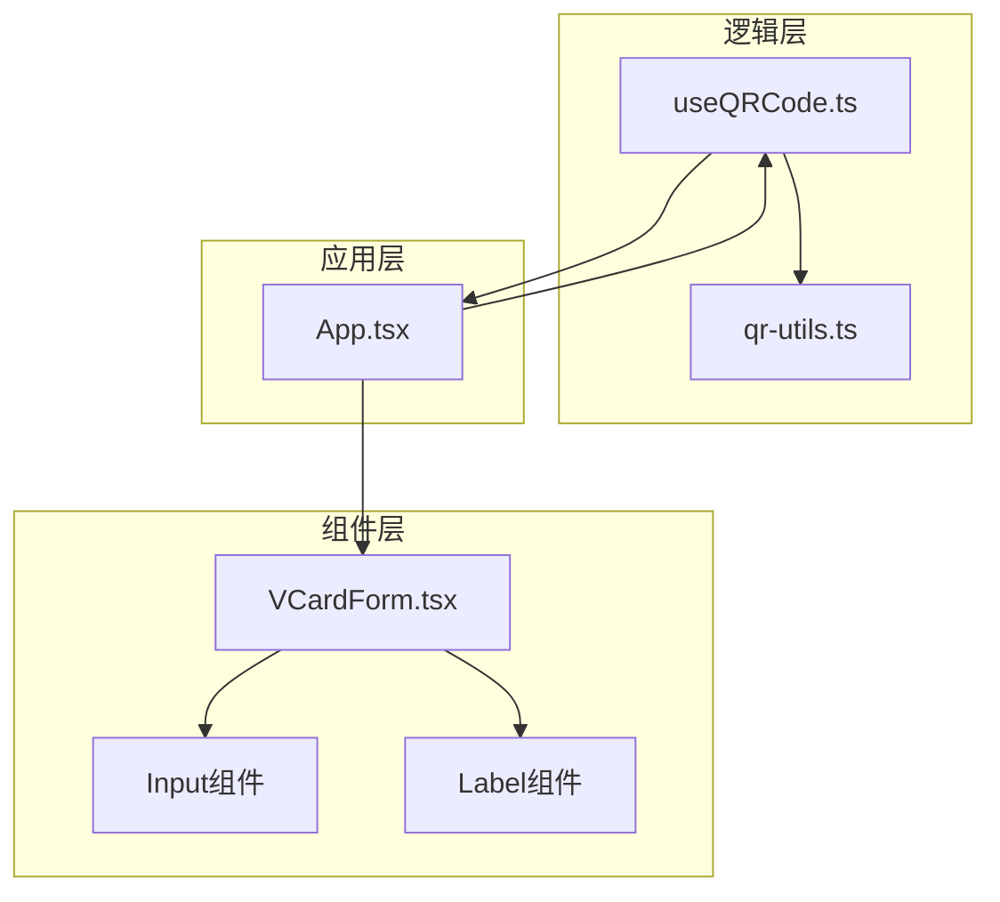
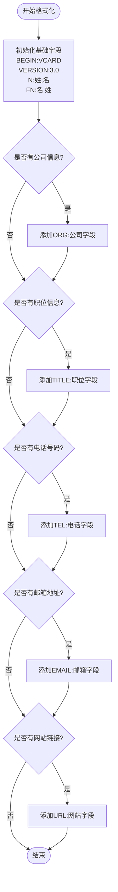
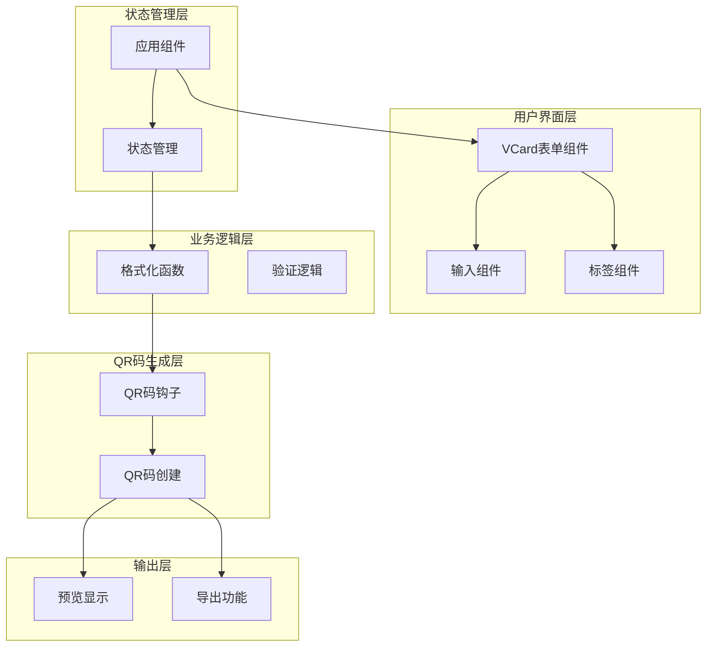
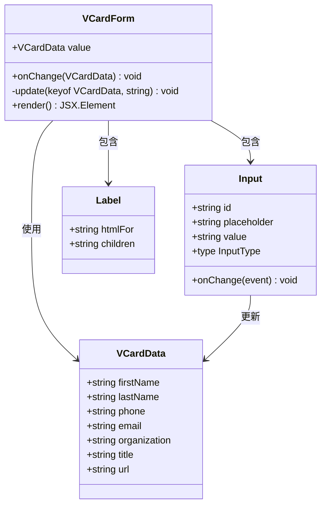
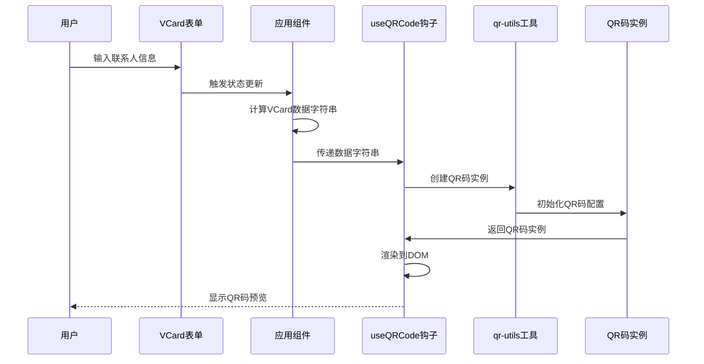
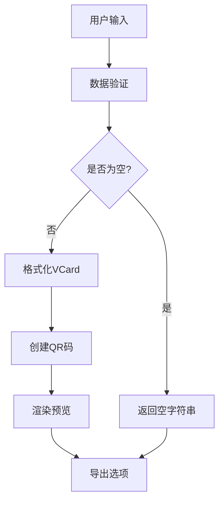
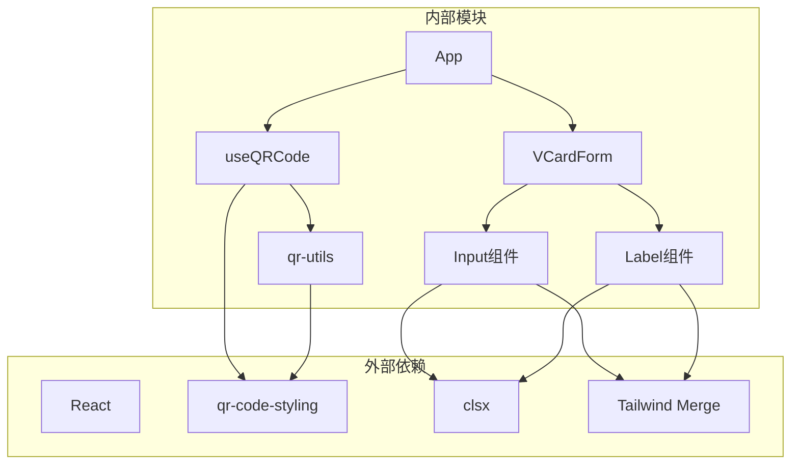

# VCard联系人名片格式

<cite>
**本文档引用的文件**
- [VCardForm.tsx](file://src/components/forms/VCardForm.tsx)
- [qr-utils.ts](file://src/lib/qr-utils.ts)
- [useQRCode.ts](file://src/hooks/useQRCode.ts)
- [App.tsx](file://src/App.tsx)
- [input.tsx](file://src/components/ui/input.tsx)
- [label.tsx](file://src/components/ui/label.tsx)
</cite>

## 目录
1. [简介](#简介)
2. [项目结构](#项目结构)
3. [核心组件](#核心组件)
4. [架构概览](#架构概览)
5. [详细组件分析](#详细组件分析)
6. [依赖关系分析](#依赖关系分析)
7. [性能考虑](#性能考虑)
8. [故障排除指南](#故障排除指南)
9. [结论](#结论)

## 简介

VCard联系人名片格式是现代数字名片的标准格式，基于RFC 2426规范，用于在不同设备和应用程序之间交换联系人信息。本项目实现了完整的VCard功能，包括联系人信息输入表单、数据验证、格式化处理和QR码编码。

VCard格式支持多种联系人信息字段，包括姓名、电话号码、电子邮件、公司信息、职位、网站链接等。通过QR码技术，这些联系人信息可以被快速扫描和导入到手机通讯录中。

## 项目结构

该项目采用模块化的React架构设计，VCard功能主要分布在以下目录结构中：

**图表来源**
- [VCardForm.tsx:1-92](file://src/components/forms/VCardForm.tsx#L1-L92)
- [qr-utils.ts:1-151](file://src/lib/qr-utils.ts#L1-L151)
- [useQRCode.ts:1-75](file://src/hooks/useQRCode.ts#L1-L75)

**章节来源**
- [VCardForm.tsx:1-92](file://src/components/forms/VCardForm.tsx#L1-L92)
- [qr-utils.ts:1-151](file://src/lib/qr-utils.ts#L1-L151)
- [useQRCode.ts:1-75](file://src/hooks/useQRCode.ts#L1-L75)

## 核心组件

### VCard数据结构

VCard数据结构定义了联系人的所有可选字段，每个字段都有特定的用途和格式要求：

| 字段名 | 类型 | 必填 | 描述 | 示例 |
|--------|------|------|------|------|
| firstName | string | 否 | 名字 | 小明 |
| lastName | string | 否 | 姓氏 | 张 |
| phone | string | 否 | 电话号码 | +86 138 0000 0000 |
| email | string | 否 | 电子邮箱 | hello@example.com |
| organization | string | 否 | 公司名称 | 腾讯科技 |
| title | string | 否 | 职位 | 产品经理 |
| url | string | 否 | 网站链接 | https://example.com |

### VCard格式化函数

`formatVCard`函数负责将VCardData对象转换为标准的VCard格式字符串：

**图表来源**
- [qr-utils.ts:42-56](file://src/lib/qr-utils.ts#L42-L56)

**章节来源**
- [qr-utils.ts:25-33](file://src/lib/qr-utils.ts#L25-L33)
- [qr-utils.ts:42-56](file://src/lib/qr-utils.ts#L42-L56)

## 架构概览

整个VCard功能的架构采用分层设计，确保了良好的代码组织和可维护性：

**图表来源**
- [App.tsx:24-65](file://src/App.tsx#L24-L65)
- [qr-utils.ts:42-101](file://src/lib/qr-utils.ts#L42-L101)
- [useQRCode.ts:5-29](file://src/hooks/useQRCode.ts#L5-L29)

## 详细组件分析

### VCard表单组件

VCard表单组件提供了直观的用户界面，用于输入联系人信息。该组件采用响应式布局设计，支持双列显示主要字段。

#### 组件结构分析

**图表来源**
- [VCardForm.tsx:5-13](file://src/components/forms/VCardForm.tsx#L5-L13)
- [qr-utils.ts:25-33](file://src/lib/qr-utils.ts#L25-L33)

#### 字段验证策略

VCard表单组件采用了渐进式验证策略：

1. **必填字段检查**：当`firstName`或`lastName`任一为空时，VCard不会被生成
2. **类型安全**：所有输入都通过React的类型系统进行验证
3. **实时更新**：每次输入变化都会触发状态更新

**章节来源**
- [VCardForm.tsx:10-13](file://src/components/forms/VCardForm.tsx#L10-L13)
- [App.tsx:54-56](file://src/App.tsx#L54-L56)

### QR码生成流程

QR码生成过程涉及多个步骤，从数据准备到最终输出：

**图表来源**
- [App.tsx:47-65](file://src/App.tsx#L47-L65)
- [useQRCode.ts:11-29](file://src/hooks/useQRCode.ts#L11-L29)
- [qr-utils.ts:63-101](file://src/lib/qr-utils.ts#L63-L101)

### 数据流处理

VCard数据在系统中的流转过程如下：

**图表来源**
- [App.tsx:47-62](file://src/App.tsx#L47-L62)
- [qr-utils.ts:42-56](file://src/lib/qr-utils.ts#L42-L56)

**章节来源**
- [App.tsx:47-62](file://src/App.tsx#L47-L62)
- [useQRCode.ts:11-29](file://src/hooks/useQRCode.ts#L11-L29)

## 依赖关系分析

### 组件间依赖关系

**图表来源**
- [VCardForm.tsx:1-3](file://src/components/forms/VCardForm.tsx#L1-L3)
- [qr-utils.ts:1](file://src/lib/qr-utils.ts#L1)
- [input.tsx:1-2](file://src/components/ui/input.tsx#L1-L2)

### 数据依赖链

VCard功能的数据依赖链体现了清晰的职责分离：

1. **输入层**：VCardForm接收用户输入
2. **验证层**：App组件进行数据有效性检查
3. **格式化层**：qr-utils.formatVCard执行VCard格式化
4. **渲染层**：useQRCode钩子负责QR码渲染
5. **输出层**：提供导出功能

**章节来源**
- [qr-utils.ts:42-56](file://src/lib/qr-utils.ts#L42-L56)
- [useQRCode.ts:20-26](file://src/hooks/useQRCode.ts#L20-L26)

## 性能考虑

### 内存优化策略

1. **状态管理优化**：使用React的useMemo避免不必要的重新计算
2. **组件更新控制**：通过精确的状态更新减少重渲染
3. **资源清理**：在组件卸载时清理QR码实例

### 渲染性能

1. **条件渲染**：只有在有有效数据时才生成QR码
2. **懒加载**：QR码生成延迟到需要时执行
3. **虚拟化**：对于大量数据的场景考虑使用虚拟化技术

### 最佳实践建议

1. **数据最小化**：只存储必要的联系人信息
2. **缓存策略**：对已生成的QR码进行缓存
3. **错误边界**：实现适当的错误处理和降级策略

## 故障排除指南

### 常见问题及解决方案

#### VCard格式错误

**问题**：生成的VCard无法被其他应用识别
**原因**：
- 缺少必需字段（如姓名）
- 字段值包含特殊字符未正确转义
- 格式不符合VCard 3.0规范

**解决方案**：
1. 确保至少包含姓名信息
2. 检查特殊字符的处理
3. 验证VCard格式的完整性

#### QR码扫描失败

**问题**：QR码无法被手机正确扫描
**原因**：
- QR码尺寸过小
- 颜色对比度不足
- 数据量过大导致识别困难

**解决方案**：
1. 调整QR码尺寸到推荐大小
2. 选择高对比度的颜色方案
3. 简化联系人信息内容

#### 导出问题

**问题**：导出的图片质量不佳
**原因**：
- 导出尺寸设置不当
- 背景透明度问题
- 图片格式不兼容

**解决方案**：
1. 使用推荐的导出尺寸（512x512或更高）
2. 确保背景不是透明的
3. 优先使用PNG格式以获得更好的质量

**章节来源**
- [qr-utils.ts:134-139](file://src/lib/qr-utils.ts#L134-L139)
- [qr-utils.ts:141-150](file://src/lib/qr-utils.ts#L141-L150)

## 结论

VCard联系人名片格式功能在本项目中实现了完整的端到端解决方案。通过精心设计的组件架构、严格的数据验证和高效的QR码生成算法，用户可以轻松创建专业的数字名片。

关键优势包括：
- **用户体验友好**：直观的表单界面和实时预览
- **数据完整性**：严格的验证机制确保数据质量
- **兼容性强**：遵循标准VCard 3.0规范
- **性能优异**：优化的渲染和导出流程

未来可以考虑的功能增强：
- 添加更多的VCard字段支持
- 实现批量导入导出功能
- 提供更丰富的样式定制选项
- 增加多语言支持