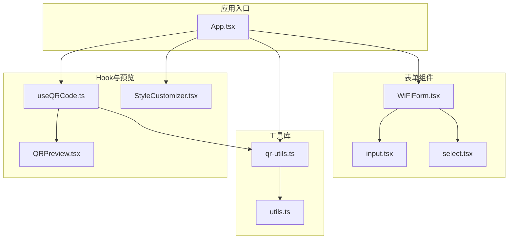
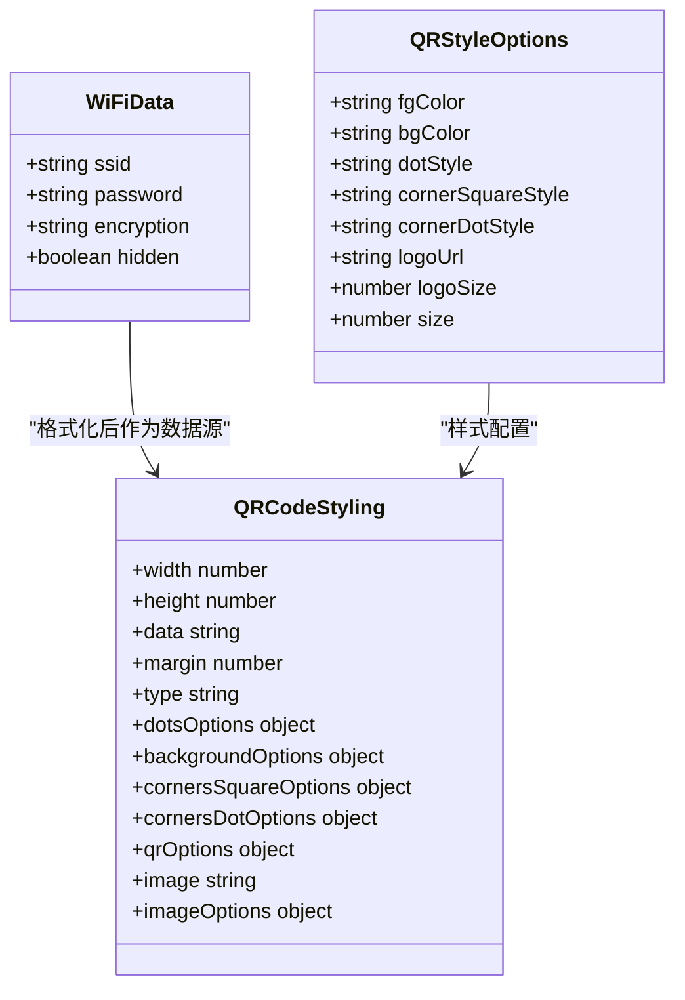
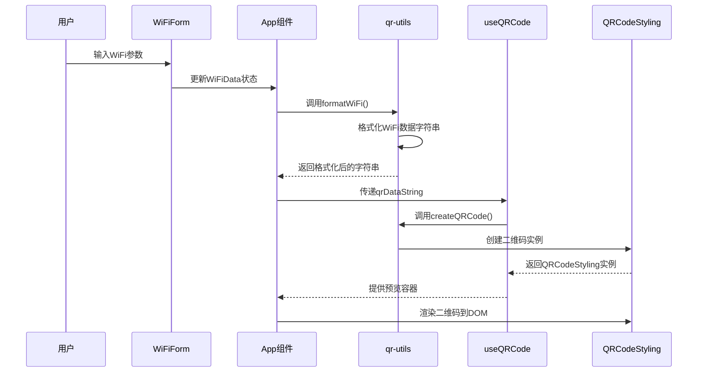
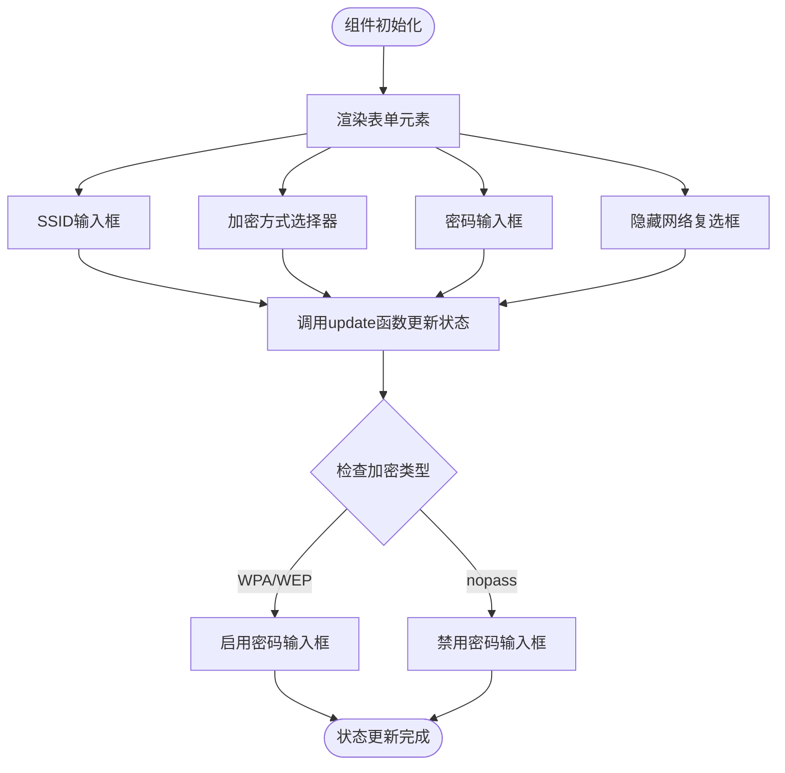
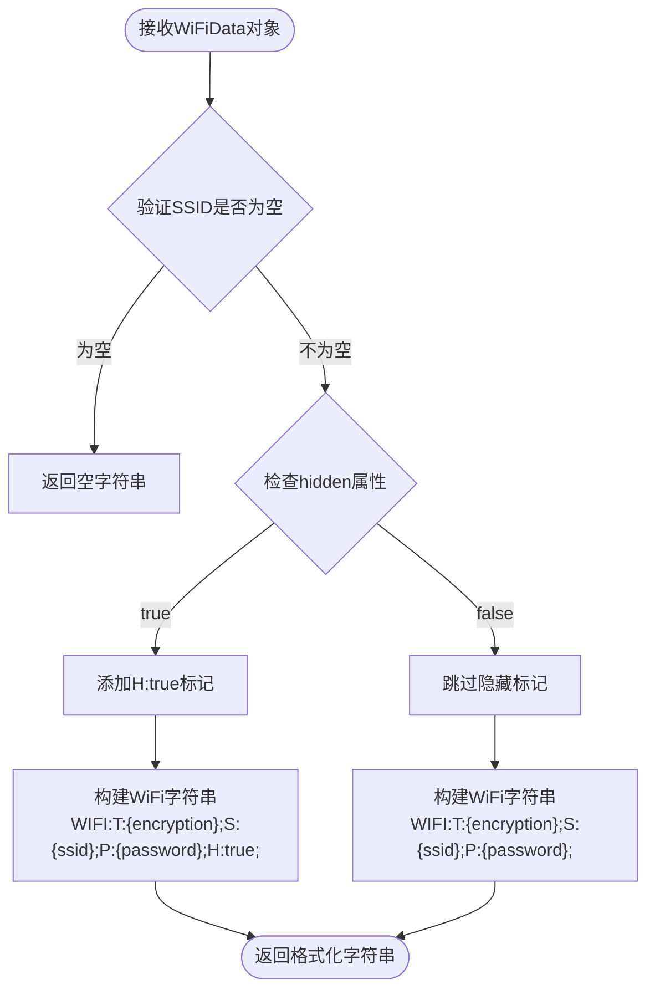
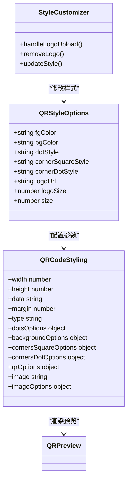
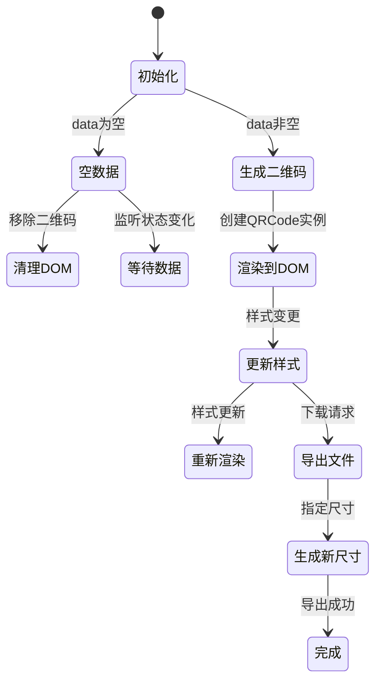
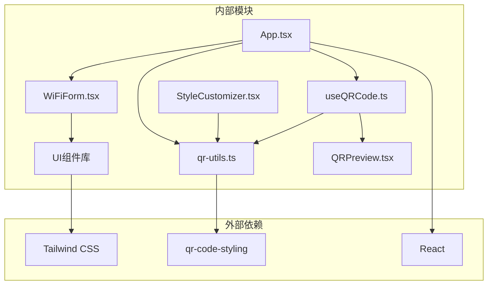

# WiFi凭证格式

<cite>
**本文档引用的文件**
- [WiFiForm.tsx](file://src/components/forms/WiFiForm.tsx)
- [qr-utils.ts](file://src/lib/qr-utils.ts)
- [App.tsx](file://src/App.tsx)
- [useQRCode.ts](file://src/hooks/useQRCode.ts)
- [QRPreview.tsx](file://src/components/QRPreview.tsx)
- [StyleCustomizer.tsx](file://src/components/StyleCustomizer.tsx)
- [input.tsx](file://src/components/ui/input.tsx)
- [select.tsx](file://src/components/ui/select.tsx)
</cite>

## 目录
1. [简介](#简介)
2. [项目结构](#项目结构)
3. [核心组件](#核心组件)
4. [架构概览](#架构概览)
5. [详细组件分析](#详细组件分析)
6. [依赖关系分析](#依赖关系分析)
7. [性能考量](#性能考量)
8. [故障排除指南](#故障排除指南)
9. [结论](#结论)

## 简介

本文件详细阐述了WiFi凭证格式功能的实现原理和使用方法。该功能允许用户通过直观的表单界面输入WiFi网络参数，并将其转换为标准的WiFi数据字符串格式，最终生成可被移动设备识别的二维码。本文档涵盖以下关键内容：
- WiFi表单组件的实现原理
- 网络参数输入验证与处理流程
- WiFi凭证格式化处理机制
- QR码编码过程与最佳实践
- 数据结构设计与安全考虑
- 具体使用示例与配置说明

## 项目结构

WiFi凭证功能位于项目的前端组件体系中，采用模块化设计，主要涉及以下文件：

**图表来源**
- [App.tsx:24-62](file://src/App.tsx#L24-L62)
- [WiFiForm.tsx:17-66](file://src/components/forms/WiFiForm.tsx#L17-L66)
- [qr-utils.ts:58-101](file://src/lib/qr-utils.ts#L58-L101)

**章节来源**
- [App.tsx:1-173](file://src/App.tsx#L1-L173)
- [WiFiForm.tsx:1-67](file://src/components/forms/WiFiForm.tsx#L1-L67)
- [qr-utils.ts:1-151](file://src/lib/qr-utils.ts#L1-L151)

## 核心组件

### WiFi数据结构

WiFi凭证功能的核心数据结构定义如下：

**图表来源**
- [qr-utils.ts:35-40](file://src/lib/qr-utils.ts#L35-L40)
- [qr-utils.ts:14-23](file://src/lib/qr-utils.ts#L14-L23)

WiFi数据结构包含四个核心字段：
- **ssid**: 网络名称，必填字段
- **password**: 网络密码，根据加密类型决定是否需要
- **encryption**: 加密类型，支持"WPA"、"WEP"、"nopass"
- **hidden**: 是否为隐藏网络，默认false

**章节来源**
- [qr-utils.ts:35-40](file://src/lib/qr-utils.ts#L35-L40)

### 表单组件实现

WiFi表单组件提供直观的用户界面，支持以下功能：
- SSID输入框（必填）
- 加密方式选择器（WPA/WPA2、WEP、无密码）
- 密码输入框（根据加密类型动态启用/禁用）
- 隐藏网络复选框

**章节来源**
- [WiFiForm.tsx:17-66](file://src/components/forms/WiFiForm.tsx#L17-L66)

## 架构概览

WiFi凭证功能的整体架构采用分层设计，从用户输入到二维码生成的完整流程如下：

**图表来源**
- [App.tsx:47-62](file://src/App.tsx#L47-L62)
- [qr-utils.ts:58-101](file://src/lib/qr-utils.ts#L58-L101)
- [useQRCode.ts:11-29](file://src/hooks/useQRCode.ts#L11-L29)

## 详细组件分析

### WiFi表单组件分析

WiFiForm组件采用受控组件模式，通过props传递的状态管理实现双向数据绑定：

**图表来源**
- [WiFiForm.tsx:17-66](file://src/components/forms/WiFiForm.tsx#L17-L66)

**章节来源**
- [WiFiForm.tsx:17-66](file://src/components/forms/WiFiForm.tsx#L17-L66)

### WiFi数据格式化机制

formatWiFi函数负责将WiFiData对象转换为标准的WiFi数据字符串格式：

**图表来源**
- [qr-utils.ts:58-61](file://src/lib/qr-utils.ts#L58-L61)

格式化后的WiFi字符串遵循标准格式：`WIFI:T:{加密类型};S:{SSID};P:{密码};{隐藏标记};`

**章节来源**
- [qr-utils.ts:58-61](file://src/lib/qr-utils.ts#L58-L61)

### QR码生成与样式定制

QR码生成过程采用模块化设计，支持丰富的样式定制选项：

**图表来源**
- [qr-utils.ts:14-23](file://src/lib/qr-utils.ts#L14-L23)
- [qr-utils.ts:63-101](file://src/lib/qr-utils.ts#L63-L101)
- [StyleCustomizer.tsx:20-134](file://src/components/StyleCustomizer.tsx#L20-L134)

**章节来源**
- [qr-utils.ts:63-101](file://src/lib/qr-utils.ts#L63-L101)
- [StyleCustomizer.tsx:20-134](file://src/components/StyleCustomizer.tsx#L20-L134)

### Hook系统与状态管理

useQRCode Hook提供完整的QR码生命周期管理：

**图表来源**
- [useQRCode.ts:5-29](file://src/hooks/useQRCode.ts#L5-L29)

**章节来源**
- [useQRCode.ts:5-75](file://src/hooks/useQRCode.ts#L5-L75)

## 依赖关系分析

WiFi凭证功能的依赖关系呈现清晰的层次结构：

**图表来源**
- [qr-utils.ts:1](file://src/lib/qr-utils.ts#L1)
- [App.tsx:1](file://src/App.tsx#L1)

**章节来源**
- [qr-utils.ts:1-6](file://src/lib/qr-utils.ts#L1-L6)
- [App.tsx:1-13](file://src/App.tsx#L1-L13)

## 性能考量

### 内存优化策略

1. **状态管理优化**: 使用React.memo和useMemo避免不必要的重渲染
2. **DOM操作最小化**: 仅在数据或样式变化时重新渲染二维码
3. **资源清理**: 组件卸载时自动清理DOM节点和事件监听器

### 渲染性能

1. **虚拟DOM**: 利用React的高效diff算法减少真实DOM操作
2. **样式缓存**: QR码样式配置缓存在内存中，避免重复计算
3. **懒加载**: 二维码生成按需触发，不占用初始渲染时间

## 故障排除指南

### 常见问题及解决方案

**问题1: WiFi密码无法输入**
- **原因**: 加密类型设置为"无密码"
- **解决**: 更换加密类型或启用密码输入框

**问题2: 二维码无法显示**
- **原因**: SSID为空或格式不正确
- **解决**: 确保SSID非空且符合字符限制

**问题3: 移动设备无法识别WiFi信息**
- **原因**: WiFi字符串格式错误
- **解决**: 检查formatWiFi函数输出格式

**问题4: 样式定制无效**
- **原因**: 样式参数未正确传递
- **解决**: 验证QRStyleOptions配置

**章节来源**
- [WiFiForm.tsx:51](file://src/components/forms/WiFiForm.tsx#L51)
- [App.tsx:57-58](file://src/App.tsx#L57-L58)

## 结论

WiFi凭证格式功能通过精心设计的组件架构和严格的格式规范，实现了从用户输入到二维码生成的完整流程。该功能具有以下特点：

1. **用户友好**: 直观的表单界面和实时预览功能
2. **格式标准**: 严格遵循WiFi数据字符串标准格式
3. **样式丰富**: 支持多种样式定制选项
4. **性能优化**: 采用高效的渲染和状态管理策略
5. **安全考虑**: 在本地生成，保护用户隐私数据

通过本文档的详细说明，开发者可以深入理解WiFi凭证格式功能的实现原理，并能够正确配置和使用该功能来满足各种应用场景的需求。