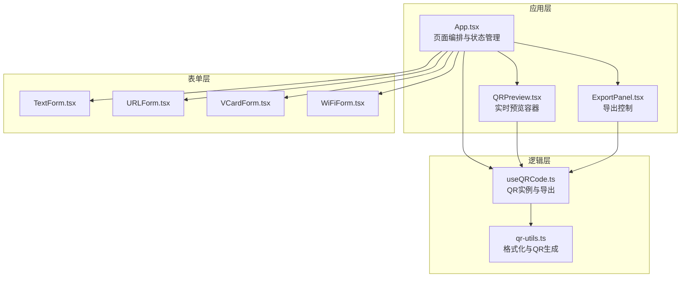
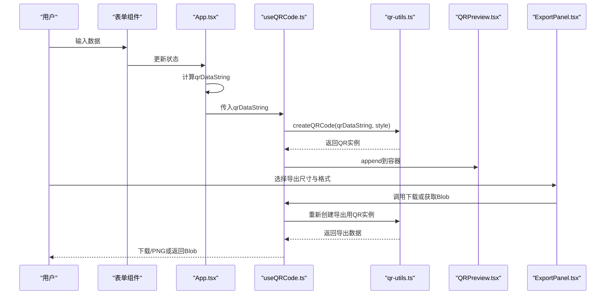
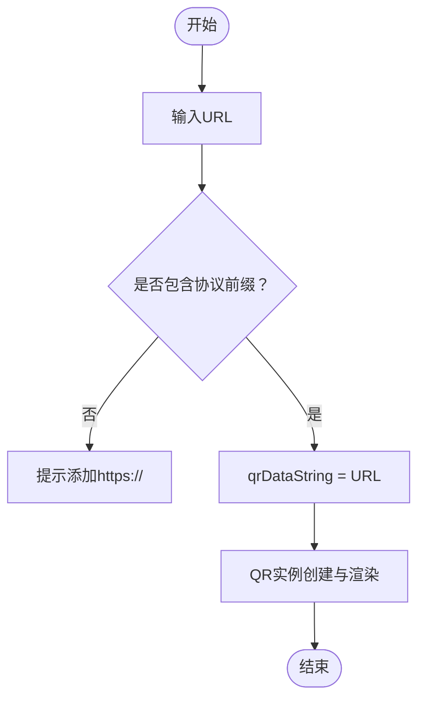
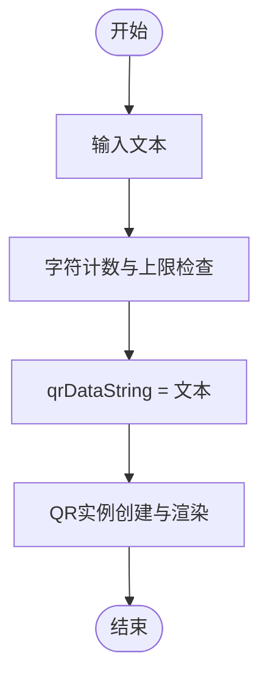
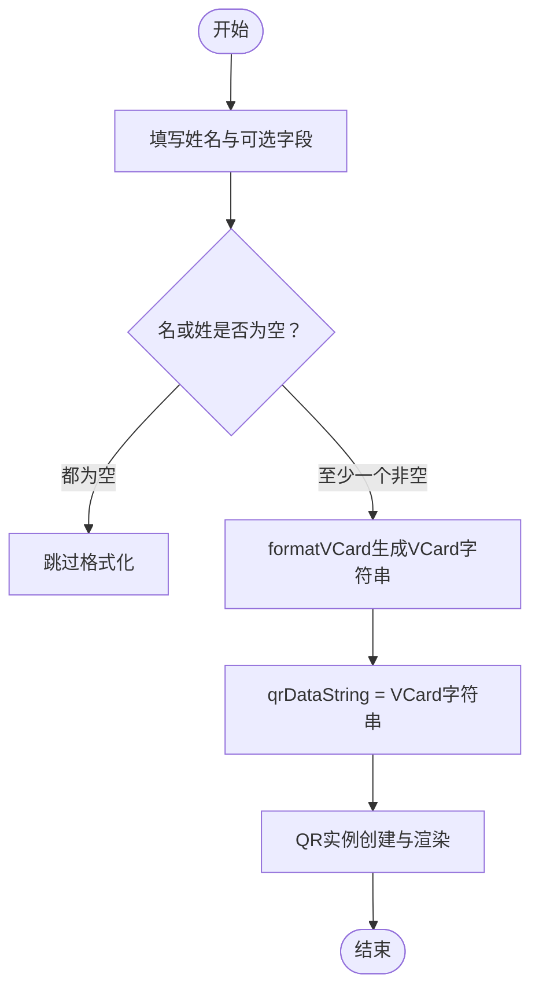
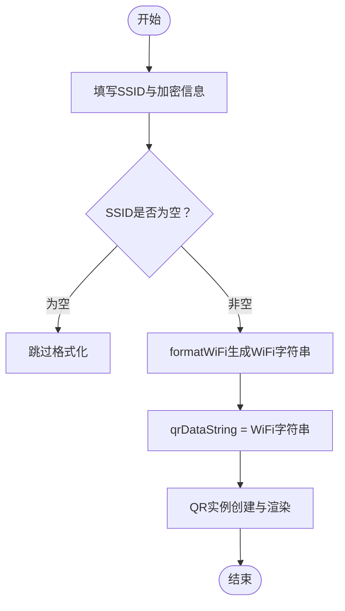
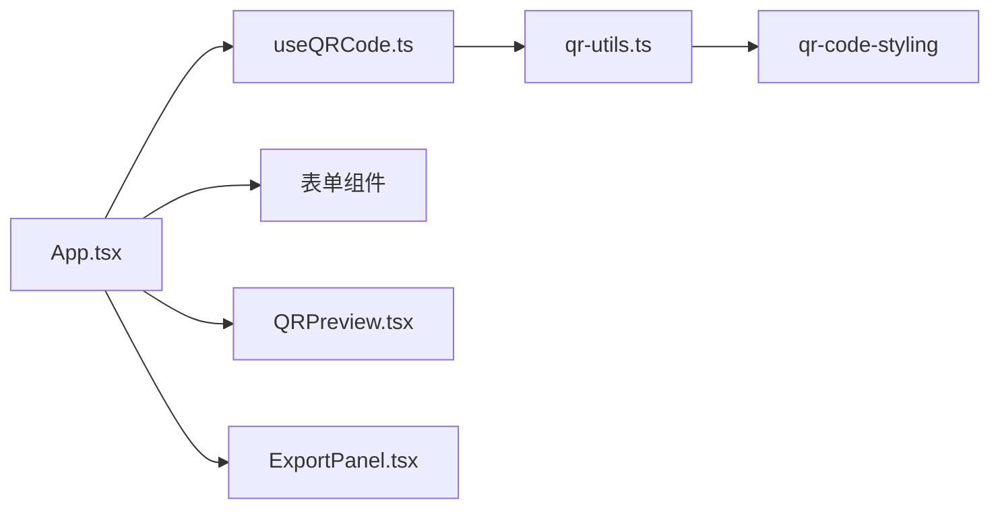

# 多格式数据支持

<cite>
**本文引用的文件**
- [src/lib/qr-utils.ts](file://src/lib/qr-utils.ts)
- [src/App.tsx](file://src/App.tsx)
- [src/hooks/useQRCode.ts](file://src/hooks/useQRCode.ts)
- [src/components/forms/TextForm.tsx](file://src/components/forms/TextForm.tsx)
- [src/components/forms/URLForm.tsx](file://src/components/forms/URLForm.tsx)
- [src/components/forms/VCardForm.tsx](file://src/components/forms/VCardForm.tsx)
- [src/components/forms/WiFiForm.tsx](file://src/components/forms/WiFiForm.tsx)
- [src/components/QRPreview.tsx](file://src/components/QRPreview.tsx)
- [src/components/ExportPanel.tsx](file://src/components/ExportPanel.tsx)
- [package.json](file://package.json)
</cite>

## 目录
1. [简介](#简介)
2. [项目结构](#项目结构)
3. [核心组件](#核心组件)
4. [架构总览](#架构总览)
5. [详细组件分析](#详细组件分析)
6. [依赖关系分析](#依赖关系分析)
7. [性能考量](#性能考量)
8. [故障排查指南](#故障排查指南)
9. [结论](#结论)
10. [附录](#附录)

## 简介
本文件围绕QR码生成器的“多格式数据支持”能力，系统性阐述URL、文本、VCard联系人名片、WiFi凭证四种数据类型的实现原理、输入验证规则、格式化处理逻辑与QR码编码流程。文档同时提供使用示例、数据格式化函数工作机制说明，以及不同数据类型在二维码中的编码方式与最佳实践建议，帮助开发者与使用者高效、准确地生成符合预期的二维码。

## 项目结构
该应用采用React + TypeScript构建，核心逻辑集中在以下模块：
- 数据格式化与QR生成：位于 [src/lib/qr-utils.ts](file://src/lib/qr-utils.ts)
- 应用入口与页面编排：位于 [src/App.tsx](file://src/App.tsx)
- QR实例生命周期与导出：位于 [src/hooks/useQRCode.ts](file://src/hooks/useQRCode.ts)
- 表单输入组件（文本、URL、VCard、WiFi）：位于 [src/components/forms/](file://src/components/forms/)
- 预览与导出面板：位于 [src/components/QRPreview.tsx](file://src/components/QRPreview.tsx)、[src/components/ExportPanel.tsx](file://src/components/ExportPanel.tsx)
- 依赖声明：位于 [package.json](file://package.json)

图表来源
- [src/App.tsx:1-173](file://src/App.tsx#L1-L173)
- [src/hooks/useQRCode.ts:1-75](file://src/hooks/useQRCode.ts#L1-L75)
- [src/lib/qr-utils.ts:1-151](file://src/lib/qr-utils.ts#L1-L151)

章节来源
- [src/App.tsx:1-173](file://src/App.tsx#L1-L173)
- [package.json:1-37](file://package.json#L1-L37)

## 核心组件
- 数据类型与格式化工具
  - 定义了四种数据类型枚举与样式选项接口，提供VCard与WiFi的格式化函数，以及基于qr-code-styling的QR实例创建函数。
  - 关键路径：[src/lib/qr-utils.ts:8-151](file://src/lib/qr-utils.ts#L8-L151)
- 应用主流程
  - 根据当前激活标签页选择对应输入数据，计算最终用于编码的字符串；通过Hook创建QR实例并注入到预览容器中。
  - 关键路径：[src/App.tsx:46-65](file://src/App.tsx#L46-L65)
- QR实例与导出
  - Hook负责监听数据与样式变化，动态渲染QR；提供PNG/SVG下载与Blob获取能力。
  - 关键路径：[src/hooks/useQRCode.ts:1-75](file://src/hooks/useQRCode.ts#L1-L75)
- 表单输入
  - 文本、URL、VCard、WiFi四类表单分别收集用户输入，触发状态更新。
  - 关键路径：[src/components/forms/TextForm.tsx:1-28](file://src/components/forms/TextForm.tsx#L1-L28)、[src/components/forms/URLForm.tsx:1-33](file://src/components/forms/URLForm.tsx#L1-L33)、[src/components/forms/VCardForm.tsx:1-92](file://src/components/forms/VCardForm.tsx#L1-L92)、[src/components/forms/WiFiForm.tsx:1-67](file://src/components/forms/WiFiForm.tsx#L1-L67)

章节来源
- [src/lib/qr-utils.ts:8-151](file://src/lib/qr-utils.ts#L8-L151)
- [src/App.tsx:46-65](file://src/App.tsx#L46-L65)
- [src/hooks/useQRCode.ts:1-75](file://src/hooks/useQRCode.ts#L1-L75)
- [src/components/forms/TextForm.tsx:1-28](file://src/components/forms/TextForm.tsx#L1-L28)
- [src/components/forms/URLForm.tsx:1-33](file://src/components/forms/URLForm.tsx#L1-L33)
- [src/components/forms/VCardForm.tsx:1-92](file://src/components/forms/VCardForm.tsx#L1-L92)
- [src/components/forms/WiFiForm.tsx:1-67](file://src/components/forms/WiFiForm.tsx#L1-L67)

## 架构总览
下图展示了从用户输入到QR码渲染与导出的端到端流程。

图表来源
- [src/App.tsx:46-65](file://src/App.tsx#L46-L65)
- [src/hooks/useQRCode.ts:11-29](file://src/hooks/useQRCode.ts#L11-L29)
- [src/lib/qr-utils.ts:63-101](file://src/lib/qr-utils.ts#L63-L101)
- [src/components/QRPreview.tsx:27-33](file://src/components/QRPreview.tsx#L27-L33)
- [src/components/ExportPanel.tsx:21-37](file://src/components/ExportPanel.tsx#L21-L37)

## 详细组件分析

### URL数据类型
- 输入验证与格式化
  - 表单组件提供URL输入框，使用HTML5的url类型与前缀提示，确保输入包含协议前缀。
  - App在计算qrDataString时直接使用URL字符串，无需额外格式化。
  - 关键路径：[src/components/forms/URLForm.tsx:10-32](file://src/components/forms/URLForm.tsx#L10-L32)、[src/App.tsx:48-50](file://src/App.tsx#L48-L50)
- 编码与渲染
  - QR实例创建时直接将URL作为数据源，qr-code-styling负责编码与渲染。
  - 关键路径：[src/lib/qr-utils.ts:63-101](file://src/lib/qr-utils.ts#L63-L101)
- 使用示例
  - 在“网址链接”输入框中输入完整URL，如：https://example.com
  - 预览与导出均直接使用该URL字符串
  - 关键路径：[src/components/forms/URLForm.tsx:17-24](file://src/components/forms/URLForm.tsx#L17-L24)

图表来源
- [src/components/forms/URLForm.tsx:10-32](file://src/components/forms/URLForm.tsx#L10-L32)
- [src/App.tsx:48-50](file://src/App.tsx#L48-L50)
- [src/lib/qr-utils.ts:63-101](file://src/lib/qr-utils.ts#L63-L101)

章节来源
- [src/components/forms/URLForm.tsx:10-32](file://src/components/forms/URLForm.tsx#L10-L32)
- [src/App.tsx:48-50](file://src/App.tsx#L48-L50)
- [src/lib/qr-utils.ts:63-101](file://src/lib/qr-utils.ts#L63-L101)

### 文本数据类型
- 输入验证与格式化
  - 表单组件提供多行文本输入，限制字符数并显示计数。
  - App在计算qrDataString时直接使用文本字符串，无需额外格式化。
  - 关键路径：[src/components/forms/TextForm.tsx:9-27](file://src/components/forms/TextForm.tsx#L9-L27)、[src/App.tsx:51-52](file://src/App.tsx#L51-L52)
- 编码与渲染
  - QR实例创建时直接将文本作为数据源进行编码。
  - 关键路径：[src/lib/qr-utils.ts:63-101](file://src/lib/qr-utils.ts#L63-L101)
- 使用示例
  - 在“文本内容”输入框中输入任意文本，例如一段说明文字或备注。
  - 预览与导出均直接使用该文本字符串。
  - 关键路径：[src/components/forms/TextForm.tsx:14-20](file://src/components/forms/TextForm.tsx#L14-L20)

图表来源
- [src/components/forms/TextForm.tsx:9-27](file://src/components/forms/TextForm.tsx#L9-L27)
- [src/App.tsx:51-52](file://src/App.tsx#L51-L52)
- [src/lib/qr-utils.ts:63-101](file://src/lib/qr-utils.ts#L63-L101)

章节来源
- [src/components/forms/TextForm.tsx:9-27](file://src/components/forms/TextForm.tsx#L9-L27)
- [src/App.tsx:51-52](file://src/App.tsx#L51-L52)
- [src/lib/qr-utils.ts:63-101](file://src/lib/qr-utils.ts#L63-L101)

### VCard联系人名片数据类型
- 输入验证与格式化
  - 表单组件提供姓名、电话、邮箱、公司、职位、网站等字段，部分字段可选。
  - App仅在“名”或“姓”至少有一个非空时才调用格式化函数生成VCard字符串。
  - 关键路径：[src/components/forms/VCardForm.tsx:10-91](file://src/components/forms/VCardForm.tsx#L10-L91)、[src/App.tsx:53-56](file://src/App.tsx#L53-L56)
- VCard格式化逻辑
  - 固定头尾与版本号，按顺序拼接必要字段；仅当存在值时才写入组织、职位、电话、邮箱、网站。
  - 关键路径：[src/lib/qr-utils.ts:42-56](file://src/lib/qr-utils.ts#L42-L56)
- 编码与渲染
  - 将VCard字符串作为数据源进行QR编码与渲染。
  - 关键路径：[src/lib/qr-utils.ts:63-101](file://src/lib/qr-utils.ts#L63-L101)
- 使用示例
  - 在“名”和“姓”至少填写一项后，系统自动格式化为标准VCard字符串并生成二维码。
  - 可选字段如“公司”、“职位”、“电话”、“邮箱”、“网站”均可按需填写。
  - 关键路径：[src/components/forms/VCardForm.tsx:18-36](file://src/components/forms/VCardForm.tsx#L18-L36)、[src/components/forms/VCardForm.tsx:59-78](file://src/components/forms/VCardForm.tsx#L59-L78)

图表来源
- [src/components/forms/VCardForm.tsx:10-91](file://src/components/forms/VCardForm.tsx#L10-L91)
- [src/App.tsx:53-56](file://src/App.tsx#L53-L56)
- [src/lib/qr-utils.ts:42-56](file://src/lib/qr-utils.ts#L42-L56)
- [src/lib/qr-utils.ts:63-101](file://src/lib/qr-utils.ts#L63-L101)

章节来源
- [src/components/forms/VCardForm.tsx:10-91](file://src/components/forms/VCardForm.tsx#L10-L91)
- [src/App.tsx:53-56](file://src/App.tsx#L53-L56)
- [src/lib/qr-utils.ts:42-56](file://src/lib/qr-utils.ts#L42-L56)
- [src/lib/qr-utils.ts:63-101](file://src/lib/qr-utils.ts#L63-L101)

### WiFi凭证数据类型
- 输入验证与格式化
  - 表单组件提供SSID、加密方式（WPA/WPA2、WEP、无密码）、密码（根据加密方式启用/禁用）、隐藏网络勾选。
  - App仅在“SSID”非空时才调用格式化函数生成WiFi字符串。
  - 关键路径：[src/components/forms/WiFiForm.tsx:17-66](file://src/components/forms/WiFiForm.tsx#L17-L66)、[src/App.tsx:57-58](file://src/App.tsx#L57-L58)
- WiFi格式化逻辑
  - 固定前缀与加密类型，拼接SSID与密码；若为隐藏网络则追加隐藏标记。
  - 关键路径：[src/lib/qr-utils.ts:58-61](file://src/lib/qr-utils.ts#L58-L61)
- 编码与渲染
  - 将WiFi字符串作为数据源进行QR编码与渲染。
  - 关键路径：[src/lib/qr-utils.ts:63-101](file://src/lib/qr-utils.ts#L63-L101)
- 使用示例
  - 填写“WiFi名称(SSID)”；根据实际网络选择加密方式；若为无密码则禁用密码输入框；勾选“隐藏网络”以包含相应标记。
  - 关键路径：[src/components/forms/WiFiForm.tsx:25-53](file://src/components/forms/WiFiForm.tsx#L25-L53)

图表来源
- [src/components/forms/WiFiForm.tsx:17-66](file://src/components/forms/WiFiForm.tsx#L17-L66)
- [src/App.tsx:57-58](file://src/App.tsx#L57-L58)
- [src/lib/qr-utils.ts:58-61](file://src/lib/qr-utils.ts#L58-L61)
- [src/lib/qr-utils.ts:63-101](file://src/lib/qr-utils.ts#L63-L101)

章节来源
- [src/components/forms/WiFiForm.tsx:17-66](file://src/components/forms/WiFiForm.tsx#L17-L66)
- [src/App.tsx:57-58](file://src/App.tsx#L57-L58)
- [src/lib/qr-utils.ts:58-61](file://src/lib/qr-utils.ts#L58-L61)
- [src/lib/qr-utils.ts:63-101](file://src/lib/qr-utils.ts#L63-L101)

## 依赖关系分析
- 组件耦合与职责
  - App负责状态聚合与数据字符串计算，useQRCode负责QR实例生命周期与导出，qr-utils封装格式化与QR生成细节，表单组件负责输入收集。
- 外部依赖
  - 使用qr-code-styling进行QR码渲染；使用TailwindCSS与Tailwind Merge进行样式合并；使用Lucide图标库；使用Sonner进行通知提示。
- 关键路径
  - [src/App.tsx:14-20](file://src/App.tsx#L14-L20)导入格式化函数；[src/hooks/useQRCode.ts:2](file://src/hooks/useQRCode.ts#L2)导入样式与默认配置；[src/lib/qr-utils.ts:1-6](file://src/lib/qr-utils.ts#L1-L6)引入qr-code-styling类型。

图表来源
- [src/App.tsx:14-20](file://src/App.tsx#L14-L20)
- [src/hooks/useQRCode.ts:2](file://src/hooks/useQRCode.ts#L2)
- [src/lib/qr-utils.ts:1-6](file://src/lib/qr-utils.ts#L1-L6)

章节来源
- [src/App.tsx:14-20](file://src/App.tsx#L14-L20)
- [src/hooks/useQRCode.ts:2](file://src/hooks/useQRCode.ts#L2)
- [src/lib/qr-utils.ts:1-6](file://src/lib/qr-utils.ts#L1-L6)
- [package.json:11-24](file://package.json#L11-L24)

## 性能考量
- 渲染优化
  - App通过useMemo计算qrDataString，避免不必要的重渲染；useQRCode在数据或样式变化时才重建QR实例。
  - 关键路径：[src/App.tsx:46-62](file://src/App.tsx#L46-L62)、[src/hooks/useQRCode.ts:11-29](file://src/hooks/useQRCode.ts#L11-L29)
- 导出性能
  - 导出时按指定尺寸重新创建QR实例，避免影响实时预览；PNG导出支持自定义尺寸，SVG导出固定尺寸以保证矢量质量。
  - 关键路径：[src/hooks/useQRCode.ts:35-62](file://src/hooks/useQRCode.ts#L35-L62)、[src/components/ExportPanel.tsx:18-37](file://src/components/ExportPanel.tsx#L18-L37)
- 最佳实践
  - 对于大文本或复杂VCard，建议在输入阶段进行必要的长度与格式约束，减少QR编码负担。
  - 高分辨率导出时优先选择SVG以保持清晰度，PNG适合快速分享与嵌入。

[本节为通用性能建议，不涉及具体代码片段]

## 故障排查指南
- 无数据时预览空白
  - 当qrDataString为空时，预览容器会显示占位提示；确认已正确填写任一表单且满足格式要求。
  - 关键路径：[src/components/QRPreview.tsx:21-26](file://src/components/QRPreview.tsx#L21-L26)、[src/App.tsx:67](file://src/App.tsx#L67)
- WiFi导出失败或无法连接
  - 检查SSID是否填写；若选择“无密码”，请确保密码字段被禁用且未填入内容；隐藏网络需勾选相应选项。
  - 关键路径：[src/components/forms/WiFiForm.tsx:51-63](file://src/components/forms/WiFiForm.tsx#L51-L63)
- VCard无法识别
  - 确保“名”或“姓”至少填写一项，否则不会生成VCard字符串。
  - 关键路径：[src/App.tsx:54-56](file://src/App.tsx#L54-L56)
- 导出按钮不可用
  - 确认已有有效数据且未处于导出中；导出过程中按钮会被禁用。
  - 关键路径：[src/components/ExportPanel.tsx:60-78](file://src/components/ExportPanel.tsx#L60-L78)

章节来源
- [src/components/QRPreview.tsx:21-26](file://src/components/QRPreview.tsx#L21-L26)
- [src/App.tsx:67](file://src/App.tsx#L67)
- [src/components/forms/WiFiForm.tsx:51-63](file://src/components/forms/WiFiForm.tsx#L51-L63)
- [src/App.tsx:54-56](file://src/App.tsx#L54-L56)
- [src/components/ExportPanel.tsx:60-78](file://src/components/ExportPanel.tsx#L60-L78)

## 结论
本项目通过清晰的分层设计与简洁的格式化函数，实现了对URL、文本、VCard、WiFi四种数据类型的稳定支持。表单层负责输入与校验，应用层负责数据聚合与QR字符串生成，Hook层负责QR实例生命周期与导出，qr-utils层封装底层编码细节。配合直观的预览与灵活的导出选项，用户可以高效生成高质量的二维码，并在不同场景下获得最佳体验。

[本节为总结性内容，不涉及具体代码片段]

## 附录

### 数据类型与编码要点
- URL
  - 输入即编码；注意协议前缀完整性。
  - 关键路径：[src/components/forms/URLForm.tsx:17-24](file://src/components/forms/URLForm.tsx#L17-L24)
- 文本
  - 输入即编码；关注字符数量限制。
  - 关键路径：[src/components/forms/TextForm.tsx:14-20](file://src/components/forms/TextForm.tsx#L14-L20)
- VCard
  - 仅当“名”或“姓”非空时生成；字段按顺序拼接，可选字段按需加入。
  - 关键路径：[src/lib/qr-utils.ts:42-56](file://src/lib/qr-utils.ts#L42-L56)
- WiFi
  - 仅当“SSID”非空时生成；加密方式与隐藏网络决定最终字符串结构。
  - 关键路径：[src/lib/qr-utils.ts:58-61](file://src/lib/qr-utils.ts#L58-L61)

### 使用示例清单
- URL示例
  - 输入：https://example.com
  - 预览与导出：直接使用该URL
  - 关键路径：[src/components/forms/URLForm.tsx:17-24](file://src/components/forms/URLForm.tsx#L17-L24)
- 文本示例
  - 输入：一段说明文字
  - 预览与导出：直接使用该文本
  - 关键路径：[src/components/forms/TextForm.tsx:14-20](file://src/components/forms/TextForm.tsx#L14-L20)
- VCard示例
  - 输入：名/姓至少一项，可选填电话、邮箱、公司、职位、网站
  - 预览与导出：系统生成VCard字符串
  - 关键路径：[src/components/forms/VCardForm.tsx:18-36](file://src/components/forms/VCardForm.tsx#L18-L36)、[src/components/forms/VCardForm.tsx:59-78](file://src/components/forms/VCardForm.tsx#L59-L78)
- WiFi示例
  - 输入：SSID、加密方式、密码（按需）、隐藏网络勾选
  - 预览与导出：系统生成WiFi字符串
  - 关键路径：[src/components/forms/WiFiForm.tsx:25-53](file://src/components/forms/WiFiForm.tsx#L25-L53)