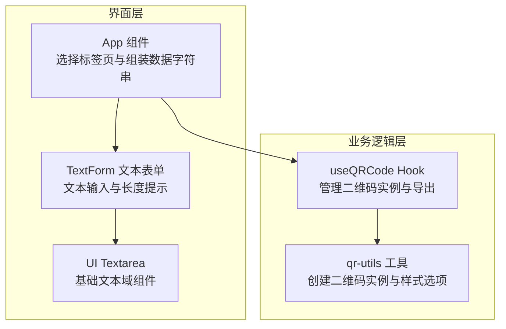
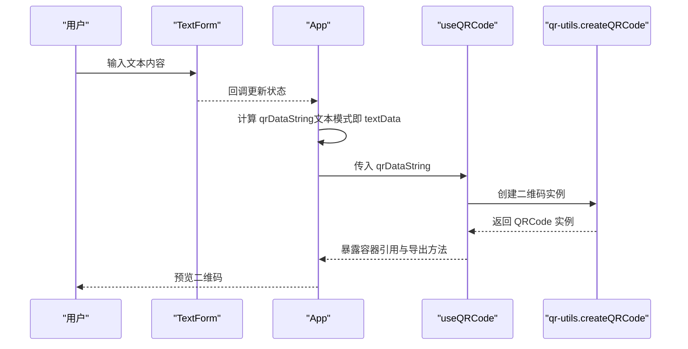
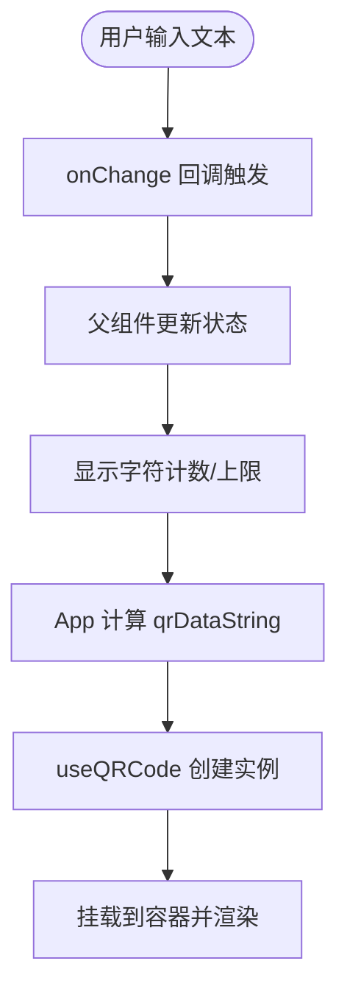
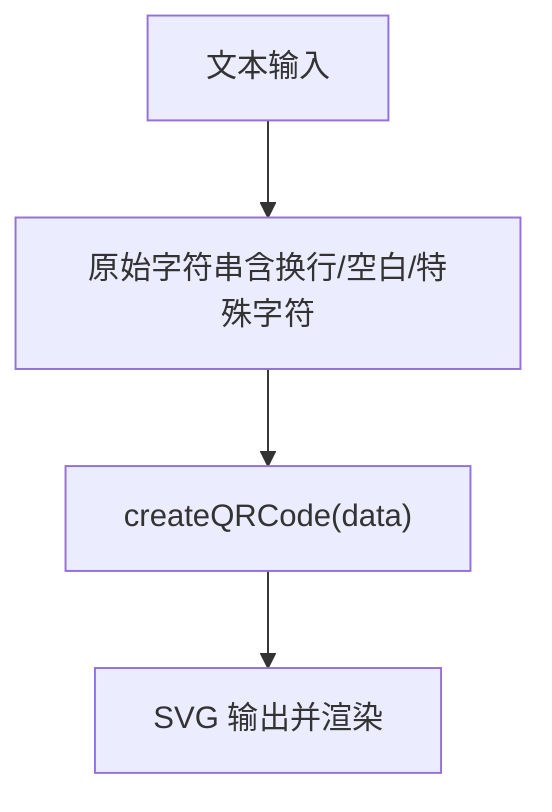
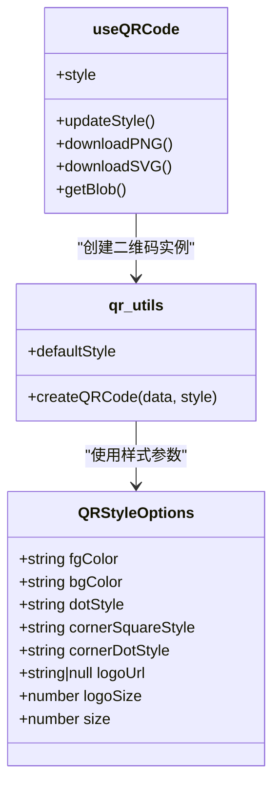
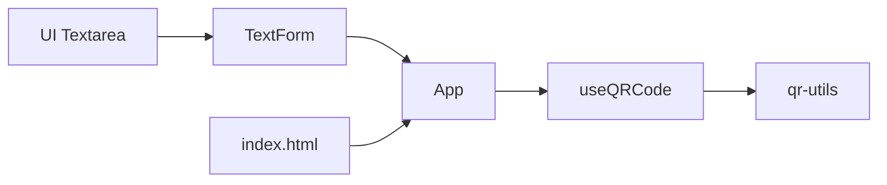

# 文本数据格式

<cite>
**本文档引用的文件**
- [src/components/forms/TextForm.tsx](file://src/components/forms/TextForm.tsx)
- [src/components/ui/textarea.tsx](file://src/components/ui/textarea.tsx)
- [src/lib/qr-utils.ts](file://src/lib/qr-utils.ts)
- [src/hooks/useQRCode.ts](file://src/hooks/useQRCode.ts)
- [src/App.tsx](file://src/App.tsx)
- [index.html](file://index.html)
</cite>

## 目录
1. [简介](#简介)
2. [项目结构](#项目结构)
3. [核心组件](#核心组件)
4. [架构总览](#架构总览)
5. [详细组件分析](#详细组件分析)
6. [依赖关系分析](#依赖关系分析)
7. [性能考量](#性能考量)
8. [故障排除指南](#故障排除指南)
9. [结论](#结论)
10. [附录](#附录)

## 简介
本文件聚焦于“文本数据格式”功能，系统性阐述文本表单组件的实现原理、文本输入处理流程、长度限制策略，以及文本数据在二维码中的编码与渲染机制。文档还涵盖换行符处理、特殊字符转义与编码优化建议，并提供多语言支持与字符集处理的最佳实践。

## 项目结构
该功能位于前端应用中，采用模块化组织：表单层负责用户输入，工具层负责二维码生成与样式配置，Hook 层负责状态与导出能力，入口层负责数据拼装与预览。

图表来源
- [src/App.tsx:24-67](file://src/App.tsx#L24-L67)
- [src/components/forms/TextForm.tsx:9-27](file://src/components/forms/TextForm.tsx#L9-L27)
- [src/components/ui/textarea.tsx:7-21](file://src/components/ui/textarea.tsx#L7-L21)
- [src/hooks/useQRCode.ts:5-29](file://src/hooks/useQRCode.ts#L5-L29)
- [src/lib/qr-utils.ts:63-101](file://src/lib/qr-utils.ts#L63-L101)

章节来源
- [src/App.tsx:24-67](file://src/App.tsx#L24-L67)
- [src/components/forms/TextForm.tsx:9-27](file://src/components/forms/TextForm.tsx#L9-L27)
- [src/components/ui/textarea.tsx:7-21](file://src/components/ui/textarea.tsx#L7-L21)
- [src/hooks/useQRCode.ts:5-29](file://src/hooks/useQRCode.ts#L5-L29)
- [src/lib/qr-utils.ts:63-101](file://src/lib/qr-utils.ts#L63-L101)

## 核心组件
- 文本表单组件：提供文本输入框与字符计数显示，支持最大 2000 字符限制提示。
- UI 文本域：封装基础 textarea 的样式与交互行为。
- 二维码生成器：根据传入的数据字符串创建 QRCode 实例，支持尺寸、颜色与样式配置。
- Hook：负责监听数据变化、创建二维码实例、挂载到容器、提供下载与导出能力。

章节来源
- [src/components/forms/TextForm.tsx:9-27](file://src/components/forms/TextForm.tsx#L9-L27)
- [src/components/ui/textarea.tsx:7-21](file://src/components/ui/textarea.tsx#L7-L21)
- [src/lib/qr-utils.ts:63-101](file://src/lib/qr-utils.ts#L63-L101)
- [src/hooks/useQRCode.ts:5-29](file://src/hooks/useQRCode.ts#L5-L29)

## 架构总览
文本数据从用户输入开始，经由表单组件进入应用状态，再由入口组件根据当前标签页拼装为最终的二维码数据字符串，最后通过 Hook 与工具层创建二维码实例并渲染到页面。

图表来源
- [src/App.tsx:46-62](file://src/App.tsx#L46-L62)
- [src/components/forms/TextForm.tsx:9-27](file://src/components/forms/TextForm.tsx#L9-L27)
- [src/hooks/useQRCode.ts:11-29](file://src/hooks/useQRCode.ts#L11-L29)
- [src/lib/qr-utils.ts:63-101](file://src/lib/qr-utils.ts#L63-L101)

## 详细组件分析

### 文本表单组件（TextForm）
- 职责：提供文本输入区域、字符计数与上限提示。
- 输入处理：受控组件，onChange 将值回传给父组件。
- 长度限制：显示当前字符数与上限（2000），便于用户感知输入规模。
- UI 基础：基于 UI Textarea 组件，具备统一的样式与交互。

图表来源
- [src/components/forms/TextForm.tsx:9-27](file://src/components/forms/TextForm.tsx#L9-L27)
- [src/App.tsx:46-62](file://src/App.tsx#L46-L62)
- [src/hooks/useQRCode.ts:11-29](file://src/hooks/useQRCode.ts#L11-L29)

章节来源
- [src/components/forms/TextForm.tsx:9-27](file://src/components/forms/TextForm.tsx#L9-L27)
- [src/components/ui/textarea.tsx:7-21](file://src/components/ui/textarea.tsx#L7-L21)

### 文本数据处理与编码
- 数据来源：文本模式下，qrDataString 即为 textData。
- 编码方式：直接将字符串传递给二维码生成器；未进行显式转义或规范化处理。
- 换行符处理：未做特殊处理，保留原始换行符。
- 特殊字符转义：未进行自动转义；如需在特定场景（如 URL、CSV）中避免歧义，应在上游进行转义。
- 编码优化：建议在需要时对控制字符进行过滤或替换，以提升兼容性与可读性。

图表来源
- [src/App.tsx:46-62](file://src/App.tsx#L46-L62)
- [src/lib/qr-utils.ts:63-101](file://src/lib/qr-utils.ts#L63-L101)

章节来源
- [src/App.tsx:46-62](file://src/App.tsx#L46-L62)
- [src/lib/qr-utils.ts:63-101](file://src/lib/qr-utils.ts#L63-L101)

### 二维码生成与样式定制
- 生成流程：useQRCode 在数据变化时创建 QRCode 实例并挂载到容器。
- 样式选项：支持前景色、背景色、码点样式、角样式、角点样式、Logo 与尺寸等。
- 导出能力：提供 PNG 与 SVG 下载，以及获取 Blob 的通用接口。

图表来源
- [src/hooks/useQRCode.ts:5-74](file://src/hooks/useQRCode.ts#L5-L74)
- [src/lib/qr-utils.ts:14-112](file://src/lib/qr-utils.ts#L14-L112)

章节来源
- [src/hooks/useQRCode.ts:5-74](file://src/hooks/useQRCode.ts#L5-L74)
- [src/lib/qr-utils.ts:14-112](file://src/lib/qr-utils.ts#L14-L112)

### 使用示例与最佳实践
- 基本文本输入：在文本表单中输入任意文本，字符计数实时更新。
- 多语言支持：建议确保输入内容使用 UTF-8 编码，以覆盖广泛字符集。
- 控制字符处理：对于包含换行符、制表符、不可见控制字符的文本，建议在写入前进行清理或替换，以避免二维码解析异常。
- 特殊字符转义：若文本用于特定协议（如 URL、CSV），请在上游进行相应转义，避免歧义。
- 编码优化：对长文本可考虑分段或压缩策略（如 Base64），但需评估二维码容量与解析兼容性。

章节来源
- [src/components/forms/TextForm.tsx:9-27](file://src/components/forms/TextForm.tsx#L9-L27)
- [src/App.tsx:46-62](file://src/App.tsx#L46-L62)

## 依赖关系分析
- TextForm 依赖 UI Textarea，负责输入与计数。
- App 根据标签页动态选择数据源，文本模式直接取 textData。
- useQRCode 依赖 qr-utils 创建二维码实例，并暴露导出与样式更新能力。
- index.html 设置了语言与描述信息，确保国际化与 SEO 友好。

图表来源
- [src/components/forms/TextForm.tsx:9-27](file://src/components/forms/TextForm.tsx#L9-L27)
- [src/components/ui/textarea.tsx:7-21](file://src/components/ui/textarea.tsx#L7-L21)
- [src/App.tsx:24-67](file://src/App.tsx#L24-L67)
- [src/hooks/useQRCode.ts:5-29](file://src/hooks/useQRCode.ts#L5-L29)
- [src/lib/qr-utils.ts:63-101](file://src/lib/qr-utils.ts#L63-L101)
- [index.html:2-11](file://index.html#L2-L11)

章节来源
- [src/App.tsx:24-67](file://src/App.tsx#L24-L67)
- [src/hooks/useQRCode.ts:5-29](file://src/hooks/useQRCode.ts#L5-L29)
- [src/lib/qr-utils.ts:63-101](file://src/lib/qr-utils.ts#L63-L101)
- [index.html:2-11](file://index.html#L2-L11)

## 性能考量
- 渲染开销：文本输入频繁触发状态更新，建议在大文本场景下使用防抖或节流策略，减少不必要的重渲染。
- 二维码生成：每次数据变化都会重新创建实例，建议在高频输入时延迟生成或合并多次变更。
- 图像导出：PNG/SVG 导出涉及大量像素/矢量计算，建议在需要时才触发，避免阻塞主线程。

## 故障排除指南
- 输入超过上限：当字符数达到 2000 时，应提醒用户减少输入或拆分文本。
- 二维码无法识别：检查是否包含过多控制字符或不被支持的字符集；必要时进行清洗或转义。
- 导出失败：确认浏览器允许下载与跨域资源；若包含 Logo，注意跨域与尺寸设置。

章节来源
- [src/components/forms/TextForm.tsx:21-23](file://src/components/forms/TextForm.tsx#L21-L23)
- [src/hooks/useQRCode.ts:35-62](file://src/hooks/useQRCode.ts#L35-L62)

## 结论
文本数据格式功能以简洁的表单输入为核心，结合应用层的数据拼装与 Hook 的生命周期管理，实现了从文本到二维码的完整链路。当前实现未对文本进行特殊转义或规范化，建议在实际使用中根据目标场景进行必要的清洗与转义，以确保二维码的稳定解析与良好的用户体验。

## 附录
- 语言与元信息：index.html 中设置了语言与描述，有助于国际化与搜索引擎优化。

章节来源
- [index.html:2-11](file://index.html#L2-L11)