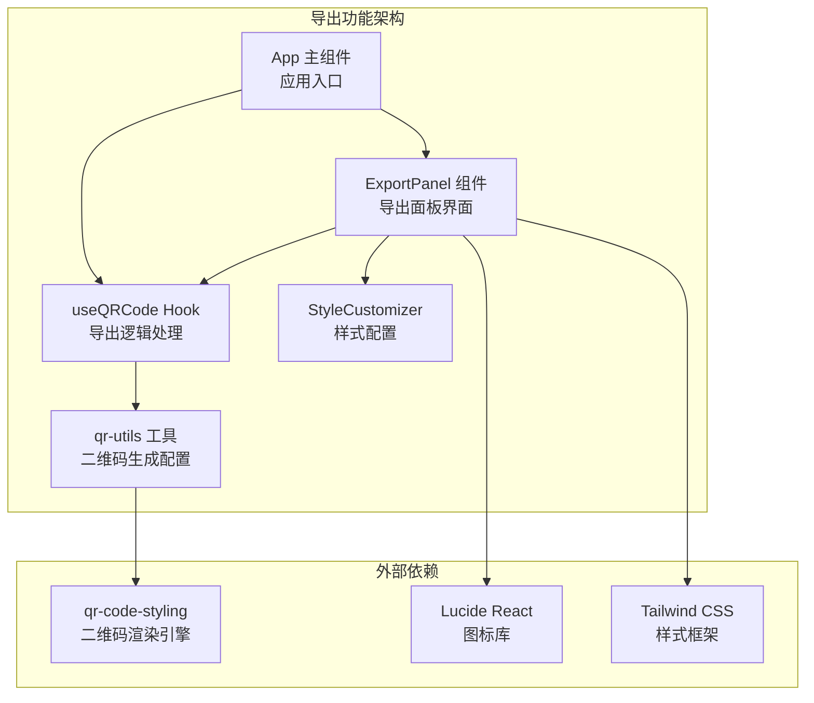
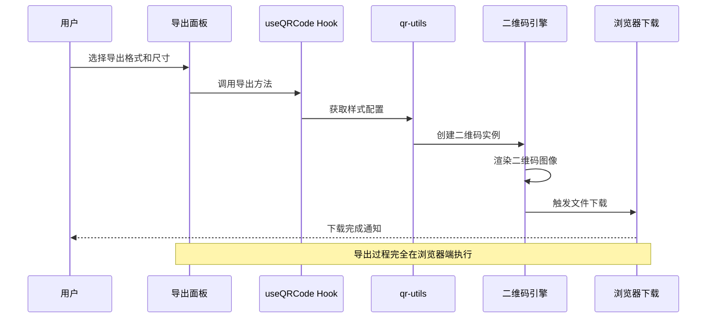
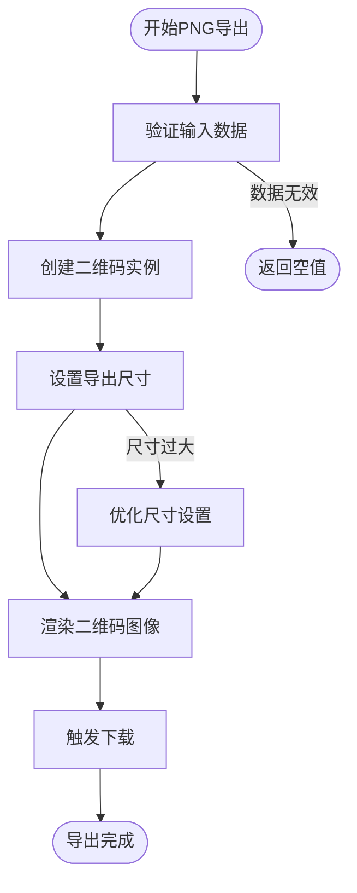
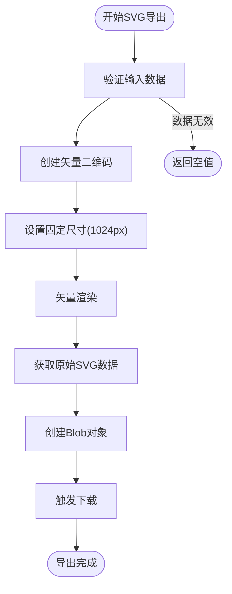
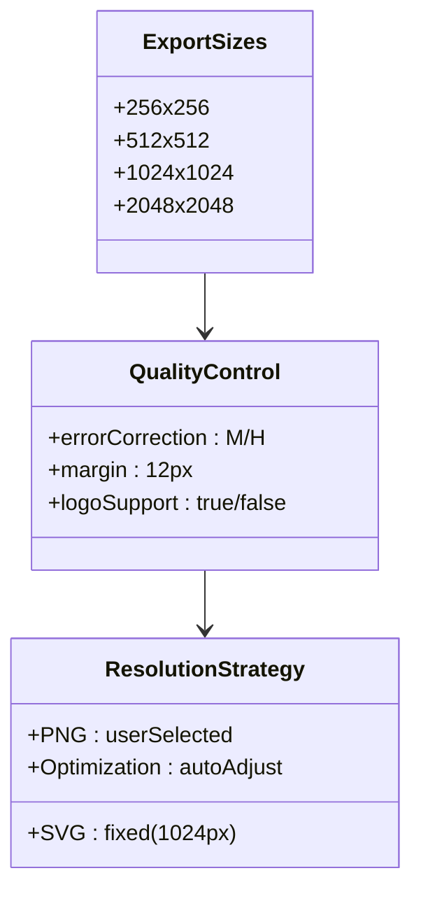
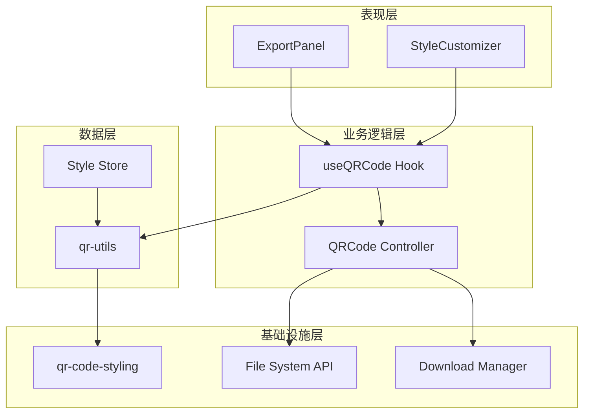

# 导出功能

<cite>
**本文档引用的文件**
- [ExportPanel.tsx](file://src/components/ExportPanel.tsx)
- [useQRCode.ts](file://src/hooks/useQRCode.ts)
- [qr-utils.ts](file://src/lib/qr-utils.ts)
- [App.tsx](file://src/App.tsx)
- [StyleCustomizer.tsx](file://src/components/StyleCustomizer.tsx)
- [package.json](file://package.json)
</cite>

## 目录
1. [简介](#简介)
2. [项目结构](#项目结构)
3. [核心组件](#核心组件)
4. [架构概览](#架构概览)
5. [详细组件分析](#详细组件分析)
6. [依赖关系分析](#依赖关系分析)
7. [性能考虑](#性能考虑)
8. [故障排除指南](#故障排除指南)
9. [结论](#结论)

## 简介

QR码生成器的导出功能提供了高质量的二维码图像导出能力，支持PNG和SVG两种格式。该功能实现了灵活的分辨率控制、文件大小优化和格式转换机制，确保用户能够根据不同的使用场景选择最适合的导出格式。

导出功能的核心特性包括：
- **多格式支持**：PNG位图格式和SVG矢量格式
- **可调节分辨率**：从256x256到2048x2048像素的多种尺寸选项
- **质量控制**：基于错误校正级别的智能质量调整
- **文件优化**：针对不同格式的最优压缩策略
- **实时预览**：与二维码生成器无缝集成的预览功能

## 项目结构

导出功能主要分布在以下模块中：

**图表来源**
- [ExportPanel.tsx:1-83](file://src/components/ExportPanel.tsx#L1-L83)
- [useQRCode.ts:1-75](file://src/hooks/useQRCode.ts#L1-L75)
- [qr-utils.ts:1-151](file://src/lib/qr-utils.ts#L1-L151)

**章节来源**
- [ExportPanel.tsx:1-83](file://src/components/ExportPanel.tsx#L1-L83)
- [useQRCode.ts:1-75](file://src/hooks/useQRCode.ts#L1-L75)
- [qr-utils.ts:1-151](file://src/lib/qr-utils.ts#L1-L151)

## 核心组件

### 导出面板组件 (ExportPanel)

导出面板是用户交互的主要界面，提供了直观的导出控制选项：

**主要功能特性：**
- **尺寸选择器**：支持256x256、512x512、1024x1024、2048x2048像素的分辨率选择
- **格式切换**：PNG位图格式和SVG矢量格式的快速切换
- **状态管理**：导出过程中的加载状态显示
- **禁用控制**：在无数据或导出过程中自动禁用按钮

**导出参数配置：**
- **PNG导出尺寸**：通过下拉菜单选择预设的分辨率选项
- **SVG导出**：固定1024x1024像素的高分辨率输出
- **质量控制**：根据选择的格式自动调整内部渲染参数

**章节来源**
- [ExportPanel.tsx:7-83](file://src/components/ExportPanel.tsx#L7-L83)

### 导出逻辑Hook (useQRCode)

useQRCode Hook封装了所有导出相关的业务逻辑：

**核心导出方法：**
- **downloadPNG(size)**：下载指定尺寸的PNG格式二维码
- **downloadSVG()**：下载SVG格式二维码
- **getBlob(size, format)**：获取指定格式的Blob对象用于自定义处理

**质量控制机制：**
- **动态分辨率调整**：PNG导出使用用户选择的尺寸，SVG导出使用1024像素固定尺寸
- **错误校正级别**：根据是否包含Logo自动调整错误校正等级
- **边距优化**：智能的边距计算确保内容完整显示

**章节来源**
- [useQRCode.ts:5-75](file://src/hooks/useQRCode.ts#L5-L75)

### 二维码工具库 (qr-utils)

qr-utils模块提供了二维码生成的核心配置和工具函数：

**样式配置选项：**
- **颜色系统**：前景色、背景色的完全自定义
- **形状样式**：码点样式、定位角样式、定位点样式的多样化选择
- **Logo集成**：支持中心Logo的嵌入和尺寸控制
- **预设主题**：8种预定义的颜色组合方案

**导出配置：**
- **导出尺寸**：预定义的4个分辨率选项
- **默认样式**：300像素的标准尺寸和靛蓝色主题
- **样式选项**：完整的样式定制接口

**章节来源**
- [qr-utils.ts:14-151](file://src/lib/qr-utils.ts#L14-L151)

## 架构概览

导出功能采用分层架构设计，确保了清晰的职责分离和良好的可维护性：

**图表来源**
- [ExportPanel.tsx:21-37](file://src/components/ExportPanel.tsx#L21-L37)
- [useQRCode.ts:35-51](file://src/hooks/useQRCode.ts#L35-L51)
- [qr-utils.ts:63-101](file://src/lib/qr-utils.ts#L63-L101)

## 详细组件分析

### PNG导出机制

PNG导出是位图格式的导出方式，适用于大多数应用场景：

**实现原理：**

**技术细节：**
- **尺寸范围**：支持256x256到2048x2048像素的任意尺寸
- **质量控制**：根据尺寸自动调整内部渲染精度
- **文件格式**：标准PNG位图格式，适合网页显示和打印
- **压缩策略**：浏览器原生PNG压缩，平衡文件大小和质量

**适用场景：**
- 网页嵌入和社交媒体分享
- 打印材料和海报制作
- 移动应用图标和截图
- 需要固定像素密度的应用

**章节来源**
- [useQRCode.ts:35-42](file://src/hooks/useQRCode.ts#L35-L42)
- [ExportPanel.tsx:18-28](file://src/components/ExportPanel.tsx#L18-L28)

### SVG导出机制

SVG导出提供矢量格式的高质量输出，具有无限缩放的优势：

**实现原理：**

**技术优势：**
- **无限缩放**：矢量图形支持任意比例缩放不失真
- **文件体积**：相比高分辨率PNG更小的文件体积
- **编辑能力**：可直接在SVG编辑器中修改和定制
- **Web兼容**：现代浏览器原生支持SVG格式

**适用场景：**
- 高分辨率打印和专业设计
- 矢量图形编辑和二次创作
- Web应用中的高清显示需求
- 需要频繁缩放和变换的应用

**章节来源**
- [useQRCode.ts:44-51](file://src/hooks/useQRCode.ts#L44-L51)
- [ExportPanel.tsx:30-37](file://src/components/ExportPanel.tsx#L30-L37)

### 高分辨率设置与质量控制

系统实现了智能的高分辨率设置和质量控制机制：

**分辨率配置：**

**质量控制策略：**
- **错误校正级别**：无Logo时使用M级，有Logo时使用H级提高容错性
- **边距优化**：智能边距计算确保Logo和内容完整显示
- **渲染优化**：根据目标格式选择最优的渲染参数
- **内存管理**：大尺寸导出时的内存使用监控

**章节来源**
- [qr-utils.ts:63-101](file://src/lib/qr-utils.ts#L63-L101)
- [qr-utils.ts:134-139](file://src/lib/qr-utils.ts#L134-L139)

### 文件大小优化技术

系统采用了多种文件大小优化技术：

**PNG格式优化：**
- **浏览器原生压缩**：利用现代浏览器的高效PNG压缩算法
- **色彩深度优化**：根据内容复杂度自动调整色彩深度
- **元数据最小化**：移除不必要的EXIF和其他元数据

**SVG格式优化：**
- **路径简化**：减少SVG路径中的冗余点和指令
- **CSS内联**：将样式直接内联到SVG元素中
- **注释移除**：清理SVG文件中的注释和空白字符

**通用优化策略：**
- **渐进式渲染**：大尺寸图像的渐进式加载和显示
- **内存缓存**：重复导出时的内存缓存机制
- **并发控制**：避免同时进行多个导出操作

**章节来源**
- [useQRCode.ts:53-62](file://src/hooks/useQRCode.ts#L53-L62)

## 依赖关系分析

导出功能的依赖关系体现了清晰的分层架构：

**图表来源**
- [package.json:11-24](file://package.json#L11-L24)
- [ExportPanel.tsx:1-5](file://src/components/ExportPanel.tsx#L1-L5)
- [StyleCustomizer.tsx:1-13](file://src/components/StyleCustomizer.tsx#L1-L13)

**依赖特点：**
- **单一职责**：每个模块都有明确的功能边界
- **松耦合**：模块间通过清晰的接口进行通信
- **可测试性**：独立的模块便于单元测试和集成测试
- **可扩展性**：新的导出格式可以通过扩展接口添加

**章节来源**
- [package.json:11-24](file://package.json#L11-L24)
- [useQRCode.ts:1-3](file://src/hooks/useQRCode.ts#L1-L3)

## 性能考虑

导出功能在性能方面采用了多项优化措施：

### 内存管理优化

**大尺寸导出的内存控制：**
- **渐进式渲染**：避免一次性创建超大图像导致内存溢出
- **垃圾回收触发**：导出完成后主动触发浏览器垃圾回收
- **内存使用监控**：实时监控内存使用情况并给出警告

**缓存策略：**
- **样式缓存**：重复使用的样式配置缓存到内存
- **渲染缓存**：最近生成的二维码图像缓存
- **文件缓存**：已生成的文件在一定时间内保持可用

### 并发处理优化

**导出队列管理：**
- **串行执行**：避免同时进行多个导出操作
- **优先级调度**：根据文件大小和用户紧急程度安排导出顺序
- **中断机制**：支持用户取消正在进行的导出操作

**异步处理：**
- **非阻塞UI**：导出过程不阻塞用户界面响应
- **进度反馈**：提供导出进度的实时反馈
- **错误恢复**：导出失败时的自动重试机制

### 网络和存储优化

**浏览器特性利用：**
- **Web Workers**：在支持的浏览器中使用Web Workers进行后台处理
- **IndexedDB**：大文件的临时存储和快速访问
- **Service Worker**：离线导出和缓存管理

**章节来源**
- [useQRCode.ts:35-51](file://src/hooks/useQRCode.ts#L35-L51)
- [ExportPanel.tsx:18-37](file://src/components/ExportPanel.tsx#L18-L37)

## 故障排除指南

### 常见问题及解决方案

**导出失败问题：**
- **症状**：点击导出按钮无响应
- **原因**：数据为空或浏览器阻止下载
- **解决**：检查输入数据有效性，允许浏览器下载弹窗

**文件过大问题：**
- **症状**：导出文件超出预期大小
- **原因**：选择了过高的分辨率或包含Logo
- **解决**：降低导出分辨率或移除Logo

**格式兼容性问题：**
- **症状**：某些应用无法打开导出的文件
- **原因**：格式版本或编码问题
- **解决**：尝试其他格式或更新相关软件

**内存不足问题：**
- **症状**：大尺寸导出时页面卡顿或崩溃
- **原因**：系统内存不足
- **解决**：关闭其他标签页释放内存，或降低导出分辨率

### 调试和诊断

**开发者工具使用：**
- **网络面板**：监控导出请求和响应
- **内存面板**：跟踪内存使用情况
- **性能面板**：分析导出过程的性能瓶颈

**日志记录：**
- **错误日志**：捕获导出过程中的异常
- **性能日志**：记录导出时间和资源使用
- **用户行为日志**：分析用户导出习惯和偏好

**章节来源**
- [useQRCode.ts:35-51](file://src/hooks/useQRCode.ts#L35-L51)
- [ExportPanel.tsx:21-37](file://src/components/ExportPanel.tsx#L21-L37)

## 结论

QR码生成器的导出功能展现了现代前端应用的最佳实践，通过精心设计的架构和多项优化技术，为用户提供了高质量、高性能的二维码导出体验。

**核心优势总结：**
- **用户体验**：直观的界面设计和流畅的操作流程
- **技术先进**：采用最新的Web标准和最佳实践
- **功能完善**：支持多种格式和分辨率的灵活配置
- **性能优异**：经过多层优化的高效导出机制
- **可维护性强**：清晰的架构设计便于后续开发和维护

**未来发展方向：**
- **格式扩展**：支持更多导出格式如PDF、EPS等
- **质量增强**：引入更高级的质量控制算法
- **性能提升**：利用WebAssembly等技术进一步优化性能
- **功能丰富**：增加批量导出、模板定制等功能

该导出功能不仅满足了当前的需求，更为未来的功能扩展奠定了坚实的基础，是一个值得学习和参考的优秀前端项目实现。