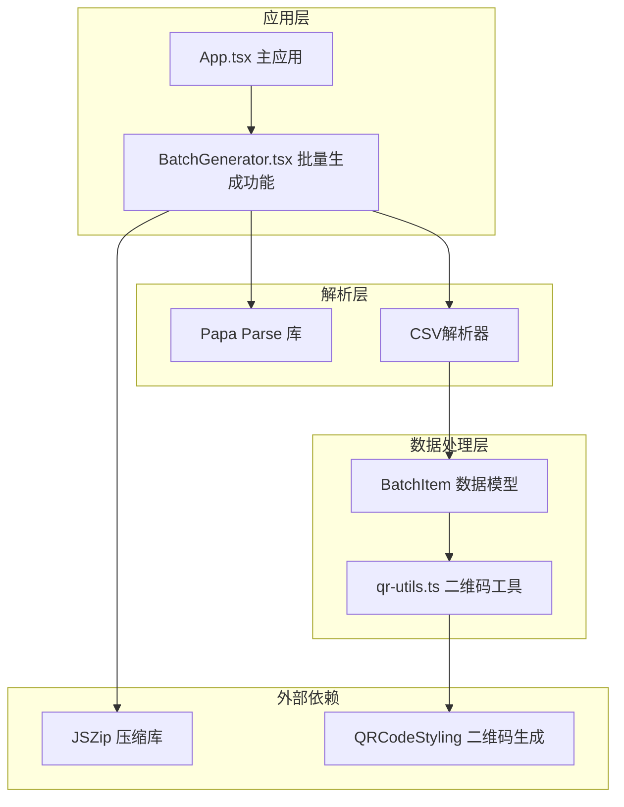
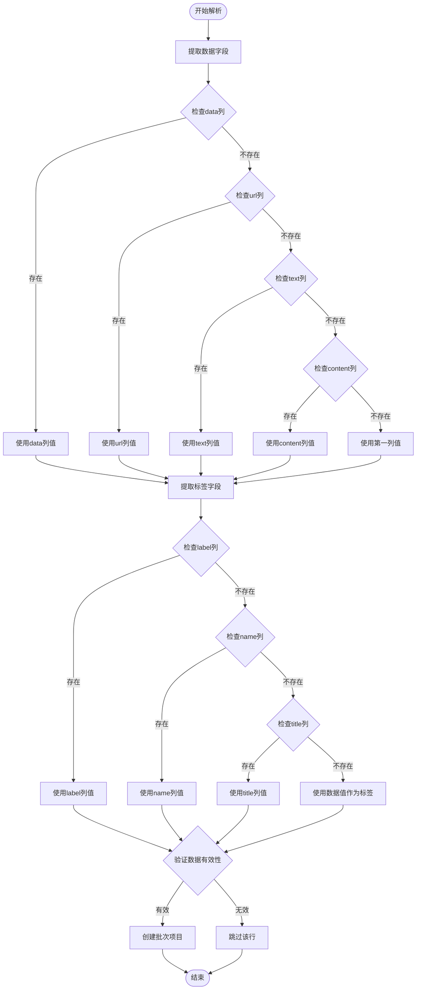
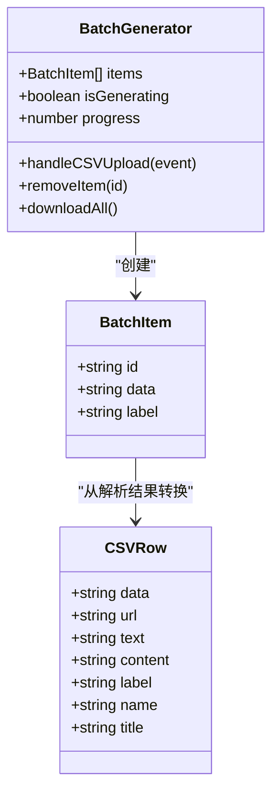
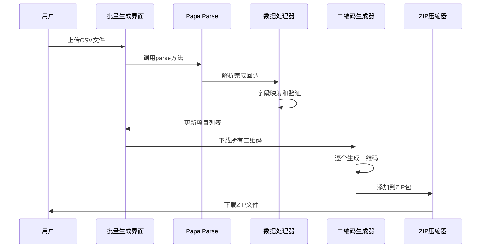
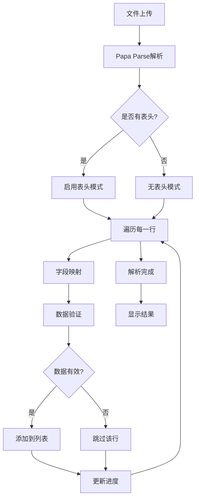
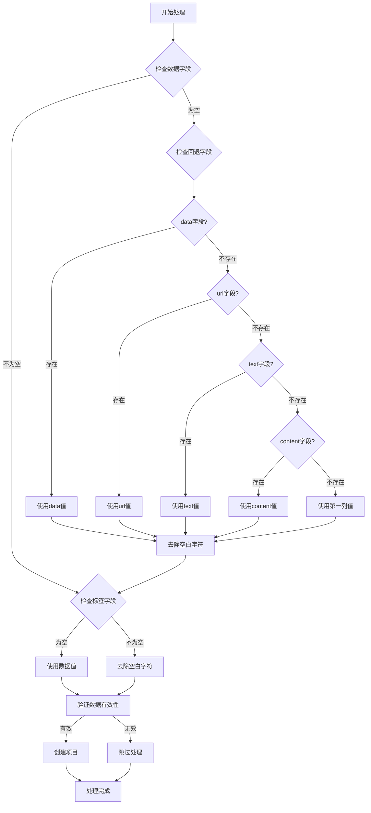
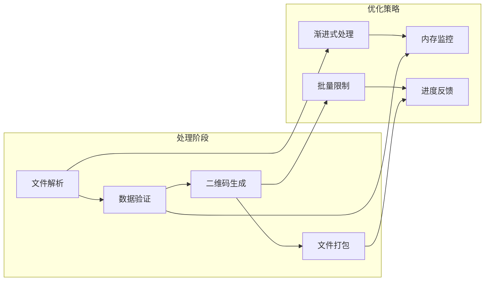
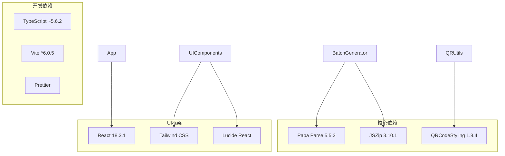

# CSV文件解析机制

<cite>
**本文档引用的文件**
- [BatchGenerator.tsx](file://src/components/BatchGenerator.tsx)
- [package.json](file://package.json)
- [qr-utils.ts](file://src/lib/qr-utils.ts)
- [App.tsx](file://src/App.tsx)
- [sample-header.csv](file://node_modules/papaparse/tests/sample-header.csv)
- [sample.csv](file://node_modules/papaparse/tests/sample.csv)
- [utf-8-bom-sample.csv](file://node_modules/papaparse/tests/utf-8-bom-sample.csv)
</cite>

## 目录
1. [简介](#简介)
2. [项目结构](#项目结构)
3. [核心组件](#核心组件)
4. [架构概览](#架构概览)
5. [详细组件分析](#详细组件分析)
6. [依赖关系分析](#依赖关系分析)
7. [性能考虑](#性能考虑)
8. [故障排除指南](#故障排除指南)
9. [结论](#结论)
10. [附录](#附录)

## 简介

本文档深入解析了QR码生成器项目中的CSV文件解析机制。该项目基于Papa Parse库实现了高效的CSV文件处理功能，支持批量生成二维码。系统通过Papa Parse库解析CSV文件，提取数据字段并生成相应的二维码文件。

## 项目结构

项目采用模块化架构设计，CSV解析功能主要集中在BatchGenerator组件中：



**图表来源**
- [BatchGenerator.tsx:15-179](file://src/components/BatchGenerator.tsx#L15-L179)
- [package.json:11-24](file://package.json#L11-L24)

**章节来源**
- [BatchGenerator.tsx:1-180](file://src/components/BatchGenerator.tsx#L1-L180)
- [package.json:1-37](file://package.json#L1-L37)

## 核心组件

### CSV解析器配置

系统使用Papa Parse库进行CSV文件解析，配置参数如下：

| 配置项 | 值 | 说明 |
|--------|-----|------|
| header | true | 启用头部解析模式 |
| skipEmptyLines | true | 跳过空行 |
| complete | 回调函数 | 解析完成后的回调处理 |

### 数据字段映射规则

系统支持多种列名变体，具有优先级顺序：



**图表来源**
- [BatchGenerator.tsx:25-42](file://src/components/BatchGenerator.tsx#L25-L42)

### 数据模型定义



**图表来源**
- [BatchGenerator.tsx:9-13](file://src/components/BatchGenerator.tsx#L9-L13)
- [BatchGenerator.tsx:21-46](file://src/components/BatchGenerator.tsx#L21-L46)

**章节来源**
- [BatchGenerator.tsx:9-46](file://src/components/BatchGenerator.tsx#L9-L46)

## 架构概览

系统采用分层架构设计，CSV解析流程如下：



**图表来源**
- [BatchGenerator.tsx:21-79](file://src/components/BatchGenerator.tsx#L21-L79)

## 详细组件分析

### CSV解析组件实现

#### 核心解析逻辑



**图表来源**
- [BatchGenerator.tsx:25-42](file://src/components/BatchGenerator.tsx#L25-L42)

#### 错误处理机制

系统实现了多层次的错误处理策略：

1. **文件类型验证**：仅接受.csv格式文件
2. **空值处理**：自动跳过无效数据行
3. **编码兼容性**：支持UTF-8编码
4. **内存管理**：及时清理对象URL

**章节来源**
- [BatchGenerator.tsx:21-46](file://src/components/BatchGenerator.tsx#L21-L46)

### 数据处理算法

#### 字段提取算法

系统实现了智能的字段提取算法，支持多种列名变体：

| 字段类型 | 支持的列名 | 优先级 | 用途 |
|----------|------------|--------|------|
| 数据内容 | data, url, text, content | 1-4 | 二维码数据源 |
| 标签名称 | label, name, title | 1-3 | 文件命名参考 |

#### 空值处理策略



**图表来源**
- [BatchGenerator.tsx:31-38](file://src/components/BatchGenerator.tsx#L31-L38)

**章节来源**
- [BatchGenerator.tsx:29-41](file://src/components/BatchGenerator.tsx#L29-L41)

### 性能优化特性

#### 内存管理优化

系统采用了多项内存优化策略：

1. **及时释放资源**：解析完成后立即清空文件输入框
2. **对象URL清理**：下载完成后及时撤销URL对象
3. **渐进式处理**：批量处理时采用渐进式生成避免内存峰值

#### 并发处理优化



**图表来源**
- [BatchGenerator.tsx:52-79](file://src/components/BatchGenerator.tsx#L52-L79)

**章节来源**
- [BatchGenerator.tsx:52-79](file://src/components/BatchGenerator.tsx#L52-L79)

## 依赖关系分析

### 外部库依赖

系统依赖以下关键库：



**图表来源**
- [package.json:11-35](file://package.json#L11-L35)

### 版本兼容性

| 依赖库 | 当前版本 | 类型 | 说明 |
|--------|----------|------|------|
| papaparse | 5.5.3 | 运行时 | CSV解析核心库 |
| jszip | 3.10.1 | 运行时 | ZIP文件压缩 |
| qr-code-styling | 1.8.4 | 运行时 | 二维码生成 |
| react | ^18.3.1 | 运行时 | UI框架 |
| @types/papaparse | ^5.3.15 | 开发时 | 类型定义 |

**章节来源**
- [package.json:11-35](file://package.json#L11-L35)

## 性能考虑

### 内存使用优化

1. **流式处理**：Papa Parse支持流式解析大型文件
2. **及时清理**：解析完成后立即清理DOM引用
3. **渐进式渲染**：大量数据时采用虚拟滚动

### 处理速度优化

1. **异步处理**：文件解析和二维码生成采用异步方式
2. **并发控制**：合理控制同时生成的二维码数量
3. **缓存策略**：对已生成的二维码进行缓存

## 故障排除指南

### 常见问题及解决方案

#### CSV文件格式问题

| 问题描述 | 可能原因 | 解决方案 |
|----------|----------|----------|
| 解析失败 | 文件编码不正确 | 确保使用UTF-8编码保存CSV文件 |
| 字段缺失 | 列名不匹配 | 使用支持的列名变体：data/url/text/content |
| 数据为空 | 空值处理 | 系统会自动跳过空数据行 |
| 中文乱码 | 编码设置错误 | 确保CSV文件保存为UTF-8编码 |

#### 浏览器兼容性问题

| 问题描述 | 可能原因 | 解决方案 |
|----------|----------|----------|
| 文件上传失败 | 浏览器不支持 | 检查浏览器是否支持HTML5 File API |
| ZIP下载失败 | 浏览器安全策略 | 尝试在不同浏览器中打开 |
| 二维码生成异常 | Canvas支持问题 | 确保浏览器支持Canvas API |

**章节来源**
- [BatchGenerator.tsx:21-46](file://src/components/BatchGenerator.tsx#L21-L46)

### 调试技巧

1. **开发者工具**：使用浏览器开发者工具检查网络请求
2. **控制台日志**：在解析过程中添加适当的日志输出
3. **文件大小测试**：使用不同大小的CSV文件测试性能表现

## 结论

该CSV文件解析机制通过Papa Parse库实现了高效、可靠的CSV处理功能。系统支持多种列名变体，具备完善的错误处理和性能优化策略。通过合理的架构设计和优化措施，能够满足大规模CSV文件处理的需求。

## 附录

### CSV文件格式要求

#### 必需字段

系统支持以下必需字段（按优先级排序）：

1. **data** - 主要的数据字段
2. **url** - URL链接数据
3. **text** - 文本内容数据
4. **content** - 内容字段

#### 可选字段

系统支持以下可选字段用于文件命名：

1. **label** - 标签名称
2. **name** - 名称字段
3. **title** - 标题字段

### 完整CSV模板示例

#### 基础模板
```csv
data,label
https://example.com,网站二维码
Hello World,文本二维码
```

#### 扩展模板
```csv
data,url,text,content,label,name,title
https://google.com,https://google.com,www.google.com,www.google.com,Google,google,Google搜索
```

#### 多语言支持模板
```csv
data,label
https://example.com,Website QR Code
https://example.com,网站二维码
```

### 最佳实践指南

#### CSV文件制作建议

1. **文件编码**：使用UTF-8编码保存CSV文件
2. **列名规范**：使用英文列名以确保兼容性
3. **数据质量**：确保每行数据的完整性
4. **文件大小**：单个文件建议不超过10MB

#### 数据格式规范

1. **URL格式**：确保URL包含协议前缀（如https://）
2. **文本内容**：避免使用特殊字符，必要时进行转义
3. **标签命名**：使用简洁明了的标签名称
4. **编码统一**：保持整个CSV文件编码一致

#### 性能优化建议

1. **分批处理**：对于大型CSV文件，考虑分批处理
2. **内存监控**：监控内存使用情况，避免内存泄漏
3. **进度反馈**：为用户提供处理进度反馈
4. **错误恢复**：实现断点续传功能

**章节来源**
- [BatchGenerator.tsx:89-91](file://src/components/BatchGenerator.tsx#L89-L91)
- [BatchGenerator.tsx:172-175](file://src/components/BatchGenerator.tsx#L172-L175)