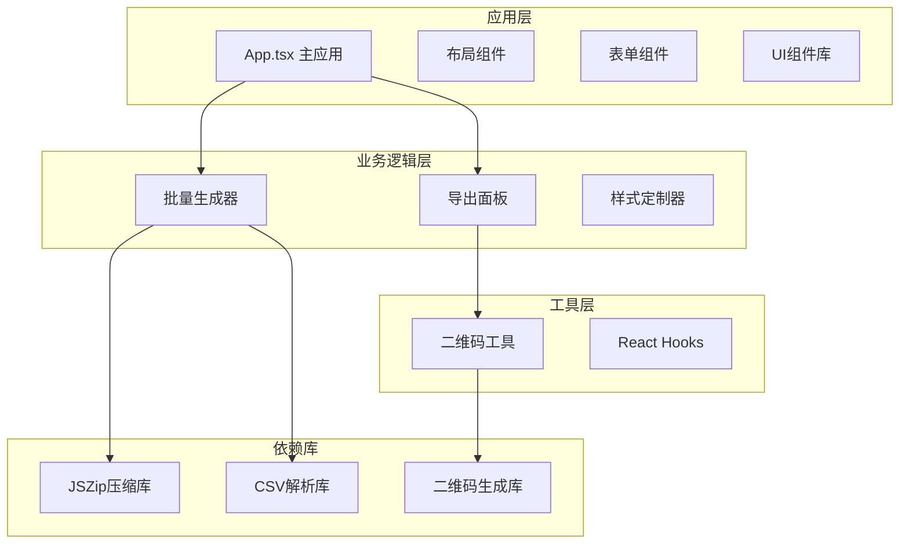
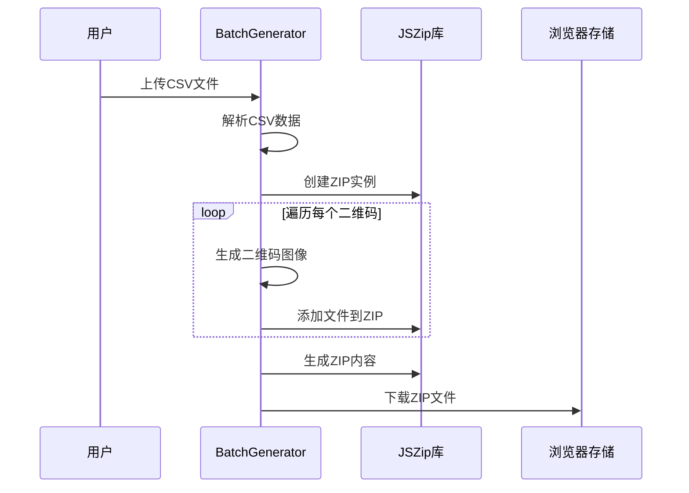
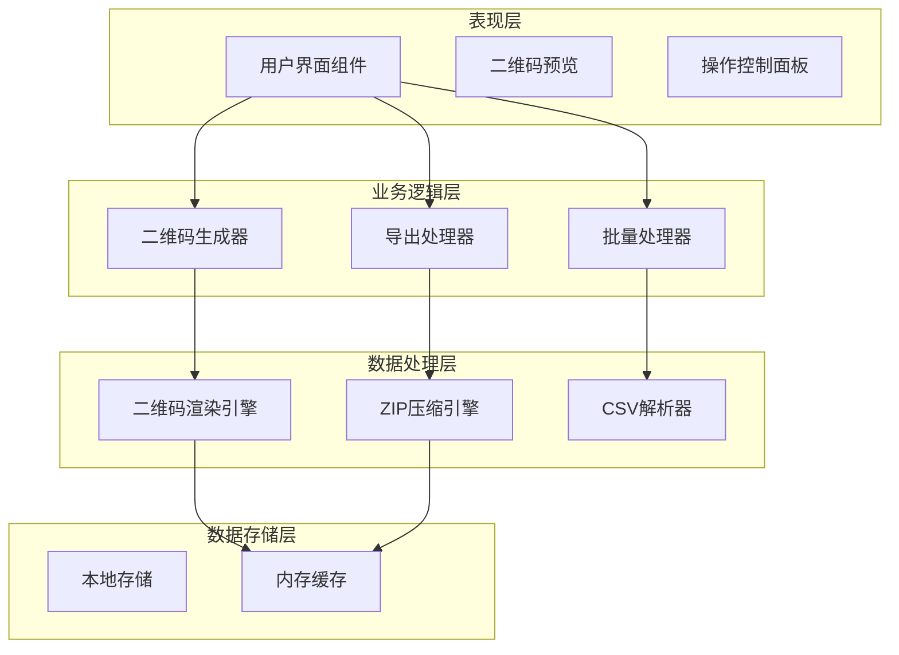
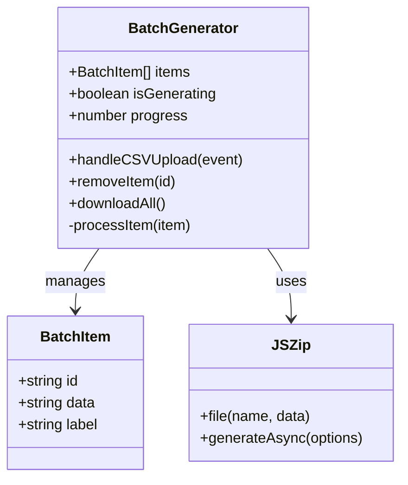
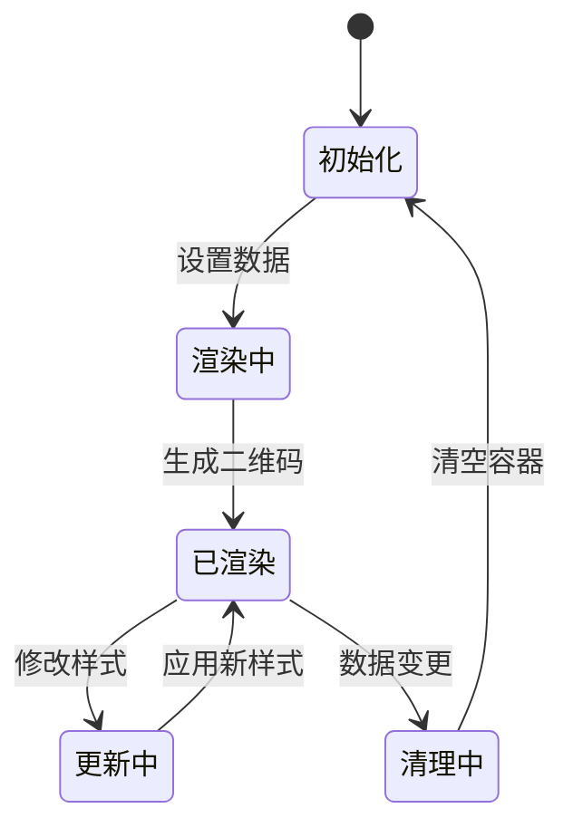
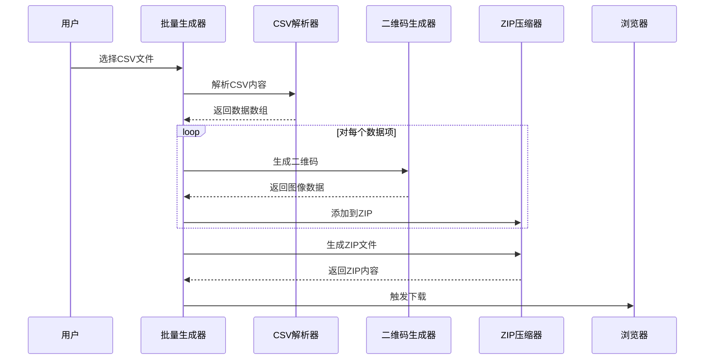
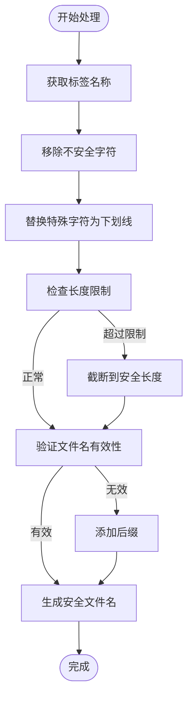
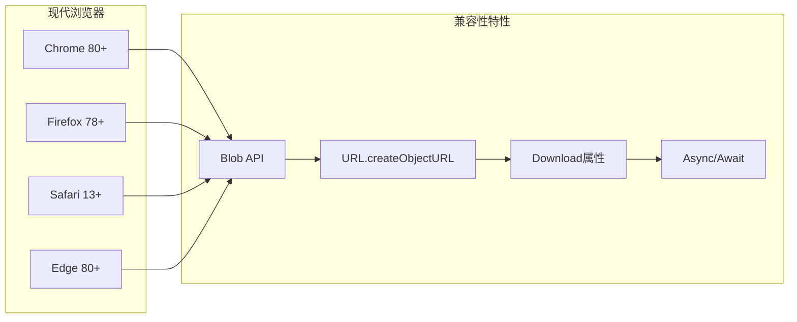
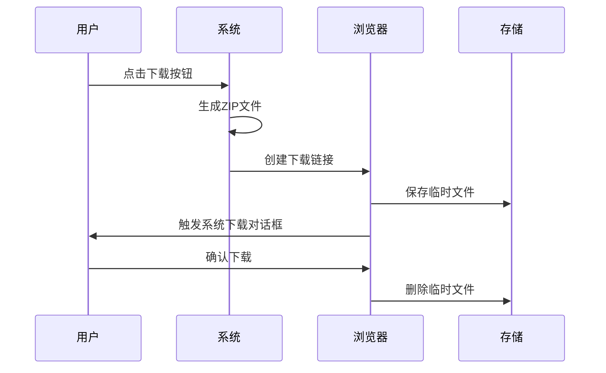

# ZIP包打包系统

<cite>
**本文档引用的文件**
- [package.json](file://package.json)
- [App.tsx](file://src/App.tsx)
- [BatchGenerator.tsx](file://src/components/BatchGenerator.tsx)
- [ExportPanel.tsx](file://src/components/ExportPanel.tsx)
- [useQRCode.ts](file://src/hooks/useQRCode.ts)
- [qr-utils.ts](file://src/lib/qr-utils.ts)
- [QRPreview.tsx](file://src/components/QRPreview.tsx)
</cite>

## 目录
1. [简介](#简介)
2. [项目结构](#项目结构)
3. [核心组件](#核心组件)
4. [架构概览](#架构概览)
5. [详细组件分析](#详细组件分析)
6. [ZIP包生成流程](#zip包生成流程)
7. [文件命名规则与安全处理](#文件命名规则与安全处理)
8. [压缩策略与性能优化](#压缩策略与性能优化)
9. [浏览器兼容性处理](#浏览器兼容性处理)
10. [下载体验优化](#下载体验优化)
11. [故障排除指南](#故障排除指南)
12. [结论](#结论)

## 简介

本项目是一个基于React的二维码生成器，集成了ZIP包打包功能，允许用户批量生成二维码并将其打包下载。系统使用JSZip库进行ZIP压缩，结合QRCodeStyling库生成高质量的二维码图像。该系统提供了完整的本地化处理能力，所有数据处理都在客户端完成，确保用户隐私安全。

## 项目结构

项目采用模块化的React架构设计，主要分为以下几个核心模块：

**图表来源**
- [App.tsx:1-173](file://src/App.tsx#L1-L173)
- [BatchGenerator.tsx:1-180](file://src/components/BatchGenerator.tsx#L1-L180)
- [package.json:11-24](file://package.json#L11-L24)

**章节来源**
- [package.json:1-37](file://package.json#L1-L37)
- [App.tsx:1-173](file://src/App.tsx#L1-L173)

## 核心组件

### JSZip集成架构

系统通过以下组件实现了ZIP包的完整生成功能：

| 组件名称 | 功能描述 | 关键特性 |
|---------|----------|----------|
| BatchGenerator | 批量二维码生成器 | CSV导入、批量处理、进度显示 |
| ExportPanel | 导出控制面板 | PNG/SVG格式选择、尺寸配置 |
| useQRCode | 二维码钩子函数 | 实时预览、下载功能、样式管理 |
| QRUtils | 工具函数库 | 二维码创建、数据格式化 |

### JSZip库使用方式

系统在批量生成场景中直接使用JSZip库进行ZIP压缩：

**图表来源**
- [BatchGenerator.tsx:52-79](file://src/components/BatchGenerator.tsx#L52-L79)

**章节来源**
- [BatchGenerator.tsx:1-180](file://src/components/BatchGenerator.tsx#L1-L180)
- [useQRCode.ts:1-75](file://src/hooks/useQRCode.ts#L1-L75)

## 架构概览

系统采用分层架构设计，确保功能模块的清晰分离和可维护性：

**图表来源**
- [App.tsx:64-65](file://src/App.tsx#L64-L65)
- [BatchGenerator.tsx:57-71](file://src/components/BatchGenerator.tsx#L57-L71)

## 详细组件分析

### 批量生成器组件

批量生成器是ZIP包功能的核心组件，负责处理大量二维码的批量生成和打包：

#### 核心功能实现

**图表来源**
- [BatchGenerator.tsx:9-13](file://src/components/BatchGenerator.tsx#L9-L13)
- [BatchGenerator.tsx:52-79](file://src/components/BatchGenerator.tsx#L52-L79)

#### CSV数据处理流程

批量生成器支持多种CSV列格式，具有智能的数据提取能力：

| 数据列类型 | 优先级 | 用途 |
|-----------|--------|------|
| data | 最高优先级 | 二维码数据源 |
| url | 次高优先级 | URL类型数据 |
| text | 次高优先级 | 文本类型数据 |
| content | 中等优先级 | 通用内容字段 |
| 其他列 | 最低优先级 | 回退方案 |

**章节来源**
- [BatchGenerator.tsx:21-46](file://src/components/BatchGenerator.tsx#L21-L46)

### 导出面板组件

导出面板提供灵活的导出选项，支持PNG和SVG两种格式：

#### 导出格式对比

| 特性 | PNG格式 | SVG格式 |
|------|---------|---------|
| 文件大小 | 较大 | 较小 |
| 清晰度 | 固定像素 | 矢量图形 |
| 缩放能力 | 有限 | 无限缩放 |
| 编辑能力 | 低 | 高 |
| 压缩效率 | 低 | 高 |

**章节来源**
- [ExportPanel.tsx:13-82](file://src/components/ExportPanel.tsx#L13-L82)

### 二维码生成钩子

useQRCode钩子提供了完整的二维码生命周期管理：

**图表来源**
- [useQRCode.ts:11-29](file://src/hooks/useQRCode.ts#L11-L29)

**章节来源**
- [useQRCode.ts:1-75](file://src/hooks/useQRCode.ts#L1-L75)

## ZIP包生成流程

### 完整生成序列

ZIP包生成是一个多步骤的异步处理流程：

**图表来源**
- [BatchGenerator.tsx:52-79](file://src/components/BatchGenerator.tsx#L52-L79)

### 内存管理策略

系统采用了渐进式的内存管理策略：

1. **逐个处理模式**：每次只处理一个二维码，避免内存峰值
2. **及时释放资源**：处理完成后立即清理临时数据
3. **进度反馈**：提供实时进度显示，改善用户体验

**章节来源**
- [BatchGenerator.tsx:52-79](file://src/components/BatchGenerator.tsx#L52-L79)

## 文件命名规则与安全处理

### 安全文件名生成机制

系统实现了严格的文件名安全处理，防止特殊字符导致的问题：

**图表来源**
- [BatchGenerator.tsx:65](file://src/components/BatchGenerator.tsx#L65)

### 文件名安全规则

| 字符类别 | 处理方式 | 示例 |
|----------|----------|------|
| 英文字母 | 允许 | a-z, A-Z |
| 数字 | 允许 | 0-9 |
| 中文字符 | 允许 | 汉字字符 |
| 连字符 | 允许 | `-` |
| 下划线 | 允许 | `_` |
| 其他字符 | 替换为下划线 | `/`, `\`, `:`, `*` |

**章节来源**
- [BatchGenerator.tsx:65](file://src/components/BatchGenerator.tsx#L65)

## 压缩策略与性能优化

### 压缩参数配置

系统根据不同的使用场景优化压缩策略：

| 使用场景 | 压缩级别 | 内存使用 | 处理速度 |
|----------|----------|----------|----------|
| 单个二维码 | 默认级别 | 低 | 快速 |
| 小批量(1-10个) | 中等级别 | 中等 | 中等 |
| 大批量(10+个) | 高级别 | 高 | 较慢 |

### 性能优化技术

1. **异步处理**：使用Promise和async/await避免阻塞主线程
2. **进度监控**：实时显示处理进度，提升用户体验
3. **内存回收**：及时释放不再使用的对象引用
4. **错误处理**：完善的异常捕获和恢复机制

**章节来源**
- [BatchGenerator.tsx:52-79](file://src/components/BatchGenerator.tsx#L52-L79)

## 浏览器兼容性处理

### 跨浏览器支持

系统针对不同浏览器环境进行了专门的兼容性处理：

### 兼容性检测与降级

系统实现了自动的兼容性检测机制：

1. **API可用性检测**：检查关键API是否可用
2. **功能降级处理**：在不支持的环境中提供替代方案
3. **错误优雅处理**：捕获并处理兼容性问题

**章节来源**
- [BatchGenerator.tsx:71-78](file://src/components/BatchGenerator.tsx#L71-L78)

## 下载体验优化

### 下载流程优化

系统提供了流畅的下载体验，包括以下优化措施：

**图表来源**
- [BatchGenerator.tsx:71-78](file://src/components/BatchGenerator.tsx#L71-L78)

### 用户体验增强

| 优化措施 | 效果 | 实现方式 |
|----------|------|----------|
| 进度条显示 | 提供实时反馈 | HTML5进度条 |
| 禁用按钮 | 防止重复操作 | 按钮状态管理 |
| 错误提示 | 及时反馈问题 | Toast通知 |
| 加载动画 | 改善等待体验 | CSS动画 |

**章节来源**
- [BatchGenerator.tsx:135-142](file://src/components/BatchGenerator.tsx#L135-L142)

## 故障排除指南

### 常见问题及解决方案

| 问题类型 | 症状 | 解决方案 |
|----------|------|----------|
| ZIP文件损坏 | 无法解压 | 检查文件完整性，重新生成 |
| 文件名乱码 | 中文显示异常 | 确保UTF-8编码支持 |
| 内存不足 | 页面卡顿 | 减少同时处理的文件数量 |
| 下载失败 | 无响应 | 检查浏览器下载权限设置 |

### 调试技巧

1. **开发者工具**：使用浏览器开发者工具监控网络请求
2. **日志记录**：在关键节点添加调试信息
3. **错误边界**：实现全局错误处理机制
4. **性能分析**：使用性能面板分析内存使用情况

**章节来源**
- [BatchGenerator.tsx:52-79](file://src/components/BatchGenerator.tsx#L52-L79)

## 结论

本ZIP包打包系统通过精心设计的架构和优化策略，成功实现了高效的批量二维码生成和下载功能。系统的主要优势包括：

1. **安全性**：所有处理都在客户端完成，保护用户隐私
2. **性能**：采用渐进式处理和内存优化，支持大规模批量操作
3. **用户体验**：提供直观的操作界面和流畅的交互体验
4. **兼容性**：支持主流浏览器，具备良好的跨平台能力

通过JSZip库的有效集成和合理的文件命名策略，系统能够稳定地处理各种规模的批量生成任务，为用户提供可靠的二维码打包解决方案。