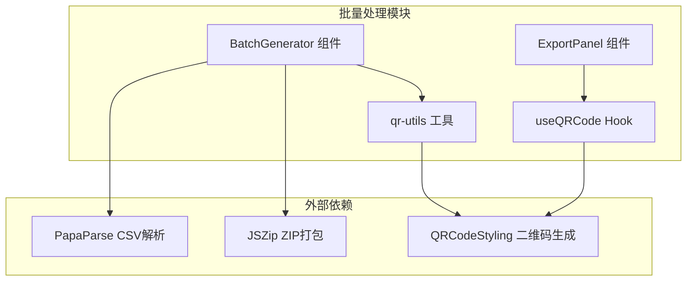
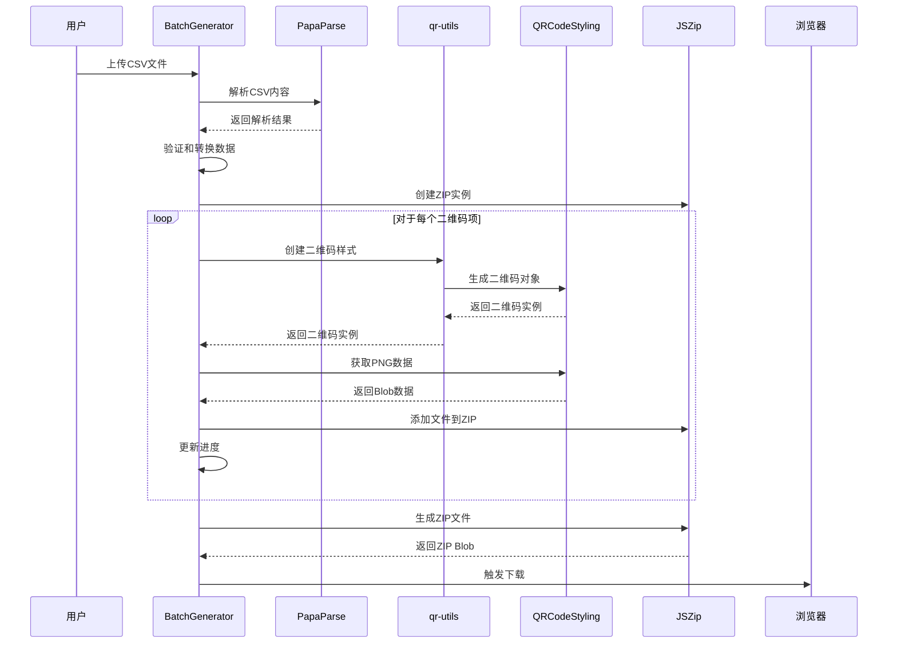
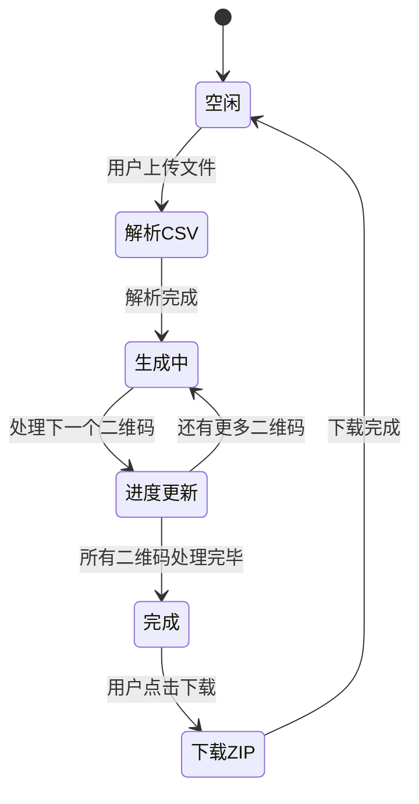
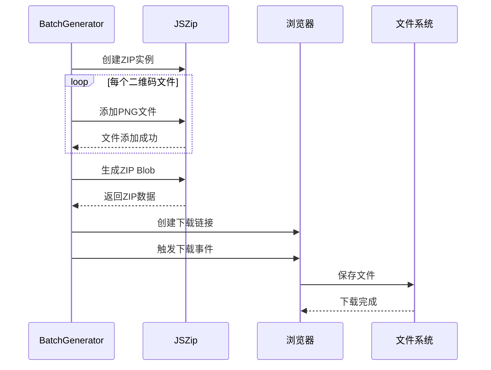
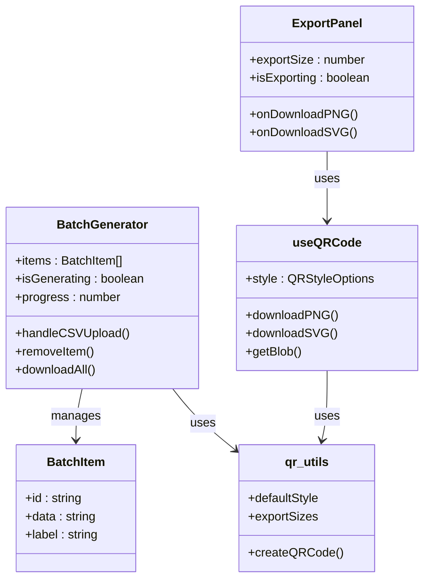
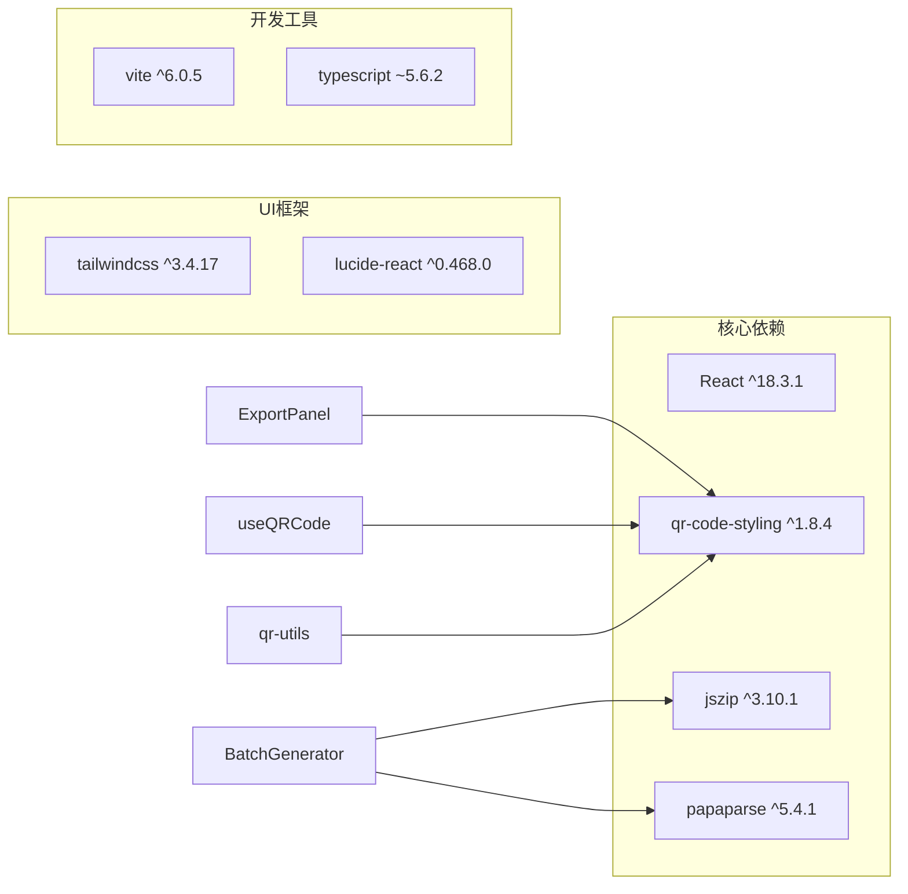
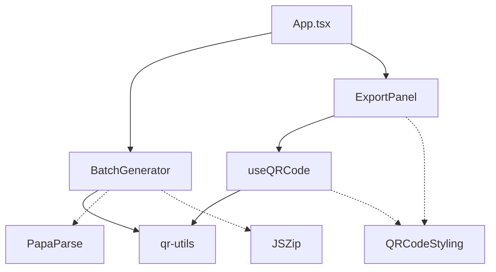

# 批量处理功能

<cite>
**本文档引用的文件**
- [BatchGenerator.tsx](file://src/components/BatchGenerator.tsx)
- [ExportPanel.tsx](file://src/components/ExportPanel.tsx)
- [useQRCode.ts](file://src/hooks/useQRCode.ts)
- [qr-utils.ts](file://src/lib/qr-utils.ts)
- [App.tsx](file://src/App.tsx)
- [package.json](file://package.json)
</cite>

## 目录
1. [简介](#简介)
2. [项目结构](#项目结构)
3. [核心组件](#核心组件)
4. [架构概览](#架构概览)
5. [详细组件分析](#详细组件分析)
6. [依赖关系分析](#依赖关系分析)
7. [性能考虑](#性能考虑)
8. [故障排除指南](#故障排除指南)
9. [结论](#结论)
10. [附录](#附录)

## 简介

QR码生成器的批量处理功能允许用户通过上传CSV文件来批量生成多个二维码，并将所有生成的二维码打包成ZIP文件进行下载。该功能基于React Hooks和现代Web技术栈构建，提供了完整的CSV解析、批量生成和ZIP打包下载的端到端解决方案。

## 项目结构

批量处理功能主要由以下组件构成：



**图表来源**
- [BatchGenerator.tsx:1-180](file://src/components/BatchGenerator.tsx#L1-L180)
- [ExportPanel.tsx:1-83](file://src/components/ExportPanel.tsx#L1-L83)
- [useQRCode.ts:1-75](file://src/hooks/useQRCode.ts#L1-L75)
- [qr-utils.ts:1-151](file://src/lib/qr-utils.ts#L1-L151)

**章节来源**
- [BatchGenerator.tsx:1-180](file://src/components/BatchGenerator.tsx#L1-L180)
- [package.json:11-24](file://package.json#L11-L24)

## 核心组件

批量处理功能的核心组件包括：

### BatchGenerator 组件
- **职责**: 处理CSV文件上传、解析、批量生成和ZIP下载
- **状态管理**: 管理待生成的二维码列表、生成进度和状态
- **数据流**: CSV解析 → 数据验证 → 二维码生成 → ZIP打包 → 下载

### ExportPanel 组件
- **职责**: 提供单个二维码的导出功能（PNG/SVG）
- **集成**: 与useQRCode Hook协作实现导出功能

### useQRCode Hook
- **职责**: 管理二维码样式、生成和导出逻辑
- **功能**: 动态样式更新、PNG/SVG导出、Blob数据获取

**章节来源**
- [BatchGenerator.tsx:15-179](file://src/components/BatchGenerator.tsx#L15-L179)
- [ExportPanel.tsx:13-82](file://src/components/ExportPanel.tsx#L13-L82)
- [useQRCode.ts:5-74](file://src/hooks/useQRCode.ts#L5-L74)

## 架构概览

批量处理功能采用分层架构设计：



**图表来源**
- [BatchGenerator.tsx:21-79](file://src/components/BatchGenerator.tsx#L21-L79)
- [qr-utils.ts:63-101](file://src/lib/qr-utils.ts#L63-L101)

## 详细组件分析

### CSV文件解析机制

#### 字段映射规则
批量处理功能支持多种CSV字段名称，具有灵活的数据映射能力：

```mermaid
flowchart TD
Start([开始解析CSV]) --> CheckHeaders["检查CSV头部"]
CheckHeaders --> FindDataField{"查找数据字段"}
FindDataField --> |找到"data"| UseData["使用 'data' 字段"]
FindDataField --> |未找到| CheckURL["查找 'url' 字段"]
CheckURL --> |找到| UseURL["使用 'url' 字段"]
CheckURL --> |未找到| CheckText["查找 'text' 字段"]
CheckText --> |找到| UseText["使用 'text' 字段"]
CheckText --> |未找到| CheckContent["查找 'content' 字段"]
CheckContent --> |找到| UseContent["使用 'content' 字段"]
CheckContent --> |未找到| UseFirst["使用第一列数据"]
UseData --> FindLabelField{"查找标签字段"}
UseURL --> FindLabelField
UseText --> FindLabelField
UseContent --> FindLabelField
UseFirst --> FindLabelField
FindLabelField --> |找到"label"| UseLabel["使用 'label' 字段"]
FindLabelField --> |未找到| CheckName["查找 'name' 字段"]
CheckName --> |找到| UseName["使用 'name' 字段"]
CheckName --> |未找到| CheckTitle["查找 'title' 字段"]
CheckTitle --> |找到| UseTitle["使用 'title' 字段"]
CheckTitle --> |未找到| UseDataAsLabel["使用数据作为标签"]
UseLabel --> ValidateData{"数据有效?"}
UseName --> ValidateData
UseTitle --> ValidateData
UseDataAsLabel --> ValidateData
ValidateData --> |是| AddToQueue["添加到生成队列"]
ValidateData --> |否| SkipRow["跳过此行"]
AddToQueue --> NextRow["处理下一行"]
SkipRow --> NextRow
NextRow --> End([解析完成])
```

**图表来源**
- [BatchGenerator.tsx:25-46](file://src/components/BatchGenerator.tsx#L25-L46)

#### 数据验证和清理
- **空值处理**: 自动过滤无效数据行
- **数据清理**: 自动去除首尾空白字符
- **唯一标识**: 为每条数据生成随机ID

**章节来源**
- [BatchGenerator.tsx:21-46](file://src/components/BatchGenerator.tsx#L21-L46)

### 批量生成流程

#### 生成配置
批量生成使用统一的配置参数：
- **尺寸**: 1024x1024像素（高质量输出）
- **样式**: 使用默认样式配置
- **格式**: PNG格式（高质量矢量格式）

#### 进度跟踪


**图表来源**
- [BatchGenerator.tsx:52-79](file://src/components/BatchGenerator.tsx#L52-L79)

**章节来源**
- [BatchGenerator.tsx:52-79](file://src/components/BatchGenerator.tsx#L52-L79)

### ZIP包下载功能

#### 文件命名策略
- **安全字符**: 将非字母数字字符替换为下划线
- **中文支持**: 正确处理中文字符
- **唯一性**: 确保文件名唯一性

#### 下载流程


**图表来源**
- [BatchGenerator.tsx:57-79](file://src/components/BatchGenerator.tsx#L57-L79)

**章节来源**
- [BatchGenerator.tsx:57-79](file://src/components/BatchGenerator.tsx#L57-L79)

### 组件交互关系



**图表来源**
- [BatchGenerator.tsx:9-13](file://src/components/BatchGenerator.tsx#L9-L13)
- [ExportPanel.tsx:7-11](file://src/components/ExportPanel.tsx#L7-L11)
- [useQRCode.ts:5-74](file://src/hooks/useQRCode.ts#L5-L74)
- [qr-utils.ts:14-23](file://src/lib/qr-utils.ts#L14-L23)

## 依赖关系分析

### 外部依赖



**图表来源**
- [package.json:11-24](file://package.json#L11-L24)

### 内部依赖关系

批量处理功能的内部依赖关系如下：



**图表来源**
- [App.tsx:10-11](file://src/App.tsx#L10-L11)
- [BatchGenerator.tsx:4-7](file://src/components/BatchGenerator.tsx#L4-L7)
- [ExportPanel.tsx:1-4](file://src/components/ExportPanel.tsx#L1-L4)
- [useQRCode.ts:1-3](file://src/hooks/useQRCode.ts#L1-L3)

**章节来源**
- [package.json:11-35](file://package.json#L11-L35)
- [App.tsx:10-21](file://src/App.tsx#L10-L21)

## 性能考虑

### 内存管理
- **渐进式处理**: 逐个生成二维码，避免内存峰值
- **及时释放**: 生成完成后立即释放临时数据
- **对象URL清理**: 下载完成后清理URL对象

### 并发优化
- **顺序处理**: 采用顺序处理确保稳定性
- **异步生成**: 使用Promise确保非阻塞操作
- **进度反馈**: 实时更新进度指示器

### 文件大小优化
- **高质量默认值**: 默认1024x1024像素确保清晰度
- **PNG格式**: 无损压缩保证质量
- **ZIP压缩**: 二进制压缩减少文件大小

## 故障排除指南

### 常见问题及解决方案

#### CSV文件解析失败
**症状**: 无法识别CSV文件或解析错误
**原因**: 文件格式不正确或编码问题
**解决方案**: 
- 确认文件为标准CSV格式
- 检查文件编码是否为UTF-8
- 验证CSV头部是否包含预期字段

#### 二维码生成异常
**症状**: 生成的二维码显示异常或无法下载
**原因**: 数据格式不正确或样式配置问题
**解决方案**:
- 检查数据字段是否包含有效内容
- 验证二维码数据格式符合要求
- 确认样式配置参数有效

#### ZIP下载失败
**症状**: 下载触发但文件损坏或无法打开
**原因**: 文件名包含非法字符或浏览器兼容性问题
**解决方案**:
- 检查文件名是否包含特殊字符
- 尝试在不同浏览器中下载
- 确认有足够的磁盘空间

**章节来源**
- [BatchGenerator.tsx:21-46](file://src/components/BatchGenerator.tsx#L21-L46)
- [BatchGenerator.tsx:52-79](file://src/components/BatchGenerator.tsx#L52-L79)

## 结论

QR码生成器的批量处理功能通过精心设计的架构实现了高效、可靠的CSV文件处理和批量二维码生成功能。该功能具有以下特点：

- **灵活性**: 支持多种CSV字段映射规则
- **可靠性**: 完善的错误处理和数据验证机制
- **性能**: 优化的内存管理和渐进式处理
- **用户体验**: 实时进度反馈和直观的操作界面

该功能为需要批量生成二维码的用户提供了便捷的解决方案，特别适用于营销活动、产品标签打印和活动管理等场景。

## 附录

### CSV模板示例

推荐的CSV文件格式：

| data | label |
|------|-------|
| https://www.example.com | 首页链接 |
| Hello World | 文本内容 |
| https://wifi.example.com | WiFi网络 |

### 最佳实践指南

#### CSV文件准备
1. **字段命名**: 使用标准字段名称提高兼容性
2. **数据质量**: 确保数据完整性和准确性
3. **文件大小**: 控制单次处理的文件大小以获得最佳性能
4. **编码格式**: 使用UTF-8编码确保特殊字符正确显示

#### 批量生成建议
1. **分批处理**: 对于大量数据，建议分批处理以避免浏览器限制
2. **样式一致性**: 在批量生成前统一二维码样式
3. **进度监控**: 关注进度指示器确保处理正常进行
4. **备份策略**: 处理前备份原始数据以防意外

#### 性能优化技巧
1. **浏览器选择**: 使用最新版本的现代浏览器
2. **内存管理**: 关闭不必要的浏览器标签页释放内存
3. **网络环境**: 确保稳定的网络连接（如需在线资源）
4. **文件系统**: 确保目标文件夹有足够的存储空间