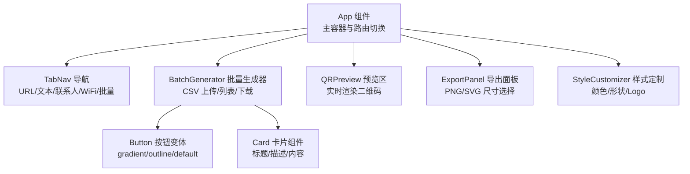
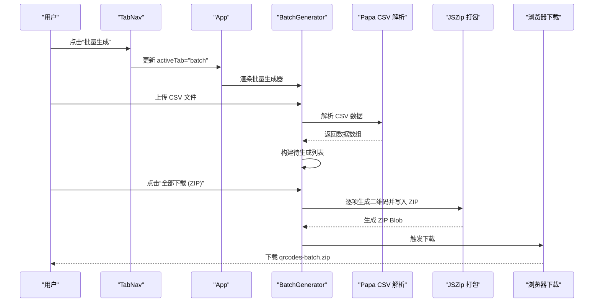
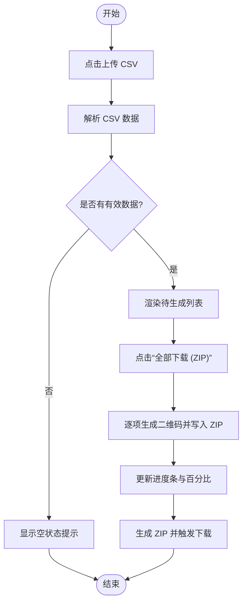
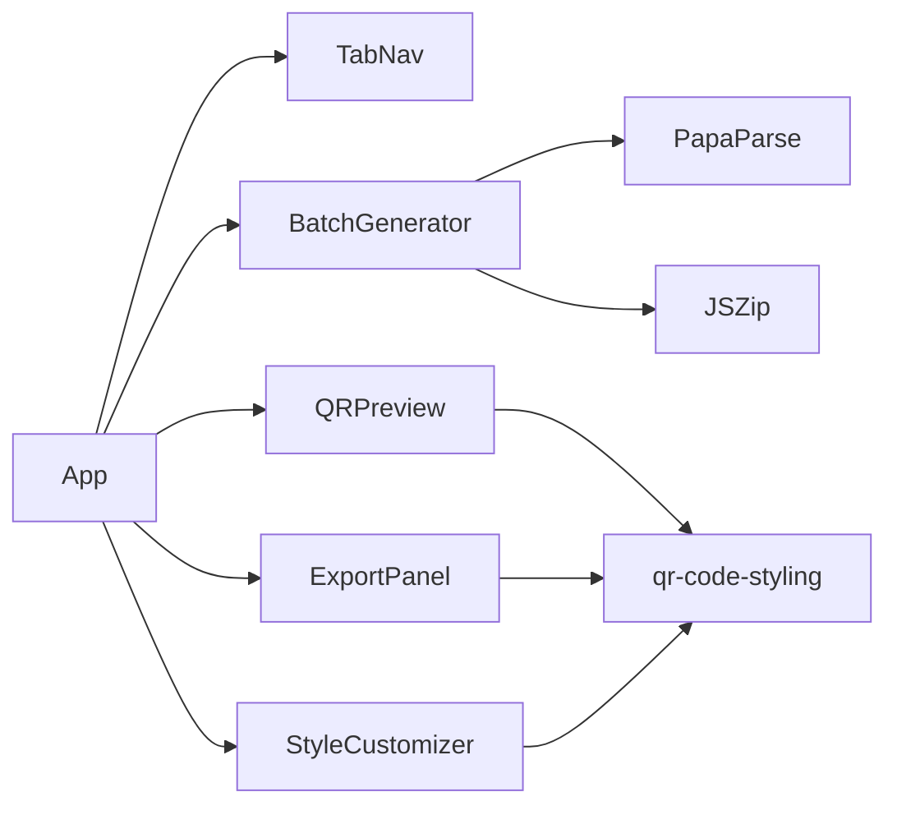

# 批量处理界面交互

<cite>
**本文档引用的文件**
- [src/components/BatchGenerator.tsx](file://src/components/BatchGenerator.tsx)
- [src/App.tsx](file://src/App.tsx)
- [src/lib/qr-utils.ts](file://src/lib/qr-utils.ts)
- [src/hooks/useQRCode.ts](file://src/hooks/useQRCode.ts)
- [src/components/ui/button.tsx](file://src/components/ui/button.tsx)
- [src/components/ui/card.tsx](file://src/components/ui/card.tsx)
- [src/components/layout/TabNav.tsx](file://src/components/layout/TabNav.tsx)
- [src/components/ExportPanel.tsx](file://src/components/ExportPanel.tsx)
- [src/components/QRPreview.tsx](file://src/components/QRPreview.tsx)
- [src/components/forms/URLForm.tsx](file://src/components/forms/URLForm.tsx)
- [src/components/forms/TextForm.tsx](file://src/components/forms/TextForm.tsx)
- [src/components/forms/VCardForm.tsx](file://src/components/forms/VCardForm.tsx)
- [src/components/forms/WiFiForm.tsx](file://src/components/forms/WiFiForm.tsx)
- [src/components/StyleCustomizer.tsx](file://src/components/StyleCustomizer.tsx)
</cite>

## 目录
1. [简介](#简介)
2. [项目结构](#项目结构)
3. [核心组件](#核心组件)
4. [架构总览](#架构总览)
5. [详细组件分析](#详细组件分析)
6. [依赖关系分析](#依赖关系分析)
7. [性能考虑](#性能考虑)
8. [故障排除指南](#故障排除指南)
9. [结论](#结论)
10. [附录](#附录)

## 简介
本文件聚焦于批量处理界面的交互设计与实现，围绕“文件上传界面”、“待生成列表展示”和“进度反馈机制”三大核心功能，系统阐述用户界面设计理念、交互流程与用户体验优化策略。文档同时覆盖响应式设计、状态管理、错误提示与无障碍访问支持等最佳实践，帮助开发者与产品人员快速理解与迭代该界面。

## 项目结构
批量处理界面位于应用主页面的“批量生成”标签页内，采用卡片化布局与渐进增强的交互模式。整体由导航栏、批量生成区域、导出与预览区域组成，配合主题与样式定制模块，形成统一的视觉与交互语言。

图表来源
- [src/App.tsx:24-173](file://src/App.tsx#L24-L173)
- [src/components/layout/TabNav.tsx:22-47](file://src/components/layout/TabNav.tsx#L22-L47)
- [src/components/BatchGenerator.tsx:15-180](file://src/components/BatchGenerator.tsx#L15-L180)
- [src/components/QRPreview.tsx:9-45](file://src/components/QRPreview.tsx#L9-L45)
- [src/components/ExportPanel.tsx:13-83](file://src/components/ExportPanel.tsx#L13-L83)
- [src/components/StyleCustomizer.tsx:20-193](file://src/components/StyleCustomizer.tsx#L20-L193)
- [src/components/ui/button.tsx:5-51](file://src/components/ui/button.tsx#L5-L51)
- [src/components/ui/card.tsx:4-86](file://src/components/ui/card.tsx#L4-L86)

章节来源
- [src/App.tsx:24-173](file://src/App.tsx#L24-L173)
- [src/components/layout/TabNav.tsx:22-47](file://src/components/layout/TabNav.tsx#L22-L47)

## 核心组件
- 批量生成器（BatchGenerator）：负责 CSV 文件解析、待生成列表渲染、逐项生成与打包下载、进度反馈与交互控制。
- 导出面板（ExportPanel）：提供 PNG/SVG 导出入口与尺寸选择，统一导出流程与状态反馈。
- 预览区（QRPreview）：在非批量模式下提供实时二维码预览，与批量模式下的进度条形成一致的反馈体验。
- 样式定制（StyleCustomizer）：在批量模式下同样支持样式调整，确保批量导出与单个导出的一致性。
- UI 组件（Button/Card）：提供统一的交互语义与视觉反馈，保障一致性与可访问性。

章节来源
- [src/components/BatchGenerator.tsx:15-180](file://src/components/BatchGenerator.tsx#L15-L180)
- [src/components/ExportPanel.tsx:13-83](file://src/components/ExportPanel.tsx#L13-L83)
- [src/components/QRPreview.tsx:9-45](file://src/components/QRPreview.tsx#L9-L45)
- [src/components/StyleCustomizer.tsx:20-193](file://src/components/StyleCustomizer.tsx#L20-L193)
- [src/components/ui/button.tsx:5-51](file://src/components/ui/button.tsx#L5-L51)
- [src/components/ui/card.tsx:4-86](file://src/components/ui/card.tsx#L4-L86)

## 架构总览
批量处理界面通过 Tab 导航进入“批量生成”模式，随后由 BatchGenerator 负责数据流与状态管理；导出与预览在非批量模式下由 App 主组件协调，二者共享相同的样式与工具函数，保证交互一致性。

图表来源
- [src/components/layout/TabNav.tsx:22-47](file://src/components/layout/TabNav.tsx#L22-L47)
- [src/App.tsx:24-173](file://src/App.tsx#L24-L173)
- [src/components/BatchGenerator.tsx:21-79](file://src/components/BatchGenerator.tsx#L21-L79)

## 详细组件分析

### 批量生成器（BatchGenerator）
- 设计理念
  - 卡片化信息架构：上传区与列表区分离，信息层级清晰，便于用户聚焦任务状态。
  - 渐进式反馈：上传后即时呈现待生成列表；下载过程中显示进度条与百分比，降低等待焦虑。
  - 可编辑性：支持逐项删除，提升用户对生成结果的可控性。
- 交互流程
  - CSV 上传：点击上传区域触发文件选择，解析完成后清空输入框并更新状态。
  - 列表展示：按序号、标签、数据三段信息展示，支持一键删除。
  - 下载打包：逐项生成 PNG 并写入 ZIP，实时更新进度，完成后自动触发下载。
- 用户体验优化
  - 响应式设计：列表区域设置最大高度并启用垂直滚动，避免页面过长。
  - 状态禁用：生成过程中禁用下载按钮，防止重复触发。
  - 文件名安全：对标签进行字符清洗，避免非法字符导致下载失败。
- 错误提示策略
  - 空列表提示：未上传 CSV 时显示引导文案与示例格式。
  - 重置输入：解析完成后清空文件输入，避免重复解析同一文件。
- 无障碍支持
  - 按钮具备焦点可见轮廓与键盘可达性。
  - 列表项使用语义化结构，屏幕阅读器可读取序号与内容。

图表来源
- [src/components/BatchGenerator.tsx:21-79](file://src/components/BatchGenerator.tsx#L21-L79)

章节来源
- [src/components/BatchGenerator.tsx:15-180](file://src/components/BatchGenerator.tsx#L15-L180)

### 导出面板（ExportPanel）
- 功能职责
  - 提供 PNG/SVG 两种导出格式与尺寸选择，统一导出流程。
  - 在导出过程中禁用按钮并显示加载状态，避免并发导出。
- 交互细节
  - 尺寸选择：通过下拉菜单选择导出尺寸，支持 256x256 至 2048x2048。
  - 导出触发：分别调用 PNG/SVG 导出方法，内部通过工具函数生成对应格式。
- 与批量生成的关系
  - 批量模式下，导出逻辑由批量生成器内部完成；导出面板更适合单个二维码导出场景。
  - 两者共享导出尺寸配置与样式选项，保持一致性。

章节来源
- [src/components/ExportPanel.tsx:13-83](file://src/components/ExportPanel.tsx#L13-L83)
- [src/lib/qr-utils.ts:134-139](file://src/lib/qr-utils.ts#L134-L139)

### 预览区（QRPreview）
- 设计目标
  - 在非批量模式下提供实时预览，增强用户信心与交互反馈。
  - 无数据时提供占位提示，引导用户输入数据。
- 交互特性
  - 条件渲染：根据是否存在数据决定显示预览或占位提示。
  - 动画过渡：预览出现时使用缩放与阴影动画，提升体验自然度。
- 与批量生成的协同
  - 批量模式下不直接渲染预览区，但整体风格与动效保持一致，减少认知负担。

章节来源
- [src/components/QRPreview.tsx:9-45](file://src/components/QRPreview.tsx#L9-L45)

### 样式定制（StyleCustomizer）
- 功能范围
  - 颜色：预设配色与自定义颜色（前景/背景），支持十六进制与颜色选择器。
  - 形状：码点样式、定位角样式与定位点样式三类选项。
  - Logo：支持上传图片并在二维码中心显示，可调节大小。
- 交互设计
  - 即时生效：样式变更通过回调传递给父组件，实时影响预览与导出。
  - 安全上传：限制文件类型为图片，上传后可移除或重新选择。
- 与批量生成的集成
  - 批量导出时复用相同样式配置，确保批量与单个导出风格一致。

章节来源
- [src/components/StyleCustomizer.tsx:20-193](file://src/components/StyleCustomizer.tsx#L20-L193)

### 表单组件（URL/文本/联系人/WiFi）
- 设计原则
  - 语义化标签与占位符，明确输入要求与约束。
  - 交互反馈：如文本长度提示、WiFi 加密方式禁用/启用联动。
- 与批量生成的差异
  - 表单组件用于单个二维码的数据输入，批量生成器通过 CSV 批量处理多条数据。
  - 两者共享相同的样式与导出能力，保证一致的用户体验。

章节来源
- [src/components/forms/URLForm.tsx:10-33](file://src/components/forms/URLForm.tsx#L10-L33)
- [src/components/forms/TextForm.tsx:9-28](file://src/components/forms/TextForm.tsx#L9-L28)
- [src/components/forms/VCardForm.tsx:10-92](file://src/components/forms/VCardForm.tsx#L10-L92)
- [src/components/forms/WiFiForm.tsx:17-67](file://src/components/forms/WiFiForm.tsx#L17-L67)

## 依赖关系分析
- 组件耦合
  - App 作为顶层容器，协调 Tab 切换与批量/单个模式的渲染。
  - BatchGenerator 依赖 CSV 解析库与压缩库，承担数据与流程控制。
  - 导出与预览依赖样式工具与二维码生成库，形成稳定的分层。
- 外部依赖
  - PapaParse：CSV 解析。
  - JSZip：ZIP 打包。
  - qr-code-styling：二维码生成与导出。
- 状态管理
  - 使用 React 状态与 Hook 管理数据与 UI 状态，避免跨组件复杂通信。
  - useQRCode 提供统一的样式与导出接口，便于批量与单个场景复用。

图表来源
- [src/App.tsx:24-173](file://src/App.tsx#L24-L173)
- [src/components/BatchGenerator.tsx:1-8](file://src/components/BatchGenerator.tsx#L1-L8)
- [src/hooks/useQRCode.ts:1-75](file://src/hooks/useQRCode.ts#L1-L75)

章节来源
- [src/App.tsx:24-173](file://src/App.tsx#L24-L173)
- [src/components/BatchGenerator.tsx:1-8](file://src/components/BatchGenerator.tsx#L1-L8)
- [src/hooks/useQRCode.ts:1-75](file://src/hooks/useQRCode.ts#L1-L75)

## 性能考虑
- 批量生成性能
  - 逐项生成与打包：建议控制单次生成数量，避免长时间阻塞主线程。
  - 进度反馈：实时更新进度，提升感知性能。
  - 内存管理：生成完成后及时释放对象 URL，避免内存泄漏。
- 导出性能
  - PNG/SVG 生成：根据需求选择合适尺寸，避免过大图像导致内存压力。
  - 并发控制：导出过程中禁用按钮，避免重复触发造成资源浪费。
- 响应式与渲染
  - 列表滚动：设置最大高度与滚动容器，减少重排与重绘。
  - 卡片动画：使用轻量级过渡效果，避免在低端设备上造成卡顿。

## 故障排除指南
- CSV 解析问题
  - 缺少必要列：当 CSV 中缺少 data/url/text 列时，解析结果为空；请检查列名是否符合规范。
  - 空行与编码：启用跳过空行与正确的文件编码，避免解析异常。
- 下载失败
  - 空列表：若列表为空，下载按钮被禁用；请先上传有效 CSV。
  - 文件名非法：标签中的非法字符会被替换为下划线，确保下载成功。
- 导出异常
  - 尺寸过大：选择较小尺寸导出，避免内存不足。
  - 样式冲突：Logo 与错误纠正等级存在关联，确保样式配置合理。
- 无障碍问题
  - 焦点管理：按钮与输入框应具备可见焦点；检查键盘可达性。
  - 屏幕阅读器：列表项与按钮应具备可读的文本标签。

章节来源
- [src/components/BatchGenerator.tsx:21-79](file://src/components/BatchGenerator.tsx#L21-L79)
- [src/components/ExportPanel.tsx:13-83](file://src/components/ExportPanel.tsx#L13-L83)

## 结论
批量处理界面通过清晰的卡片化布局、渐进式反馈与一致的样式体系，实现了从 CSV 上传到批量导出的完整闭环。其交互设计强调可控性与可预期性，结合响应式与无障碍支持，为不同用户提供了高效且友好的使用体验。后续可在性能与错误处理方面持续优化，进一步提升大规模数据处理的稳定性与可用性。

## 附录
- 最佳实践
  - 明确数据规范：在上传前提供示例 CSV 与字段说明，降低用户试错成本。
  - 引导式反馈：在关键步骤提供提示与确认，减少误操作。
  - 一致性设计：批量与单个模式共享样式与交互语言，降低学习成本。
- 无障碍访问
  - 语义化标签与键盘可达性：确保所有交互元素均可通过键盘操作。
  - 屏幕阅读器友好：为动态内容提供可读的文本描述与状态提示。
  - 对比度与可读性：确保前景与背景颜色满足对比度要求，提升可读性。