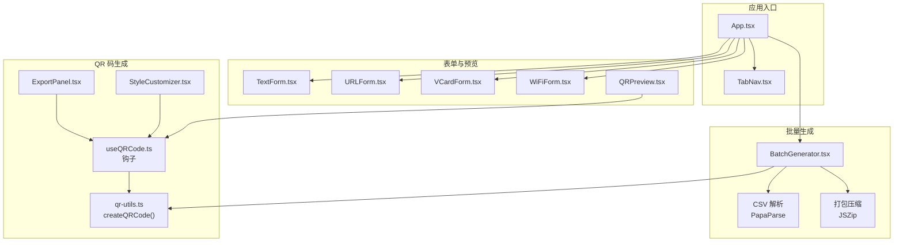
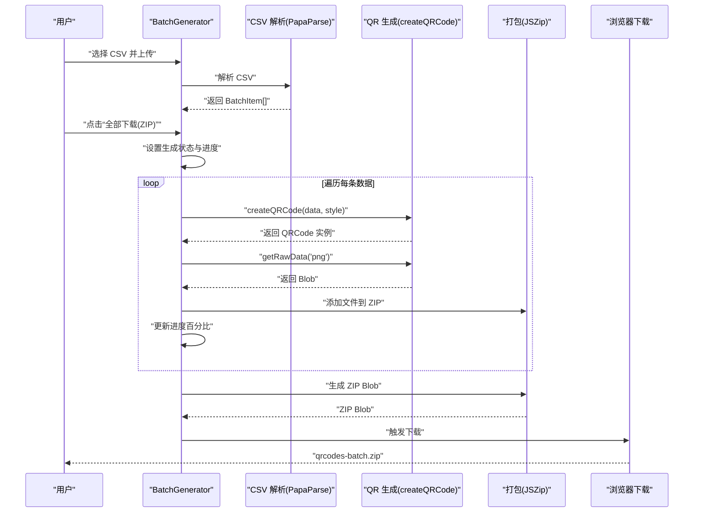
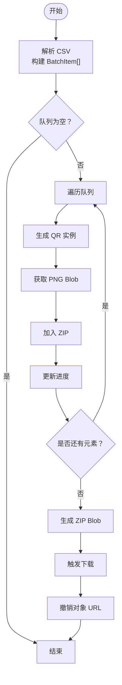
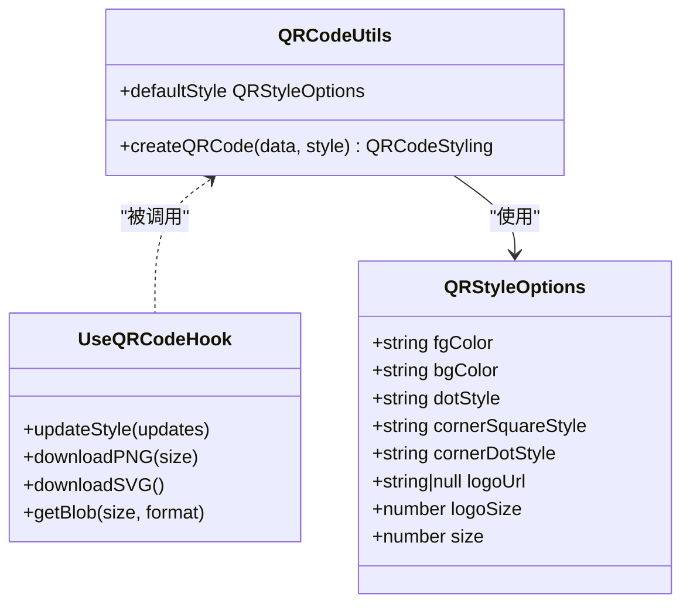
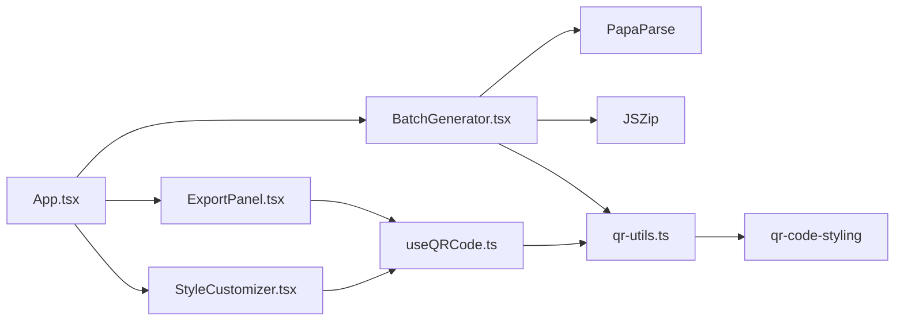

# 批量生成流程

<cite>
**本文引用的文件**
- [src/components/BatchGenerator.tsx](file://src/components/BatchGenerator.tsx)
- [src/lib/qr-utils.ts](file://src/lib/qr-utils.ts)
- [src/hooks/useQRCode.ts](file://src/hooks/useQRCode.ts)
- [src/App.tsx](file://src/App.tsx)
- [package.json](file://package.json)
- [src/components/ExportPanel.tsx](file://src/components/ExportPanel.tsx)
- [src/components/StyleCustomizer.tsx](file://src/components/StyleCustomizer.tsx)
- [src/components/QRPreview.tsx](file://src/components/QRPreview.tsx)
- [src/components/layout/TabNav.tsx](file://src/components/layout/TabNav.tsx)
- [src/components/forms/TextForm.tsx](file://src/components/forms/TextForm.tsx)
- [src/components/forms/URLForm.tsx](file://src/components/forms/URLForm.tsx)
- [src/components/forms/VCardForm.tsx](file://src/components/forms/VCardForm.tsx)
- [src/components/forms/WiFiForm.tsx](file://src/components/forms/WiFiForm.tsx)
</cite>

## 目录
1. [简介](#简介)
2. [项目结构](#项目结构)
3. [核心组件](#核心组件)
4. [架构总览](#架构总览)
5. [详细组件分析](#详细组件分析)
6. [依赖关系分析](#依赖关系分析)
7. [性能考量](#性能考量)
8. [故障排查指南](#故障排查指南)
9. [结论](#结论)
10. [附录](#附录)

## 简介
本文件围绕“批量生成流程”进行系统化技术文档编写，聚焦于以下目标：
- 深入解释批量处理的工作流程、并发控制策略与性能优化机制
- 详述 QR 码生成过程中的内存管理、进度跟踪与错误恢复机制
- 覆盖批量生成的完整生命周期：从数据预处理（CSV 解析）到 QR 码生成再到文件打包保存
- 提供性能基准与优化建议，帮助用户在不同规模数据下获得稳定体验

## 项目结构
该应用采用前端单页应用架构，核心功能集中在组件与工具模块中：
- 组件层：负责用户交互、表单输入、样式定制、预览与导出面板
- 工具层：封装 QR 码生成逻辑与样式配置
- 钩子层：封装 QR 码实例化、样式更新与导出能力
- 应用入口：组织页面布局与路由式切换（含批量生成页）

图表来源
- [src/App.tsx:24-173](file://src/App.tsx#L24-L173)
- [src/components/BatchGenerator.tsx:15-180](file://src/components/BatchGenerator.tsx#L15-L180)
- [src/lib/qr-utils.ts:63-101](file://src/lib/qr-utils.ts#L63-L101)
- [src/hooks/useQRCode.ts:5-75](file://src/hooks/useQRCode.ts#L5-L75)
- [src/components/ExportPanel.tsx:13-83](file://src/components/ExportPanel.tsx#L13-L83)
- [src/components/StyleCustomizer.tsx:20-193](file://src/components/StyleCustomizer.tsx#L20-L193)
- [src/components/QRPreview.tsx:9-45](file://src/components/QRPreview.tsx#L9-L45)
- [src/components/layout/TabNav.tsx:22-47](file://src/components/layout/TabNav.tsx#L22-L47)

章节来源
- [src/App.tsx:24-173](file://src/App.tsx#L24-L173)
- [src/components/layout/TabNav.tsx:22-47](file://src/components/layout/TabNav.tsx#L22-L47)

## 核心组件
- 批量生成器（BatchGenerator）
  - 负责 CSV 上传解析、构建待生成队列、逐条生成 QR 码并打包下载
  - 使用状态管理维护队列、生成进度与生成状态
- QR 码工具（qr-utils）
  - 封装 createQRCode 与默认样式，统一生成参数与导出选项
- 钩子（useQRCode）
  - 管理 QR 实例生命周期、样式更新、导出 PNG/SVG 与获取 Blob
- 导出面板（ExportPanel）
  - 提供 PNG/SVG 导出入口，控制导出尺寸与禁用态
- 样式定制器（StyleCustomizer）
  - 提供配色、点样式、角样式与 Logo 上传等定制项
- 表单组件（TextForm/URLForm/VCardForm/WiFiForm）
  - 分别对应不同数据类型输入，驱动 QR 数据字符串计算

章节来源
- [src/components/BatchGenerator.tsx:15-180](file://src/components/BatchGenerator.tsx#L15-L180)
- [src/lib/qr-utils.ts:63-101](file://src/lib/qr-utils.ts#L63-L101)
- [src/hooks/useQRCode.ts:5-75](file://src/hooks/useQRCode.ts#L5-L75)
- [src/components/ExportPanel.tsx:13-83](file://src/components/ExportPanel.tsx#L13-L83)
- [src/components/StyleCustomizer.tsx:20-193](file://src/components/StyleCustomizer.tsx#L20-L193)
- [src/components/forms/TextForm.tsx:9-28](file://src/components/forms/TextForm.tsx#L9-L28)
- [src/components/forms/URLForm.tsx:10-33](file://src/components/forms/URLForm.tsx#L10-L33)
- [src/components/forms/VCardForm.tsx:10-92](file://src/components/forms/VCardForm.tsx#L10-L92)
- [src/components/forms/WiFiForm.tsx:17-67](file://src/components/forms/WiFiForm.tsx#L17-L67)

## 架构总览
批量生成流程由“数据导入 → 队列构建 → 逐条生成 → 打包下载”构成，整体采用同步顺序执行，未引入 Web Workers 或分片并发，适合中小规模数据集。

图表来源
- [src/components/BatchGenerator.tsx:21-79](file://src/components/BatchGenerator.tsx#L21-L79)
- [src/lib/qr-utils.ts:63-101](file://src/lib/qr-utils.ts#L63-L101)

## 详细组件分析

### 批量生成器（BatchGenerator）
- 数据预处理
  - 使用 PapaParse 解析 CSV，自动识别 data/url/text/content 或首列作为数据源，label/name/title 作为文件名，缺失时回退为数据值
  - 清洗空行与空白字符，生成 BatchItem 数组
- 并发控制策略
  - 当前实现为顺序循环生成，不使用并发或分片，避免主线程阻塞与内存峰值叠加
- 进度跟踪
  - 基于索引计算百分比，实时更新 UI 进度条
- 错误恢复机制
  - 对无效行进行跳过；对生成失败的 Blob 进行条件写入；下载前清理对象 URL，防止内存泄漏
- 文件保存
  - 使用 JSZip 异步生成 Blob，再通过 a.download 触发下载，最后撤销对象 URL

图表来源
- [src/components/BatchGenerator.tsx:21-79](file://src/components/BatchGenerator.tsx#L21-L79)

章节来源
- [src/components/BatchGenerator.tsx:15-180](file://src/components/BatchGenerator.tsx#L15-L180)

### QR 码生成与导出（qr-utils + useQRCode）
- 生成参数
  - 统一通过 createQRCode 构建 Options，包含尺寸、前景/背景色、点样式、角样式、纠错等级与可选 Logo
  - 默认尺寸为 300，批量场景中在下载时临时提升至 1024 以保证清晰度
- 导出能力
  - 支持直接下载 PNG/SVG 与获取 Blob，便于后续打包
- 样式定制
  - StyleCustomizer 提供配色、点样式、角样式与 Logo 上传，配合 useQRCode 的 updateStyle 动态更新

图表来源
- [src/lib/qr-utils.ts:14-112](file://src/lib/qr-utils.ts#L14-L112)
- [src/hooks/useQRCode.ts:31-62](file://src/hooks/useQRCode.ts#L31-L62)

章节来源
- [src/lib/qr-utils.ts:63-101](file://src/lib/qr-utils.ts#L63-L101)
- [src/hooks/useQRCode.ts:5-75](file://src/hooks/useQRCode.ts#L5-L75)
- [src/components/StyleCustomizer.tsx:20-193](file://src/components/StyleCustomizer.tsx#L20-L193)

### 导出面板与预览（ExportPanel + QRPreview）
- 导出面板
  - 提供 PNG 尺寸选择与导出开关，内部通过 useQRCode 的下载方法实现
- 实时预览
  - 通过 useQRCode 在容器内渲染 QR，无数据时显示占位提示

章节来源
- [src/components/ExportPanel.tsx:13-83](file://src/components/ExportPanel.tsx#L13-L83)
- [src/components/QRPreview.tsx:9-45](file://src/components/QRPreview.tsx#L9-L45)

### 表单与数据输入（TextForm/URLForm/VCardForm/WiFiForm）
- 各表单组件分别维护对应字段的状态，并在 App 中根据当前 Tab 计算最终 QR 数据字符串
- VCard 与 WiFi 通过工具函数格式化为标准字符串

章节来源
- [src/components/forms/TextForm.tsx:9-28](file://src/components/forms/TextForm.tsx#L9-L28)
- [src/components/forms/URLForm.tsx:10-33](file://src/components/forms/URLForm.tsx#L10-L33)
- [src/components/forms/VCardForm.tsx:10-92](file://src/components/forms/VCardForm.tsx#L10-L92)
- [src/components/forms/WiFiForm.tsx:17-67](file://src/components/forms/WiFiForm.tsx#L17-L67)
- [src/lib/qr-utils.ts:42-61](file://src/lib/qr-utils.ts#L42-L61)

## 依赖关系分析
- 第三方库
  - PapaParse：CSV 解析
  - JSZip：ZIP 打包
  - qr-code-styling：QR 码渲染与导出
  - lucide-react、sonner：UI 图标与通知
- 内部依赖
  - BatchGenerator 依赖 PapaParse、JSZip 与 qr-utils
  - useQRCode 依赖 qr-utils 与外部库
  - App 作为中枢协调各组件

图表来源
- [src/components/BatchGenerator.tsx:1-8](file://src/components/BatchGenerator.tsx#L1-L8)
- [package.json:11-24](file://package.json#L11-L24)

章节来源
- [package.json:11-24](file://package.json#L11-L24)

## 性能考量
- 当前实现为顺序生成，优点是内存占用稳定、实现简单；缺点是在大数据量时耗时较长
- 内存管理
  - 生成完成后及时撤销对象 URL，避免内存泄漏
  - 逐条生成并写入 ZIP，避免一次性持有大量 Blob
- 并发与分片建议
  - 可考虑将队列分块（如每批 10~50 项），使用 setTimeout 或 requestIdleCallback 控制主线程让渡
  - 对于超大批次，可引入 Web Workers 将 QR 生成与 Blob 获取移出主线程
- I/O 优化
  - 批量下载前先估算 ZIP 大小，必要时提示用户磁盘空间
  - 对重复数据进行去重或缓存，减少重复生成
- UI 响应性
  - 在生成期间启用防抖与节流，降低进度更新频率
  - 对长列表使用虚拟滚动，减少 DOM 更新压力

## 故障排查指南
- CSV 解析异常
  - 现象：无法识别数据列或生成空队列
  - 排查：确认 CSV 包含 data/url/text/content 或首列之一；检查编码与分隔符
- 生成失败或空白文件
  - 现象：ZIP 中存在空文件或缺失
  - 排查：检查 getRawData 返回值；确保数据非空且合法
- 下载失败
  - 现象：点击无响应或下载失败
  - 排查：确认对象 URL 已创建；检查浏览器下载权限与弹窗拦截
- 内存占用过高
  - 现象：长时间卡顿或页面崩溃
  - 排查：减小批量规模；分批生成；避免同时打开多个标签页
- Logo 导入问题
  - 现象：Logo 不显示或样式异常
  - 排查：确认图片格式与尺寸；调整 logoSize 参数

章节来源
- [src/components/BatchGenerator.tsx:21-79](file://src/components/BatchGenerator.tsx#L21-L79)
- [src/hooks/useQRCode.ts:53-62](file://src/hooks/useQRCode.ts#L53-L62)

## 结论
本批量生成流程以简洁稳定的顺序执行为核心，结合合理的内存管理与进度反馈，满足中小规模批量需求。对于大规模数据，建议引入分片与异步策略，在保证用户体验的同时提升吞吐与稳定性。

## 附录
- 关键实现路径参考
  - 批量生成主流程：[src/components/BatchGenerator.tsx:52-79](file://src/components/BatchGenerator.tsx#L52-L79)
  - QR 生成与导出：[src/lib/qr-utils.ts:63-101](file://src/lib/qr-utils.ts#L63-L101)、[src/hooks/useQRCode.ts:35-62](file://src/hooks/useQRCode.ts#L35-L62)
  - 导出面板与预览：[src/components/ExportPanel.tsx:21-37](file://src/components/ExportPanel.tsx#L21-L37)、[src/components/QRPreview.tsx:9-45](file://src/components/QRPreview.tsx#L9-L45)
  - 表单与数据计算：[src/App.tsx:47-65](file://src/App.tsx#L47-L65)、[src/components/forms/VCardForm.tsx:10-92](file://src/components/forms/VCardForm.tsx#L10-L92)、[src/components/forms/WiFiForm.tsx:17-67](file://src/components/forms/WiFiForm.tsx#L17-L67)