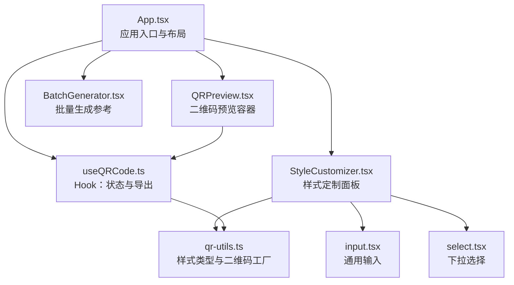
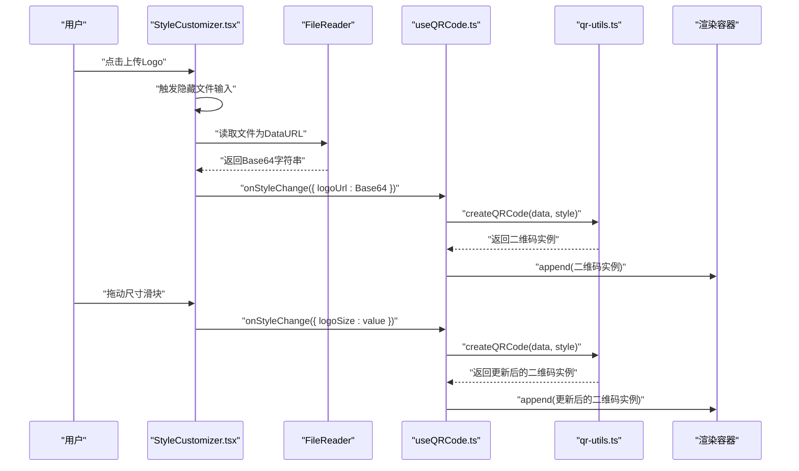
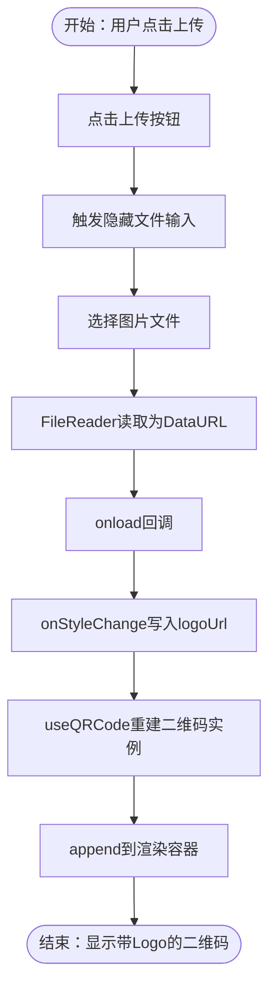
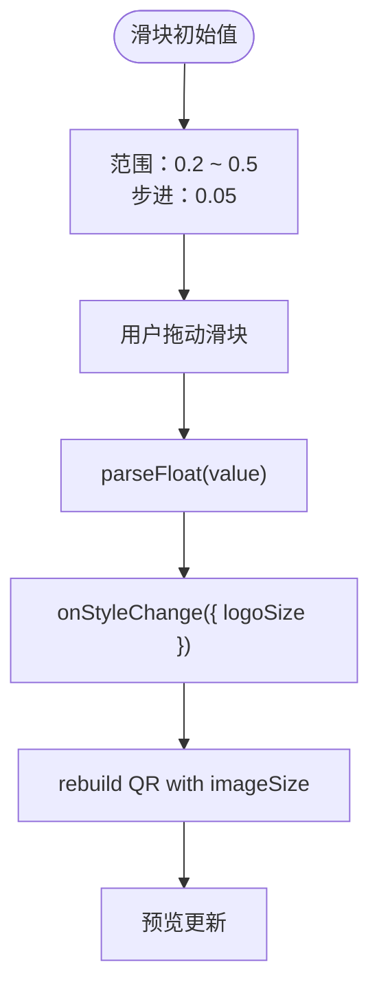
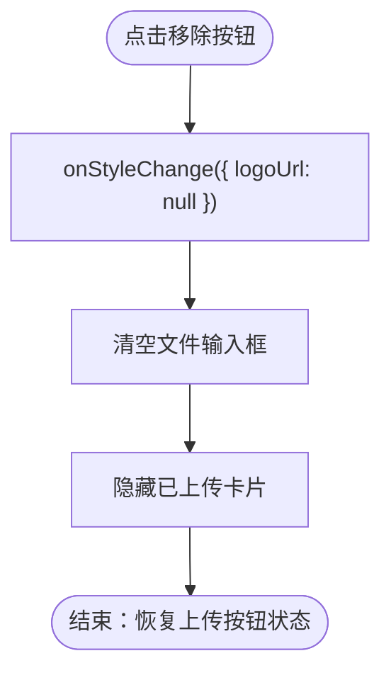
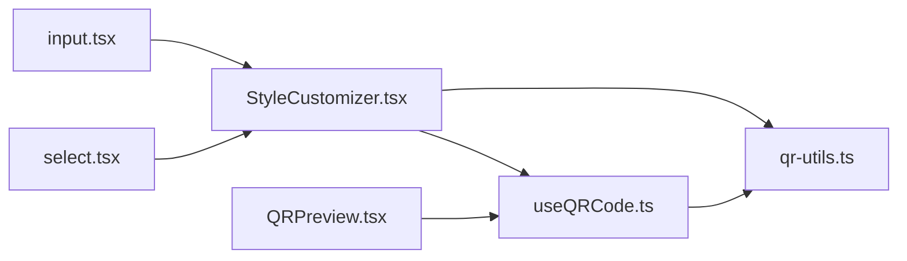

# Logo集成

<cite>
**本文引用的文件**
- [App.tsx](file://src/App.tsx)
- [StyleCustomizer.tsx](file://src/components/StyleCustomizer.tsx)
- [QRPreview.tsx](file://src/components/QRPreview.tsx)
- [useQRCode.ts](file://src/hooks/useQRCode.ts)
- [qr-utils.ts](file://src/lib/qr-utils.ts)
- [input.tsx](file://src/components/ui/input.tsx)
- [select.tsx](file://src/components/ui/select.tsx)
- [package.json](file://package.json)
</cite>

## 目录
1. [简介](#简介)
2. [项目结构](#项目结构)
3. [核心组件](#核心组件)
4. [架构总览](#架构总览)
5. [详细组件分析](#详细组件分析)
6. [依赖关系分析](#依赖关系分析)
7. [性能考量](#性能考量)
8. [故障排除指南](#故障排除指南)
9. [结论](#结论)
10. [附录](#附录)

## 简介
本文件针对QR码生成器的Logo集成系统进行深入技术文档化，重点覆盖以下方面：
- Logo上传功能的实现机制：文件选择器、图片读取与Base64编码流程
- Logo尺寸控制滑块的工作原理：0.2到0.5范围内的缩放算法与映射
- Logo移除功能：状态重置与文件输入框清空
- Logo尺寸建议、格式要求与最佳实践
- Logo在二维码中的视觉平衡考虑

该系统基于React + TypeScript构建，使用qr-code-styling库渲染二维码，并通过受控组件与Hook管理样式状态，确保Logo在二维码中的正确显示与交互体验。

## 项目结构
Logo集成功能涉及多个层次的组件与工具函数，整体结构如下：
- 应用入口与布局：App.tsx负责页面布局、标签页切换与数据输入区域
- 样式定制面板：StyleCustomizer.tsx提供Logo上传、尺寸滑块与移除操作
- 预览容器：QRPreview.tsx承载二维码渲染容器
- 状态与逻辑：useQRCode.ts Hook管理二维码实例、样式更新与导出
- 工具与类型：qr-utils.ts定义样式选项、默认值与二维码配置工厂
- UI基础组件：input.tsx、select.tsx提供通用输入控件
- 依赖声明：package.json展示qr-code-styling等关键依赖

图表来源
- [App.tsx:1-173](file://src/App.tsx#L1-L173)
- [StyleCustomizer.tsx:1-193](file://src/components/StyleCustomizer.tsx#L1-L193)
- [QRPreview.tsx:1-45](file://src/components/QRPreview.tsx#L1-L45)
- [useQRCode.ts:1-75](file://src/hooks/useQRCode.ts#L1-L75)
- [qr-utils.ts:1-151](file://src/lib/qr-utils.ts#L1-L151)
- [input.tsx:1-25](file://src/components/ui/input.tsx#L1-L25)
- [select.tsx:1-31](file://src/components/ui/select.tsx#L1-L31)

章节来源
- [App.tsx:1-173](file://src/App.tsx#L1-L173)
- [StyleCustomizer.tsx:1-193](file://src/components/StyleCustomizer.tsx#L1-L193)
- [QRPreview.tsx:1-45](file://src/components/QRPreview.tsx#L1-L45)
- [useQRCode.ts:1-75](file://src/hooks/useQRCode.ts#L1-L75)
- [qr-utils.ts:1-151](file://src/lib/qr-utils.ts#L1-L151)
- [input.tsx:1-25](file://src/components/ui/input.tsx#L1-L25)
- [select.tsx:1-31](file://src/components/ui/select.tsx#L1-L31)

## 核心组件
本节聚焦Logo集成相关的核心组件及其职责：
- StyleCustomizer：提供Logo上传、尺寸滑块与移除操作；通过onStyleChange回调更新全局样式
- useQRCode：维护样式状态、创建二维码实例并在容器内渲染；支持导出PNG/SVG
- qr-utils：定义QRStyleOptions类型、默认样式与createQRCode工厂；根据logoUrl条件启用imageOptions
- App：协调数据输入、样式定制与预览导出

章节来源
- [StyleCustomizer.tsx:15-193](file://src/components/StyleCustomizer.tsx#L15-L193)
- [useQRCode.ts:5-75](file://src/hooks/useQRCode.ts#L5-L75)
- [qr-utils.ts:14-112](file://src/lib/qr-utils.ts#L14-L112)
- [App.tsx:64-65](file://src/App.tsx#L64-L65)

## 架构总览
Logo集成的端到端工作流如下：
- 用户在样式定制面板触发Logo上传，通过FileReader读取为Base64数据URL
- 将logoUrl与logoSize写入样式状态，触发useQRCode重新创建二维码实例
- qr-utils根据是否包含logoUrl决定是否启用imageOptions（含imageSize）
- 渲染容器接收二维码实例并插入DOM

图表来源
- [StyleCustomizer.tsx:23-36](file://src/components/StyleCustomizer.tsx#L23-L36)
- [StyleCustomizer.tsx:178-187](file://src/components/StyleCustomizer.tsx#L178-L187)
- [useQRCode.ts:20-29](file://src/hooks/useQRCode.ts#L20-L29)
- [qr-utils.ts:63-101](file://src/lib/qr-utils.ts#L63-L101)

## 详细组件分析

### Logo上传功能实现机制
- 文件选择器与触发
  - 隐藏的文件输入元素仅接受图像类型，用于限制用户选择
  - 通过按钮点击触发文件输入的原生click事件，避免直接暴露文件输入外观
- 图片读取与Base64编码
  - 使用FileReader异步读取所选文件，回调中将结果作为DataURL传递给父组件
  - onStyleChange接收logoUrl并写入全局样式状态，驱动后续渲染
- 状态与渲染
  - 当存在logoUrl时，qr-utils的createQRCode会启用imageOptions，包含crossOrigin、margin与imageSize等参数
  - useQRCode在每次样式变化时重建二维码实例并append到容器

图表来源
- [StyleCustomizer.tsx:158-172](file://src/components/StyleCustomizer.tsx#L158-L172)
- [StyleCustomizer.tsx:23-31](file://src/components/StyleCustomizer.tsx#L23-L31)
- [useQRCode.ts:20-29](file://src/hooks/useQRCode.ts#L20-L29)
- [qr-utils.ts:90-98](file://src/lib/qr-utils.ts#L90-L98)

章节来源
- [StyleCustomizer.tsx:21-36](file://src/components/StyleCustomizer.tsx#L21-L36)
- [StyleCustomizer.tsx:158-172](file://src/components/StyleCustomizer.tsx#L158-L172)
- [qr-utils.ts:90-98](file://src/lib/qr-utils.ts#L90-L98)
- [useQRCode.ts:20-29](file://src/hooks/useQRCode.ts#L20-L29)

### Logo尺寸控制滑块工作原理
- 滑块范围与步进
  - 范围：最小值0.2，最大值0.5，步进0.05
  - 显示：实时百分比显示当前值（Math.round(style.logoSize * 100)）
- 缩放算法与映射
  - 值域映射：滑块值直接对应imageOptions.imageSize，表示Logo占二维码可视区域的比例
  - 作用：影响Logo在二维码中的相对尺寸，从而影响视觉权重与可读性
- 变更处理
  - onChange事件将浮点数转换后写入logoSize，触发样式更新与二维码重建

图表来源
- [StyleCustomizer.tsx:178-187](file://src/components/StyleCustomizer.tsx#L178-L187)
- [qr-utils.ts:92-97](file://src/lib/qr-utils.ts#L92-L97)

章节来源
- [StyleCustomizer.tsx:178-187](file://src/components/StyleCustomizer.tsx#L178-L187)
- [qr-utils.ts:92-97](file://src/lib/qr-utils.ts#L92-L97)

### Logo移除功能实现
- 移除流程
  - 点击“移除”按钮调用removeLogo
  - onStyleChange将logoUrl设置为null，清空样式中的Logo
  - 同时将文件输入框的value清空，确保下次同一文件可重复选择
- 视觉反馈
  - 当无logoUrl时，界面显示上传按钮而非已上传卡片

图表来源
- [StyleCustomizer.tsx:33-36](file://src/components/StyleCustomizer.tsx#L33-L36)
- [StyleCustomizer.tsx:158-165](file://src/components/StyleCustomizer.tsx#L158-L165)

章节来源
- [StyleCustomizer.tsx:33-36](file://src/components/StyleCustomizer.tsx#L33-L36)
- [StyleCustomizer.tsx:158-165](file://src/components/StyleCustomizer.tsx#L158-L165)

### Logo尺寸建议、格式要求与最佳实践
- 尺寸建议
  - 默认值：0.4（即40%），适合大多数场景
  - 推荐范围：0.25~0.45，兼顾Logo可见性与二维码纠错能力
- 格式要求
  - 仅接受图像类型文件（accept="image/*"）
  - 建议使用矢量或高分辨率位图，避免低质量导致模糊
- 最佳实践
  - 保持Logo简洁，避免过多细节影响二维码识别
  - 控制Logo色彩对比度，确保在浅色背景上清晰可见
  - 注意Logo比例，避免过度拉伸或压缩
  - 在启用Logo时，二维码纠错等级自动提升至较高水平，以保证可读性

章节来源
- [qr-utils.ts:103-112](file://src/lib/qr-utils.ts#L103-L112)
- [StyleCustomizer.tsx:166-172](file://src/components/StyleCustomizer.tsx#L166-L172)

### Logo在二维码中的视觉平衡考虑
- 视觉权重与可读性
  - 较大的Logo会占用更多二维码模块，降低纠错冗余，可能影响扫描成功率
  - 建议在Logo尺寸与二维码可读性之间取得平衡
- 错误纠正策略
  - 当存在Logo时，二维码纠错等级自动提高，有助于在Logo遮挡下仍保持可读性
- 设计建议
  - 使用透明背景或与背景对比明显的Logo
  - 避免使用与二维码主体颜色相近的Logo，以免造成混淆
  - 在Logo周围留白，减少与二维码模块的冲突

章节来源
- [qr-utils.ts:85-87](file://src/lib/qr-utils.ts#L85-L87)

## 依赖关系分析
Logo集成功能的关键依赖与耦合关系如下：
- StyleCustomizer依赖qr-utils中的类型与默认值，同时依赖useQRCode提供的onStyleChange回调
- useQRCode依赖qr-utils的createQRCode工厂，根据样式动态创建二维码实例
- QRPreview仅负责渲染容器，不直接参与Logo逻辑
- UI组件input.tsx与select.tsx为通用控件，被StyleCustomizer复用

图表来源
- [StyleCustomizer.tsx:15-18](file://src/components/StyleCustomizer.tsx#L15-L18)
- [useQRCode.ts:1-6](file://src/hooks/useQRCode.ts#L1-L6)
- [qr-utils.ts:14-23](file://src/lib/qr-utils.ts#L14-L23)

章节来源
- [StyleCustomizer.tsx:15-18](file://src/components/StyleCustomizer.tsx#L15-L18)
- [useQRCode.ts:1-6](file://src/hooks/useQRCode.ts#L1-L6)
- [qr-utils.ts:14-23](file://src/lib/qr-utils.ts#L14-L23)

## 性能考量
- 文件读取与内存
  - FileReader以DataURL形式加载图片，适合小到中等尺寸图片；大图可能导致内存占用上升
  - 建议限制上传图片大小，避免长时间阻塞UI线程
- 二维码重建频率
  - 每次Logo尺寸或样式变化都会重建二维码实例，频繁拖动滑块可能带来重绘开销
  - 可通过节流/防抖优化onChange事件，减少不必要的重建
- 渲染与DOM
  - append操作在容器内进行，建议避免在高频事件中重复append，确保只在必要时更新

章节来源
- [StyleCustomizer.tsx:178-187](file://src/components/StyleCustomizer.tsx#L178-L187)
- [useQRCode.ts:20-29](file://src/hooks/useQRCode.ts#L20-L29)

## 故障排除指南
- 无法上传图片
  - 检查文件输入的accept属性是否正确
  - 确认未禁用文件输入或其父级元素
- 上传后Logo未显示
  - 确认onStyleChange已正确写入logoUrl
  - 检查二维码实例是否成功重建并append到容器
- 尺寸滑块无效
  - 确认onChange事件已将值转换为浮点数并写入logoSize
  - 检查createQRCode是否正确传入imageOptions.imageSize
- 移除Logo后仍显示
  - 确认removeLogo已将logoUrl设为null且文件输入框value被清空
  - 检查界面逻辑是否正确根据logoUrl切换显示内容

章节来源
- [StyleCustomizer.tsx:166-172](file://src/components/StyleCustomizer.tsx#L166-L172)
- [StyleCustomizer.tsx:178-187](file://src/components/StyleCustomizer.tsx#L178-L187)
- [StyleCustomizer.tsx:33-36](file://src/components/StyleCustomizer.tsx#L33-L36)
- [qr-utils.ts:90-98](file://src/lib/qr-utils.ts#L90-L98)

## 结论
Logo集成系统通过受控组件与Hook实现了完整的上传、尺寸调节与移除流程。其设计遵循单一职责原则：StyleCustomizer专注交互与状态变更，useQRCode负责实例管理与渲染，qr-utils提供类型与工厂方法。在视觉平衡与性能方面，系统提供了合理的默认值与自动纠错策略，同时允许用户精细调整以满足不同场景需求。

## 附录
- 关键依赖版本
  - qr-code-styling：用于二维码渲染与Logo叠加
  - jszip：用于批量导出（参考）
  - papaparse：用于批量导入（参考）

章节来源
- [package.json:20-23](file://package.json#L20-L23)