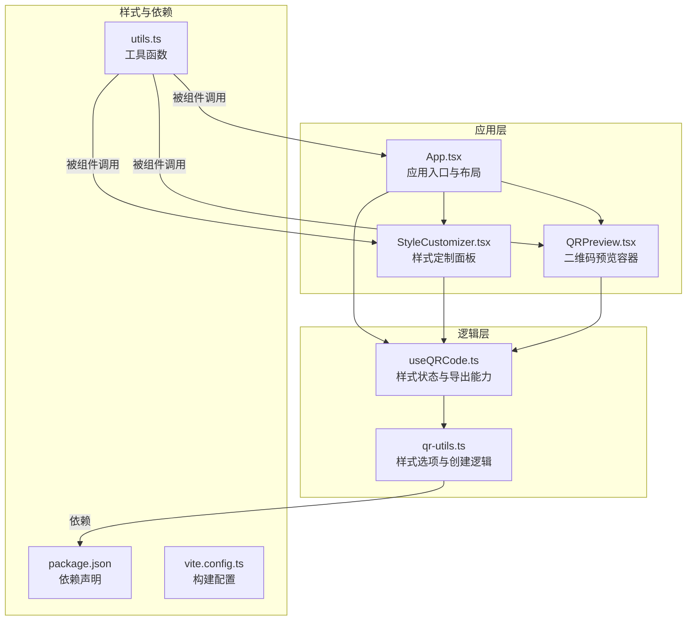
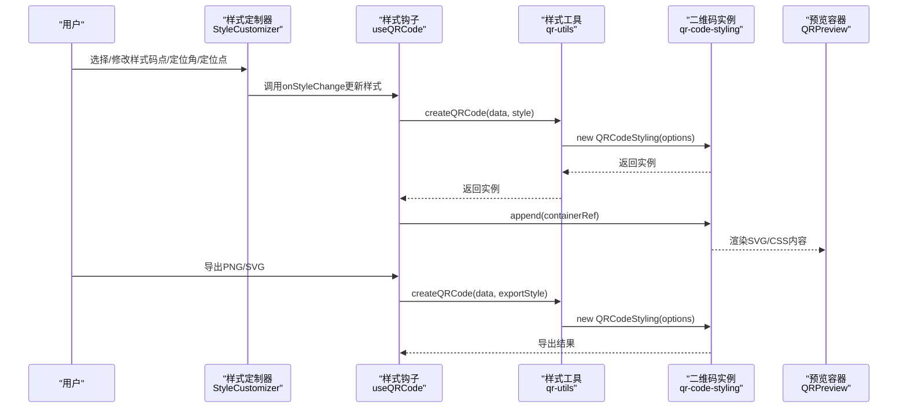
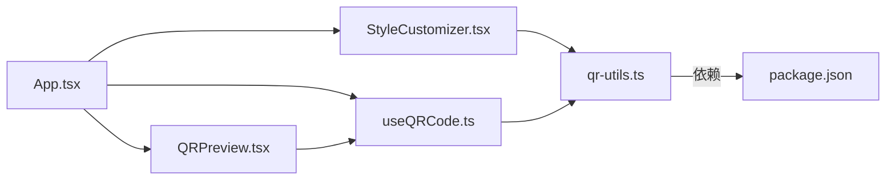

# 形状样式

<cite>
**本文引用的文件**
- [App.tsx](file://src/App.tsx)
- [StyleCustomizer.tsx](file://src/components/StyleCustomizer.tsx)
- [useQRCode.ts](file://src/hooks/useQRCode.ts)
- [qr-utils.ts](file://src/lib/qr-utils.ts)
- [QRPreview.tsx](file://src/components/QRPreview.tsx)
- [utils.ts](file://src/lib/utils.ts)
- [package.json](file://package.json)
- [vite.config.ts](file://vite.config.ts)
</cite>

## 目录
1. [简介](#简介)
2. [项目结构](#项目结构)
3. [核心组件](#核心组件)
4. [架构总览](#架构总览)
5. [详细组件分析](#详细组件分析)
6. [依赖关系分析](#依赖关系分析)
7. [性能考量](#性能考量)
8. [故障排除指南](#故障排除指南)
9. [结论](#结论)
10. [附录](#附录)

## 简介
本文件聚焦于QR码生成器的“形状样式”系统，系统性阐述码点样式（dotStyle）、定位角样式（cornerSquareStyle）与定位点样式（cornerDotStyle）的实现机制与视觉效果。通过对代码库中样式选项、状态管理与渲染流程的深入分析，帮助读者理解不同几何形状组合如何影响二维码的整体外观，并给出设计原则与视觉层次建议。

## 项目结构
该应用采用React + TypeScript构建，使用Vite进行开发与打包，样式系统通过外部库qr-code-styling实现。核心样式逻辑集中在样式工具模块与自定义Hook中，界面由主应用、样式定制器与二维码预览组件构成。

图表来源
- [App.tsx:1-173](file://src/App.tsx#L1-L173)
- [StyleCustomizer.tsx:1-193](file://src/components/StyleCustomizer.tsx#L1-L193)
- [useQRCode.ts:1-75](file://src/hooks/useQRCode.ts#L1-L75)
- [qr-utils.ts:1-151](file://src/lib/qr-utils.ts#L1-L151)
- [QRPreview.tsx:1-45](file://src/components/QRPreview.tsx#L1-L45)
- [utils.ts:1-7](file://src/lib/utils.ts#L1-L7)
- [package.json:1-37](file://package.json#L1-L37)
- [vite.config.ts:1-13](file://vite.config.ts#L1-L13)

章节来源
- [App.tsx:1-173](file://src/App.tsx#L1-L173)
- [package.json:1-37](file://package.json#L1-L37)
- [vite.config.ts:1-13](file://vite.config.ts#L1-L13)

## 核心组件
- 样式选项类型与默认值：定义了前景色、背景色、码点样式、定位角样式、定位点样式、Logo地址、Logo尺寸与整体尺寸等字段，并提供默认样式。
- 样式创建函数：根据传入的数据与样式选项，构造qr-code-styling实例，设置二维码的点阵、背景、角部样式与可选Logo。
- 样式定制器：提供预设配色、自定义颜色、码点样式、定位角样式、定位点样式与Logo上传的交互界面。
- 钩子：管理样式状态、监听数据变化并重新渲染二维码，同时提供PNG/SVG导出能力。

章节来源
- [qr-utils.ts:14-112](file://src/lib/qr-utils.ts#L14-L112)
- [qr-utils.ts:63-101](file://src/lib/qr-utils.ts#L63-L101)
- [StyleCustomizer.tsx:15-193](file://src/components/StyleCustomizer.tsx#L15-L193)
- [useQRCode.ts:5-75](file://src/hooks/useQRCode.ts#L5-L75)

## 架构总览
下图展示了从用户交互到二维码渲染与导出的端到端流程，重点体现形状样式参数如何贯穿整个过程。

图表来源
- [StyleCustomizer.tsx:106-134](file://src/components/StyleCustomizer.tsx#L106-L134)
- [useQRCode.ts:31-73](file://src/hooks/useQRCode.ts#L31-L73)
- [qr-utils.ts:63-101](file://src/lib/qr-utils.ts#L63-L101)
- [QRPreview.tsx:27-33](file://src/components/QRPreview.tsx#L27-L33)

## 详细组件分析

### 码点样式（dotStyle）与几何算法
码点样式控制二维码中每个“点”的形状，直接影响整体密度与视觉质感。系统支持多种类型，每种类型对应不同的几何算法与渲染策略：
- 圆角（rounded）：点的边缘采用圆弧过渡，视觉柔和、现代感强，适合品牌化场景。
- 方形（square）：点为直角矩形，对比度高、信息密度大，适合需要高识别性的场合。
- 超圆角（extra-rounded）：圆角半径更大，形成更饱满的视觉效果，强调柔和与亲和。
- 圆点（dots）：点呈现为圆形，具有独特的颗粒感与艺术风格。
- 经典（classy）：经典点样式，平衡了清晰度与美观度。
- 经典圆角（classy-rounded）：在经典基础上增加圆角，兼具清晰与柔和。

这些样式通过qr-code-styling的DotType枚举传递给底层渲染引擎，最终映射为不同路径或图形元素的绘制方式。不同样式组合会产生不同的视觉层次：例如“超圆角+圆点”组合偏向柔和与艺术，“方形+经典”组合偏向清晰与专业。

章节来源
- [qr-utils.ts:114-121](file://src/lib/qr-utils.ts#L114-L121)
- [StyleCustomizer.tsx:106-114](file://src/components/StyleCustomizer.tsx#L106-L114)

### 定位角样式（cornerSquareStyle）与几何算法
定位角位于二维码三个角落，用于标识二维码方向与校验信息。系统支持以下类型：
- 超圆角（extra-rounded）：角部圆润，视觉柔和，适合强调友好与现代感。
- 圆点（dot）：角部为小圆点，形成独特的装饰性细节。
- 方形（square）：角部为直角矩形，简洁明确，强调功能性。

定位角样式通过CornerSquareType枚举传递至qr-code-styling，决定角部图形的路径与填充策略。合理选择定位角样式可以与码点样式形成统一的视觉语言，例如“超圆角角+圆点点”组合营造柔和而精致的观感。

章节来源
- [qr-utils.ts:123-127](file://src/lib/qr-utils.ts#L123-L127)
- [StyleCustomizer.tsx:116-125](file://src/components/StyleCustomizer.tsx#L116-L125)

### 定位点样式（cornerDotStyle）与几何算法
定位点位于定位角内部，作为额外的装饰与校验标记。系统支持两种类型：
- 圆点（dot）：定位点为圆形，与定位角的圆点风格保持一致。
- 方形（square）：定位点为方形，与定位角的方形风格保持一致。

定位点样式通过CornerDotType枚举传递至qr-code-styling，决定角内装饰元素的形状。定位点与定位角的组合应遵循“内外一致”的原则，避免风格冲突。

章节来源
- [qr-utils.ts:129-132](file://src/lib/qr-utils.ts#L129-L132)
- [StyleCustomizer.tsx:126-133](file://src/components/StyleCustomizer.tsx#L126-L133)

### 样式参数对整体外观的影响
- 颜色与对比度：前景色与背景色决定二维码的对比度与可读性。高对比度（如深色前景/浅色背景）提升扫描成功率；低对比度可能影响识别。
- 尺寸与密度：整体尺寸影响点阵密度与像素级细节；较小尺寸可能导致细节丢失，较大尺寸则增强辨识度但占用空间更大。
- Logo叠加：当启用Logo时，二维码的容错等级会自动提升，以保证Logo区域不影响扫描。Logo尺寸与位置通过imageOptions控制，需与整体风格协调。
- 错误纠正级别：Logo启用时自动提升至较高容错等级，确保二维码在覆盖Logo后仍可稳定识别。

章节来源
- [qr-utils.ts:85-98](file://src/lib/qr-utils.ts#L85-L98)
- [qr-utils.ts:103-112](file://src/lib/qr-utils.ts#L103-L112)
- [useQRCode.ts:35-62](file://src/hooks/useQRCode.ts#L35-L62)

### 样式选择的设计原则与视觉层次建议
- 统一性：码点样式、定位角样式与定位点样式应保持风格一致，避免“角圆点方”的冲突组合。
- 可读性优先：在需要高识别性的场景（如公共设施、物流标签），优先选择方形或经典样式；在品牌展示场景，可选用圆角或超圆角以增强亲和力。
- 对比度与环境：在复杂背景下，应提高对比度；在近距离阅读场景，可适当降低对比度以减少视觉压力。
- 色彩搭配：预设配色提供多种方案，建议结合品牌主色与背景色进行选择，避免过于鲜艳导致眩光或对比度过低。
- Logo与信息密度：Logo会降低信息密度并提升容错等级，应根据目标受众与使用场景权衡是否添加Logo及Logo大小。

章节来源
- [qr-utils.ts:141-150](file://src/lib/qr-utils.ts#L141-L150)
- [StyleCustomizer.tsx:40-66](file://src/components/StyleCustomizer.tsx#L40-L66)

## 依赖关系分析
- 外部依赖：qr-code-styling负责二维码的几何渲染与导出；React生态提供组件化与状态管理；Tailwind CSS提供样式工具类。
- 内部依赖：App通过useQRCode管理样式与渲染；StyleCustomizer提供交互式样式编辑；qr-utils集中定义样式类型、默认值与创建逻辑；QRPreview承载渲染输出。

图表来源
- [App.tsx:13-65](file://src/App.tsx#L13-L65)
- [StyleCustomizer.tsx:1-18](file://src/components/StyleCustomizer.tsx#L1-L18)
- [useQRCode.ts:1-6](file://src/hooks/useQRCode.ts#L1-L6)
- [qr-utils.ts:1-6](file://src/lib/qr-utils.ts#L1-L6)
- [package.json:11-23](file://package.json#L11-L23)

章节来源
- [package.json:11-23](file://package.json#L11-L23)
- [qr-utils.ts:1-6](file://src/lib/qr-utils.ts#L1-L6)

## 性能考量
- 渲染开销：二维码尺寸越大，渲染与导出耗时越高。建议在预览阶段使用适中尺寸，在导出时按需增大。
- 重渲染频率：样式变更触发重新渲染，频繁微调可能造成抖动。可通过节流或防抖优化交互体验。
- 导出质量：PNG与SVG导出分别适用于静态图片与矢量图形，矢量格式在缩放时保持清晰度，但生成时间较长。
- Logo处理：Logo尺寸过大或过多可能影响渲染性能，建议控制在合理范围内。

## 故障排除指南
- 二维码无法显示：检查数据是否为空、容器是否正确挂载、样式是否有效。
- 样式不生效：确认样式对象中的字段名称与类型匹配，确保传入的样式值在可用选项范围内。
- 导出失败：检查导出尺寸与格式，确认浏览器支持相应API；若为SVG导出，注意跨域与隐藏背景点的设置。
- Logo遮挡：若Logo过大或位置不当，可能影响识别。调整Logo尺寸与位置，必要时提升容错等级。

章节来源
- [useQRCode.ts:11-29](file://src/hooks/useQRCode.ts#L11-L29)
- [qr-utils.ts:63-101](file://src/lib/qr-utils.ts#L63-L101)

## 结论
该形状样式系统通过清晰的类型定义与直观的交互界面，实现了对二维码外观的精细化控制。码点样式、定位角样式与定位点样式三者协同作用，既能满足功能需求（高识别性），也能满足美学需求（品牌化与视觉层次）。建议在实际使用中遵循统一性、可读性与对比度原则，结合具体场景选择合适的样式组合与色彩方案。

## 附录
- 样式选项一览
  - 码点样式：圆角、方形、超圆角、圆点、经典、经典圆角
  - 定位角样式：超圆角、圆点、方形
  - 定位点样式：圆点、方形
- 默认样式：深紫色前景、白色背景、圆角码点、超圆角定位角、圆点定位点、无Logo、Logo尺寸0.4、整体尺寸300px
- 导出尺寸：256×256、512×512、1024×1024、2048×2048

章节来源
- [qr-utils.ts:114-132](file://src/lib/qr-utils.ts#L114-L132)
- [qr-utils.ts:103-112](file://src/lib/qr-utils.ts#L103-L112)
- [qr-utils.ts:134-139](file://src/lib/qr-utils.ts#L134-L139)