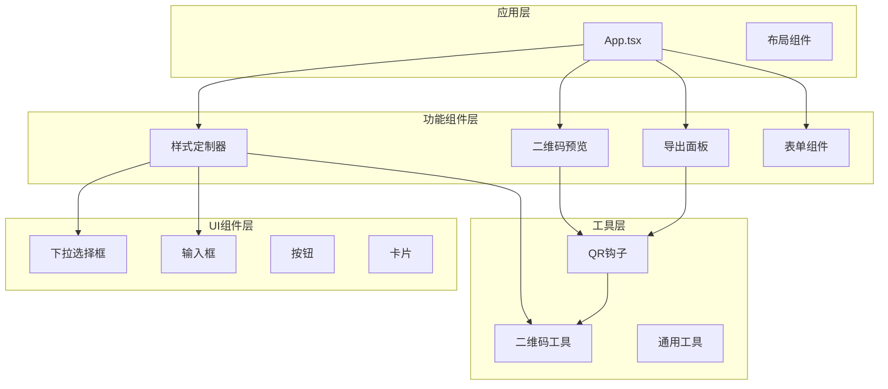
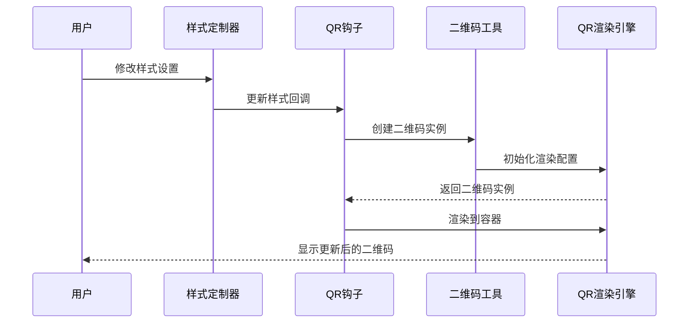
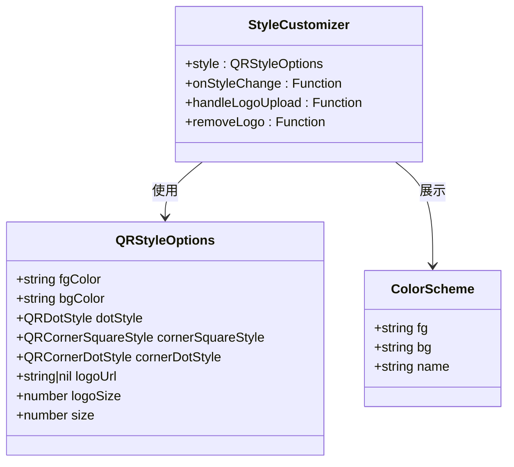
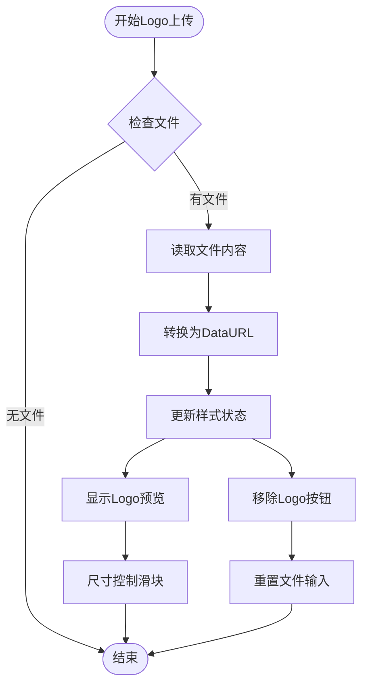
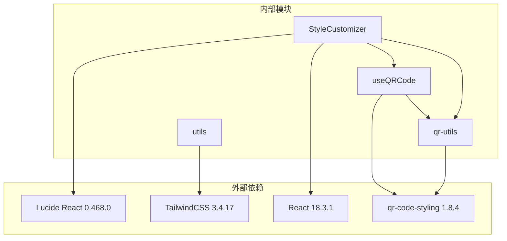

# 样式定制系统

<cite>
**本文档引用的文件**
- [src/components/StyleCustomizer.tsx](file://src/components/StyleCustomizer.tsx)
- [src/lib/qr-utils.ts](file://src/lib/qr-utils.ts)
- [src/hooks/useQRCode.ts](file://src/hooks/useQRCode.ts)
- [src/components/QRPreview.tsx](file://src/components/QRPreview.tsx)
- [src/App.tsx](file://src/App.tsx)
- [src/components/ui/select.tsx](file://src/components/ui/select.tsx)
- [src/components/ui/input.tsx](file://src/components/ui/input.tsx)
- [src/components/ExportPanel.tsx](file://src/components/ExportPanel.tsx)
- [src/lib/utils.ts](file://src/lib/utils.ts)
- [package.json](file://package.json)
</cite>

## 目录
1. [简介](#简介)
2. [项目结构](#项目结构)
3. [核心组件](#核心组件)
4. [架构概览](#架构概览)
5. [详细组件分析](#详细组件分析)
6. [依赖关系分析](#依赖关系分析)
7. [性能考虑](#性能考虑)
8. [故障排除指南](#故障排除指南)
9. [结论](#结论)
10. [附录](#附录)

## 简介

QR码生成器的样式定制系统是一个完整的前端解决方案，允许用户自定义二维码的视觉外观。该系统提供了丰富的样式选项，包括颜色方案、形状样式、Logo集成和预设方案。通过直观的用户界面，用户可以实时预览和调整二维码的外观效果。

系统基于React和TypeScript构建，使用了现代化的前端开发技术栈，包括TailwindCSS用于样式管理、Lucide React图标库、以及QR Code Styling库进行实际的二维码渲染。

## 项目结构

该项目采用模块化的组件架构，主要分为以下几个层次：

**图表来源**
- [src/App.tsx:1-173](file://src/App.tsx#L1-L173)
- [src/components/StyleCustomizer.tsx:1-193](file://src/components/StyleCustomizer.tsx#L1-L193)
- [src/hooks/useQRCode.ts:1-75](file://src/hooks/useQRCode.ts#L1-L75)

**章节来源**
- [src/App.tsx:1-173](file://src/App.tsx#L1-L173)
- [package.json:1-37](file://package.json#L1-L37)

## 核心组件

样式定制系统的核心由以下关键组件构成：

### 样式定制器组件
样式定制器是用户界面的主要交互组件，负责提供所有样式定制选项。它支持：
- 颜色方案定制（前景色和背景色）
- 形状样式选择（码点样式、定位角样式、定位点样式）
- Logo上传和尺寸控制
- 预设配色方案

### QR码生成钩子
useQRCode钩子管理二维码的生成和更新逻辑，提供：
- 实时样式更新
- 导出功能（PNG和SVG格式）
- 二维码容器管理

### 二维码工具库
qr-utils模块提供核心的二维码生成逻辑和类型定义，包括：
- 样式选项接口定义
- 预设样式配置
- QR码生成函数

**章节来源**
- [src/components/StyleCustomizer.tsx:15-193](file://src/components/StyleCustomizer.tsx#L15-L193)
- [src/hooks/useQRCode.ts:5-75](file://src/hooks/useQRCode.ts#L5-L75)
- [src/lib/qr-utils.ts:14-151](file://src/lib/qr-utils.ts#L14-L151)

## 架构概览

样式定制系统采用分层架构设计，确保了良好的可维护性和扩展性：

**图表来源**
- [src/components/StyleCustomizer.tsx:31-33](file://src/components/StyleCustomizer.tsx#L31-L33)
- [src/hooks/useQRCode.ts:20-29](file://src/hooks/useQRCode.ts#L20-L29)
- [src/lib/qr-utils.ts:63-101](file://src/lib/qr-utils.ts#L63-L101)

系统架构的关键特点：
- **响应式设计**：所有样式更改都会实时反映在预览中
- **类型安全**：使用TypeScript确保类型安全
- **模块化**：每个组件职责明确，便于测试和维护
- **可扩展性**：易于添加新的样式选项和预设

## 详细组件分析

### 样式定制器组件分析

样式定制器组件是整个系统的核心交互界面，提供了完整的样式定制功能：

#### 颜色方案定制

系统支持两种颜色定制方式：

1. **预设配色方案**：提供8种精心设计的颜色组合
2. **自定义颜色**：支持任意RGB颜色值的输入和选择

**图表来源**
- [src/lib/qr-utils.ts:14-23](file://src/lib/qr-utils.ts#L14-L23)
- [src/components/StyleCustomizer.tsx:15-18](file://src/components/StyleCustomizer.tsx#L15-L18)

#### 形状样式选择

系统提供了多种形状样式供用户选择：

1. **码点样式**：控制二维码内部模块的形状
2. **定位角样式**：控制二维码角落装饰的形状  
3. **定位点样式**：控制角落定位点的形状

每种样式都有多个预设选项，从简单的圆形到复杂的几何形状。

#### Logo集成系统

Logo集成功能允许用户在二维码中心添加自定义Logo：

**图表来源**
- [src/components/StyleCustomizer.tsx:23-36](file://src/components/StyleCustomizer.tsx#L23-L36)
- [src/components/StyleCustomizer.tsx:136-189](file://src/components/StyleCustomizer.tsx#L136-L189)

**章节来源**
- [src/components/StyleCustomizer.tsx:40-193](file://src/components/StyleCustomizer.tsx#L40-L193)

### QR码生成钩子分析

useQRCode钩子提供了完整的二维码生命周期管理：

#### 核心功能

1. **样式状态管理**：维护当前的样式配置
2. **实时渲染**：当数据或样式发生变化时自动重新渲染
3. **导出功能**：支持PNG和SVG格式的导出
4. **容器管理**：管理二维码的DOM容器

#### 性能优化

钩子实现了多项性能优化措施：
- **记忆化计算**：使用useMemo避免不必要的重新计算
- **回调优化**：使用useCallback确保回调函数的稳定性
- **条件渲染**：只有在有有效数据时才创建二维码实例

**章节来源**
- [src/hooks/useQRCode.ts:1-75](file://src/hooks/useQRCode.ts#L1-L75)

### 二维码工具库分析

qr-utils模块提供了系统的核心功能：

#### 类型定义

系统定义了完整的类型体系：
- `QRStyleOptions`：样式配置接口
- `QRDotStyle`、`QRCornerSquareStyle`、`QRCornerDotStyle`：样式枚举类型
- 各种数据格式的类型定义

#### 预设配置

系统内置了丰富的预设配置：
- **预设颜色**：8种精心设计的颜色组合
- **样式选项**：码点、定位角、定位点的多种样式
- **导出尺寸**：支持256x256到2048x2048的多种尺寸

#### 生成逻辑

`createQRCode`函数实现了完整的二维码生成逻辑，包括：
- 基础配置设置
- Logo集成处理
- 错误纠正级别动态调整

**章节来源**
- [src/lib/qr-utils.ts:14-151](file://src/lib/qr-utils.ts#L14-L151)

## 依赖关系分析

样式定制系统依赖于多个外部库和内部模块：

**图表来源**
- [package.json:11-24](file://package.json#L11-L24)
- [src/components/StyleCustomizer.tsx:1-13](file://src/components/StyleCustomizer.tsx#L1-L13)

### 关键依赖说明

1. **React生态系统**：提供组件基础和状态管理
2. **QR Code Styling**：核心二维码渲染引擎
3. **TailwindCSS**：提供实用的样式类和响应式设计
4. **Lucide React**：提供高质量的图标组件

**章节来源**
- [package.json:11-37](file://package.json#L11-L37)

## 性能考虑

样式定制系统在设计时充分考虑了性能优化：

### 渲染优化

1. **条件渲染**：只有在有有效数据时才渲染二维码
2. **记忆化**：使用useMemo避免重复计算
3. **回调稳定化**：使用useCallback确保回调函数引用稳定

### 内存管理

1. **资源清理**：在组件卸载时清理DOM节点
2. **状态最小化**：只存储必要的样式状态
3. **事件处理优化**：避免不必要的事件监听器

### 用户体验优化

1. **即时反馈**：样式更改立即反映在预览中
2. **加载状态**：导出操作时显示加载状态
3. **错误处理**：优雅地处理各种异常情况

## 故障排除指南

### 常见问题及解决方案

#### Logo无法显示

**问题描述**：上传Logo后无法在二维码中显示

**可能原因**：
1. Logo文件格式不支持
2. Logo尺寸过大影响二维码识别
3. CORS跨域问题

**解决方案**：
1. 确保上传PNG、JPG等支持的格式
2. 调整Logo大小到合理范围（建议20%-50%）
3. 确保Logo图片没有跨域限制

#### 颜色显示异常

**问题描述**：自定义颜色无法正确显示

**可能原因**：
1. 颜色值格式不正确
2. 颜色对比度不足
3. 浏览器兼容性问题

**解决方案**：
1. 使用标准的十六进制颜色值（如#6C3AED）
2. 确保前景色和背景色有足够的对比度
3. 在不同浏览器中测试颜色显示

#### 导出失败

**问题描述**：下载二维码图片失败

**可能原因**：
1. 浏览器阻止弹窗
2. 文件名冲突
3. 内存不足

**解决方案**：
1. 允许浏览器弹窗权限
2. 更改文件名或保存位置
3. 尝试较小的导出尺寸

**章节来源**
- [src/components/StyleCustomizer.tsx:23-36](file://src/components/StyleCustomizer.tsx#L23-L36)
- [src/hooks/useQRCode.ts:35-62](file://src/hooks/useQRCode.ts#L35-L62)

## 结论

QR码生成器的样式定制系统是一个功能完整、设计精良的前端解决方案。系统通过模块化的架构设计、完善的类型系统和丰富的用户界面，为用户提供了灵活而强大的二维码定制能力。

系统的主要优势包括：
- **易用性**：直观的用户界面和实时预览功能
- **灵活性**：丰富的样式选项和自定义能力
- **性能**：优化的渲染和内存管理
- **可扩展性**：清晰的架构便于功能扩展

未来可以考虑的功能增强：
- 添加更多的预设样式模板
- 支持渐变色和图案填充
- 提供批量样式应用功能
- 增强移动端适配

## 附录

### 样式配置接口详细说明

#### QRStyleOptions接口

| 属性名 | 类型 | 默认值 | 描述 |
|--------|------|--------|------|
| fgColor | string | "#6C3AED" | 前景色（二维码主体颜色） |
| bgColor | string | "#FFFFFF" | 背景色（二维码背景颜色） |
| dotStyle | QRDotStyle | "rounded" | 码点样式类型 |
| cornerSquareStyle | QRCornerSquareStyle | "extra-rounded" | 定位角样式类型 |
| cornerDotStyle | QRCornerDotStyle | "dot" | 定位点样式类型 |
| logoUrl | string \| null | null | Logo图片URL |
| logoSize | number | 0.4 | Logo相对于二维码的比例（0.2-0.5） |
| size | number | 300 | 二维码尺寸（像素） |

#### 预设样式选项

**码点样式**：
- rounded：圆角矩形
- dots：圆形点
- classy：经典样式
- classy-rounded：经典圆角
- square：方形
- extra-rounded：超圆角

**定位角样式**：
- extra-rounded：超圆角
- dot：圆点
- square：方形

**定位点样式**：
- dot：圆点
- square：方形

**预设颜色方案**：
- 靛蓝：#6C3AED/#FFFFFF
- 天蓝：#0EA5E9/#FFFFFF
- 翠绿：#10B981/#FFFFFF
- 琥珀：#F59E0B/#FFFFFF
- 赤红：#EF4444/#FFFFFF
- 粉红：#EC4899/#FFFFFF
- 深夜：#1E1B4B/#FFFFFF
- 反转：#FFFFFF/#1E1B4B

### 最佳实践建议

#### 颜色搭配建议

1. **高对比度原则**：确保前景色和背景色有足够的对比度
2. **品牌一致性**：使用符合品牌形象的颜色方案
3. **可访问性考虑**：避免使用难以区分的颜色组合
4. **色彩心理学**：根据应用场景选择合适的颜色

#### Logo集成最佳实践

1. **尺寸控制**：Logo大小控制在20%-50%之间
2. **透明度处理**：确保Logo具有适当的透明度
3. **文件格式**：优先使用PNG格式以获得最佳质量
4. **版权注意**：确保使用的Logo拥有合法使用权

#### 性能优化建议

1. **及时清理**：及时移除不需要的样式设置
2. **合理导出**：根据用途选择合适的导出尺寸
3. **缓存策略**：利用浏览器缓存减少重复加载
4. **懒加载**：对于大量二维码场景考虑懒加载