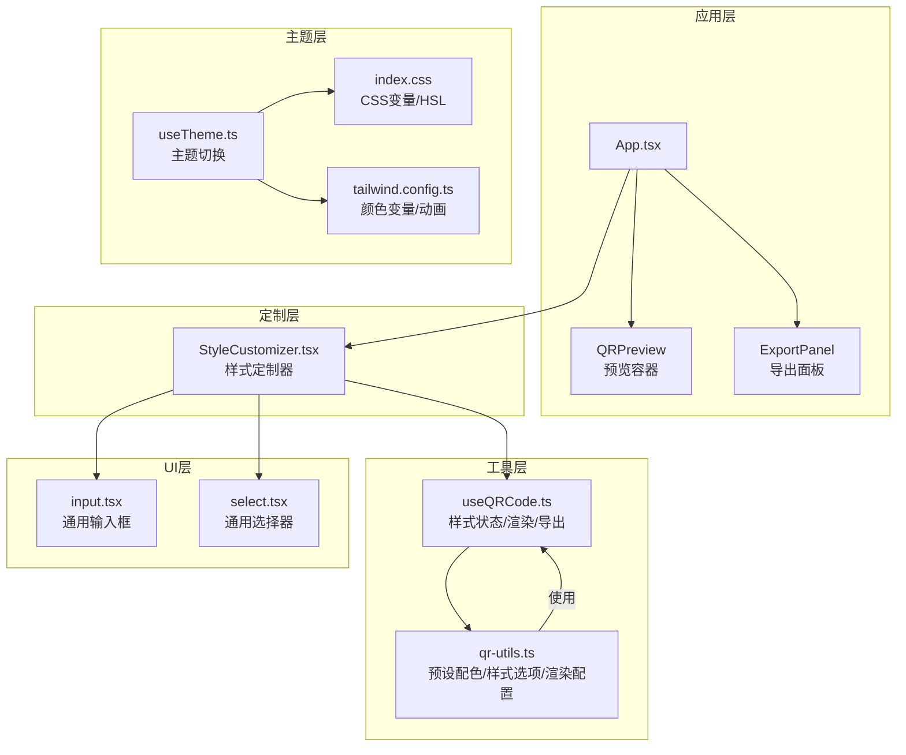
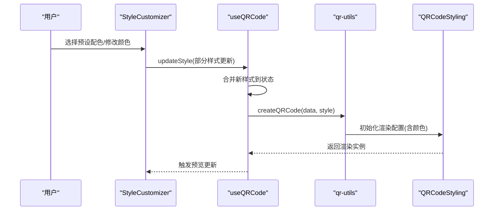
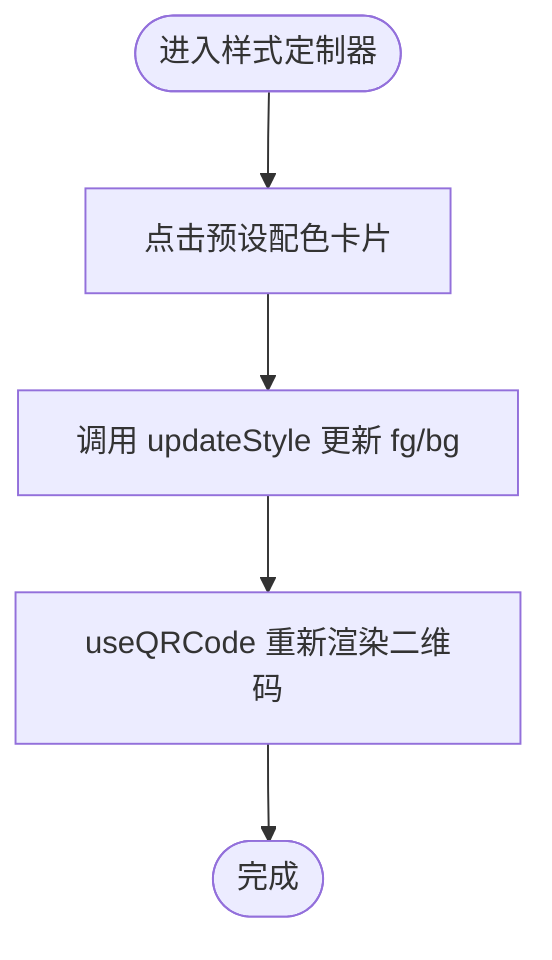
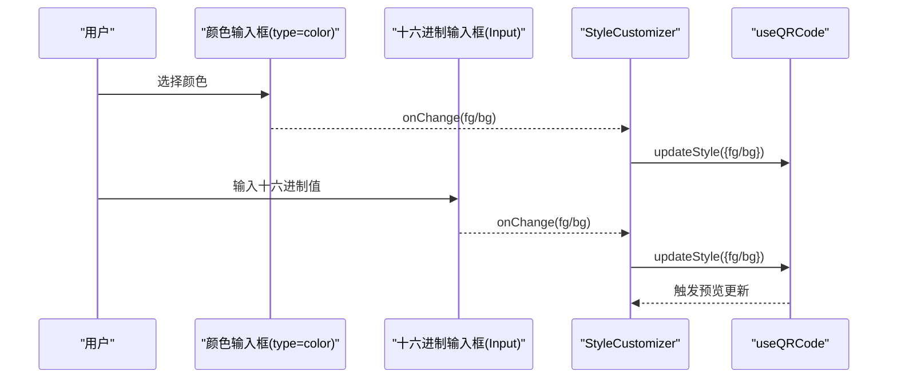
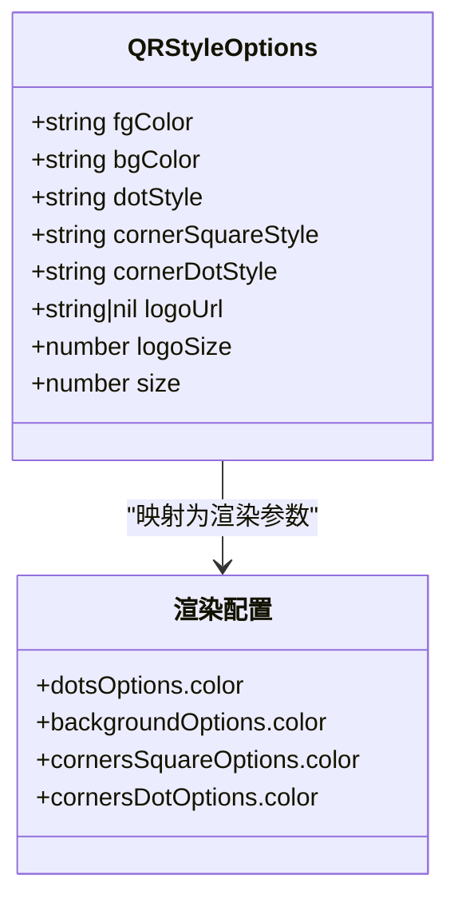
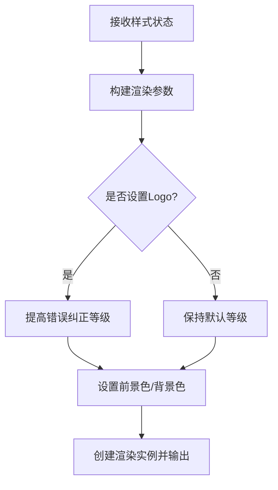
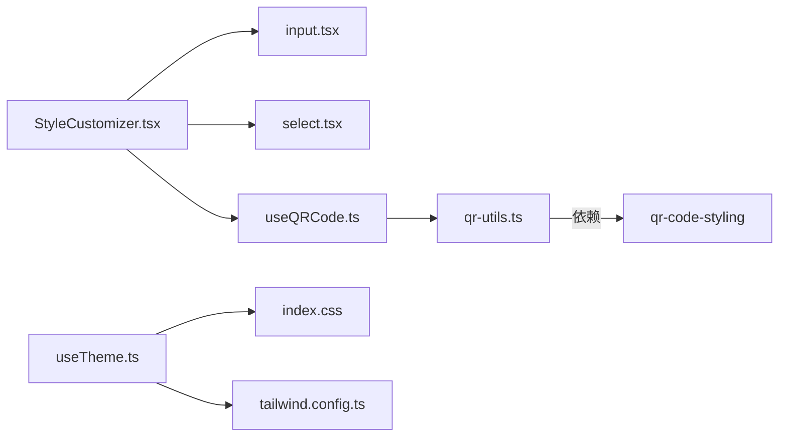

# 颜色方案

<cite>
**本文引用的文件**
- [StyleCustomizer.tsx](file://src/components/StyleCustomizer.tsx)
- [qr-utils.ts](file://src/lib/qr-utils.ts)
- [useQRCode.ts](file://src/hooks/useQRCode.ts)
- [App.tsx](file://src/App.tsx)
- [index.css](file://src/index.css)
- [tailwind.config.ts](file://tailwind.config.ts)
- [input.tsx](file://src/components/ui/input.tsx)
- [select.tsx](file://src/components/ui/select.tsx)
- [useTheme.ts](file://src/hooks/useTheme.ts)
- [package.json](file://package.json)
</cite>

## 目录
1. [简介](#简介)
2. [项目结构](#项目结构)
3. [核心组件](#核心组件)
4. [架构总览](#架构总览)
5. [详细组件分析](#详细组件分析)
6. [依赖关系分析](#依赖关系分析)
7. [性能考量](#性能考量)
8. [故障排查指南](#故障排查指南)
9. [结论](#结论)
10. [附录](#附录)

## 简介
本章节面向QR码生成器的颜色方案系统，系统性阐述预设配色方案的实现机制、自定义颜色选择器的工作原理，以及颜色值在二维码渲染中的应用方式。文档同时提供颜色搭配最佳实践与无障碍设计建议，帮助开发者与设计师在保证可用性的前提下，实现美观且专业的二维码外观。

## 项目结构
颜色方案系统主要由以下模块构成：
- 样式定制组件：负责预设配色展示、自定义颜色输入与交互。
- 颜色与样式工具：定义预设配色、默认样式、样式选项与二维码渲染配置。
- 钩子：管理二维码样式状态、响应式更新与导出。
- 主应用：组织输入表单、样式定制面板与预览导出区域。
- UI组件：输入框与选择器等基础控件。
- 主题与样式：Tailwind变量与暗色模式支持。

图表来源
- [App.tsx:118-129](file://src/App.tsx#L118-L129)
- [StyleCustomizer.tsx:15-193](file://src/components/StyleCustomizer.tsx#L15-L193)
- [qr-utils.ts:141-150](file://src/lib/qr-utils.ts#L141-L150)
- [useQRCode.ts:5-29](file://src/hooks/useQRCode.ts#L5-L29)
- [input.tsx:1-25](file://src/components/ui/input.tsx#L1-L25)
- [select.tsx:1-31](file://src/components/ui/select.tsx#L1-L31)
- [useTheme.ts:1-26](file://src/hooks/useTheme.ts#L1-L26)
- [tailwind.config.ts:15-54](file://tailwind.config.ts#L15-L54)
- [index.css:5-84](file://src/index.css#L5-L84)

章节来源
- [App.tsx:118-129](file://src/App.tsx#L118-L129)
- [StyleCustomizer.tsx:15-193](file://src/components/StyleCustomizer.tsx#L15-L193)
- [qr-utils.ts:141-150](file://src/lib/qr-utils.ts#L141-L150)
- [useQRCode.ts:5-29](file://src/hooks/useQRCode.ts#L5-L29)
- [input.tsx:1-25](file://src/components/ui/input.tsx#L1-L25)
- [select.tsx:1-31](file://src/components/ui/select.tsx#L1-L31)
- [useTheme.ts:1-26](file://src/hooks/useTheme.ts#L1-L26)
- [tailwind.config.ts:15-54](file://tailwind.config.ts#L15-L54)
- [index.css:5-84](file://src/index.css#L5-L84)

## 核心组件
- 预设配色方案：8组RGB值定义，覆盖品牌主色、自然色系与反转配色，便于快速选择。
- 自定义颜色选择器：提供颜色输入框与十六进制输入框，支持实时预览与同步更新。
- 样式选项：码点样式、定位角样式与定位点样式，配合前景色/背景色共同决定视觉效果。
- 渲染配置：将样式映射到二维码渲染参数，确保颜色在最终输出中正确呈现。

章节来源
- [qr-utils.ts:141-150](file://src/lib/qr-utils.ts#L141-L150)
- [StyleCustomizer.tsx:40-104](file://src/components/StyleCustomizer.tsx#L40-L104)
- [qr-utils.ts:114-132](file://src/lib/qr-utils.ts#L114-L132)
- [qr-utils.ts:63-101](file://src/lib/qr-utils.ts#L63-L101)

## 架构总览
颜色方案系统采用“状态驱动渲染”的架构：
- 应用层通过钩子维护样式状态，样式变更触发二维码重新渲染。
- 定制器负责收集用户输入（预设/自定义颜色、样式选项），并通过回调更新样式状态。
- 工具层提供预设配色、样式选项与渲染配置，确保颜色与样式的一致性。
- UI层提供统一的输入控件，保证交互一致性与可访问性。

图表来源
- [StyleCustomizer.tsx:47-56](file://src/components/StyleCustomizer.tsx#L47-L56)
- [StyleCustomizer.tsx:73-84](file://src/components/StyleCustomizer.tsx#L73-L84)
- [StyleCustomizer.tsx:89-102](file://src/components/StyleCustomizer.tsx#L89-L102)
- [useQRCode.ts:31-33](file://src/hooks/useQRCode.ts#L31-L33)
- [qr-utils.ts:63-101](file://src/lib/qr-utils.ts#L63-L101)

## 详细组件分析

### 预设配色方案
- 颜色定义：系统提供8组预设配色，每组包含前景色与背景色，名称用于UI展示。
- 视觉效果：预设覆盖从品牌主色到自然色系，满足不同场景需求；反转配色适用于深色主题或特殊风格。
- 交互逻辑：点击预设按钮后，样式状态同时更新前景色与背景色，选中项高亮显示。

图表来源
- [StyleCustomizer.tsx:47-56](file://src/components/StyleCustomizer.tsx#L47-L56)
- [qr-utils.ts:141-150](file://src/lib/qr-utils.ts#L141-L150)
- [useQRCode.ts:31-33](file://src/hooks/useQRCode.ts#L31-L33)

章节来源
- [qr-utils.ts:141-150](file://src/lib/qr-utils.ts#L141-L150)
- [StyleCustomizer.tsx:40-66](file://src/components/StyleCustomizer.tsx#L40-L66)

### 自定义颜色选择器
- 颜色输入框：HTML原生颜色选择器，支持平台级颜色选择体验。
- 十六进制输入框：文本输入框，支持手动粘贴十六进制颜色值。
- 交互逻辑：两者双向绑定，任一输入都会触发样式更新回调，确保颜色值一致。
- 前景色与背景色：分别独立控制，便于实现对比度优化与主题适配。

图表来源
- [StyleCustomizer.tsx:73-84](file://src/components/StyleCustomizer.tsx#L73-L84)
- [StyleCustomizer.tsx:89-102](file://src/components/StyleCustomizer.tsx#L89-L102)
- [input.tsx:7-20](file://src/components/ui/input.tsx#L7-L20)

章节来源
- [StyleCustomizer.tsx:68-104](file://src/components/StyleCustomizer.tsx#L68-L104)
- [input.tsx:7-20](file://src/components/ui/input.tsx#L7-L20)

### 样式选项与颜色应用
- 码点样式：控制二维码内部码点的形状与风格，影响整体密度与质感。
- 定位角样式与定位点样式：控制二维码四个角的装饰与细节，提升辨识度。
- 颜色应用：前景色用于码点与角部装饰，背景色用于整体背景；二者共同决定对比度与可读性。

图表来源
- [qr-utils.ts:14-23](file://src/lib/qr-utils.ts#L14-L23)
- [qr-utils.ts:63-101](file://src/lib/qr-utils.ts#L63-L101)

章节来源
- [qr-utils.ts:114-132](file://src/lib/qr-utils.ts#L114-L132)
- [qr-utils.ts:63-101](file://src/lib/qr-utils.ts#L63-L101)

### 颜色值在二维码渲染中的应用
- 渲染入口：通过工具函数创建二维码渲染实例，传入当前样式。
- 参数映射：样式中的前景色与背景色分别映射到码点、角部与背景的渲染参数。
- 错误纠正等级：当存在Logo时自动提高错误纠正等级，保证二维码在叠加Logo后的可读性。

图表来源
- [qr-utils.ts:63-101](file://src/lib/qr-utils.ts#L63-L101)

章节来源
- [qr-utils.ts:63-101](file://src/lib/qr-utils.ts#L63-L101)
- [useQRCode.ts:20-26](file://src/hooks/useQRCode.ts#L20-L26)

## 依赖关系分析
- 组件耦合：样式定制器依赖UI组件与工具层；钩子负责状态与渲染；工具层封装渲染配置。
- 外部依赖：使用二维码渲染库进行实际绘制，Tailwind提供主题与样式变量。
- 潜在循环：当前结构无明显循环依赖，模块职责清晰。

图表来源
- [StyleCustomizer.tsx:1-12](file://src/components/StyleCustomizer.tsx#L1-L12)
- [useQRCode.ts:1-3](file://src/hooks/useQRCode.ts#L1-L3)
- [qr-utils.ts:1-6](file://src/lib/qr-utils.ts#L1-L6)
- [useTheme.ts:1-26](file://src/hooks/useTheme.ts#L1-L26)
- [index.css:1-84](file://src/index.css#L1-L84)
- [tailwind.config.ts:1-107](file://tailwind.config.ts#L1-L107)
- [package.json:20](file://package.json#L20)

章节来源
- [StyleCustomizer.tsx:1-12](file://src/components/StyleCustomizer.tsx#L1-L12)
- [useQRCode.ts:1-3](file://src/hooks/useQRCode.ts#L1-L3)
- [qr-utils.ts:1-6](file://src/lib/qr-utils.ts#L1-L6)
- [useTheme.ts:1-26](file://src/hooks/useTheme.ts#L1-L26)
- [index.css:1-84](file://src/index.css#L1-L84)
- [tailwind.config.ts:1-107](file://tailwind.config.ts#L1-L107)
- [package.json:20](file://package.json#L20)

## 性能考量
- 渲染优化：仅在数据或样式变化时重建渲染实例，避免不必要的重绘。
- 导出性能：导出时按指定尺寸创建临时渲染实例，避免污染主预览状态。
- 交互流畅：颜色输入与样式切换采用防抖策略，减少频繁重渲染。

章节来源
- [useQRCode.ts:11-29](file://src/hooks/useQRCode.ts#L11-L29)
- [useQRCode.ts:35-62](file://src/hooks/useQRCode.ts#L35-L62)

## 故障排查指南
- 颜色不生效
  - 检查样式状态是否正确更新（确认回调是否被调用）。
  - 确认渲染配置中颜色字段是否正确映射。
- 预设配色未选中
  - 检查当前样式与预设是否完全匹配（fg/bg同时一致）。
- Logo叠加导致识别困难
  - 提升错误纠正等级，适当调整Logo尺寸与位置。
- 暗色模式下对比度不足
  - 使用反转配色或调整前景/背景色，确保对比度符合标准。

章节来源
- [StyleCustomizer.tsx:47-56](file://src/components/StyleCustomizer.tsx#L47-L56)
- [qr-utils.ts:63-101](file://src/lib/qr-utils.ts#L63-L101)
- [useTheme.ts:14-20](file://src/hooks/useTheme.ts#L14-L20)

## 结论
颜色方案系统通过“预设配色 + 自定义颜色 + 样式选项”的组合，实现了灵活而一致的二维码外观定制能力。借助状态驱动的渲染机制与清晰的模块划分，系统在保证易用性的同时兼顾了性能与可维护性。结合无障碍设计建议与最佳实践，可进一步提升二维码在不同场景下的可用性与专业度。

## 附录

### 预设配色清单与视觉效果
- 靛蓝：前景色为品牌主色，背景为纯白，适合科技感与专业场景。
- 天蓝：冷色调，适合清新与商务风格。
- 翠绿：自然健康，适合生态与健康类主题。
- 琥珀：温暖中性，适合品牌与日常场景。
- 赤红：醒目警示，适合促销与活动场景。
- 粉红：柔和女性化，适合社交与生活方式主题。
- 深夜：深色背景配浅色前景，适合夜间或暗色主题。
- 反转：前景为白色、背景为深色，适合深色模式与高对比场景。

章节来源
- [qr-utils.ts:141-150](file://src/lib/qr-utils.ts#L141-L150)

### 自定义颜色输入框与十六进制输入
- 颜色输入框：提供平台级颜色选择器，便于直观选取。
- 十六进制输入框：支持手动输入，便于精确控制颜色值。
- 交互一致性：两者均通过回调更新样式状态，确保颜色值同步。

章节来源
- [StyleCustomizer.tsx:73-84](file://src/components/StyleCustomizer.tsx#L73-L84)
- [StyleCustomizer.tsx:89-102](file://src/components/StyleCustomizer.tsx#L89-L102)
- [input.tsx:7-20](file://src/components/ui/input.tsx#L7-L20)

### 前景色与背景色配置方法
- 前景色：用于码点与角部装饰，应与背景形成足够对比度。
- 背景色：用于整体背景，建议与前景色形成至少4.5:1的对比度（AA级别）。
- 配置入口：在样式定制器中分别选择前景色与背景色，或使用预设配色一键应用。

章节来源
- [StyleCustomizer.tsx:68-104](file://src/components/StyleCustomizer.tsx#L68-L104)
- [qr-utils.ts:141-150](file://src/lib/qr-utils.ts#L141-L150)

### 颜色搭配最佳实践
- 对比度优先：确保前景与背景对比度满足WCAG AA及以上。
- 场景适配：根据用途选择合适的色彩语义（科技、自然、警示等）。
- 一致性：在品牌体系内统一使用预设配色，保持视觉一致性。
- 可访问性：避免使用仅靠颜色区分的信息，辅以形状或标签。

### 无障碍设计建议
- 颜色对比度：遵循WCAG 2.1 AA/AAA标准，确保文字与背景对比度充足。
- 颜色无关信息：不要仅依赖颜色传达关键信息，应结合形状、图标或文本。
- 深色模式支持：提供反转配色与暗色主题适配，保障在低光环境下的可读性。
- 主题切换：通过主题钩子实现明暗模式切换，自动调整颜色变量。

章节来源
- [useTheme.ts:14-20](file://src/hooks/useTheme.ts#L14-L20)
- [index.css:46-75](file://src/index.css#L46-L75)
- [tailwind.config.ts:15-54](file://tailwind.config.ts#L15-L54)