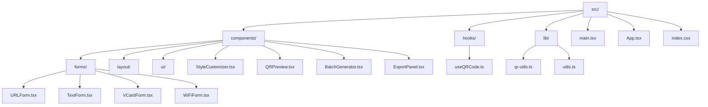
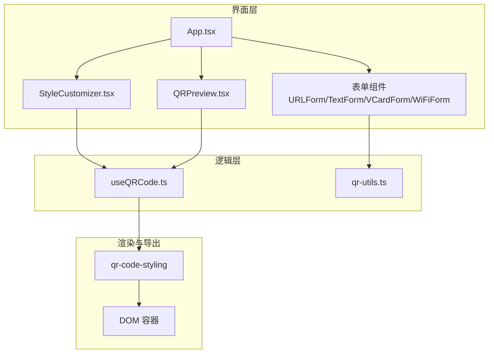
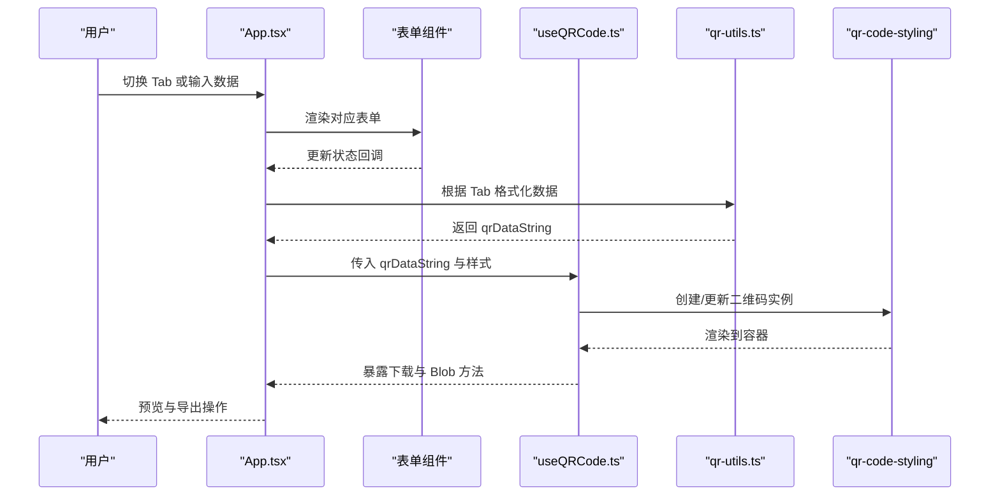
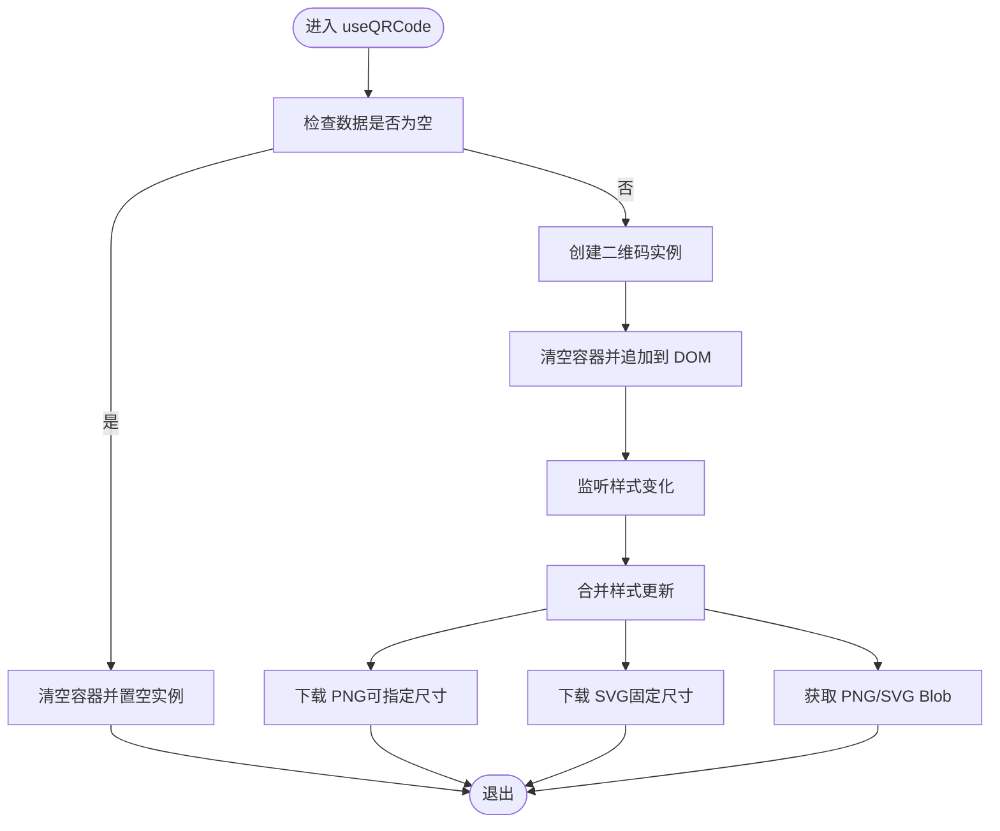
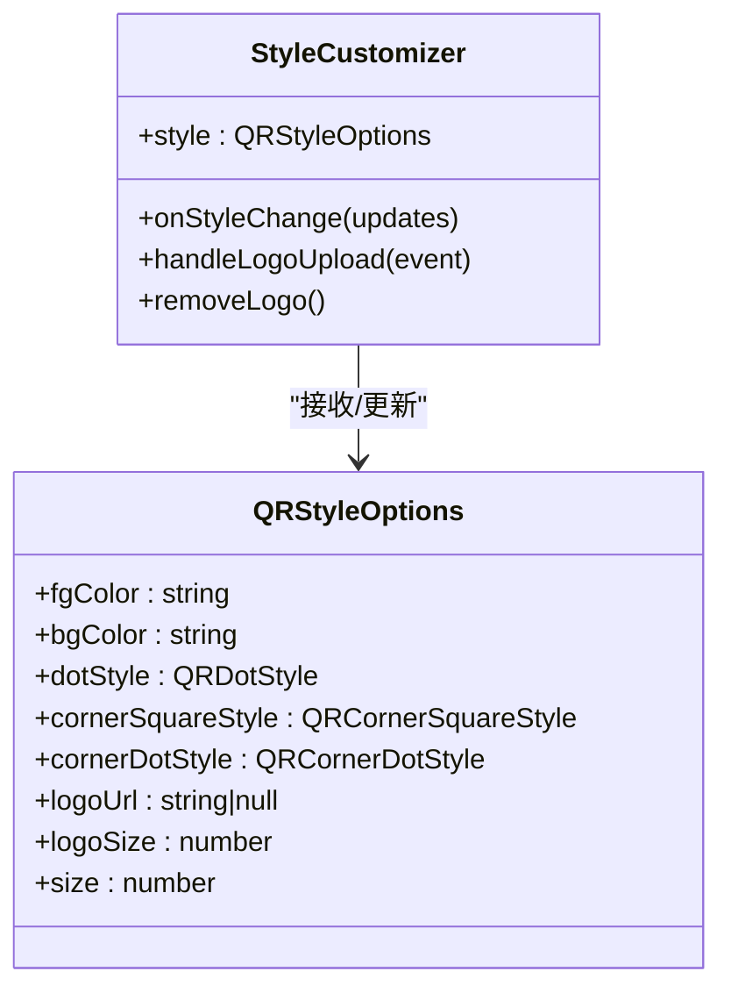
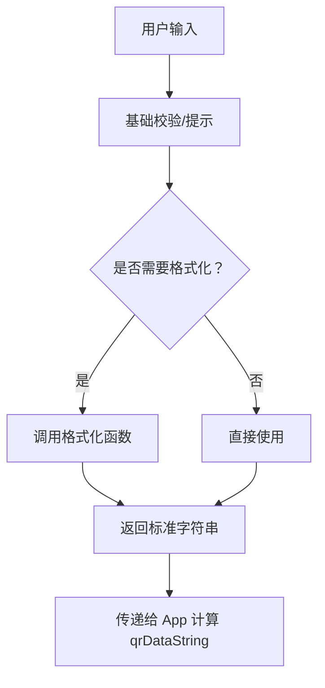
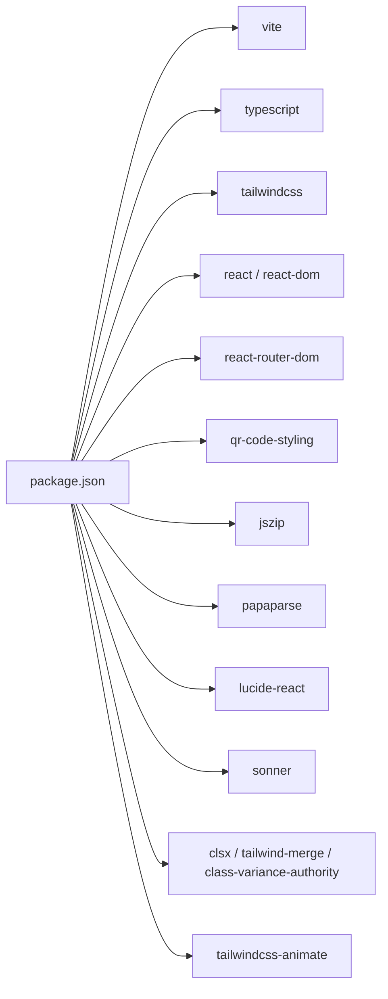

# 开发指南

<cite>
**本文引用的文件**
- [package.json](file://package.json)
- [vite.config.ts](file://vite.config.ts)
- [tsconfig.json](file://tsconfig.json)
- [tsconfig.app.json](file://tsconfig.app.json)
- [tailwind.config.ts](file://tailwind.config.ts)
- [src/index.css](file://src/index.css)
- [.gitignore](file://.gitignore)
- [src/main.tsx](file://src/main.tsx)
- [src/App.tsx](file://src/App.tsx)
- [src/hooks/useQRCode.ts](file://src/hooks/useQRCode.ts)
- [src/lib/qr-utils.ts](file://src/lib/qr-utils.ts)
- [src/components/forms/URLForm.tsx](file://src/components/forms/URLForm.tsx)
- [src/components/forms/TextForm.tsx](file://src/components/forms/TextForm.tsx)
- [src/components/forms/VCardForm.tsx](file://src/components/forms/VCardForm.tsx)
- [src/components/forms/WiFiForm.tsx](file://src/components/forms/WiFiForm.tsx)
- [src/components/StyleCustomizer.tsx](file://src/components/StyleCustomizer.tsx)
- [src/components/QRPreview.tsx](file://src/components/QRPreview.tsx)
- [src/components/ui/button.tsx](file://src/components/ui/button.tsx)
- [src/components/ui/input.tsx](file://src/components/ui/input.tsx)
</cite>

## 目录
1. [简介](#简介)
2. [项目结构](#项目结构)
3. [核心组件](#核心组件)
4. [架构总览](#架构总览)
5. [详细组件分析](#详细组件分析)
6. [依赖关系分析](#依赖关系分析)
7. [性能考虑](#性能考虑)
8. [故障排查指南](#故障排查指南)
9. [结论](#结论)
10. [附录](#附录)

## 简介
本指南面向参与 QR 码生成器项目的开发者，提供从环境搭建、代码规范、测试策略、Git 工作流到性能优化与调试的完整实践建议。项目采用 React + TypeScript + Vite + TailwindCSS 技术栈，使用 qr-code-styling 进行二维码渲染，支持多种数据类型（URL、文本、VCard、WiFi）与样式定制，具备 PNG/SVG 导出能力。

## 项目结构
项目采用按功能域分层的目录组织方式：组件、Hooks、工具库、入口与样式资源分离清晰，便于维护与扩展。

图表来源
- [src/main.tsx:1-11](file://src/main.tsx#L1-L11)
- [src/App.tsx:1-173](file://src/App.tsx#L1-L173)
- [src/components/forms/URLForm.tsx:1-33](file://src/components/forms/URLForm.tsx#L1-L33)
- [src/components/forms/TextForm.tsx:1-28](file://src/components/forms/TextForm.tsx#L1-L28)
- [src/components/forms/VCardForm.tsx:1-92](file://src/components/forms/VCardForm.tsx#L1-L92)
- [src/components/forms/WiFiForm.tsx:1-67](file://src/components/forms/WiFiForm.tsx#L1-L67)
- [src/components/StyleCustomizer.tsx:1-193](file://src/components/StyleCustomizer.tsx#L1-L193)
- [src/components/QRPreview.tsx:1-45](file://src/components/QRPreview.tsx#L1-L45)
- [src/hooks/useQRCode.ts:1-75](file://src/hooks/useQRCode.ts#L1-L75)
- [src/lib/qr-utils.ts:1-151](file://src/lib/qr-utils.ts#L1-L151)

章节来源
- [src/main.tsx:1-11](file://src/main.tsx#L1-L11)
- [src/App.tsx:1-173](file://src/App.tsx#L1-L173)

## 核心组件
- 应用入口与路由：通过 main.tsx 渲染根组件 App；App 负责状态管理、Tab 切换、表单与样式面板、预览与导出区域的编排。
- Hooks：useQRCode 提供二维码实例生命周期管理、样式更新、下载与 Blob 获取等能力。
- 工具库：qr-utils 定义二维码数据类型、样式选项、格式化函数与默认样式配置。
- 表单组件：URLForm、TextForm、VCardForm、WiFiForm 分别处理不同数据类型的输入与校验提示。
- UI 组件：button、input 等基于 cva 的可变式组件，配合 Tailwind 变量实现主题化与动效。
- 预览与导出：QRPreview 展示 SVG/Canvas 输出；StyleCustomizer 提供颜色、形状、Logo 等样式定制。

章节来源
- [src/App.tsx:1-173](file://src/App.tsx#L1-L173)
- [src/hooks/useQRCode.ts:1-75](file://src/hooks/useQRCode.ts#L1-L75)
- [src/lib/qr-utils.ts:1-151](file://src/lib/qr-utils.ts#L1-L151)
- [src/components/forms/URLForm.tsx:1-33](file://src/components/forms/URLForm.tsx#L1-L33)
- [src/components/forms/TextForm.tsx:1-28](file://src/components/forms/TextForm.tsx#L1-L28)
- [src/components/forms/VCardForm.tsx:1-92](file://src/components/forms/VCardForm.tsx#L1-L92)
- [src/components/forms/WiFiForm.tsx:1-67](file://src/components/forms/WiFiForm.tsx#L1-L67)
- [src/components/StyleCustomizer.tsx:1-193](file://src/components/StyleCustomizer.tsx#L1-L193)
- [src/components/QRPreview.tsx:1-45](file://src/components/QRPreview.tsx#L1-L45)
- [src/components/ui/button.tsx:1-51](file://src/components/ui/button.tsx#L1-L51)
- [src/components/ui/input.tsx:1-25](file://src/components/ui/input.tsx#L1-L25)

## 架构总览
应用采用“容器组件 + 业务组件 + Hooks + 工具库”的分层架构，数据从表单流向 qr-utils 格式化，再由 useQRCode 驱动 qr-code-styling 渲染，最终在 QRPreview 中展示，并支持导出。

图表来源
- [src/App.tsx:1-173](file://src/App.tsx#L1-L173)
- [src/hooks/useQRCode.ts:1-75](file://src/hooks/useQRCode.ts#L1-L75)
- [src/lib/qr-utils.ts:1-151](file://src/lib/qr-utils.ts#L1-L151)
- [src/components/QRPreview.tsx:1-45](file://src/components/QRPreview.tsx#L1-L45)
- [src/components/StyleCustomizer.tsx:1-193](file://src/components/StyleCustomizer.tsx#L1-L193)

## 详细组件分析

### 组件：App（应用主容器）
职责
- 维护活动 Tab 与各表单状态
- 计算当前二维码数据字符串
- 调用 useQRCode 管理样式与导出
- 渲染头部、导航、输入区、样式区、预览区与导出区

关键交互
- Tab 切换驱动表单渲染
- 各表单值变化影响 qrDataString
- useQRCode 响应数据与样式变更，更新 DOM 容器

图表来源
- [src/App.tsx:1-173](file://src/App.tsx#L1-L173)
- [src/hooks/useQRCode.ts:1-75](file://src/hooks/useQRCode.ts#L1-L75)
- [src/lib/qr-utils.ts:1-151](file://src/lib/qr-utils.ts#L1-L151)

章节来源
- [src/App.tsx:1-173](file://src/App.tsx#L1-L173)

### 组件：useQRCode（二维码逻辑钩子）
职责
- 基于数据与样式创建/更新二维码实例
- 管理容器引用，向容器追加渲染节点
- 提供样式更新、PNG/SVG 下载、原始 Blob 获取等方法

复杂度与性能
- 依赖 useEffect 监听数据与样式变化，避免重复创建实例
- 下载与 Blob 获取根据尺寸动态构造临时实例，注意内存占用

图表来源
- [src/hooks/useQRCode.ts:1-75](file://src/hooks/useQRCode.ts#L1-L75)

章节来源
- [src/hooks/useQRCode.ts:1-75](file://src/hooks/useQRCode.ts#L1-L75)

### 组件：StyleCustomizer（样式定制器）
职责
- 颜色选择与预设配色切换
- 码点/定位角样式选择
- Logo 上传、移除与大小调节
- 将样式变更回调给父组件

图表来源
- [src/components/StyleCustomizer.tsx:1-193](file://src/components/StyleCustomizer.tsx#L1-L193)
- [src/lib/qr-utils.ts:14-23](file://src/lib/qr-utils.ts#L14-L23)

章节来源
- [src/components/StyleCustomizer.tsx:1-193](file://src/components/StyleCustomizer.tsx#L1-L193)
- [src/lib/qr-utils.ts:14-23](file://src/lib/qr-utils.ts#L14-L23)

### 组件：表单组件（URL/Text/VCard/WiFi）
职责
- 输入验证与提示文案
- 将用户输入转换为内部状态
- VCard/WiFi 使用格式化函数生成标准字符串

图表来源
- [src/components/forms/URLForm.tsx:1-33](file://src/components/forms/URLForm.tsx#L1-L33)
- [src/components/forms/TextForm.tsx:1-28](file://src/components/forms/TextForm.tsx#L1-L28)
- [src/components/forms/VCardForm.tsx:1-92](file://src/components/forms/VCardForm.tsx#L1-L92)
- [src/components/forms/WiFiForm.tsx:1-67](file://src/components/forms/WiFiForm.tsx#L1-L67)
- [src/lib/qr-utils.ts:42-61](file://src/lib/qr-utils.ts#L42-L61)

章节来源
- [src/components/forms/URLForm.tsx:1-33](file://src/components/forms/URLForm.tsx#L1-L33)
- [src/components/forms/TextForm.tsx:1-28](file://src/components/forms/TextForm.tsx#L1-L28)
- [src/components/forms/VCardForm.tsx:1-92](file://src/components/forms/VCardForm.tsx#L1-L92)
- [src/components/forms/WiFiForm.tsx:1-67](file://src/components/forms/WiFiForm.tsx#L1-L67)
- [src/lib/qr-utils.ts:42-61](file://src/lib/qr-utils.ts#L42-L61)

### 组件：QRPreview（二维码预览）
职责
- 在容器中渲染二维码或占位提示
- 根据是否有数据切换样式与可见性

章节来源
- [src/components/QRPreview.tsx:1-45](file://src/components/QRPreview.tsx#L1-L45)

## 依赖关系分析
- 构建与运行时
  - Vite 作为开发服务器与打包工具，配置了 React 插件与路径别名
  - TypeScript 用于类型安全与构建
  - TailwindCSS 提供原子化样式与暗色模式支持
- 运行时依赖
  - React 生态与路由
  - qr-code-styling 负责二维码绘制
  - jszip、papaparse 用于导出与 CSV 处理
  - lucide-react、sonner 提供图标与通知
  - clsx、class-variance-authority、tailwind-merge、tailwindcss-animate 提升样式组合与动画体验

图表来源
- [package.json:1-37](file://package.json#L1-L37)

章节来源
- [package.json:1-37](file://package.json#L1-L37)
- [vite.config.ts:1-13](file://vite.config.ts#L1-L13)
- [tailwind.config.ts:1-107](file://tailwind.config.ts#L1-L107)

## 性能考虑
- 渲染性能
  - 使用 useMemo 计算 qrDataString，避免不必要的重渲染
  - useQRCode 中仅在数据或样式变化时重建实例，减少 DOM 操作
- 内存与导出
  - 下载与 Blob 获取会创建临时实例，注意在大尺寸导出时的内存峰值
  - 建议限制导出尺寸上限，或在用户确认后再触发导出
- 样式与动画
  - Tailwind 动画与过渡变量统一管理，避免重复计算
  - 按需加载与懒渲染，减少首屏压力

章节来源
- [src/App.tsx:47-62](file://src/App.tsx#L47-L62)
- [src/hooks/useQRCode.ts:11-29](file://src/hooks/useQRCode.ts#L11-L29)
- [src/lib/qr-utils.ts:134-139](file://src/lib/qr-utils.ts#L134-L139)

## 故障排查指南
- 开发服务器无法启动
  - 确认 Node.js 版本满足依赖要求（详见附录）
  - 清理缓存后重新安装依赖
- 样式未生效
  - 检查 Tailwind 配置的 content 路径是否覆盖到组件目录
  - 确保 index.css 正确引入
- 二维码不显示
  - 检查数据是否为空或格式错误
  - 确认容器引用有效且未被提前清理
- 导出失败
  - 确认浏览器允许下载与跨域设置
  - 检查尺寸参数与格式支持

章节来源
- [tailwind.config.ts:4-5](file://tailwind.config.ts#L4-L5)
- [src/index.css:1-148](file://src/index.css#L1-L148)
- [src/hooks/useQRCode.ts:35-51](file://src/hooks/useQRCode.ts#L35-L51)

## 结论
本项目以清晰的分层架构与模块化设计实现了高质量的二维码生成与导出能力。遵循本文档的开发规范、测试策略与性能建议，可确保团队协作效率与产品稳定性。

## 附录

### A. 开发环境搭建
- Node.js 版本
  - 推荐使用 LTS 版本（如 18.x 或 20.x），确保与依赖兼容
- 安装依赖
  - 使用包管理器安装：npm ci 或 npm install
- 启动开发服务器
  - 运行脚本：npm run dev
- 构建与预览
  - 构建：npm run build
  - 预览：npm run preview

章节来源
- [package.json:6-10](file://package.json#L6-L10)
- [vite.config.ts:1-13](file://vite.config.ts#L1-L13)

### B. 代码规范

- TypeScript 编码标准
  - 使用严格模式与明确的类型声明
  - 对外暴露的 props 使用接口定义，避免 any
  - 使用 React 的 forwardRef 与 RefObject 明确组件引用
- React 组件开发规范
  - 使用函数组件与 Hooks，避免类组件
  - 合理拆分组件，保持单一职责
  - 使用 useMemo/useCallback 降低重渲染
- 样式编写约定
  - 优先使用 Tailwind 原子类与变量，避免内联样式
  - 使用 css 变量与暗色模式适配
  - 动画与过渡统一通过变量控制
- 文件组织结构
  - 按功能域划分目录（components/forms、components/ui、hooks、lib）
  - 组件文件命名采用帕斯卡命名法，如 Button.tsx
  - 路径别名统一使用 @ 指向 src

章节来源
- [src/components/ui/button.tsx:1-51](file://src/components/ui/button.tsx#L1-L51)
- [src/components/ui/input.tsx:1-25](file://src/components/ui/input.tsx#L1-L25)
- [src/index.css:1-148](file://src/index.css#L1-L148)
- [vite.config.ts:7-11](file://vite.config.ts#L7-L11)

### C. 测试策略
- 单元测试
  - 对格式化函数（如格式化 VCard、WiFi）进行断言测试
  - 对 Hooks（如 useQRCode）进行行为测试，验证样式更新与导出方法
- 集成测试
  - 组件渲染与交互测试：模拟用户输入、样式切换、导出触发
  - 端到端测试
    - 覆盖主要工作流：输入数据 -> 预览 -> 导出 PNG/SVG
    - 验证暗色模式与响应式布局
- 测试工具建议
  - 单测：vitest/jest + @testing-library/react
  - 端到端：playwright/cypress

[本节为通用测试策略建议，不直接分析具体文件，故不附加章节来源]

### D. Git 工作流程与分支管理
- 分支模型
  - 主分支：main（保护分支，禁止直接推送）
  - 开发分支：develop（日常开发与集成）
  - 功能分支：feature/<name>（每个功能独立分支）
  - 修复分支：fix/<name>（热修复）
- 提交规范
  - 类型：feat、fix、docs、style、refactor、test、chore
  - 示例：feat(hooks): 添加 useQRCode 的样式更新能力
- 代码审查
  - 至少一名同事审查，关注可读性、性能与安全性
  - 合并前确保通过所有测试与 Lint

[本节为通用 Git 规范建议，不直接分析具体文件，故不附加章节来源]

### E. 性能优化技巧
- 渲染优化
  - 对重度计算使用 useMemo/useCallback
  - 控制组件树深度，按需渲染
- 资源优化
  - 图片与字体按需加载
  - Tailwind 按需扫描 content，避免打包冗余样式
- 导出优化
  - 限制导出尺寸范围，避免内存溢出
  - 使用 Blob 缓存与复用策略

[本节为通用性能建议，不直接分析具体文件，故不附加章节来源]

### F. 调试方法
- 浏览器调试
  - 使用 React DevTools 检查组件树与状态
  - 在 useQRCode 中断点观察实例创建与容器更新
- 日志与通知
  - 使用 sonner 提供用户反馈
- 错误边界
  - 在 App 顶层添加错误边界组件，捕获渲染异常

章节来源
- [src/App.tsx:22-22](file://src/App.tsx#L22-L22)
- [src/hooks/useQRCode.ts:11-29](file://src/hooks/useQRCode.ts#L11-L29)

### G. 常见问题与解决方案
- 二维码空白
  - 检查数据非空与格式正确性
  - 确认容器引用存在且未被提前清空
- 样式不生效
  - 检查 Tailwind 配置与 content 路径
  - 确认 index.css 引入顺序
- 导出失败
  - 检查浏览器下载权限与跨域设置
  - 降低导出尺寸或格式

章节来源
- [src/components/QRPreview.tsx:12-34](file://src/components/QRPreview.tsx#L12-L34)
- [tailwind.config.ts:4-5](file://tailwind.config.ts#L4-L5)
- [src/index.css:1-148](file://src/index.css#L1-L148)
- [src/hooks/useQRCode.ts:35-51](file://src/hooks/useQRCode.ts#L35-L51)