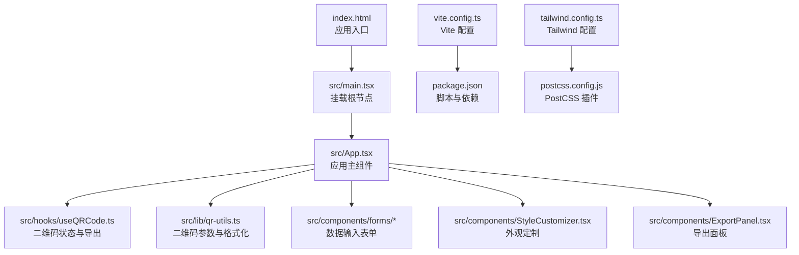
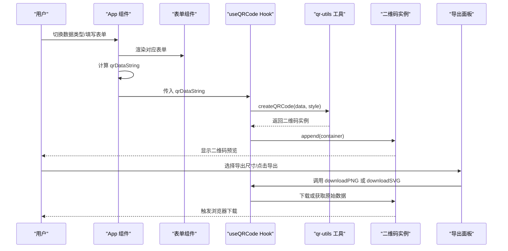
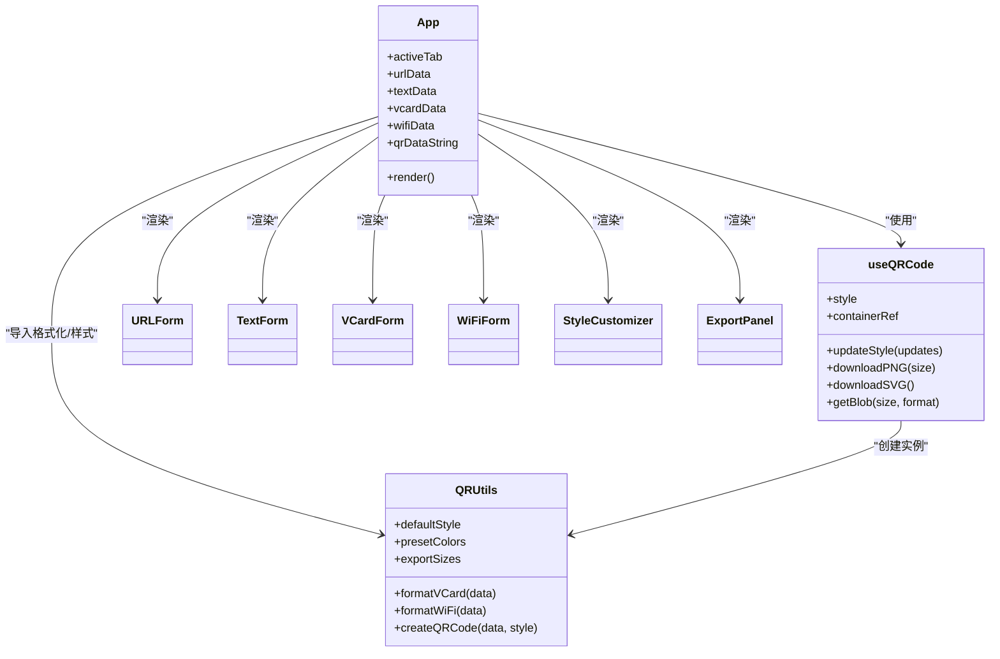
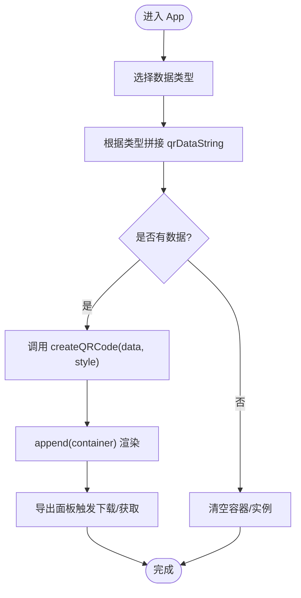
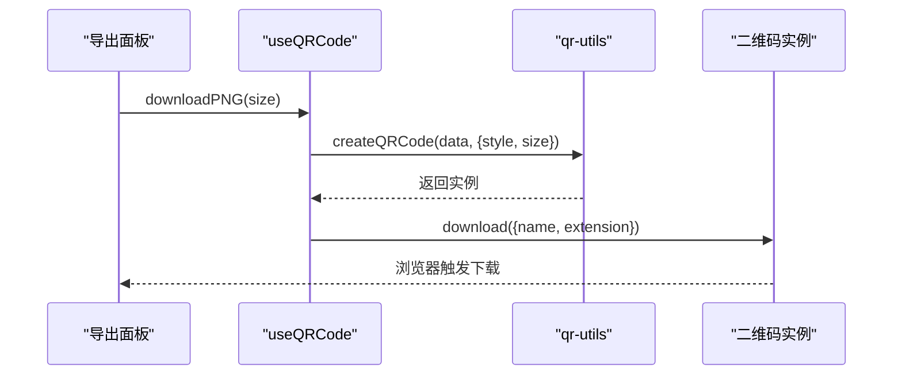
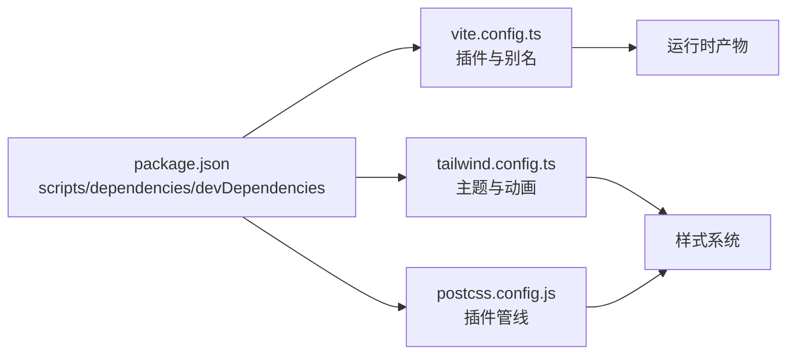

# 快速开始

<cite>
**本文引用的文件**
- [package.json](file://package.json)
- [vite.config.ts](file://vite.config.ts)
- [index.html](file://index.html)
- [src/main.tsx](file://src/main.tsx)
- [src/App.tsx](file://src/App.tsx)
- [src/hooks/useQRCode.ts](file://src/hooks/useQRCode.ts)
- [src/lib/qr-utils.ts](file://src/lib/qr-utils.ts)
- [src/components/forms/URLForm.tsx](file://src/components/forms/URLForm.tsx)
- [src/components/forms/TextForm.tsx](file://src/components/forms/TextForm.tsx)
- [src/components/forms/VCardForm.tsx](file://src/components/forms/VCardForm.tsx)
- [src/components/forms/WiFiForm.tsx](file://src/components/forms/WiFiForm.tsx)
- [src/components/StyleCustomizer.tsx](file://src/components/StyleCustomizer.tsx)
- [src/components/ExportPanel.tsx](file://src/components/ExportPanel.tsx)
- [tailwind.config.ts](file://tailwind.config.ts)
- [postcss.config.js](file://postcss.config.js)
</cite>

## 目录
1. [简介](#简介)
2. [项目结构](#项目结构)
3. [核心组件](#核心组件)
4. [架构总览](#架构总览)
5. [详细组件分析](#详细组件分析)
6. [依赖分析](#依赖分析)
7. [性能考虑](#性能考虑)
8. [故障排除指南](#故障排除指南)
9. [结论](#结论)
10. [附录](#附录)

## 简介
本指南面向希望快速上手 QR 码生成器项目的开发者。项目基于 React 18、TypeScript 与 Vite 构建，采用 TailwindCSS 进行样式管理，使用 qr-code-styling 库在浏览器端生成高质量二维码，并支持导出 PNG/SVG。通过本指南，你将完成环境准备、安装依赖、本地运行、基础使用与导出流程，并了解如何扩展与优化开发体验。

## 项目结构
项目采用按功能分层的组织方式：入口脚本与 HTML 模板位于根目录；核心应用逻辑集中在 src 目录，包括页面级组件、表单组件、UI 组件、自定义 Hook、工具函数与样式配置。关键文件职责如下：
- 入口与构建：index.html、src/main.tsx、vite.config.ts、package.json
- 应用主组件：src/App.tsx
- 核心逻辑与状态：src/hooks/useQRCode.ts、src/lib/qr-utils.ts
- 表单与 UI：src/components/forms/*、src/components/ui/*
- 样式与主题：tailwind.config.ts、postcss.config.js

图表来源
- [index.html:1-18](file://index.html#L1-L18)
- [src/main.tsx:1-11](file://src/main.tsx#L1-L11)
- [src/App.tsx:1-173](file://src/App.tsx#L1-L173)
- [src/hooks/useQRCode.ts:1-75](file://src/hooks/useQRCode.ts#L1-L75)
- [src/lib/qr-utils.ts:1-151](file://src/lib/qr-utils.ts#L1-L151)
- [vite.config.ts:1-13](file://vite.config.ts#L1-L13)
- [package.json:1-37](file://package.json#L1-L37)
- [tailwind.config.ts:1-107](file://tailwind.config.ts#L1-L107)
- [postcss.config.js:1-7](file://postcss.config.js#L1-L7)

章节来源
- [package.json:1-37](file://package.json#L1-L37)
- [vite.config.ts:1-13](file://vite.config.ts#L1-L13)
- [index.html:1-18](file://index.html#L1-L18)
- [src/main.tsx:1-11](file://src/main.tsx#L1-L11)
- [src/App.tsx:1-173](file://src/App.tsx#L1-L173)
- [tailwind.config.ts:1-107](file://tailwind.config.ts#L1-L107)
- [postcss.config.js:1-7](file://postcss.config.js#L1-L7)

## 核心组件
- 应用主组件 App：负责切换数据类型（URL/文本/名片/WiFi）、聚合表单输入、调用 Hook 计算二维码数据字符串并渲染预览与导出面板。
- Hook useQRCode：封装二维码实例创建、更新、下载与 Blob 获取，维护样式状态与容器引用。
- 工具模块 qr-utils：定义二维码样式接口、默认样式、预设颜色与导出尺寸，提供 VCard/WiFi 数据格式化与二维码实例创建。
- 表单组件：URLForm、TextForm、VCardForm、WiFiForm 提供不同数据源的输入界面。
- 样式定制组件 StyleCustomizer：支持预设配色、自定义前景/背景色、点样式、角样式、Logo 上传与大小调节。
- 导出面板 ExportPanel：提供 PNG 尺寸选择与 PNG/SVG 下载按钮。

章节来源
- [src/App.tsx:1-173](file://src/App.tsx#L1-L173)
- [src/hooks/useQRCode.ts:1-75](file://src/hooks/useQRCode.ts#L1-L75)
- [src/lib/qr-utils.ts:1-151](file://src/lib/qr-utils.ts#L1-L151)
- [src/components/forms/URLForm.tsx:1-33](file://src/components/forms/URLForm.tsx#L1-L33)
- [src/components/forms/TextForm.tsx:1-28](file://src/components/forms/TextForm.tsx#L1-L28)
- [src/components/forms/VCardForm.tsx:1-92](file://src/components/forms/VCardForm.tsx#L1-L92)
- [src/components/forms/WiFiForm.tsx:1-67](file://src/components/forms/WiFiForm.tsx#L1-L67)
- [src/components/StyleCustomizer.tsx:1-193](file://src/components/StyleCustomizer.tsx#L1-L193)
- [src/components/ExportPanel.tsx:1-83](file://src/components/ExportPanel.tsx#L1-L83)

## 架构总览
下图展示了从用户输入到二维码渲染与导出的关键流程，以及各模块之间的交互关系。

图表来源
- [src/App.tsx:47-65](file://src/App.tsx#L47-L65)
- [src/hooks/useQRCode.ts:20-51](file://src/hooks/useQRCode.ts#L20-L51)
- [src/lib/qr-utils.ts:63-101](file://src/lib/qr-utils.ts#L63-L101)
- [src/components/ExportPanel.tsx:21-37](file://src/components/ExportPanel.tsx#L21-L37)

## 详细组件分析

### 组件类图（代码级）

图表来源
- [src/App.tsx:24-173](file://src/App.tsx#L24-L173)
- [src/hooks/useQRCode.ts:5-74](file://src/hooks/useQRCode.ts#L5-L74)
- [src/lib/qr-utils.ts:42-151](file://src/lib/qr-utils.ts#L42-L151)
- [src/components/forms/URLForm.tsx:10-32](file://src/components/forms/URLForm.tsx#L10-L32)
- [src/components/forms/TextForm.tsx:9-27](file://src/components/forms/TextForm.tsx#L9-L27)
- [src/components/forms/VCardForm.tsx:10-91](file://src/components/forms/VCardForm.tsx#L10-L91)
- [src/components/forms/WiFiForm.tsx:17-66](file://src/components/forms/WiFiForm.tsx#L17-L66)
- [src/components/StyleCustomizer.tsx:20-192](file://src/components/StyleCustomizer.tsx#L20-L192)
- [src/components/ExportPanel.tsx:13-82](file://src/components/ExportPanel.tsx#L13-L82)

### 数据流与处理逻辑（算法实现）

图表来源
- [src/App.tsx:47-65](file://src/App.tsx#L47-L65)
- [src/hooks/useQRCode.ts:11-29](file://src/hooks/useQRCode.ts#L11-L29)
- [src/lib/qr-utils.ts:63-101](file://src/lib/qr-utils.ts#L63-L101)

### API/服务组件（Hook 调用序列）

图表来源
- [src/components/ExportPanel.tsx:21-28](file://src/components/ExportPanel.tsx#L21-L28)
- [src/hooks/useQRCode.ts:35-42](file://src/hooks/useQRCode.ts#L35-L42)
- [src/lib/qr-utils.ts:63-101](file://src/lib/qr-utils.ts#L63-L101)

## 依赖分析
- 运行时依赖：React 生态、路由、UI 组件库与图标、二维码渲染库、压缩与 CSV 解析、消息提示等。
- 开发依赖：TypeScript、Vite、React 插件、TailwindCSS、PostCSS 及其插件。
- 构建与脚本：通过 Vite 启动开发服务器、编译 TypeScript 并打包前端资源，提供本地预览命令。

图表来源
- [package.json:6-35](file://package.json#L6-L35)
- [vite.config.ts:5-12](file://vite.config.ts#L5-L12)
- [tailwind.config.ts:3-106](file://tailwind.config.ts#L3-L106)
- [postcss.config.js:1-7](file://postcss.config.js#L1-L7)

章节来源
- [package.json:1-37](file://package.json#L1-L37)
- [vite.config.ts:1-13](file://vite.config.ts#L1-L13)
- [tailwind.config.ts:1-107](file://tailwind.config.ts#L1-L107)
- [postcss.config.js:1-7](file://postcss.config.js#L1-L7)

## 性能考虑
- 本地渲染：所有二维码在浏览器端生成，避免网络传输，保障隐私与性能。
- 按需更新：useQRCode 在数据或样式变化时才重建实例并重新 append，减少不必要重绘。
- 导出尺寸：提供多种导出尺寸选项，建议根据用途选择合适分辨率以平衡质量与体积。
- 样式优化：Tailwind 动画与阴影在交互时启用，保持流畅体验的同时避免过度开销。
- 构建优化：Vite 的热更新与按需打包提升开发效率；生产构建自动进行资源压缩与 Tree-shaking。

## 故障排除指南
- 无法启动开发服务器
  - 确认 Node.js 版本满足项目需求（详见附录）。
  - 清理缓存后重新安装依赖：删除 node_modules 与锁定文件后执行安装。
  - 检查端口占用，修改 Vite 配置中的端口或释放占用端口。
- 二维码未显示
  - 确保输入框已有有效数据（URL/文本/名片/WiFi），否则 Hook 会清空容器。
  - 检查容器引用是否正确传递给预览组件。
- 导出失败
  - 确认已存在可导出的数据。
  - 检查浏览器下载权限与弹窗拦截设置。
- 样式异常
  - 确认 Tailwind 配置已正确扫描源文件路径。
  - 若自定义动画或阴影未生效，检查 keyframes 与动画名称是否一致。

章节来源
- [src/hooks/useQRCode.ts:11-29](file://src/hooks/useQRCode.ts#L11-L29)
- [tailwind.config.ts:5-106](file://tailwind.config.ts#L5-L106)

## 结论
本项目提供了从零到一的完整开发体验：清晰的组件拆分、完善的表单体系、灵活的样式定制与便捷的导出能力。按照本指南完成环境与依赖准备后，即可快速生成多种类型的二维码并导出至本地，适合新手快速上手与有经验开发者高效迭代。

## 附录

### 环境要求
- Node.js：建议使用长期支持版本（如 18.x 或 20.x），以获得最佳兼容性与性能。
- 包管理器：推荐使用 npm 9+ 或更高版本。

章节来源
- [package.json:11-24](file://package.json#L11-L24)

### 安装与运行
- 安装依赖
  - 使用 npm 安装项目所需依赖。
- 启动开发服务器
  - 执行开发脚本以启动 Vite 本地服务。
- 本地预览
  - 使用预览脚本在本地查看生产构建效果。

章节来源
- [package.json:6-10](file://package.json#L6-L10)
- [vite.config.ts:5-12](file://vite.config.ts#L5-L12)

### 基本使用示例
- URL 类型
  - 在“网址链接”输入框中填入完整 URL（含协议前缀），二维码将直接编码该链接。
- 文本类型
  - 在文本区域输入任意文本，注意字符数限制。
- 名片（VCard）类型
  - 填写姓名、电话、邮箱、公司、职位、网站等字段，系统将生成标准 VCard 数据。
- WiFi 类型
  - 填写 SSID、加密方式与密码（若无密码则选择“无密码”），可选勾选“隐藏网络”。

章节来源
- [src/components/forms/URLForm.tsx:10-32](file://src/components/forms/URLForm.tsx#L10-L32)
- [src/components/forms/TextForm.tsx:9-27](file://src/components/forms/TextForm.tsx#L9-L27)
- [src/components/forms/VCardForm.tsx:10-91](file://src/components/forms/VCardForm.tsx#L10-L91)
- [src/components/forms/WiFiForm.tsx:17-66](file://src/components/forms/WiFiForm.tsx#L17-L66)

### 开发与构建流程
- 开发服务器
  - 启动后可在浏览器中实时编辑代码并看到热更新效果。
- 构建生产版本
  - 编译 TypeScript 并打包前端资源，输出静态文件。
- 预览部署
  - 使用预览脚本在本地验证生产构建结果。

章节来源
- [package.json:6-10](file://package.json#L6-L10)
- [vite.config.ts:5-12](file://vite.config.ts#L5-L12)

### 样式与主题
- 主题与动画
  - Tailwind 配置启用了暗色模式、容器布局、圆角与多组动画，确保界面美观与交互流畅。
- 样式定制
  - 通过外观定制面板调整前景/背景色、点样式、角样式与 Logo，支持预设配色与自定义颜色。

章节来源
- [tailwind.config.ts:3-106](file://tailwind.config.ts#L3-L106)
- [src/components/StyleCustomizer.tsx:20-192](file://src/components/StyleCustomizer.tsx#L20-L192)