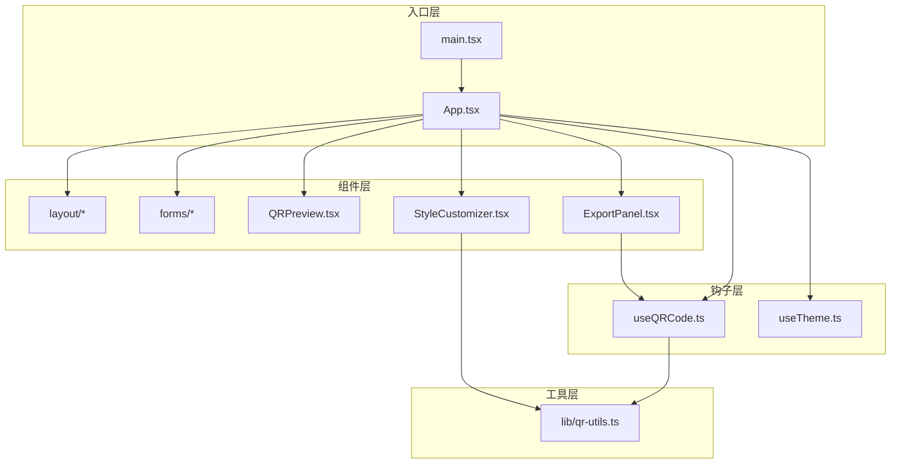
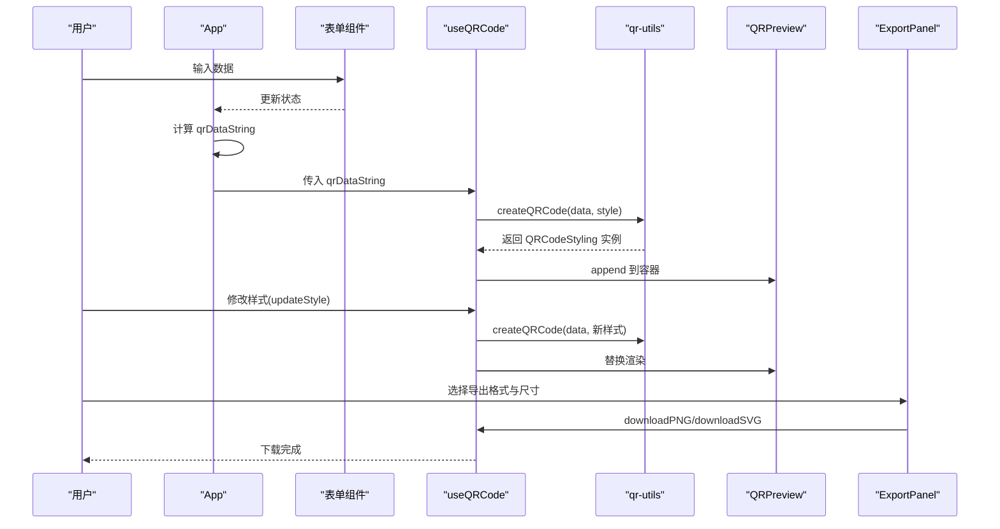
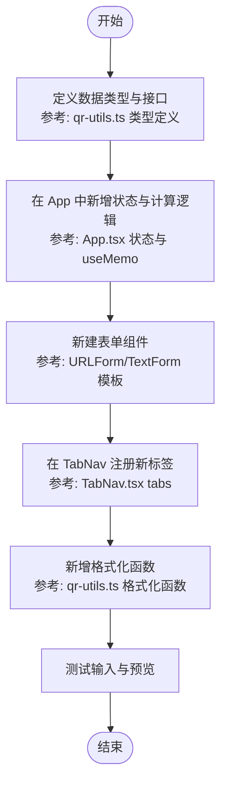
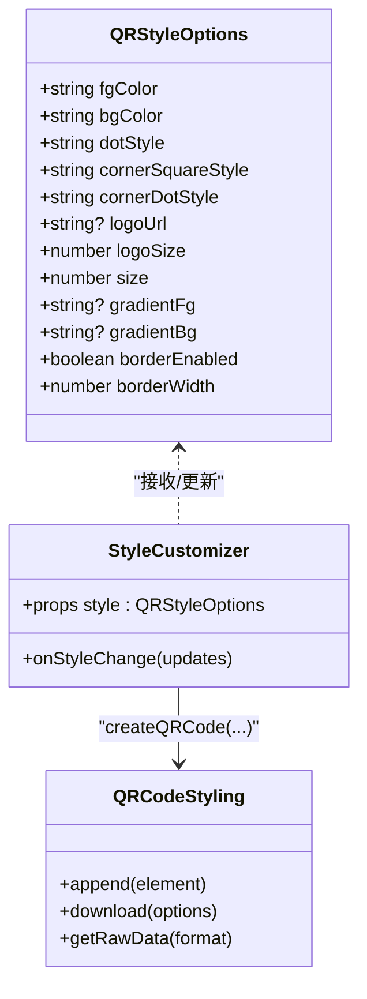
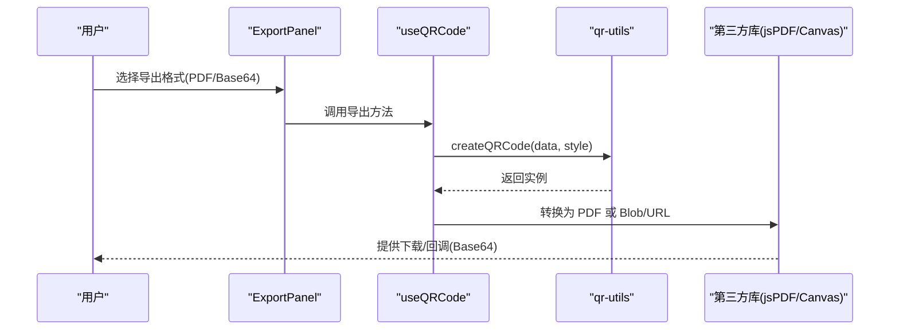

# 扩展开发

<cite>
**本文引用的文件**
- [src/App.tsx](file://src/App.tsx)
- [src/main.tsx](file://src/main.tsx)
- [package.json](file://package.json)
- [src/hooks/useQRCode.ts](file://src/hooks/useQRCode.ts)
- [src/hooks/useTheme.ts](file://src/hooks/useTheme.ts)
- [src/lib/qr-utils.ts](file://src/lib/qr-utils.ts)
- [src/components/StyleCustomizer.tsx](file://src/components/StyleCustomizer.tsx)
- [src/components/QRPreview.tsx](file://src/components/QRPreview.tsx)
- [src/components/ExportPanel.tsx](file://src/components/ExportPanel.tsx)
- [src/components/forms/URLForm.tsx](file://src/components/forms/URLForm.tsx)
- [src/components/forms/TextForm.tsx](file://src/components/forms/TextForm.tsx)
- [src/components/forms/VCardForm.tsx](file://src/components/forms/VCardForm.tsx)
- [src/components/forms/WiFiForm.tsx](file://src/components/forms/WiFiForm.tsx)
- [src/components/layout/Header.tsx](file://src/components/layout/Header.tsx)
- [src/components/layout/TabNav.tsx](file://src/components/layout/TabNav.tsx)
</cite>

## 目录
1. [简介](#简介)
2. [项目结构](#项目结构)
3. [核心组件](#核心组件)
4. [架构总览](#架构总览)
5. [详细组件分析](#详细组件分析)
6. [依赖分析](#依赖分析)
7. [性能考量](#性能考量)
8. [故障排查指南](#故障排查指南)
9. [结论](#结论)
10. [附录：扩展开发最佳实践与向后兼容](#附录扩展开发最佳实践与向后兼容)

## 简介
本指南面向希望为 QR 码生成器项目进行扩展开发的工程师，围绕以下目标展开：
- 新增数据类型（如：邮件、事件、地理位置等）
- 扩展样式选项（如：渐变、边框、图案填充等）
- 添加导出格式（如：PDF、Base64 等）
- 完整自定义样式指南（主题、组件样式、动画）
- 插件系统架构与扩展点识别
- 集成第三方库的实践与注意事项
- 最佳实践与向后兼容性建议

## 项目结构
项目采用按功能域分层的组织方式：
- 组件层：页面布局、输入表单、预览与导出面板、样式定制器
- 钩子层：状态管理与导出逻辑（useQRCode）、主题切换（useTheme）
- 工具层：二维码生成与样式配置（qr-utils）
- 入口层：应用入口与全局渲染

图表来源
- [src/main.tsx:1-11](file://src/main.tsx#L1-L11)
- [src/App.tsx:1-173](file://src/App.tsx#L1-L173)
- [src/hooks/useQRCode.ts:1-75](file://src/hooks/useQRCode.ts#L1-L75)
- [src/hooks/useTheme.ts:1-26](file://src/hooks/useTheme.ts#L1-L26)
- [src/lib/qr-utils.ts:1-151](file://src/lib/qr-utils.ts#L1-L151)
- [src/components/QRPreview.tsx:1-45](file://src/components/QRPreview.tsx#L1-L45)
- [src/components/StyleCustomizer.tsx:1-193](file://src/components/StyleCustomizer.tsx#L1-L193)
- [src/components/ExportPanel.tsx:1-83](file://src/components/ExportPanel.tsx#L1-L83)
- [src/components/forms/URLForm.tsx:1-33](file://src/components/forms/URLForm.tsx#L1-L33)
- [src/components/forms/TextForm.tsx:1-28](file://src/components/forms/TextForm.tsx#L1-L28)
- [src/components/forms/VCardForm.tsx:1-92](file://src/components/forms/VCardForm.tsx#L1-L92)
- [src/components/forms/WiFiForm.tsx:1-67](file://src/components/forms/WiFiForm.tsx#L1-L67)
- [src/components/layout/Header.tsx:1-41](file://src/components/layout/Header.tsx#L1-L41)
- [src/components/layout/TabNav.tsx:1-47](file://src/components/layout/TabNav.tsx#L1-L47)

章节来源
- [src/App.tsx:1-173](file://src/App.tsx#L1-L173)
- [src/main.tsx:1-11](file://src/main.tsx#L1-L11)

## 核心组件
- 应用主控：负责数据输入、样式定制、预览与导出的编排
- 表单组件：分别处理不同数据类型的输入（URL、文本、联系人名片、WiFi）
- 样式定制器：提供颜色、点/角样式、Logo 上传与大小控制
- 预览面板：实时渲染二维码容器
- 导出面板：提供 PNG/SVG 导出与尺寸选择
- 钩子：useQRCode 负责二维码实例化、样式更新与导出；useTheme 负责深浅色主题切换
- 工具库：qr-utils 封装 QRCodeStyling 的配置、默认样式、预设颜色与导出尺寸

章节来源
- [src/App.tsx:1-173](file://src/App.tsx#L1-L173)
- [src/lib/qr-utils.ts:1-151](file://src/lib/qr-utils.ts#L1-L151)
- [src/hooks/useQRCode.ts:1-75](file://src/hooks/useQRCode.ts#L1-L75)
- [src/hooks/useTheme.ts:1-26](file://src/hooks/useTheme.ts#L1-L26)
- [src/components/StyleCustomizer.tsx:1-193](file://src/components/StyleCustomizer.tsx#L1-L193)
- [src/components/QRPreview.tsx:1-45](file://src/components/QRPreview.tsx#L1-L45)
- [src/components/ExportPanel.tsx:1-83](file://src/components/ExportPanel.tsx#L1-L83)

## 架构总览
整体流程：用户在左侧表单输入数据，App 计算当前数据字符串；useQRCode 基于该字符串与样式创建 QRCodeStyling 实例并挂载到预览容器；用户通过 StyleCustomizer 调整样式；ExportPanel 触发下载。

图表来源
- [src/App.tsx:47-65](file://src/App.tsx#L47-L65)
- [src/hooks/useQRCode.ts:11-29](file://src/hooks/useQRCode.ts#L11-L29)
- [src/lib/qr-utils.ts:63-101](file://src/lib/qr-utils.ts#L63-L101)
- [src/components/QRPreview.tsx:27-33](file://src/components/QRPreview.tsx#L27-L33)
- [src/components/ExportPanel.tsx:21-37](file://src/components/ExportPanel.tsx#L21-L37)

## 详细组件分析

### 数据类型扩展：新增“邮件”数据类型
目标：在现有四种数据类型基础上新增“邮件”类型，支持邮箱地址与可选主题/正文。

扩展步骤
- 在类型定义处增加枚举值与数据接口
  - 参考路径：[src/lib/qr-utils.ts:8-40](file://src/lib/qr-utils.ts#L8-L40)
- 在 App 中新增状态与计算逻辑
  - 参考路径：[src/App.tsx:25-62](file://src/App.tsx#L25-L62)
- 新建表单组件
  - 参考路径：[src/components/forms/URLForm.tsx:1-33](file://src/components/forms/URLForm.tsx#L1-L33)
  - 参考路径：[src/components/forms/TextForm.tsx:1-28](file://src/components/forms/TextForm.tsx#L1-L28)
- 在 TabNav 中注册新标签
  - 参考路径：[src/components/layout/TabNav.tsx:10-20](file://src/components/layout/TabNav.tsx#L10-L20)
- 在样式定制器中根据需要扩展或复用现有控件
  - 参考路径：[src/components/StyleCustomizer.tsx:1-193](file://src/components/StyleCustomizer.tsx#L1-L193)
- 在 qr-utils 中新增格式化函数（如 mailto:）
  - 参考路径：[src/lib/qr-utils.ts:42-61](file://src/lib/qr-utils.ts#L42-L61)

图表来源
- [src/lib/qr-utils.ts:8-40](file://src/lib/qr-utils.ts#L8-L40)
- [src/App.tsx:25-62](file://src/App.tsx#L25-L62)
- [src/components/layout/TabNav.tsx:10-20](file://src/components/layout/TabNav.tsx#L10-L20)
- [src/components/forms/URLForm.tsx:1-33](file://src/components/forms/URLForm.tsx#L1-L33)
- [src/components/forms/TextForm.tsx:1-28](file://src/components/forms/TextForm.tsx#L1-L28)
- [src/lib/qr-utils.ts:42-61](file://src/lib/qr-utils.ts#L42-L61)

章节来源
- [src/lib/qr-utils.ts:8-40](file://src/lib/qr-utils.ts#L8-L40)
- [src/App.tsx:25-62](file://src/App.tsx#L25-L62)
- [src/components/layout/TabNav.tsx:10-20](file://src/components/layout/TabNav.tsx#L10-L20)
- [src/components/forms/URLForm.tsx:1-33](file://src/components/forms/URLForm.tsx#L1-L33)
- [src/components/forms/TextForm.tsx:1-28](file://src/components/forms/TextForm.tsx#L1-L28)
- [src/lib/qr-utils.ts:42-61](file://src/lib/qr-utils.ts#L42-L61)

### 样式选项扩展：新增“渐变”与“边框”
目标：允许用户选择前景/背景渐变、边框样式与阴影效果。

扩展步骤
- 在样式接口中新增字段
  - 参考路径：[src/lib/qr-utils.ts:14-23](file://src/lib/qr-utils.ts#L14-L23)
- 在默认样式中补充默认值
  - 参考路径：[src/lib/qr-utils.ts:103-112](file://src/lib/qr-utils.ts#L103-L112)
- 在样式定制器中新增控件（颜色选择器、渐变预设、边框开关）
  - 参考路径：[src/components/StyleCustomizer.tsx:40-104](file://src/components/StyleCustomizer.tsx#L40-L104)
- 在 createQRCode 中映射到 QRCodeStyling 配置
  - 参考路径：[src/lib/qr-utils.ts:63-101](file://src/lib/qr-utils.ts#L63-L101)
- 在导出时保持样式一致性
  - 参考路径：[src/hooks/useQRCode.ts:35-62](file://src/hooks/useQRCode.ts#L35-L62)

图表来源
- [src/lib/qr-utils.ts:14-23](file://src/lib/qr-utils.ts#L14-L23)
- [src/lib/qr-utils.ts:103-112](file://src/lib/qr-utils.ts#L103-L112)
- [src/components/StyleCustomizer.tsx:15-36](file://src/components/StyleCustomizer.tsx#L15-L36)
- [src/lib/qr-utils.ts:63-101](file://src/lib/qr-utils.ts#L63-L101)
- [src/hooks/useQRCode.ts:31-33](file://src/hooks/useQRCode.ts#L31-L33)

章节来源
- [src/lib/qr-utils.ts:14-23](file://src/lib/qr-utils.ts#L14-L23)
- [src/lib/qr-utils.ts:103-112](file://src/lib/qr-utils.ts#L103-L112)
- [src/components/StyleCustomizer.tsx:15-36](file://src/components/StyleCustomizer.tsx#L15-L36)
- [src/lib/qr-utils.ts:63-101](file://src/lib/qr-utils.ts#L63-L101)
- [src/hooks/useQRCode.ts:31-33](file://src/hooks/useQRCode.ts#L31-L33)

### 导出格式扩展：新增 PDF 与 Base64
目标：支持导出为 PDF 与返回 Base64 字符串，便于嵌入网页或服务端处理。

扩展步骤
- 在导出面板中新增选项
  - 参考路径：[src/components/ExportPanel.tsx:13-82](file://src/components/ExportPanel.tsx#L13-L82)
- 在 useQRCode 中新增导出方法
  - 参考路径：[src/hooks/useQRCode.ts:35-62](file://src/hooks/useQRCode.ts#L35-L62)
- 集成第三方库（如 jsPDF 用于 PDF；或使用 Canvas to Blob + Blob URL 生成 Base64）
  - 参考依赖声明：[package.json:21-23](file://package.json#L21-L23)
- 注意：导出尺寸与样式需与预览一致，避免失真
  - 参考路径：[src/hooks/useQRCode.ts:35-51](file://src/hooks/useQRCode.ts#L35-L51)

图表来源
- [src/components/ExportPanel.tsx:13-82](file://src/components/ExportPanel.tsx#L13-L82)
- [src/hooks/useQRCode.ts:35-62](file://src/hooks/useQRCode.ts#L35-L62)
- [src/lib/qr-utils.ts:63-101](file://src/lib/qr-utils.ts#L63-L101)
- [package.json:21-23](file://package.json#L21-L23)

章节来源
- [src/components/ExportPanel.tsx:13-82](file://src/components/ExportPanel.tsx#L13-L82)
- [src/hooks/useQRCode.ts:35-62](file://src/hooks/useQRCode.ts#L35-L62)
- [src/lib/qr-utils.ts:63-101](file://src/lib/qr-utils.ts#L63-L101)
- [package.json:21-23](file://package.json#L21-L23)

### 主题定制与动画效果
- 主题切换：useTheme 基于系统偏好与手动切换，动态添加/移除 dark 类
  - 参考路径：[src/hooks/useTheme.ts:4-20](file://src/hooks/useTheme.ts#L4-L20)
- 动画与过渡：预览容器与组件使用 Tailwind 动画类，可按需扩展
  - 参考路径：[src/components/QRPreview.tsx:14-18](file://src/components/QRPreview.tsx#L14-L18)
  - 参考路径：[src/components/StyleCustomizer.tsx:39](file://src/components/StyleCustomizer.tsx#L39)

章节来源
- [src/hooks/useTheme.ts:4-20](file://src/hooks/useTheme.ts#L4-L20)
- [src/components/QRPreview.tsx:14-18](file://src/components/QRPreview.tsx#L14-L18)
- [src/components/StyleCustomizer.tsx:39](file://src/components/StyleCustomizer.tsx#L39)

### 插件系统架构与扩展点识别
- 扩展点一：数据类型扩展（新增枚举、格式化函数、表单与标签）
  - 参考路径：[src/lib/qr-utils.ts:8-40](file://src/lib/qr-utils.ts#L8-L40), [src/App.tsx:25-62](file://src/App.tsx#L25-L62), [src/components/layout/TabNav.tsx:10-20](file://src/components/layout/TabNav.tsx#L10-L20)
- 扩展点二：样式扩展（新增样式字段、映射到 QRCodeStyling）
  - 参考路径：[src/lib/qr-utils.ts:14-23](file://src/lib/qr-utils.ts#L14-L23), [src/lib/qr-utils.ts:63-101](file://src/lib/qr-utils.ts#L63-L101)
- 扩展点三：导出扩展（新增导出方法、第三方库集成）
  - 参考路径：[src/hooks/useQRCode.ts:35-62](file://src/hooks/useQRCode.ts#L35-L62), [src/components/ExportPanel.tsx:13-82](file://src/components/ExportPanel.tsx#L13-L82)
- 扩展点四：UI 扩展（新增表单/控件、主题与动画）
  - 参考路径：[src/components/StyleCustomizer.tsx:1-193](file://src/components/StyleCustomizer.tsx#L1-L193), [src/components/QRPreview.tsx:1-45](file://src/components/QRPreview.tsx#L1-L45)

章节来源
- [src/lib/qr-utils.ts:8-40](file://src/lib/qr-utils.ts#L8-L40)
- [src/App.tsx:25-62](file://src/App.tsx#L25-L62)
- [src/components/layout/TabNav.tsx:10-20](file://src/components/layout/TabNav.tsx#L10-L20)
- [src/lib/qr-utils.ts:14-23](file://src/lib/qr-utils.ts#L14-L23)
- [src/lib/qr-utils.ts:63-101](file://src/lib/qr-utils.ts#L63-L101)
- [src/hooks/useQRCode.ts:35-62](file://src/hooks/useQRCode.ts#L35-L62)
- [src/components/ExportPanel.tsx:13-82](file://src/components/ExportPanel.tsx#L13-L82)
- [src/components/StyleCustomizer.tsx:1-193](file://src/components/StyleCustomizer.tsx#L1-L193)
- [src/components/QRPreview.tsx:1-45](file://src/components/QRPreview.tsx#L1-L45)

## 依赖分析
- 运行时依赖
  - react、react-dom：框架基础
  - qr-code-styling：二维码渲染核心
  - jszip、papaparse：打包与 CSV 处理（可能用于批量导出）
  - sonner：通知提示
  - lucide-react、tailwind 系列：图标与样式
- 开发依赖
  - vite、typescript、tailwindcss 等

章节来源
- [package.json:11-37](file://package.json#L11-L37)

## 性能考量
- 避免不必要的重渲染：useMemo 仅在依赖变化时重新计算数据字符串
  - 参考路径：[src/App.tsx:47-62](file://src/App.tsx#L47-L62)
- 控制导出尺寸：默认 512，大尺寸导出会增加内存与渲染时间
  - 参考路径：[src/components/ExportPanel.tsx:18](file://src/components/ExportPanel.tsx#L18), [src/lib/qr-utils.ts:134-139](file://src/lib/qr-utils.ts#L134-L139)
- Logo 与错误纠正等级：启用 Logo 时提高容错级别，避免渲染异常
  - 参考路径：[src/lib/qr-utils.ts:85-87](file://src/lib/qr-utils.ts#L85-L87)

## 故障排查指南
- 二维码不显示
  - 检查数据字符串是否为空
  - 检查容器是否正确挂载
  - 参考路径：[src/hooks/useQRCode.ts:11-29](file://src/hooks/useQRCode.ts#L11-L29), [src/components/QRPreview.tsx:27-33](file://src/components/QRPreview.tsx#L27-L33)
- 导出失败或空白图
  - 确认数据存在且样式有效
  - 检查导出尺寸与跨域资源（Logo）
  - 参考路径：[src/hooks/useQRCode.ts:35-62](file://src/hooks/useQRCode.ts#L35-L62), [src/lib/qr-utils.ts:90-98](file://src/lib/qr-utils.ts#L90-L98)
- 主题切换无效
  - 检查 DOM 是否存在 dark 类
  - 参考路径：[src/hooks/useTheme.ts:14-20](file://src/hooks/useTheme.ts#L14-L20)

章节来源
- [src/hooks/useQRCode.ts:11-29](file://src/hooks/useQRCode.ts#L11-L29)
- [src/components/QRPreview.tsx:27-33](file://src/components/QRPreview.tsx#L27-L33)
- [src/hooks/useQRCode.ts:35-62](file://src/hooks/useQRCode.ts#L35-L62)
- [src/lib/qr-utils.ts:90-98](file://src/lib/qr-utils.ts#L90-L98)
- [src/hooks/useTheme.ts:14-20](file://src/hooks/useTheme.ts#L14-L20)

## 结论
本项目以清晰的分层与明确的扩展点为基础，能够便捷地支持新的数据类型、样式选项与导出格式。遵循本文档的扩展步骤与最佳实践，可在保证向后兼容的前提下快速迭代功能。

## 附录：扩展开发最佳实践与向后兼容
- 向后兼容
  - 默认样式与预设保持稳定，新增字段使用可选属性并提供合理默认值
    - 参考路径：[src/lib/qr-utils.ts:103-112](file://src/lib/qr-utils.ts#L103-L112)
  - 扩展枚举与接口时保留旧值，避免破坏既有逻辑
    - 参考路径：[src/lib/qr-utils.ts:8-40](file://src/lib/qr-utils.ts#L8-L40)
- 可测试性
  - 将格式化函数与样式映射拆分为纯函数，便于单元测试
    - 参考路径：[src/lib/qr-utils.ts:42-61](file://src/lib/qr-utils.ts#L42-L61), [src/lib/qr-utils.ts:63-101](file://src/lib/qr-utils.ts#L63-L101)
- 可维护性
  - 统一在 qr-utils 中集中管理样式与导出配置，避免散落的硬编码
    - 参考路径：[src/lib/qr-utils.ts:14-151](file://src/lib/qr-utils.ts#L14-L151)
- 用户体验
  - 导出前禁用按钮，导出后恢复状态
    - 参考路径：[src/components/ExportPanel.tsx:18-37](file://src/components/ExportPanel.tsx#L18-L37)
  - 提供尺寸预设与实时预览反馈
    - 参考路径：[src/lib/qr-utils.ts:134-139](file://src/lib/qr-utils.ts#L134-L139), [src/components/QRPreview.tsx:36-41](file://src/components/QRPreview.tsx#L36-L41)