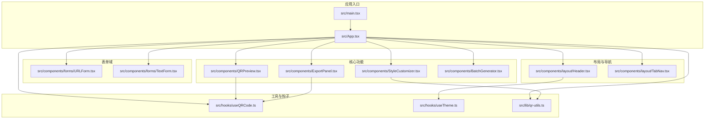
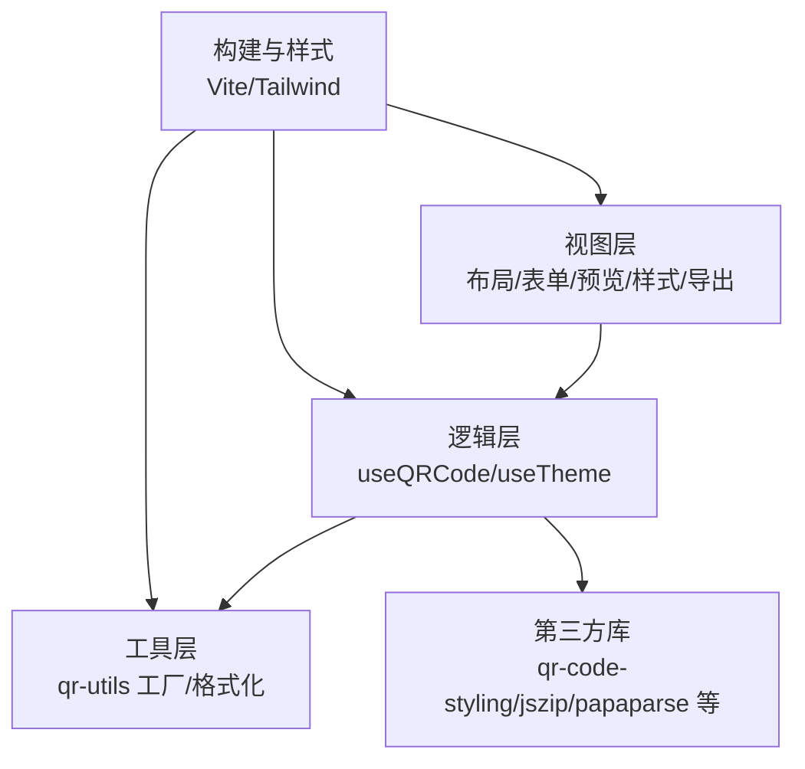
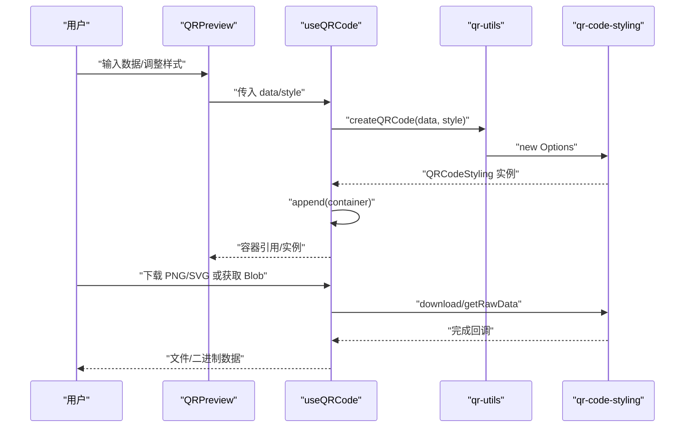
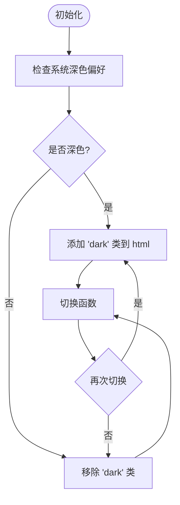
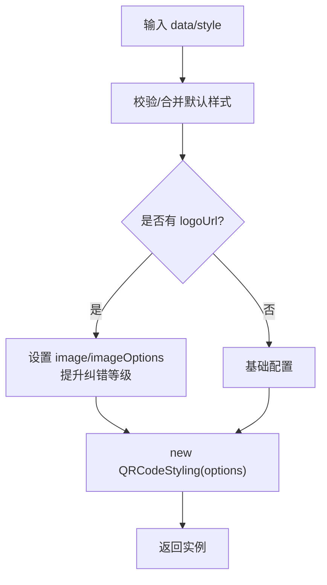
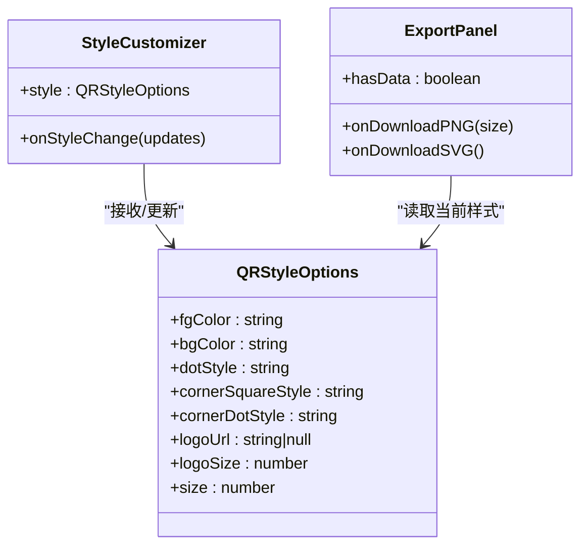
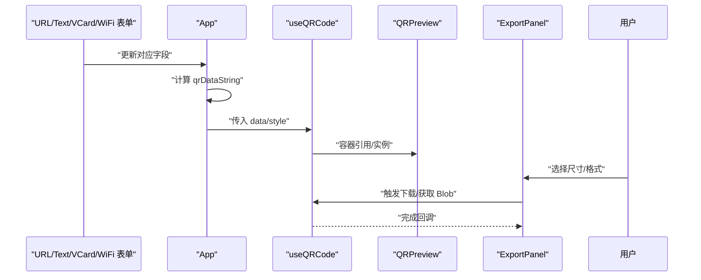
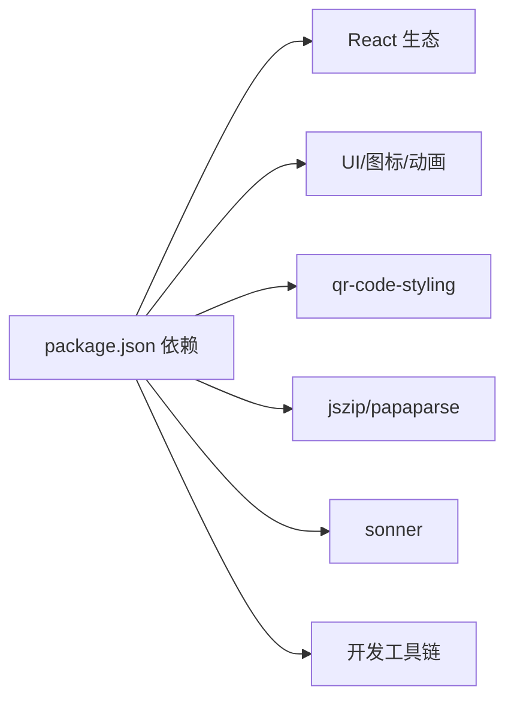
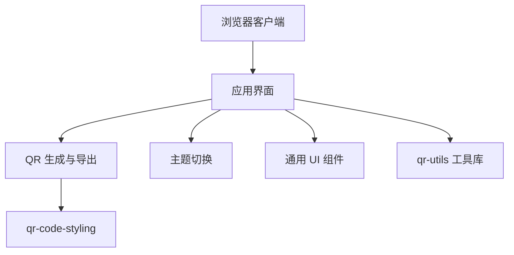

# 技术架构

<cite>
**本文引用的文件**
- [package.json](file://package.json)
- [vite.config.ts](file://vite.config.ts)
- [tailwind.config.ts](file://tailwind.config.ts)
- [src/main.tsx](file://src/main.tsx)
- [src/App.tsx](file://src/App.tsx)
- [src/hooks/useQRCode.ts](file://src/hooks/useQRCode.ts)
- [src/hooks/useTheme.ts](file://src/hooks/useTheme.ts)
- [src/lib/qr-utils.ts](file://src/lib/qr-utils.ts)
- [src/components/layout/Header.tsx](file://src/components/layout/Header.tsx)
- [src/components/layout/TabNav.tsx](file://src/components/layout/TabNav.tsx)
- [src/components/forms/URLForm.tsx](file://src/components/forms/URLForm.tsx)
- [src/components/forms/TextForm.tsx](file://src/components/forms/TextForm.tsx)
- [src/components/QRPreview.tsx](file://src/components/QRPreview.tsx)
- [src/components/StyleCustomizer.tsx](file://src/components/StyleCustomizer.tsx)
- [src/components/ExportPanel.tsx](file://src/components/ExportPanel.tsx)
</cite>

## 目录
1. [引言](#引言)
2. [项目结构](#项目结构)
3. [核心组件](#核心组件)
4. [架构总览](#架构总览)
5. [详细组件分析](#详细组件分析)
6. [依赖分析](#依赖分析)
7. [性能考虑](#性能考虑)
8. [故障排查指南](#故障排查指南)
9. [结论](#结论)
10. [附录](#附录)

## 引言
本项目是一个基于前端的二维码生成器，支持多种数据类型（URL、文本、VCard、WiFi），提供在线实时预览、样式定制、Logo 中心图、批量生成以及 PNG/SVG 导出能力。应用采用 React + TypeScript + Tailwind CSS + Vite 的现代前端技术栈，强调本地处理、无后端依赖与良好的开发体验。

## 项目结构
项目采用按功能域分层的组织方式：组件层（components）、钩子层（hooks）、工具库（lib）、入口与全局样式（main、index.css、配置）。构建与样式分别由 Vite 和 Tailwind 管理，确保开发效率与样式一致性。

**图表来源**
- [src/main.tsx:1-11](file://src/main.tsx#L1-L11)
- [src/App.tsx:1-173](file://src/App.tsx#L1-L173)
- [src/components/layout/Header.tsx:1-41](file://src/components/layout/Header.tsx#L1-L41)
- [src/components/layout/TabNav.tsx:1-47](file://src/components/layout/TabNav.tsx#L1-L47)
- [src/components/forms/URLForm.tsx:1-33](file://src/components/forms/URLForm.tsx#L1-L33)
- [src/components/forms/TextForm.tsx:1-28](file://src/components/forms/TextForm.tsx#L1-L28)
- [src/components/StyleCustomizer.tsx:1-193](file://src/components/StyleCustomizer.tsx#L1-L193)
- [src/components/QRPreview.tsx:1-45](file://src/components/QRPreview.tsx#L1-L45)
- [src/components/ExportPanel.tsx:1-83](file://src/components/ExportPanel.tsx#L1-L83)
- [src/hooks/useQRCode.ts:1-75](file://src/hooks/useQRCode.ts#L1-L75)
- [src/hooks/useTheme.ts:1-26](file://src/hooks/useTheme.ts#L1-L26)
- [src/lib/qr-utils.ts:1-151](file://src/lib/qr-utils.ts#L1-L151)

**章节来源**
- [src/main.tsx:1-11](file://src/main.tsx#L1-L11)
- [src/App.tsx:1-173](file://src/App.tsx#L1-L173)
- [vite.config.ts:1-13](file://vite.config.ts#L1-L13)
- [tailwind.config.ts:1-107](file://tailwind.config.ts#L1-L107)

## 核心组件
- 应用根组件负责状态聚合、Tab 切换、数据字符串计算与 QR 渲染控制，并协调输入表单、样式定制、预览与导出面板。
- 钩子 useQRCode 封装 QR 实例生命周期、样式更新与导出逻辑，提供下载与 Blob 获取能力。
- 钩子 useTheme 提供主题切换与系统偏好检测。
- 工具库 qr-utils 定义 QR 数据类型、样式选项、格式化函数与 QRCodeStyling 配置工厂。
- 组件层包含通用 UI 控件（按钮、输入框、标签、选择器等）与业务组件（表单、预览、样式定制、导出面板、批量生成）。

**章节来源**
- [src/App.tsx:24-173](file://src/App.tsx#L24-L173)
- [src/hooks/useQRCode.ts:1-75](file://src/hooks/useQRCode.ts#L1-L75)
- [src/hooks/useTheme.ts:1-26](file://src/hooks/useTheme.ts#L1-L26)
- [src/lib/qr-utils.ts:1-151](file://src/lib/qr-utils.ts#L1-L151)

## 架构总览
系统采用“组件驱动 + 钩子封装 + 工具库工厂”的分层架构：
- 视图层：布局、表单、预览、样式定制、导出面板等 UI 组件。
- 逻辑层：useQRCode 钩子集中处理 QR 实例创建、更新、导出；useTheme 钩子处理主题切换。
- 工具层：qr-utils 提供类型定义、格式化函数与 QRCodeStyling 工厂方法。
- 构建与样式：Vite 负责开发服务器与打包；Tailwind 提供原子化样式与暗色主题支持。

**图表来源**
- [src/App.tsx:1-173](file://src/App.tsx#L1-L173)
- [src/hooks/useQRCode.ts:1-75](file://src/hooks/useQRCode.ts#L1-L75)
- [src/hooks/useTheme.ts:1-26](file://src/hooks/useTheme.ts#L1-L26)
- [src/lib/qr-utils.ts:1-151](file://src/lib/qr-utils.ts#L1-L151)
- [package.json:11-35](file://package.json#L11-L35)
- [vite.config.ts:1-13](file://vite.config.ts#L1-L13)
- [tailwind.config.ts:1-107](file://tailwind.config.ts#L1-L107)

## 详细组件分析

### Hook 模式：useQRCode
- 职责：封装 QR 实例生命周期、样式更新、导出与 Blob 获取。
- 关键行为：
  - 基于 data 与 style 变化创建/更新 QR 实例并在容器中渲染。
  - 提供 updateStyle 合并更新样式的能力。
  - 提供 downloadPNG/downloadSVG 与 getBlob 接口，支持不同尺寸与格式导出。
- 设计要点：通过 useRef 记录上一次数据，避免重复渲染；通过 useCallback 缓存导出函数，减少重渲染。

**图表来源**
- [src/hooks/useQRCode.ts:1-75](file://src/hooks/useQRCode.ts#L1-L75)
- [src/lib/qr-utils.ts:63-101](file://src/lib/qr-utils.ts#L63-L101)

**章节来源**
- [src/hooks/useQRCode.ts:1-75](file://src/hooks/useQRCode.ts#L1-L75)

### Hook 模式：useTheme
- 职责：检测系统深色偏好并提供切换函数，通过 DOM 类名控制暗色主题。
- 关键行为：初始化时读取 DOM 与媒体查询；切换时动态添加/移除 dark 类。

**图表来源**
- [src/hooks/useTheme.ts:1-26](file://src/hooks/useTheme.ts#L1-L26)

**章节来源**
- [src/hooks/useTheme.ts:1-26](file://src/hooks/useTheme.ts#L1-L26)

### 工厂模式：qr-utils.createQRCode
- 职责：根据输入数据与样式选项构造 QRCodeStyling 实例。
- 关键行为：
  - 统一配置 width/height、margin、type、dots/background/corners 等。
  - 当存在 logoUrl 时启用纠错等级提升与图片配置。
- 设计要点：将第三方库配置抽象为工厂函数，便于测试与替换。

**图表来源**
- [src/lib/qr-utils.ts:63-101](file://src/lib/qr-utils.ts#L63-L101)

**章节来源**
- [src/lib/qr-utils.ts:63-101](file://src/lib/qr-utils.ts#L63-L101)

### 策略模式：样式与导出策略
- 样式策略：通过 QRStyleOptions 与预设选项数组（dot/corner 样式、颜色、尺寸）实现可插拔的外观策略。
- 导出策略：根据用户选择的尺寸与格式（PNG/SVG）调用不同的导出接口，支持高分辨率导出与原始数据获取。

**图表来源**
- [src/components/StyleCustomizer.tsx:1-193](file://src/components/StyleCustomizer.tsx#L1-L193)
- [src/components/ExportPanel.tsx:1-83](file://src/components/ExportPanel.tsx#L1-L83)
- [src/lib/qr-utils.ts:14-23](file://src/lib/qr-utils.ts#L14-L23)

**章节来源**
- [src/components/StyleCustomizer.tsx:1-193](file://src/components/StyleCustomizer.tsx#L1-L193)
- [src/components/ExportPanel.tsx:1-83](file://src/components/ExportPanel.tsx#L1-L83)
- [src/lib/qr-utils.ts:14-23](file://src/lib/qr-utils.ts#L14-L23)

### 组件交互与数据流
- 数据从各表单组件流向 App 的状态，App 计算 qrDataString 并传递给 useQRCode。
- useQRCode 基于数据与样式创建 QR 实例并渲染至容器；用户可实时调整样式并通过导出面板下载或获取 Blob。
- Header 与 TabNav 提供主题切换与数据类型切换，影响 App 的状态与渲染分支。

**图表来源**
- [src/App.tsx:24-173](file://src/App.tsx#L24-L173)
- [src/hooks/useQRCode.ts:1-75](file://src/hooks/useQRCode.ts#L1-L75)
- [src/components/QRPreview.tsx:1-45](file://src/components/QRPreview.tsx#L1-L45)
- [src/components/ExportPanel.tsx:1-83](file://src/components/ExportPanel.tsx#L1-L83)

**章节来源**
- [src/App.tsx:24-173](file://src/App.tsx#L24-L173)
- [src/components/forms/URLForm.tsx:1-33](file://src/components/forms/URLForm.tsx#L1-L33)
- [src/components/forms/TextForm.tsx:1-28](file://src/components/forms/TextForm.tsx#L1-L28)

## 依赖分析
- 运行时依赖：React 生态、路由、UI 图标库、Tailwind 扩展、二维码生成库、压缩与 CSV 解析库、通知组件。
- 开发依赖：TypeScript、Vite、PostCSS、Tailwind、React 插件。
- 构建别名：@ 指向 src，简化导入路径。

**图表来源**
- [package.json:11-35](file://package.json#L11-L35)

**章节来源**
- [package.json:1-37](file://package.json#L1-37)
- [vite.config.ts:1-13](file://vite.config.ts#L1-L13)

## 性能考虑
- 渲染优化：useMemo 在 App 层对 qrDataString 进行记忆化，避免不必要的计算；useCallback 在 useQRCode 中缓存导出函数，降低重渲染成本。
- 实时预览：仅在有数据时创建 QR 实例并渲染，空数据时清空容器，减少 DOM 操作。
- 导出策略：PNG 使用可选尺寸参数，SVG 默认高分辨率导出，满足不同场景需求。
- 样式与主题：Tailwind 原子类与暗色主题切换通过类名切换，避免运行时复杂计算。

**章节来源**
- [src/App.tsx:47-62](file://src/App.tsx#L47-L62)
- [src/hooks/useQRCode.ts:31-51](file://src/hooks/useQRCode.ts#L31-L51)
- [tailwind.config.ts:1-107](file://tailwind.config.ts#L1-L107)

## 故障排查指南
- 无法生成二维码
  - 检查 qrDataString 是否为空；确认已选择正确的数据类型并填写必要字段。
  - 确认 useQRCode 返回的容器引用有效且未被卸载。
- 导出失败或空白
  - 确认 hasData 为真；尝试调整导出尺寸；若使用 SVG，确认浏览器支持下载。
- 主题切换无效
  - 检查 useTheme 初始化逻辑与 DOM 上的 dark 类是否存在。
- 样式不生效
  - 确认 updateStyle 的调用路径与样式合并逻辑；检查 Tailwind 配置是否正确扫描到组件。

**章节来源**
- [src/hooks/useQRCode.ts:11-29](file://src/hooks/useQRCode.ts#L11-L29)
- [src/components/ExportPanel.tsx:21-37](file://src/components/ExportPanel.tsx#L21-L37)
- [src/hooks/useTheme.ts:4-20](file://src/hooks/useTheme.ts#L4-L20)

## 结论
本项目通过清晰的分层架构与设计模式（Hook 模式、工厂模式、策略模式）实现了高内聚、低耦合的功能模块。React + TypeScript + Tailwind CSS + Vite 的技术组合提供了良好的开发体验与一致的样式体系，配合第三方库实现强大的二维码生成与导出能力。系统强调本地处理与隐私安全，具备良好的可扩展性与可维护性。

## 附录
- 系统上下文图（概念性）
