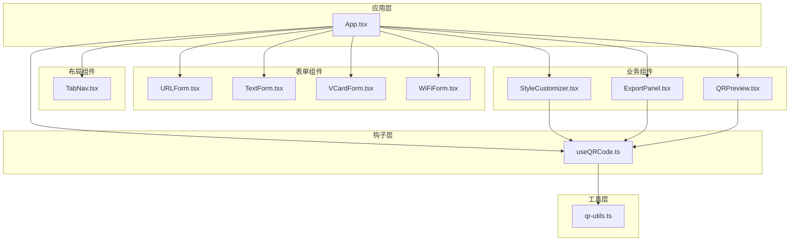
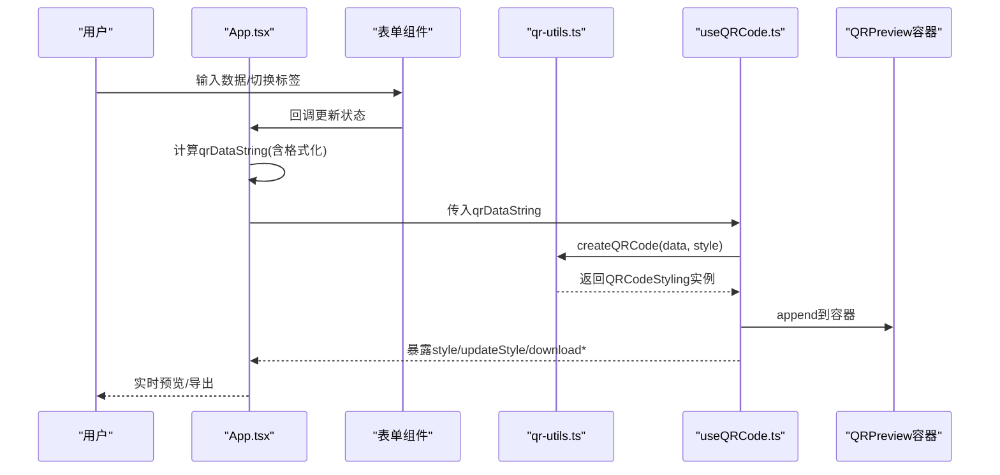
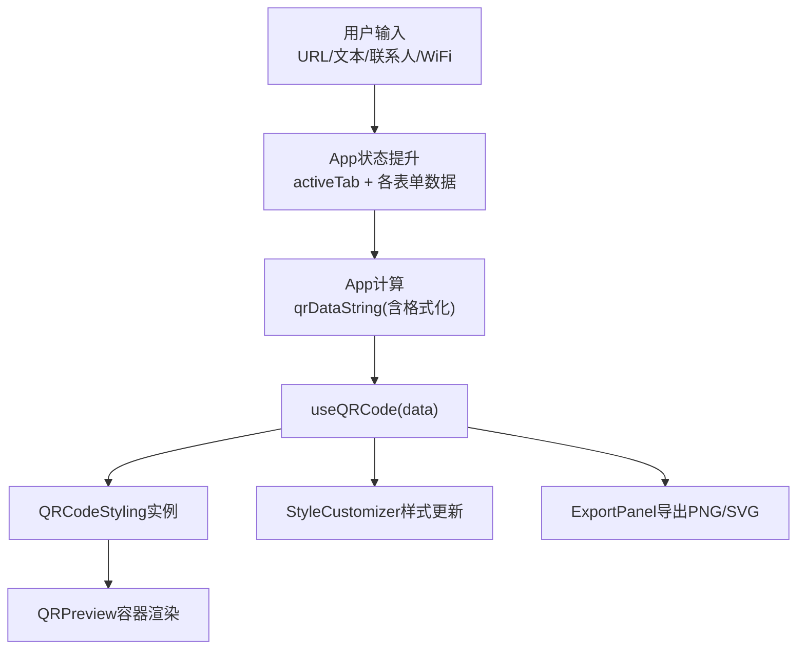
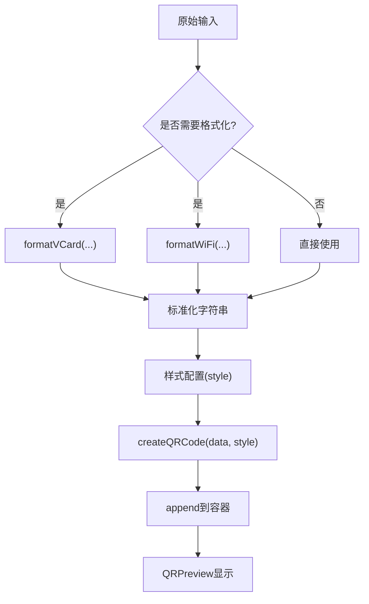
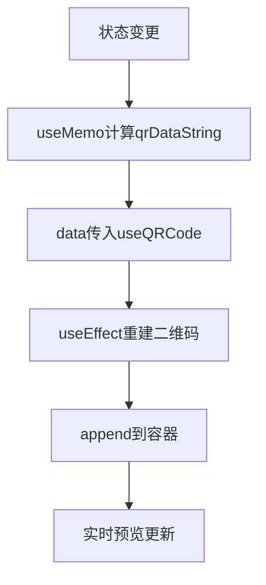
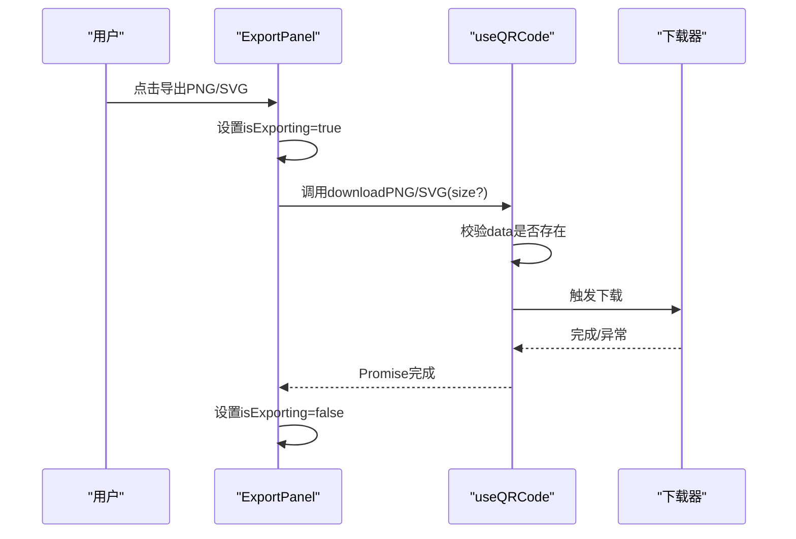
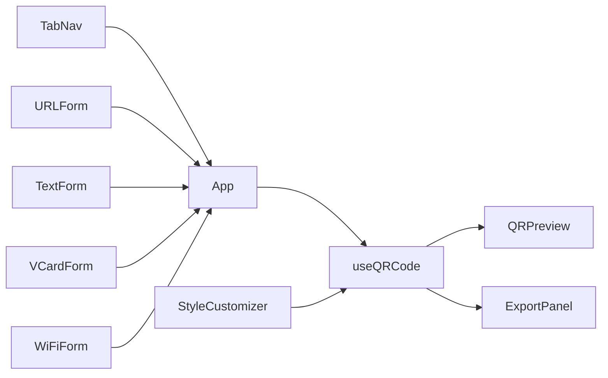
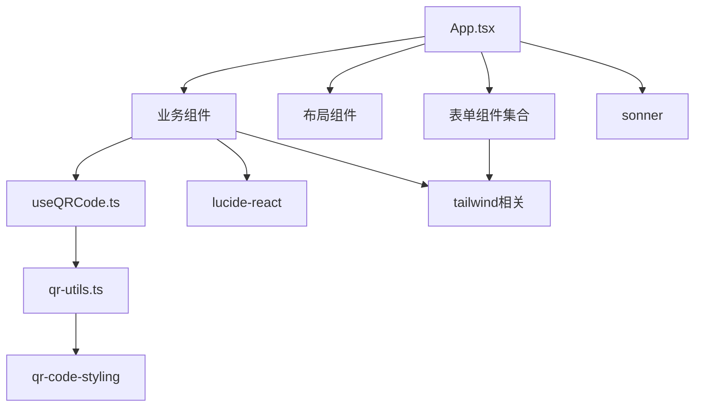

# 数据流架构

<cite>
**本文引用的文件列表**
- [src/App.tsx](file://src/App.tsx)
- [src/hooks/useQRCode.ts](file://src/hooks/useQRCode.ts)
- [src/lib/qr-utils.ts](file://src/lib/qr-utils.ts)
- [src/components/QRPreview.tsx](file://src/components/QRPreview.tsx)
- [src/components/forms/TextForm.tsx](file://src/components/forms/TextForm.tsx)
- [src/components/forms/URLForm.tsx](file://src/components/forms/URLForm.tsx)
- [src/components/forms/VCardForm.tsx](file://src/components/forms/VCardForm.tsx)
- [src/components/forms/WiFiForm.tsx](file://src/components/forms/WiFiForm.tsx)
- [src/components/StyleCustomizer.tsx](file://src/components/StyleCustomizer.tsx)
- [src/components/ExportPanel.tsx](file://src/components/ExportPanel.tsx)
- [src/components/layout/TabNav.tsx](file://src/components/layout/TabNav.tsx)
- [src/lib/utils.ts](file://src/lib/utils.ts)
- [package.json](file://package.json)
</cite>

## 目录
1. [简介](#简介)
2. [项目结构](#项目结构)
3. [核心组件](#核心组件)
4. [架构总览](#架构总览)
5. [详细组件分析](#详细组件分析)
6. [依赖关系分析](#依赖关系分析)
7. [性能考量](#性能考量)
8. [故障排查指南](#故障排查指南)
9. [结论](#结论)

## 简介
本文件面向QR码生成器项目的“数据流架构”，系统性梳理从用户输入到二维码生成与实时预览的完整数据路径，阐明状态提升策略（在App组件中集中管理全局状态并在子组件间传递）、数据转换流程（原始数据输入 → 数据格式化 → 样式应用 → 二维码生成 → 实时预览）、useMemo的使用策略与性能优化考虑，并提供数据流图与时序图帮助理解异步操作与错误处理机制。

## 项目结构
项目采用按功能域分层的组织方式：
- 组件层：表单组件（URL/文本/联系人/WiFi）、布局组件（Header/TabNav）、UI通用组件（button/input/select等）、业务组件（QRPreview/StyleCustomizer/ExportPanel/BatchGenerator）
- 钩子层：useQRCode（封装二维码生成与导出逻辑）
- 工具层：qr-utils（数据格式化、样式配置、二维码实例创建）
- 应用入口：App.tsx（状态提升与数据流编排）

图表来源
- [src/App.tsx:1-173](file://src/App.tsx#L1-L173)
- [src/hooks/useQRCode.ts:1-75](file://src/hooks/useQRCode.ts#L1-L75)
- [src/lib/qr-utils.ts:1-151](file://src/lib/qr-utils.ts#L1-L151)
- [src/components/forms/URLForm.tsx:1-33](file://src/components/forms/URLForm.tsx#L1-L33)
- [src/components/forms/TextForm.tsx:1-28](file://src/components/forms/TextForm.tsx#L1-L28)
- [src/components/forms/VCardForm.tsx:1-92](file://src/components/forms/VCardForm.tsx#L1-L92)
- [src/components/forms/WiFiForm.tsx:1-67](file://src/components/forms/WiFiForm.tsx#L1-L67)
- [src/components/StyleCustomizer.tsx:1-193](file://src/components/StyleCustomizer.tsx#L1-L193)
- [src/components/QRPreview.tsx:1-45](file://src/components/QRPreview.tsx#L1-L45)
- [src/components/ExportPanel.tsx:1-83](file://src/components/ExportPanel.tsx#L1-L83)
- [src/components/layout/TabNav.tsx:1-47](file://src/components/layout/TabNav.tsx#L1-L47)

章节来源
- [src/App.tsx:1-173](file://src/App.tsx#L1-L173)
- [src/lib/qr-utils.ts:1-151](file://src/lib/qr-utils.ts#L1-L151)

## 核心组件
- App.tsx：集中管理全局状态（活动标签、各表单数据、样式），计算qrDataString并通过useQRCode生成二维码，负责将数据流传递给子组件。
- useQRCode.ts：封装二维码生成、样式更新、下载导出、容器挂载等逻辑，暴露style、updateStyle、downloadPNG/SVG、getBlob等接口。
- qr-utils.ts：提供数据格式化函数（VCard/WiFi）、样式选项类型与默认值、二维码实例创建工厂、导出尺寸与预设配色等。
- 表单组件：URLForm/TextForm/VCardForm/WiFiForm，负责接收用户输入并回调更新App中的对应状态。
- StyleCustomizer.tsx：负责样式选择与Logo上传，通过onStyleChange回调更新useQRCode中的style。
- QRPreview.tsx：展示二维码容器，根据是否有数据切换占位与显示状态。
- ExportPanel.tsx：触发PNG/SVG导出，内部维护导出尺寸与加载状态。

章节来源
- [src/App.tsx:24-170](file://src/App.tsx#L24-L170)
- [src/hooks/useQRCode.ts:5-74](file://src/hooks/useQRCode.ts#L5-L74)
- [src/lib/qr-utils.ts:14-151](file://src/lib/qr-utils.ts#L14-L151)
- [src/components/forms/URLForm.tsx:10-31](file://src/components/forms/URLForm.tsx#L10-L31)
- [src/components/forms/TextForm.tsx:9-27](file://src/components/forms/TextForm.tsx#L9-L27)
- [src/components/forms/VCardForm.tsx:10-91](file://src/components/forms/VCardForm.tsx#L10-L91)
- [src/components/forms/WiFiForm.tsx:17-66](file://src/components/forms/WiFiForm.tsx#L17-L66)
- [src/components/StyleCustomizer.tsx:20-192](file://src/components/StyleCustomizer.tsx#L20-L192)
- [src/components/QRPreview.tsx:9-44](file://src/components/QRPreview.tsx#L9-L44)
- [src/components/ExportPanel.tsx:13-82](file://src/components/ExportPanel.tsx#L13-L82)

## 架构总览
数据流从用户输入开始，经由App组件的状态提升与计算，再通过useQRCode钩子生成二维码并渲染到DOM，同时支持样式定制与导出。

图表来源
- [src/App.tsx:47-65](file://src/App.tsx#L47-L65)
- [src/hooks/useQRCode.ts:11-29](file://src/hooks/useQRCode.ts#L11-L29)
- [src/lib/qr-utils.ts:63-101](file://src/lib/qr-utils.ts#L63-L101)
- [src/components/QRPreview.tsx:27-33](file://src/components/QRPreview.tsx#L27-L33)

## 详细组件分析

### 状态提升与数据流
- 全局状态集中在App组件：活动标签、URL/文本/联系人/WiFi数据、样式配置。
- 子组件通过props与回调更新App状态；App计算qrDataString作为useQRCode的输入。
- useQRCode返回style与下载方法，供StyleCustomizer与ExportPanel使用。

图表来源
- [src/App.tsx:25-65](file://src/App.tsx#L25-L65)
- [src/hooks/useQRCode.ts:5-74](file://src/hooks/useQRCode.ts#L5-L74)
- [src/components/QRPreview.tsx:9-44](file://src/components/QRPreview.tsx#L9-L44)
- [src/components/ExportPanel.tsx:13-82](file://src/components/ExportPanel.tsx#L13-L82)
- [src/components/StyleCustomizer.tsx:20-192](file://src/components/StyleCustomizer.tsx#L20-L192)

章节来源
- [src/App.tsx:24-170](file://src/App.tsx#L24-L170)

### 数据转换流程
- 原始数据输入：URL/文本/联系人/WiFi表单组件分别收集用户输入。
- 数据格式化：App根据activeTab选择对应字段，必要时调用formatVCard或formatWiFi生成标准字符串。
- 样式应用：StyleCustomizer通过updateStyle更新useQRCode中的style对象。
- 二维码生成：useQRCode内部调用createQRCode(data, style)创建实例并append到容器。
- 实时预览：QRPreview根据hasData控制占位与容器显示。

图表来源
- [src/App.tsx:47-62](file://src/App.tsx#L47-L62)
- [src/lib/qr-utils.ts:42-61](file://src/lib/qr-utils.ts#L42-L61)
- [src/lib/qr-utils.ts:63-101](file://src/lib/qr-utils.ts#L63-L101)
- [src/components/QRPreview.tsx:9-44](file://src/components/QRPreview.tsx#L9-L44)

章节来源
- [src/lib/qr-utils.ts:42-61](file://src/lib/qr-utils.ts#L42-L61)
- [src/lib/qr-utils.ts:63-101](file://src/lib/qr-utils.ts#L63-L101)
- [src/App.tsx:47-65](file://src/App.tsx#L47-L65)

### useMemo使用策略与性能优化
- App中使用useMemo计算qrDataString，依赖activeTab与各表单数据，避免在每次渲染时重复格式化与拼接。
- useQRCode中useEffect监听data与style变化，仅在依赖变更时重建二维码实例并重新append，减少不必要的DOM操作。
- 导出时通过createQRCode(data, { ...style, size })临时覆盖尺寸，避免影响实时预览的style。

图表来源
- [src/App.tsx:47-65](file://src/App.tsx#L47-L65)
- [src/hooks/useQRCode.ts:11-29](file://src/hooks/useQRCode.ts#L11-L29)

章节来源
- [src/App.tsx:47-65](file://src/App.tsx#L47-L65)
- [src/hooks/useQRCode.ts:11-29](file://src/hooks/useQRCode.ts#L11-L29)

### 异步操作与错误处理
- 导出PNG/SVG为异步操作，ExportPanel内部维护isExporting状态，try/finally确保无论成功与否都恢复状态。
- 当data为空时，useQRCode清理容器并置空qrCode，避免无效渲染。
- 错误提示通过全局通知组件（Toaster）呈现，便于用户感知问题。

图表来源
- [src/components/ExportPanel.tsx:21-37](file://src/components/ExportPanel.tsx#L21-L37)
- [src/hooks/useQRCode.ts:35-51](file://src/hooks/useQRCode.ts#L35-L51)
- [src/App.tsx:71-71](file://src/App.tsx#L71-L71)

章节来源
- [src/components/ExportPanel.tsx:13-82](file://src/components/ExportPanel.tsx#L13-L82)
- [src/hooks/useQRCode.ts:35-51](file://src/hooks/useQRCode.ts#L35-L51)
- [src/App.tsx:71-71](file://src/App.tsx#L71-L71)

### 组件交互与数据流图
- TabNav切换activeTab，驱动App渲染不同表单组件。
- 各表单组件通过onChange回调更新App状态，App重新计算qrDataString并触发useQRCode重建。
- StyleCustomizer通过updateStyle更新useQRCode中的style，实时影响预览。
- ExportPanel触发下载，内部维护导出尺寸与加载状态。

图表来源
- [src/components/layout/TabNav.tsx:22-46](file://src/components/layout/TabNav.tsx#L22-L46)
- [src/App.tsx:103-114](file://src/App.tsx#L103-L114)
- [src/components/StyleCustomizer.tsx:20-192](file://src/components/StyleCustomizer.tsx#L20-L192)
- [src/components/QRPreview.tsx:9-44](file://src/components/QRPreview.tsx#L9-L44)
- [src/components/ExportPanel.tsx:13-82](file://src/components/ExportPanel.tsx#L13-L82)

章节来源
- [src/components/layout/TabNav.tsx:22-46](file://src/components/layout/TabNav.tsx#L22-L46)
- [src/App.tsx:94-157](file://src/App.tsx#L94-L157)

## 依赖关系分析
- 组件依赖：App依赖所有表单、布局、业务组件；业务组件依赖useQRCode；useQRCode依赖qr-utils。
- 外部依赖：qr-code-styling用于生成二维码；sonner用于全局通知；lucide-react提供图标；tailwind相关库提供样式工具类。

图表来源
- [src/App.tsx:1-22](file://src/App.tsx#L1-L22)
- [src/hooks/useQRCode.ts:1-3](file://src/hooks/useQRCode.ts#L1-L3)
- [src/lib/qr-utils.ts:1-6](file://src/lib/qr-utils.ts#L1-L6)
- [package.json:11-23](file://package.json#L11-L23)

章节来源
- [package.json:11-23](file://package.json#L11-L23)
- [src/App.tsx:1-22](file://src/App.tsx#L1-L22)

## 性能考量
- 使用useMemo避免重复格式化与字符串拼接，降低渲染成本。
- useQRCode的useEffect仅在data或style变化时重建二维码，减少DOM重绘。
- 导出时按需创建临时实例，不影响实时预览的style。
- 通过hasData控制预览容器的显示/占位，避免空DOM节点渲染。
- 使用防抖/节流可选：当前实现基于状态变更即时响应，适合轻量输入场景；若输入频繁，可在表单组件内部增加防抖策略。

[本节为通用性能建议，不直接分析具体文件]

## 故障排查指南
- 无数据时预览空白：确认activeTab与对应表单数据是否满足格式化条件（如VCard至少包含姓名或WiFi必须有SSID）。
- 导出失败：检查data是否存在、浏览器是否允许下载、目标尺寸是否过大导致内存压力。
- 样式未生效：确认updateStyle是否正确合并到style对象，以及createQRCode是否被重新调用。
- 通知未出现：检查全局Toaster是否正确初始化。

章节来源
- [src/App.tsx:67-67](file://src/App.tsx#L67-L67)
- [src/hooks/useQRCode.ts:35-51](file://src/hooks/useQRCode.ts#L35-L51)
- [src/components/ExportPanel.tsx:21-37](file://src/components/ExportPanel.tsx#L21-L37)

## 结论
该系统通过App组件进行状态提升与数据编排，结合useMemo与useEffect实现高效的数据流与渲染控制。数据从用户输入到格式化、样式应用再到二维码生成与实时预览，形成清晰的单向数据流；异步导出与错误处理通过局部状态与全局通知保障用户体验。整体架构模块职责明确、耦合度低、扩展性强，便于后续新增数据类型与样式选项。