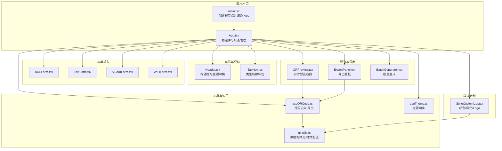
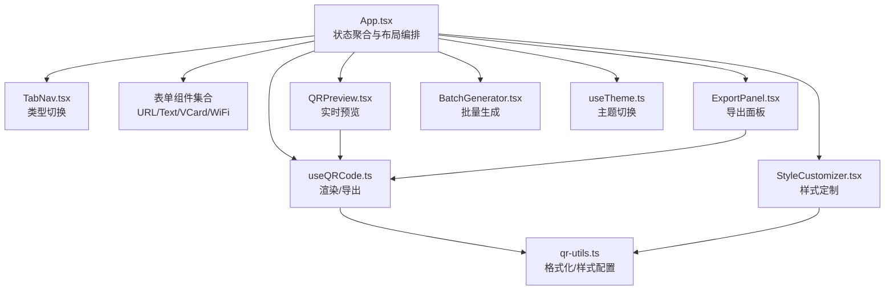
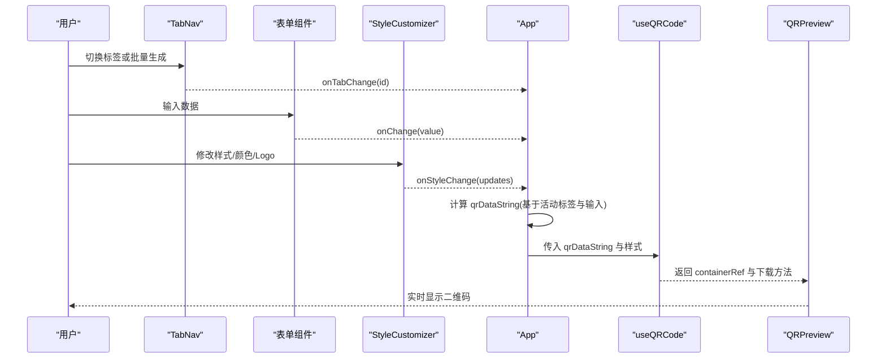
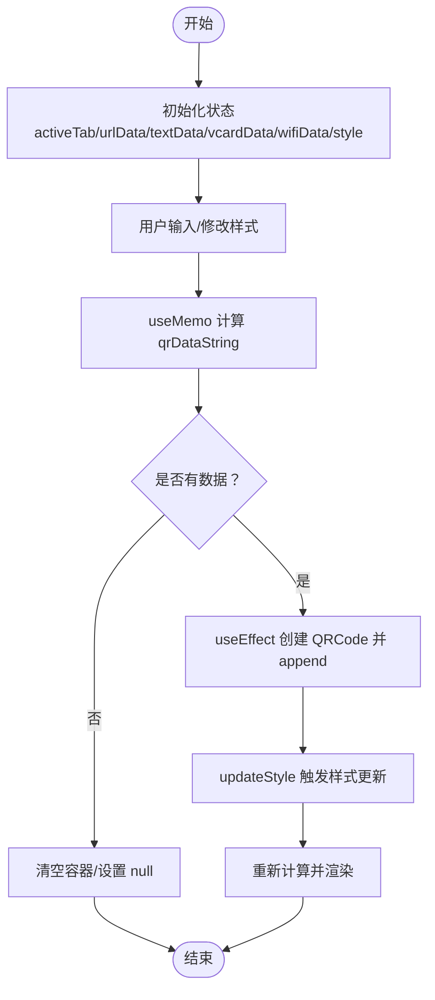
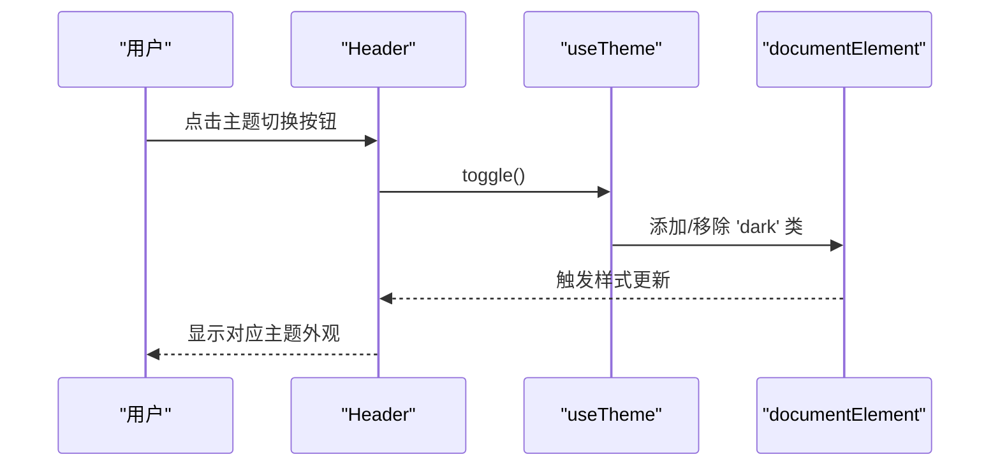
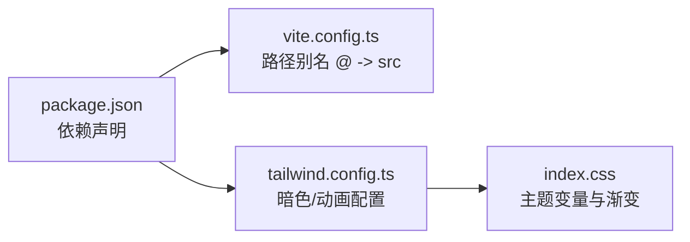

# 整体架构设计

<cite>
**本文档引用的文件**
- [src/App.tsx](file://src/App.tsx)
- [src/main.tsx](file://src/main.tsx)
- [src/components/layout/Header.tsx](file://src/components/layout/Header.tsx)
- [src/components/layout/TabNav.tsx](file://src/components/layout/TabNav.tsx)
- [src/components/StyleCustomizer.tsx](file://src/components/StyleCustomizer.tsx)
- [src/components/QRPreview.tsx](file://src/components/QRPreview.tsx)
- [src/hooks/useQRCode.ts](file://src/hooks/useQRCode.ts)
- [src/hooks/useTheme.ts](file://src/hooks/useTheme.ts)
- [src/lib/qr-utils.ts](file://src/lib/qr-utils.ts)
- [src/index.css](file://src/index.css)
- [package.json](file://package.json)
- [vite.config.ts](file://vite.config.ts)
- [tailwind.config.ts](file://tailwind.config.ts)
</cite>

## 目录
1. [引言](#引言)
2. [项目结构](#项目结构)
3. [核心组件](#核心组件)
4. [架构总览](#架构总览)
5. [详细组件分析](#详细组件分析)
6. [依赖关系分析](#依赖关系分析)
7. [性能考虑](#性能考虑)
8. [故障排除指南](#故障排除指南)
9. [结论](#结论)

## 引言
本项目是一个基于 React 的二维码生成器应用，采用组件化架构设计，围绕“数据输入—样式定制—实时预览—导出”的工作流组织功能模块。应用通过自定义 Hook 管理二维码渲染与导出逻辑，结合 TailwindCSS 主题系统实现深浅色主题切换，并提供批量生成功能入口。整体架构强调模块解耦、状态集中管理与数据单向流动，确保可维护性与可扩展性。

## 项目结构
项目采用按功能域分层的目录组织方式：
- 组件层：按功能域划分 layout、ui、forms、业务组件（QRPreview、StyleCustomizer、ExportPanel、BatchGenerator）
- 钩子层：useQRCode、useTheme 等跨组件复用的状态与副作用逻辑
- 工具层：qr-utils 提供二维码数据格式化、样式配置与 QRCode 实例创建
- 样式层：TailwindCSS 配置与全局 CSS 变量，支持主题切换与动画效果
- 构建层：Vite + React 插件，路径别名 @ 指向 src

图表来源
- [src/main.tsx:1-11](file://src/main.tsx#L1-L11)
- [src/App.tsx:1-173](file://src/App.tsx#L1-L173)
- [src/components/layout/Header.tsx:1-41](file://src/components/layout/Header.tsx#L1-L41)
- [src/components/layout/TabNav.tsx:1-47](file://src/components/layout/TabNav.tsx#L1-L47)
- [src/components/StyleCustomizer.tsx:1-193](file://src/components/StyleCustomizer.tsx#L1-L193)
- [src/components/QRPreview.tsx:1-45](file://src/components/QRPreview.tsx#L1-L45)
- [src/hooks/useQRCode.ts:1-75](file://src/hooks/useQRCode.ts#L1-L75)
- [src/hooks/useTheme.ts:1-26](file://src/hooks/useTheme.ts#L1-L26)
- [src/lib/qr-utils.ts:1-151](file://src/lib/qr-utils.ts#L1-L151)

章节来源
- [src/App.tsx:1-173](file://src/App.tsx#L1-L173)
- [src/main.tsx:1-11](file://src/main.tsx#L1-L11)
- [vite.config.ts:1-13](file://vite.config.ts#L1-L13)

## 核心组件
- 根组件 App.tsx：负责状态聚合（活动标签、各类型输入数据）、计算二维码数据字符串、调用 useQRCode 获取渲染容器与导出方法，并组织页面布局与功能模块。
- 布局组件：Header 负责应用标题与主题切换；TabNav 提供类型切换与批量生成入口。
- 表单组件：URLForm、TextForm、VCardForm、WiFiForm 分别处理不同数据类型的输入。
- 样式定制组件：StyleCustomizer 提供颜色、样式、Logo 等定制能力。
- 预览与导出：QRPreview 展示实时二维码；ExportPanel 提供 PNG/SVG 导出。
- 工具与钩子：useQRCode 封装 QRCode 实例创建、更新与导出；useTheme 管理主题切换；qr-utils 提供数据格式化与默认样式配置。

章节来源
- [src/App.tsx:24-170](file://src/App.tsx#L24-L170)
- [src/components/layout/Header.tsx:5-40](file://src/components/layout/Header.tsx#L5-L40)
- [src/components/layout/TabNav.tsx:22-46](file://src/components/layout/TabNav.tsx#L22-L46)
- [src/components/StyleCustomizer.tsx:20-192](file://src/components/StyleCustomizer.tsx#L20-L192)
- [src/components/QRPreview.tsx:9-44](file://src/components/QRPreview.tsx#L9-L44)
- [src/hooks/useQRCode.ts:5-74](file://src/hooks/useQRCode.ts#L5-L74)
- [src/hooks/useTheme.ts:3-25](file://src/hooks/useTheme.ts#L3-L25)
- [src/lib/qr-utils.ts:14-151](file://src/lib/qr-utils.ts#L14-L151)

## 架构总览
应用采用“组件化 + Hook 抽象 + 工具函数”的分层架构：
- 组件层：负责 UI 结构与交互，按功能域拆分，降低耦合度。
- 状态层：App.tsx 聚合表单状态与活动标签，useQRCode 管理二维码渲染状态与导出能力。
- 工具层：qr-utils 将数据格式化与样式配置抽象为纯函数，便于测试与复用。
- 样式层：TailwindCSS 通过 CSS 变量与暗色类控制主题，Header 中的 useTheme 切换 class。

图表来源
- [src/App.tsx:24-170](file://src/App.tsx#L24-L170)
- [src/components/layout/TabNav.tsx:22-46](file://src/components/layout/TabNav.tsx#L22-L46)
- [src/components/StyleCustomizer.tsx:20-192](file://src/components/StyleCustomizer.tsx#L20-L192)
- [src/components/QRPreview.tsx:9-44](file://src/components/QRPreview.tsx#L9-L44)
- [src/hooks/useQRCode.ts:5-74](file://src/hooks/useQRCode.ts#L5-L74)
- [src/hooks/useTheme.ts:3-25](file://src/hooks/useTheme.ts#L3-L25)
- [src/lib/qr-utils.ts:63-101](file://src/lib/qr-utils.ts#L63-L101)

## 详细组件分析

### 根组件 App.tsx 设计思路
- 状态组织：使用 useState 管理活动标签与各类型输入数据；通过 useMemo 基于活动标签与输入数据计算最终二维码数据字符串，避免不必要重渲染。
- 数据流向：从表单组件接收用户输入，经 qr-utils 格式化后传入 useQRCode；样式定制通过 updateStyle 更新内部样式对象，触发重新渲染。
- 布局结构：采用两列栅格布局（左侧输入+样式，右侧预览+导出），在大屏下使用 sticky 定位提升用户体验。
- 功能入口：当活动标签为 batch 时渲染 BatchGenerator，否则渲染当前类型对应的表单与样式定制区域。

图表来源
- [src/App.tsx:24-170](file://src/App.tsx#L24-L170)
- [src/components/layout/TabNav.tsx:22-46](file://src/components/layout/TabNav.tsx#L22-L46)
- [src/components/StyleCustomizer.tsx:20-192](file://src/components/StyleCustomizer.tsx#L20-L192)
- [src/hooks/useQRCode.ts:5-74](file://src/hooks/useQRCode.ts#L5-L74)
- [src/components/QRPreview.tsx:9-44](file://src/components/QRPreview.tsx#L9-L44)

章节来源
- [src/App.tsx:24-170](file://src/App.tsx#L24-L170)

### 状态管理模式与数据流
- 单一数据源：App.tsx 作为状态中心，将表单输入与样式配置统一管理。
- 双向绑定：表单组件通过受控组件模式将值回传给 App；样式定制组件通过回调更新样式对象。
- 渲染触发：useMemo 仅在依赖变化时重新计算数据字符串；useEffect 在数据或样式变化时重建 QRCode 并插入 DOM。
- 导出能力：useQRCode 暴露下载 PNG/SVG 与获取 Blob 的方法，供 ExportPanel 使用。

图表来源
- [src/App.tsx:47-65](file://src/App.tsx#L47-L65)
- [src/hooks/useQRCode.ts:11-29](file://src/hooks/useQRCode.ts#L11-L29)

章节来源
- [src/App.tsx:47-65](file://src/App.tsx#L47-L65)
- [src/hooks/useQRCode.ts:11-29](file://src/hooks/useQRCode.ts#L11-L29)

### 响应式布局架构
- 网格布局：左侧输入与样式卡片，右侧预览与导出卡片，使用 CSS Grid 在大屏下形成两列布局。
- 粘性定位：右侧卡片使用 lg:sticky 与 lg:top-24，在长内容场景中保持预览面板可见。
- 条件渲染：根据活动标签决定渲染单个表单还是批量生成入口，减少不必要的 DOM。

章节来源
- [src/App.tsx:94-157](file://src/App.tsx#L94-L157)

### 主题系统集成
- CSS 变量：index.css 定义明/暗两套变量，通过 .dark 类切换主题。
- 主题钩子：useTheme 初始化时读取系统偏好或已有类，切换时动态添加/移除 .dark。
- Header 集成：Header 内部使用 useTheme 控制图标与按钮外观，实现一键切换。

图表来源
- [src/components/layout/Header.tsx:5-40](file://src/components/layout/Header.tsx#L5-L40)
- [src/hooks/useTheme.ts:3-25](file://src/hooks/useTheme.ts#L3-L25)
- [src/index.css:46-75](file://src/index.css#L46-L75)

章节来源
- [src/components/layout/Header.tsx:5-40](file://src/components/layout/Header.tsx#L5-L40)
- [src/hooks/useTheme.ts:3-25](file://src/hooks/useTheme.ts#L3-L25)
- [src/index.css:46-75](file://src/index.css#L46-L75)

### 国际化支持
- 当前版本未发现专门的国际化实现（如 i18n 库或翻译资源）。
- 文案以中文为主，若未来需要国际化，建议引入 i18n 库并在组件中通过上下文或 Hook 注入翻译函数。

[本节为概念性说明，不直接分析具体文件，故无章节来源]

## 依赖关系分析
- 构建与运行时依赖：React、React DOM、React Router、Vite、TailwindCSS、Lucide Icons、QRCodeStyling、Sonner 等。
- 路径别名：vite.config.ts 配置 @ 指向 src，简化导入路径。
- 样式体系：tailwind.config.ts 启用暗色模式与动画插件，index.css 定义主题变量与渐变背景。

图表来源
- [package.json:11-37](file://package.json#L11-L37)
- [vite.config.ts:7-11](file://vite.config.ts#L7-L11)
- [tailwind.config.ts:4-104](file://tailwind.config.ts#L4-104)
- [src/index.css:5-148](file://src/index.css#L5-L148)

章节来源
- [package.json:11-37](file://package.json#L11-L37)
- [vite.config.ts:7-11](file://vite.config.ts#L7-L11)
- [tailwind.config.ts:4-104](file://tailwind.config.ts#L4-104)
- [src/index.css:5-148](file://src/index.css#L5-L148)

## 性能考虑
- 渲染优化：useMemo 仅在输入数据或样式变化时重新计算；useEffect 仅在数据或样式变化时重建 QRCode，避免频繁重绘。
- DOM 操作：通过 useRef 持有容器引用，直接 append 子元素，减少 React 重渲染成本。
- 导出策略：导出时临时创建更高分辨率实例，避免影响实时预览的性能。
- 样式切换：主题切换通过类名切换，避免全量样式重算。

[本节提供通用指导，不直接分析具体文件，故无章节来源]

## 故障排除指南
- 二维码不显示：检查 qrDataString 是否为空；确认 useQRCode 的 data 是否有效；查看容器是否正确挂载。
- 样式不生效：确认 style 对象字段与 defaultStyle 一致；检查 updateStyle 是否被正确调用。
- 导出失败：确认 hasData 为真；检查下载方法参数（尺寸、格式）；验证浏览器下载权限。
- 主题切换无效：确认 useTheme 正确添加/移除 .dark 类；检查 CSS 变量是否覆盖。

章节来源
- [src/hooks/useQRCode.ts:5-74](file://src/hooks/useQRCode.ts#L5-L74)
- [src/App.tsx:64-67](file://src/App.tsx#L64-L67)
- [src/hooks/useTheme.ts:14-20](file://src/hooks/useTheme.ts#L14-L20)
- [src/index.css:46-75](file://src/index.css#L46-L75)

## 结论
该二维码生成器采用清晰的组件化架构与 Hook 抽象，实现了“输入—样式—预览—导出”的完整工作流。通过 useMemo 与 useEffect 的合理使用，保证了渲染性能与状态一致性；TailwindCSS 与 useTheme 的结合提供了良好的主题体验。未来可在国际化、路由策略与批量导出细节上进一步增强，但现有架构已具备良好的可维护性与可扩展性。