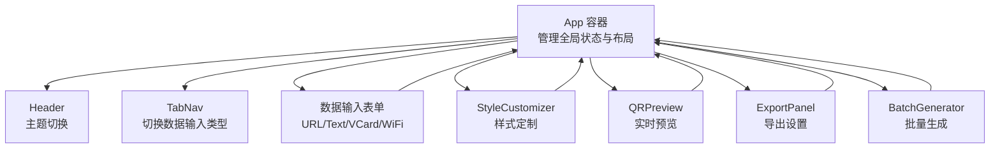
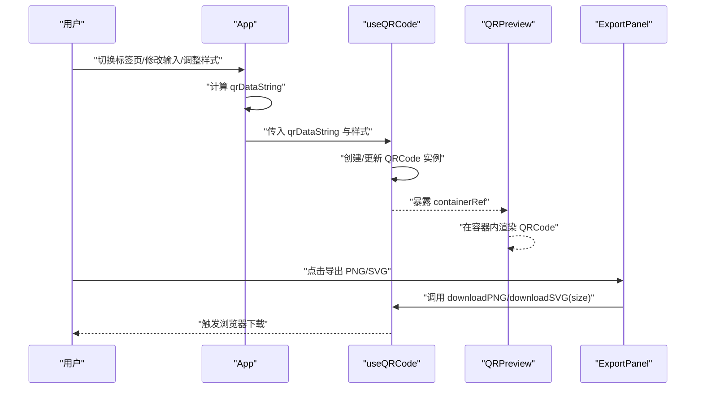
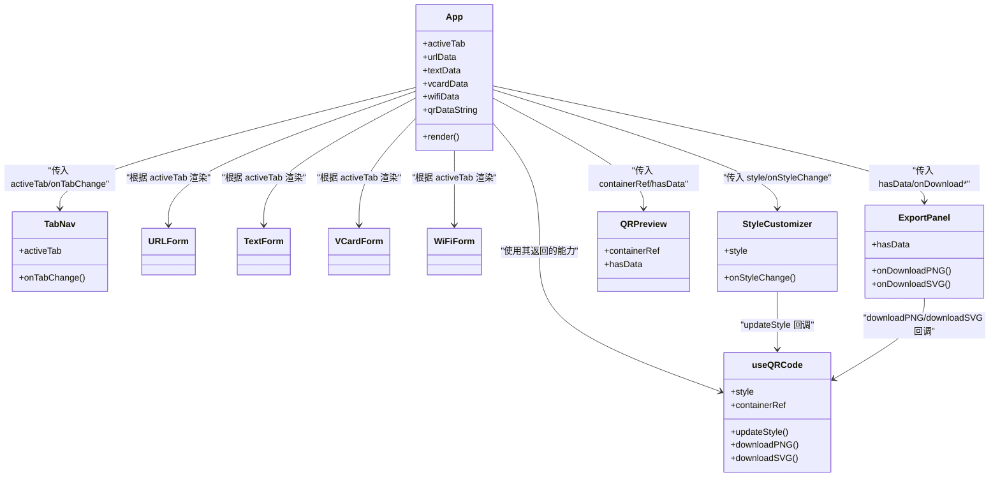
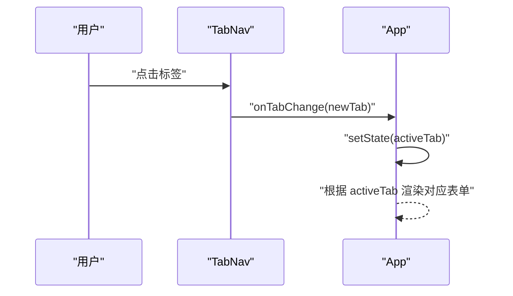
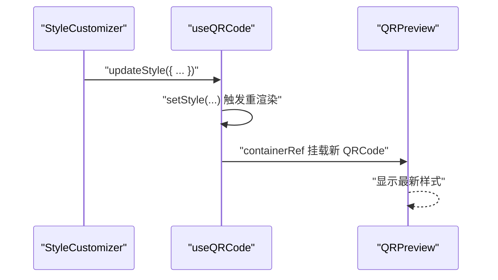
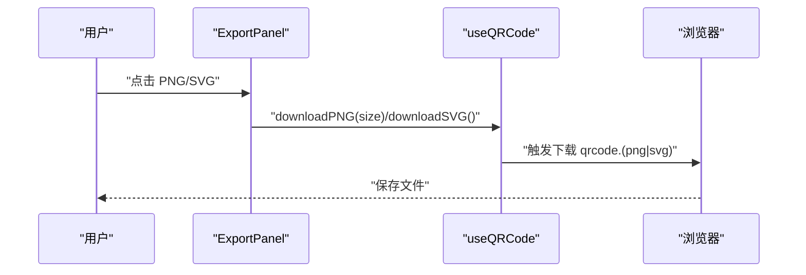
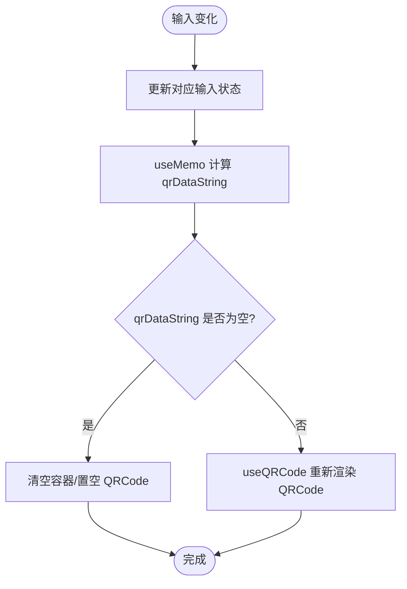
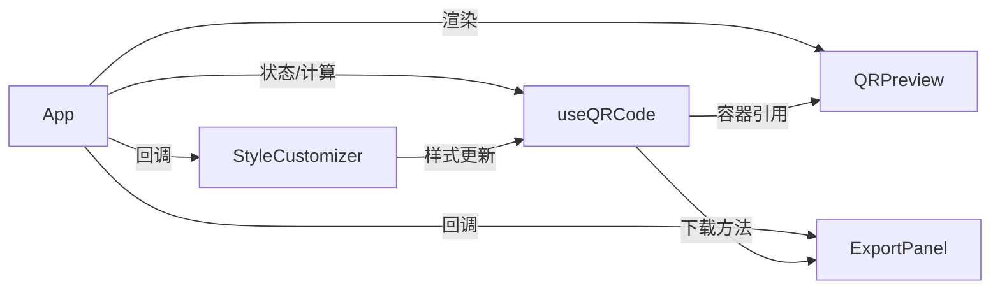

# 组件交互模式

<cite>
**本文引用的文件**
- [App.tsx](file://src/App.tsx)
- [TabNav.tsx](file://src/components/layout/TabNav.tsx)
- [StyleCustomizer.tsx](file://src/components/StyleCustomizer.tsx)
- [QRPreview.tsx](file://src/components/QRPreview.tsx)
- [ExportPanel.tsx](file://src/components/ExportPanel.tsx)
- [useQRCode.ts](file://src/hooks/useQRCode.ts)
- [qr-utils.ts](file://src/lib/qr-utils.ts)
- [URLForm.tsx](file://src/components/forms/URLForm.tsx)
- [TextForm.tsx](file://src/components/forms/TextForm.tsx)
- [VCardForm.tsx](file://src/components/forms/VCardForm.tsx)
- [WiFiForm.tsx](file://src/components/forms/WiFiForm.tsx)
- [BatchGenerator.tsx](file://src/components/BatchGenerator.tsx)
- [Header.tsx](file://src/components/layout/Header.tsx)
- [button.tsx](file://src/components/ui/button.tsx)
- [select.tsx](file://src/components/ui/select.tsx)
- [useTheme.ts](file://src/hooks/useTheme.ts)
</cite>

## 目录
1. [引言](#引言)
2. [项目结构](#项目结构)
3. [核心组件](#核心组件)
4. [架构总览](#架构总览)
5. [详细组件分析](#详细组件分析)
6. [依赖分析](#依赖分析)
7. [性能考虑](#性能考虑)
8. [故障排查指南](#故障排查指南)
9. [结论](#结论)
10. [附录](#附录)

## 引言
本文件系统性梳理 QR 码生成器的组件交互模式，聚焦以下目标：
- 父子组件通信：TabNav 如何切换不同数据输入表单；StyleCustomizer 如何影响 QRPreview 的渲染；ExportPanel 如何触发下载。
- 兄弟组件协作：输入表单与样式定制器之间的状态联动。
- 跨层级数据传递：从 App 状态到 useQRCode 钩子再到 QRPreview 和 ExportPanel 的数据流。
- 事件处理机制、回调函数传递与状态同步策略。
- 组件关系图与交互时序图。
- 生命周期管理与内存优化策略。

## 项目结构
应用采用“页面容器 + 功能模块 + 工具与钩子”的分层组织：
- 页面容器：App 负责全局状态与布局编排。
- 功能模块：TabNav、StyleCustomizer、QRPreview、ExportPanel、各表单组件、BatchGenerator。
- 工具与钩子：useQRCode 提供 QR 渲染与导出能力；qr-utils 定义样式与数据格式化工具；useTheme 管理主题。

图表来源
- [App.tsx:24-173](file://src/App.tsx#L24-L173)
- [Header.tsx:5-41](file://src/components/layout/Header.tsx#L5-L41)
- [TabNav.tsx:22-47](file://src/components/layout/TabNav.tsx#L22-L47)
- [StyleCustomizer.tsx:20-193](file://src/components/StyleCustomizer.tsx#L20-L193)
- [QRPreview.tsx:9-45](file://src/components/QRPreview.tsx#L9-L45)
- [ExportPanel.tsx:13-83](file://src/components/ExportPanel.tsx#L13-L83)
- [BatchGenerator.tsx:15-180](file://src/components/BatchGenerator.tsx#L15-L180)

章节来源
- [App.tsx:24-173](file://src/App.tsx#L24-L173)

## 核心组件
- App：集中管理 activeTab、各类输入数据、计算 qrDataString，并通过 useQRCode 获取样式与下载能力，驱动预览与导出。
- TabNav：提供标签页切换，向父组件传递新的活动类型。
- 各表单组件：URLForm、TextForm、VCardForm、WiFiForm，负责收集用户输入并通过回调更新 App 中的状态。
- StyleCustomizer：提供颜色、样式、Logo 等配置项，通过回调更新 useQRCode 内部样式。
- QRPreview：接收容器引用与 hasData，渲染 QRCode 容器。
- ExportPanel：提供 PNG/SVG 导出入口，调用 useQRCode 暴露的下载方法。
- useQRCode：封装 QR 渲染、样式更新、下载与 Blob 获取逻辑。
- qr-utils：定义样式选项、默认值、格式化函数与 QRCodeStyling 配置。

章节来源
- [App.tsx:24-173](file://src/App.tsx#L24-L173)
- [useQRCode.ts:5-75](file://src/hooks/useQRCode.ts#L5-L75)
- [qr-utils.ts:14-151](file://src/lib/qr-utils.ts#L14-L151)

## 架构总览
整体交互遵循“自上而下”和“回调驱动”的模式：
- App 作为根容器，持有所有输入状态与计算后的 qrDataString。
- useQRCode 基于 qrDataString 与当前样式创建 QRCode 并挂载到 DOM。
- QRPreview 仅负责展示容器，不直接操作数据。
- ExportPanel 通过回调触发下载，不关心内部渲染细节。
- StyleCustomizer 通过回调更新样式，触发 useQRCode 重新渲染。

图表来源
- [App.tsx:47-65](file://src/App.tsx#L47-L65)
- [useQRCode.ts:11-29](file://src/hooks/useQRCode.ts#L11-L29)
- [QRPreview.tsx:27-33](file://src/components/QRPreview.tsx#L27-L33)
- [ExportPanel.tsx:21-37](file://src/components/ExportPanel.tsx#L21-L37)

## 详细组件分析

### 组件关系与交互图

图表来源
- [App.tsx:24-173](file://src/App.tsx#L24-L173)
- [TabNav.tsx:22-47](file://src/components/layout/TabNav.tsx#L22-L47)
- [StyleCustomizer.tsx:20-193](file://src/components/StyleCustomizer.tsx#L20-L193)
- [QRPreview.tsx:9-45](file://src/components/QRPreview.tsx#L9-L45)
- [ExportPanel.tsx:13-83](file://src/components/ExportPanel.tsx#L13-L83)
- [useQRCode.ts:64-75](file://src/hooks/useQRCode.ts#L64-L75)

章节来源
- [App.tsx:24-173](file://src/App.tsx#L24-L173)
- [TabNav.tsx:22-47](file://src/components/layout/TabNav.tsx#L22-L47)
- [StyleCustomizer.tsx:20-193](file://src/components/StyleCustomizer.tsx#L20-L193)
- [QRPreview.tsx:9-45](file://src/components/QRPreview.tsx#L9-L45)
- [ExportPanel.tsx:13-83](file://src/components/ExportPanel.tsx#L13-L83)
- [useQRCode.ts:64-75](file://src/hooks/useQRCode.ts#L64-L75)

### TabNav 切换数据输入表单
- 交互流程：用户点击 TabNav 中的某个标签，TabNav 将回调 onTabChange 通知 App 更新 activeTab。
- App 根据 activeTab 条件渲染对应的表单组件（URLForm/TextForm/VCardForm/WiFiForm）。
- 表单组件通过 props 接收当前值与变更回调，实现双向绑定。

图表来源
- [TabNav.tsx:22-47](file://src/components/layout/TabNav.tsx#L22-L47)
- [App.tsx:87-115](file://src/App.tsx#L87-L115)

章节来源
- [TabNav.tsx:22-47](file://src/components/layout/TabNav.tsx#L22-L47)
- [App.tsx:87-115](file://src/App.tsx#L87-L115)

### StyleCustomizer 影响 QRPreview 渲染
- 交互流程：用户在 StyleCustomizer 中修改颜色、样式或上传 Logo，通过 onStyleChange 逐项更新 useQRCode 内部样式。
- useQRCode 基于新样式重建 QRCode 实例，并将其 append 到 QRPreview 提供的容器中。
- QRPreview 仅负责渲染容器，不参与样式计算。

图表来源
- [StyleCustomizer.tsx:31-33](file://src/components/StyleCustomizer.tsx#L31-L33)
- [useQRCode.ts:31-33](file://src/hooks/useQRCode.ts#L31-L33)
- [QRPreview.tsx:27-33](file://src/components/QRPreview.tsx#L27-L33)

章节来源
- [StyleCustomizer.tsx:20-193](file://src/components/StyleCustomizer.tsx#L20-L193)
- [useQRCode.ts:31-33](file://src/hooks/useQRCode.ts#L31-L33)
- [QRPreview.tsx:27-33](file://src/components/QRPreview.tsx#L27-L33)

### ExportPanel 触发下载功能
- 交互流程：用户在 ExportPanel 中选择导出尺寸并点击 PNG/SVG 按钮。
- ExportPanel 调用 App 传入的 onDownloadPNG/onDownloadSVG 回调，内部通过 useQRCode 的下载方法生成并触发浏览器下载。
- 下载过程包含加载态控制，避免重复触发。

图表来源
- [ExportPanel.tsx:21-37](file://src/components/ExportPanel.tsx#L21-L37)
- [useQRCode.ts:35-51](file://src/hooks/useQRCode.ts#L35-L51)

章节来源
- [ExportPanel.tsx:13-83](file://src/components/ExportPanel.tsx#L13-L83)
- [useQRCode.ts:35-51](file://src/hooks/useQRCode.ts#L35-L51)

### 表单组件与状态同步
- URLForm/TextForm/VCardForm/WiFiForm 通过 props 接收当前值与 onChange 回调，实现受控组件模式。
- App 使用 useState 管理各输入状态，useMemo 基于 activeTab 与输入值计算最终 qrDataString。
- 当任一输入变化时，qrDataString 变化会驱动 useQRCode 重新渲染 QRCode。

图表来源
- [App.tsx:28-62](file://src/App.tsx#L28-L62)
- [useQRCode.ts:11-29](file://src/hooks/useQRCode.ts#L11-L29)

章节来源
- [URLForm.tsx:10-33](file://src/components/forms/URLForm.tsx#L10-L33)
- [TextForm.tsx:9-28](file://src/components/forms/TextForm.tsx#L9-L28)
- [VCardForm.tsx:10-92](file://src/components/forms/VCardForm.tsx#L10-L92)
- [WiFiForm.tsx:17-67](file://src/components/forms/WiFiForm.tsx#L17-L67)
- [App.tsx:28-62](file://src/App.tsx#L28-L62)
- [useQRCode.ts:11-29](file://src/hooks/useQRCode.ts#L11-L29)

### 批量生成功能（兄弟组件协作）
- BatchGenerator 通过 CSV 解析生成待生成列表，独立管理自身状态。
- 导出时按默认样式批量生成 PNG 并打包下载，不依赖主流程的样式与输入。
- 该组件与主流程解耦，仅在“批量生成”标签下出现。

章节来源
- [BatchGenerator.tsx:15-180](file://src/components/BatchGenerator.tsx#L15-L180)
- [App.tsx:91-93](file://src/App.tsx#L91-L93)

## 依赖分析
- 组件耦合度：App 对子组件具有强控制权（状态与渲染），但通过回调解耦了具体行为（如下载、样式更新）。
- 数据流向：自上而下的状态与计算，自下而上的回调与事件。
- 外部依赖：QRCodeStyling、Papa、JSZip、sonner 等。

图表来源
- [App.tsx:24-173](file://src/App.tsx#L24-L173)
- [useQRCode.ts:64-75](file://src/hooks/useQRCode.ts#L64-L75)
- [QRPreview.tsx:27-33](file://src/components/QRPreview.tsx#L27-L33)
- [ExportPanel.tsx:13-83](file://src/components/ExportPanel.tsx#L13-L83)
- [StyleCustomizer.tsx:20-193](file://src/components/StyleCustomizer.tsx#L20-L193)

章节来源
- [App.tsx:24-173](file://src/App.tsx#L24-L173)
- [useQRCode.ts:64-75](file://src/hooks/useQRCode.ts#L64-L75)

## 性能考虑
- 计算缓存：App 使用 useMemo 基于 activeTab 与输入状态计算 qrDataString，避免不必要的重渲染。
- 渲染优化：useQRCode 在数据为空时清空容器并置空实例，减少 DOM 占用。
- 样式更新：updateStyle 通过局部更新样式对象，配合 QRCode 重建，避免全量重绘。
- 导出优化：ExportPanel 在导出过程中禁用按钮并设置加载态，防止并发下载。
- 批量导出：BatchGenerator 采用进度条与异步生成，避免阻塞主线程。

章节来源
- [App.tsx:47-62](file://src/App.tsx#L47-L62)
- [useQRCode.ts:11-29](file://src/hooks/useQRCode.ts#L11-L29)
- [ExportPanel.tsx:18-37](file://src/components/ExportPanel.tsx#L18-L37)
- [BatchGenerator.tsx:52-79](file://src/components/BatchGenerator.tsx#L52-L79)

## 故障排查指南
- 预览空白：检查 qrDataString 是否为空；确认 activeTab 与输入是否满足格式要求。
- 样式未生效：确认 StyleCustomizer 的回调是否正确传入 useQRCode 的 updateStyle；检查样式对象字段是否完整。
- 导出失败：确认 hasData 为真；检查浏览器下载权限；尝试更换导出尺寸。
- Logo 不显示：确认 logoUrl 已设置且跨域配置正确；检查 errorCorrectionLevel 与 hideBackgroundDots 设置。
- 主题切换异常：确认 useTheme 返回的 isDark 与 toggle 正常工作；检查 DOM 操作时机。

章节来源
- [App.tsx:67](file://src/App.tsx#L67)
- [StyleCustomizer.tsx:23-36](file://src/components/StyleCustomizer.tsx#L23-L36)
- [useQRCode.ts:35-51](file://src/hooks/useQRCode.ts#L35-L51)
- [qr-utils.ts:63-101](file://src/lib/qr-utils.ts#L63-L101)
- [useTheme.ts:14-25](file://src/hooks/useTheme.ts#L14-L25)

## 结论
本项目通过清晰的父子与回调交互模式，实现了从输入到渲染再到导出的完整链路。TabNav、表单、样式定制器与导出面板各司其职，App 作为协调者统一管理状态与计算。借助 useMemo、useCallback 与受控组件模式，系统在功能完整性与性能之间取得平衡。建议后续可进一步抽象通用表单与导出逻辑，提升复用性与可测试性。

## 附录
- 组件生命周期与内存优化要点
  - 组件卸载时应清理定时器与事件监听，避免内存泄漏。
  - QRCode 实例在数据为空时及时销毁，释放 DOM 与资源。
  - 批量导出完成后回收 Blob URL，避免内存累积。

- 最佳实践
  - 使用受控组件统一管理输入状态，避免非受控场景。
  - 将样式与数据格式化逻辑集中在工具模块，便于维护与测试。
  - 对外部依赖进行版本锁定与降级处理，确保稳定性。