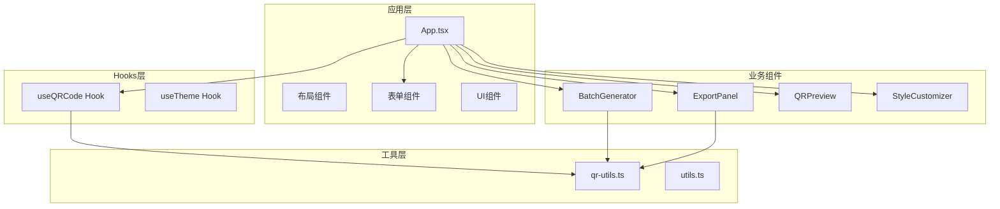
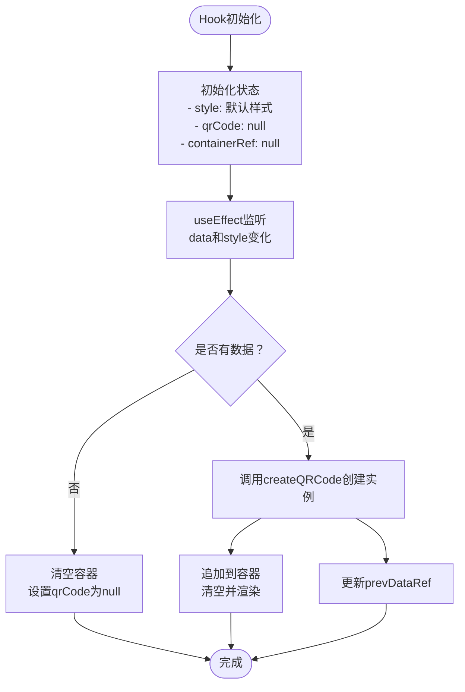
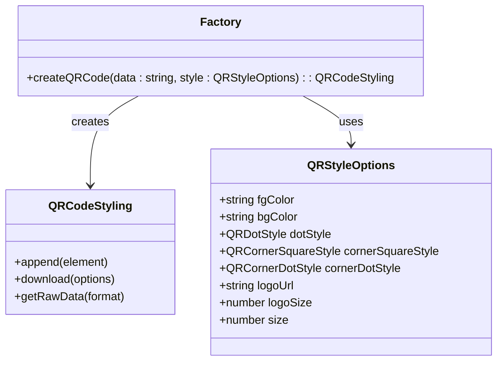
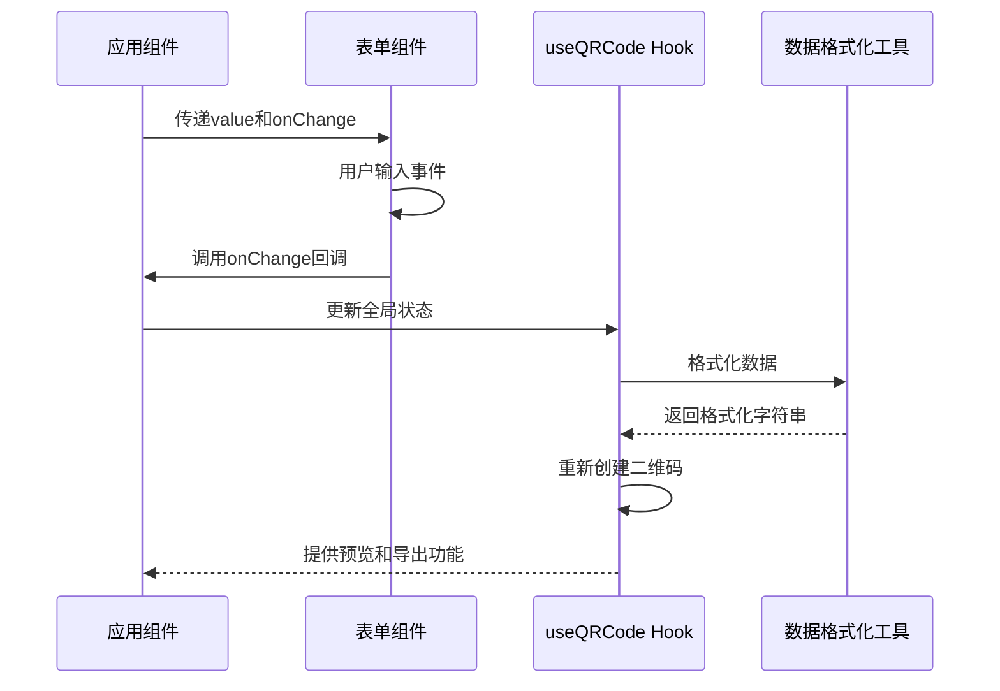
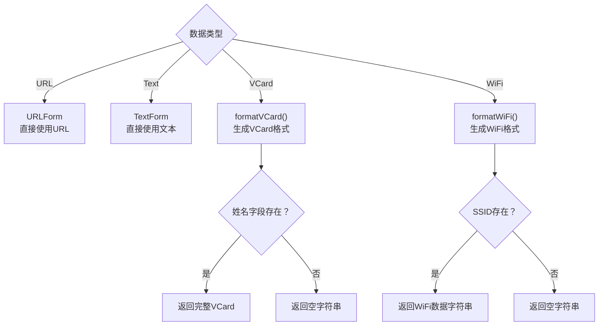
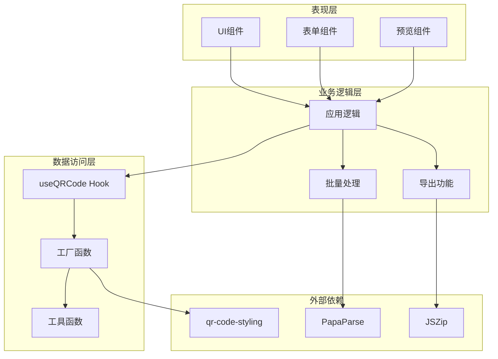
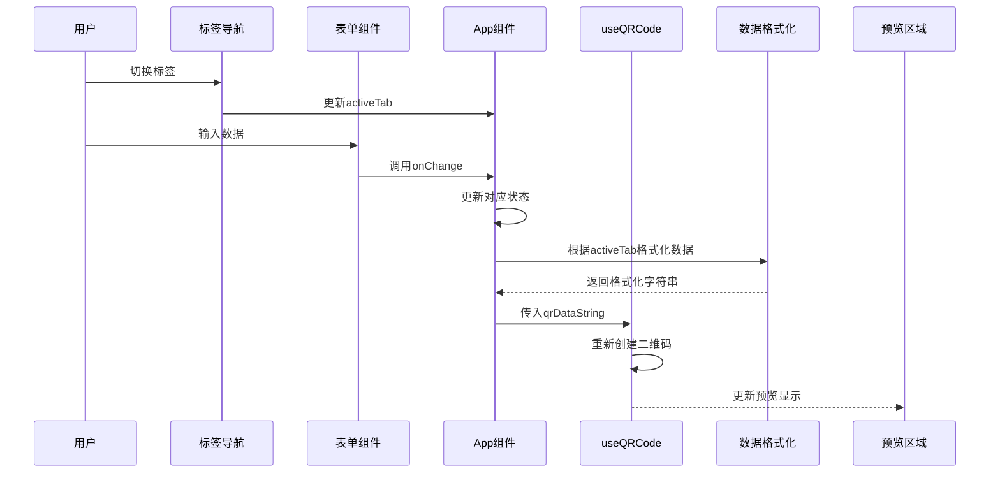
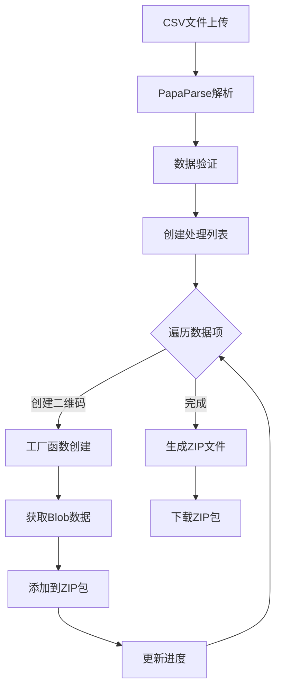
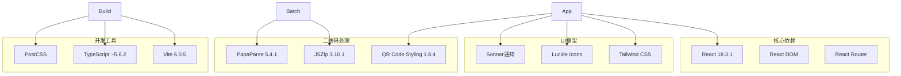
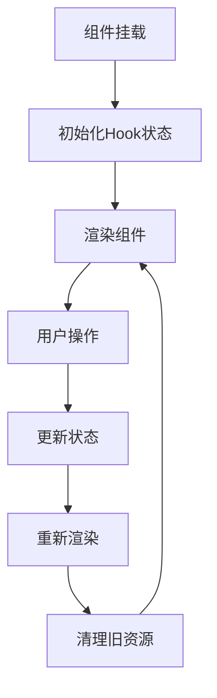

# 设计模式应用

<cite>
**本文档引用的文件**
- [useQRCode.ts](file://src/hooks/useQRCode.ts)
- [qr-utils.ts](file://src/lib/qr-utils.ts)
- [TextForm.tsx](file://src/components/forms/TextForm.tsx)
- [URLForm.tsx](file://src/components/forms/URLForm.tsx)
- [VCardForm.tsx](file://src/components/forms/VCardForm.tsx)
- [WiFiForm.tsx](file://src/components/forms/WiFiForm.tsx)
- [App.tsx](file://src/App.tsx)
- [BatchGenerator.tsx](file://src/components/BatchGenerator.tsx)
- [ExportPanel.tsx](file://src/components/ExportPanel.tsx)
- [QRPreview.tsx](file://src/components/QRPreview.tsx)
- [StyleCustomizer.tsx](file://src/components/StyleCustomizer.tsx)
- [package.json](file://package.json)
</cite>

## 目录
1. [引言](#引言)
2. [项目结构](#项目结构)
3. [核心设计模式](#核心设计模式)
4. [架构概览](#架构概览)
5. [详细组件分析](#详细组件分析)
6. [依赖关系分析](#依赖关系分析)
7. [性能考虑](#性能考虑)
8. [故障排除指南](#故障排除指南)
9. [结论](#结论)

## 引言

QR码生成器是一个基于React和TypeScript构建的现代化二维码生成工具。该项目通过精心设计的架构实现了多种设计模式，包括Hook模式、工厂模式和策略模式，为开发者提供了优雅且可扩展的解决方案。

本项目的核心目标是提供一个用户友好的界面，支持多种数据类型的二维码生成，包括URL、纯文本、联系人名片(VCard)和WiFi凭证。通过使用现代前端技术栈和设计模式，项目实现了高度的模块化、可维护性和可扩展性。

## 项目结构

项目采用功能驱动的组织方式，将相关的组件和逻辑按功能模块进行分组：

**图表来源**
- [App.tsx:1-173](file://src/App.tsx#L1-L173)
- [useQRCode.ts:1-75](file://src/hooks/useQRCode.ts#L1-L75)
- [qr-utils.ts:1-151](file://src/lib/qr-utils.ts#L1-L151)

**章节来源**
- [App.tsx:1-173](file://src/App.tsx#L1-L173)
- [package.json:1-37](file://package.json#L1-L37)

## 核心设计模式

### Hook模式：useQRCode

Hook模式是React生态系统中的重要设计模式，useQRCode Hook展示了如何将复杂的状态管理和副作用逻辑封装在一个可复用的函数中。

#### 模式实现

useQRCode Hook实现了以下核心功能：

1. **状态管理**：封装了二维码样式、QRCode实例、容器引用等状态
2. **副作用处理**：自动处理二维码的创建、更新和销毁
3. **导出功能**：提供PNG和SVG格式的导出能力
4. **响应式更新**：根据数据变化自动重新生成二维码

#### 关键特性

**图表来源**
- [useQRCode.ts:5-29](file://src/hooks/useQRCode.ts#L5-L29)

#### 应用场景

- **实时预览**：当用户输入数据时自动更新二维码显示
- **样式定制**：支持动态修改二维码外观属性
- **批量导出**：提供多种格式的导出功能
- **响应式设计**：适配不同屏幕尺寸和设备

#### 带来的好处

- **代码复用**：避免在多个组件中重复实现相同的逻辑
- **状态封装**：将复杂的副作用逻辑封装在Hook内部
- **易于测试**：Hook可以独立测试其逻辑和行为
- **性能优化**：通过useCallback和useMemo避免不必要的重渲染

**章节来源**
- [useQRCode.ts:1-75](file://src/hooks/useQRCode.ts#L1-L75)

### 工厂模式：createQRCode工厂函数

工厂模式通过专门的工厂函数来创建对象，隐藏了对象创建的复杂性，提供了统一的创建接口。

#### 模式实现

createQRCode工厂函数负责创建QRCodeStyling实例，它接收数据字符串和样式配置，并返回配置好的二维码实例。

**图表来源**
- [qr-utils.ts:63-101](file://src/lib/qr-utils.ts#L63-L101)
- [qr-utils.ts:14-23](file://src/lib/qr-utils.ts#L14-L23)

#### 关键实现细节

1. **参数验证**：检查样式配置的有效性
2. **条件配置**：根据logoUrl的存在动态调整配置
3. **错误纠正级别**：根据是否包含Logo自动调整纠错等级
4. **统一接口**：为所有二维码类型提供一致的创建接口

#### 应用场景

- **单个二维码生成**：在预览和导出功能中使用
- **批量处理**：在批量生成器中循环创建多个二维码
- **动态样式**：根据用户选择的样式配置创建实例

#### 带来的好处

- **简化创建过程**：隐藏QRCodeStyling的复杂配置
- **一致性保证**：确保所有二维码实例遵循相同的配置规则
- **扩展性**：便于添加新的样式选项或配置项
- **测试友好**：工厂函数易于单元测试

**章节来源**
- [qr-utils.ts:63-101](file://src/lib/qr-utils.ts#L63-L101)

### 策略模式：统一表单接口

策略模式允许在运行时选择不同的算法或行为，项目中的表单组件展示了如何通过统一的接口实现多数据类型的处理。

#### 模式实现

所有表单组件都遵循相同的接口约定：

**图表来源**
- [App.tsx:47-65](file://src/App.tsx#L47-L65)
- [useQRCode.ts:20-29](file://src/hooks/useQRCode.ts#L20-L29)

#### 统一接口设计

每个表单组件都实现相同的props接口：

| 组件 | Props接口 | 数据类型 |
|------|-----------|----------|
| TextForm | `{ value: string, onChange: (val: string) => void }` | 纯文本 |
| URLForm | `{ value: string, onChange: (val: string) => void }` | URL链接 |
| VCardForm | `{ value: VCardData, onChange: (val: VCardData) => void }` | 联系人信息 |
| WiFiForm | `{ value: WiFiData, onChange: (val: WiFiData) => void }` | WiFi凭证 |

#### 数据格式化策略

项目实现了针对不同数据类型的格式化策略：

**图表来源**
- [App.tsx:47-62](file://src/App.tsx#L47-L62)
- [qr-utils.ts:42-61](file://src/lib/qr-utils.ts#L42-L61)

#### 应用场景

- **多数据类型支持**：统一处理URL、文本、VCard、WiFi等多种数据类型
- **动态表单切换**：根据用户选择的类型动态渲染相应的表单
- **数据验证**：在生成二维码前进行必要的数据验证和格式化
- **用户体验**：提供直观的表单界面和实时反馈

#### 带来的好处

- **代码复用**：统一的表单接口减少了重复代码
- **易于扩展**：新增数据类型只需实现相应的格式化函数和表单组件
- **类型安全**：利用TypeScript确保数据类型的正确性
- **维护性**：清晰的接口约定便于代码维护和团队协作

**章节来源**
- [TextForm.tsx:4-7](file://src/components/forms/TextForm.tsx#L4-L7)
- [URLForm.tsx:5-8](file://src/components/forms/URLForm.tsx#L5-L8)
- [VCardForm.tsx:5-8](file://src/components/forms/VCardForm.tsx#L5-L8)
- [WiFiForm.tsx:6-9](file://src/components/forms/WiFiForm.tsx#L6-L9)
- [qr-utils.ts:42-61](file://src/lib/qr-utils.ts#L42-L61)

## 架构概览

项目采用了分层架构设计，将关注点分离到不同的层次中：

**图表来源**
- [App.tsx:1-173](file://src/App.tsx#L1-L173)
- [useQRCode.ts:1-75](file://src/hooks/useQRCode.ts#L1-L75)
- [qr-utils.ts:1-151](file://src/lib/qr-utils.ts#L1-L151)

## 详细组件分析

### 应用主组件：App

App组件作为整个应用的协调者，展示了如何将三种设计模式有机结合：

#### 核心功能

1. **状态管理**：管理所有表单的数据状态
2. **数据聚合**：根据当前激活的标签页聚合相应的数据
3. **Hook集成**：集成useQRCode Hook提供预览和导出功能
4. **组件编排**：协调各个子组件的工作流程

#### 数据流控制

**图表来源**
- [App.tsx:24-65](file://src/App.tsx#L24-L65)
- [useQRCode.ts:11-29](file://src/hooks/useQRCode.ts#L11-L29)

**章节来源**
- [App.tsx:1-173](file://src/App.tsx#L1-L173)

### 批量生成器：BatchGenerator

批量生成器展示了工厂模式在大规模数据处理中的应用：

#### 核心功能

1. **CSV文件解析**：使用PapaParse解析CSV文件
2. **批量处理**：循环处理每个数据项
3. **并行导出**：使用JSZip打包所有生成的二维码
4. **进度跟踪**：提供实时的处理进度反馈

#### 处理流程

**图表来源**
- [BatchGenerator.tsx:21-79](file://src/components/BatchGenerator.tsx#L21-L79)

**章节来源**
- [BatchGenerator.tsx:1-180](file://src/components/BatchGenerator.tsx#L1-L180)

### 导出面板：ExportPanel

导出面板展示了策略模式在用户交互中的应用：

#### 功能特点

1. **统一导出接口**：提供PNG和SVG两种导出策略
2. **尺寸选择**：支持多种导出尺寸的选择
3. **异步处理**：使用async/await处理导出操作
4. **状态管理**：跟踪导出过程的状态

**章节来源**
- [ExportPanel.tsx:1-83](file://src/components/ExportPanel.tsx#L1-L83)

## 依赖关系分析

项目使用了现代化的前端技术栈，各依赖之间的关系如下：

**图表来源**
- [package.json:11-35](file://package.json#L11-L35)

### 关键依赖分析

1. **qr-code-styling**：提供二维码生成的核心功能
2. **papaparse**：处理CSV文件的解析
3. **jszip**：生成ZIP压缩包
4. **lucide-react**：提供图标组件
5. **sonner**：提供现代化的通知系统

**章节来源**
- [package.json:1-37](file://package.json#L1-L37)

## 性能考虑

### 优化策略

1. **Hook缓存**：使用useCallback和useMemo避免不必要的重渲染
2. **条件渲染**：只有在有数据时才创建和渲染二维码
3. **异步处理**：批量导出使用异步操作避免阻塞UI
4. **资源管理**：及时清理DOM元素和事件监听器

### 内存管理

**图表来源**
- [useQRCode.ts:11-29](file://src/hooks/useQRCode.ts#L11-L29)

## 故障排除指南

### 常见问题及解决方案

1. **二维码不显示**
   - 检查数据输入是否有效
   - 确认容器引用是否正确设置
   - 验证样式配置的合法性

2. **导出失败**
   - 检查浏览器兼容性
   - 确认文件大小限制
   - 验证导出格式的支持性

3. **批量处理超时**
   - 分批处理大量数据
   - 优化CSV文件格式
   - 增加进度反馈

**章节来源**
- [useQRCode.ts:11-29](file://src/hooks/useQRCode.ts#L11-L29)
- [BatchGenerator.tsx:52-79](file://src/components/BatchGenerator.tsx#L52-L79)

## 结论

QR码生成器项目成功地将三种重要的设计模式融入到实际的代码实现中：

1. **Hook模式**通过useQRCode Hook实现了复杂状态逻辑的封装，提供了简洁的API接口
2. **工厂模式**通过createQRCode工厂函数简化了二维码实例的创建过程
3. **策略模式**通过统一的表单接口实现了多数据类型的灵活处理

这些设计模式的结合使用不仅提高了代码的可维护性和可扩展性，还为用户提供了优秀的使用体验。项目展示了如何在实际开发中恰当地应用设计模式，为其他类似项目提供了良好的参考模板。

通过模块化的架构设计和清晰的关注点分离，项目为未来的功能扩展和技术演进奠定了坚实的基础。无论是学习设计模式还是实际项目开发，这个QR码生成器都是一个值得深入研究的优秀案例。