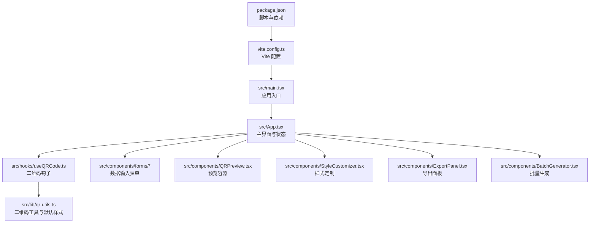
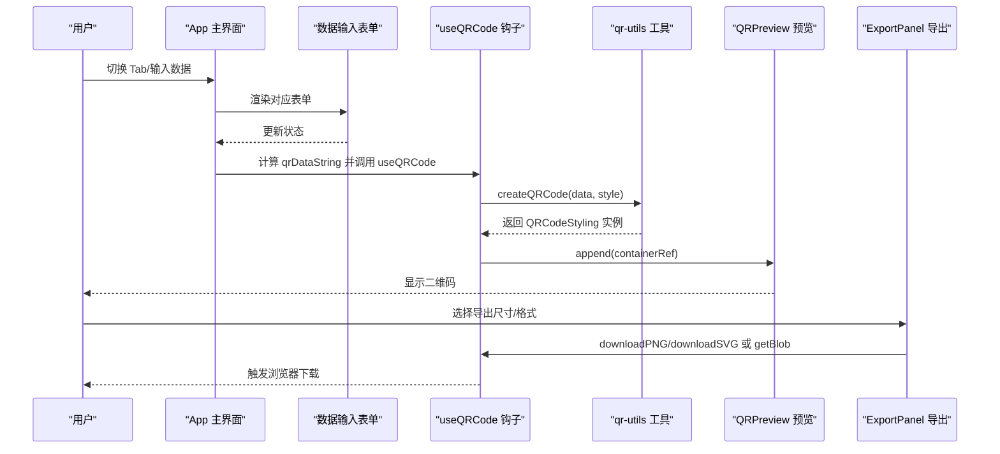
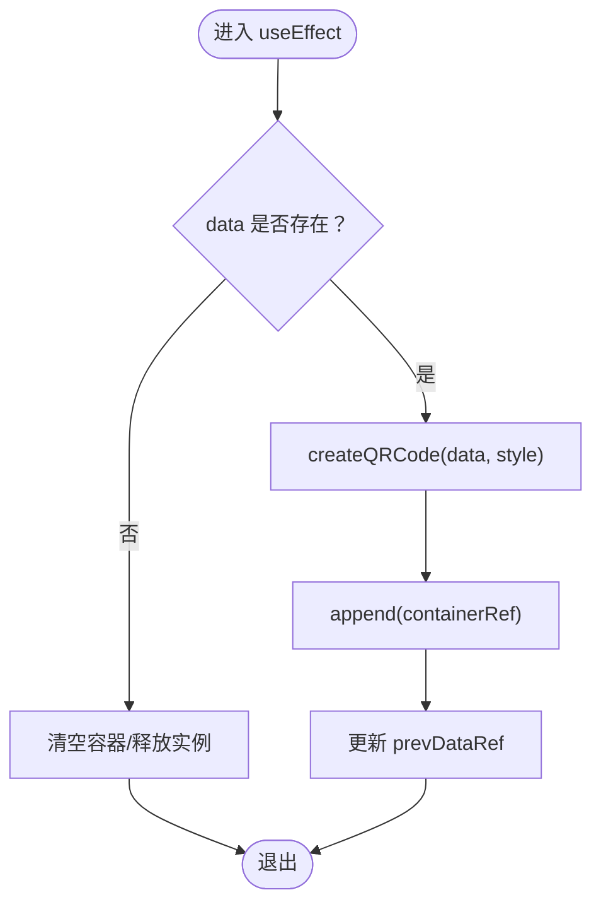
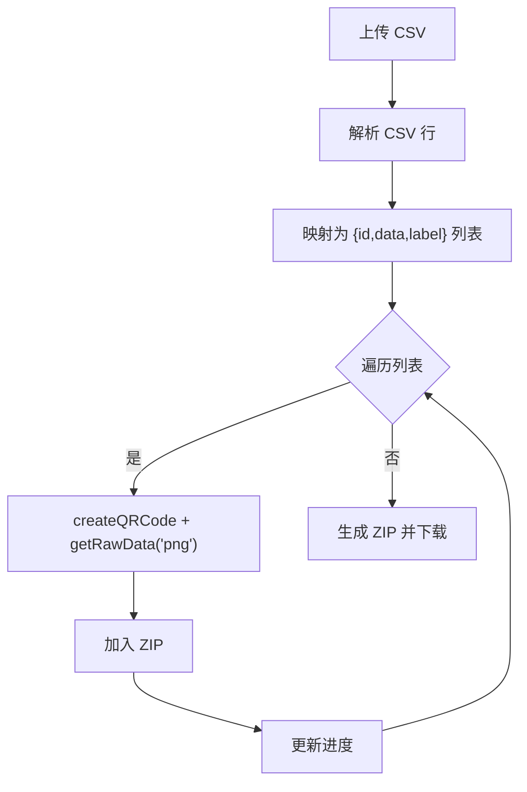
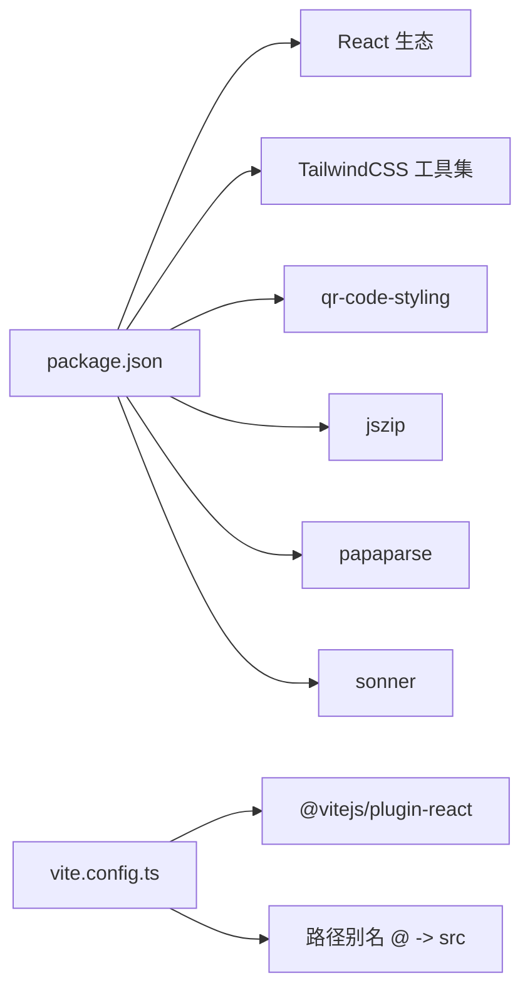

# 故障排除

<cite>
**本文引用的文件**
- [package.json](file://package.json)
- [vite.config.ts](file://vite.config.ts)
- [src/main.tsx](file://src/main.tsx)
- [src/App.tsx](file://src/App.tsx)
- [src/hooks/useQRCode.ts](file://src/hooks/useQRCode.ts)
- [src/lib/qr-utils.ts](file://src/lib/qr-utils.ts)
- [src/lib/utils.ts](file://src/lib/utils.ts)
- [src/components/QRPreview.tsx](file://src/components/QRPreview.tsx)
- [src/components/ExportPanel.tsx](file://src/components/ExportPanel.tsx)
- [src/components/BatchGenerator.tsx](file://src/components/BatchGenerator.tsx)
- [src/components/StyleCustomizer.tsx](file://src/components/StyleCustomizer.tsx)
- [src/components/forms/URLForm.tsx](file://src/components/forms/URLForm.tsx)
- [src/components/forms/TextForm.tsx](file://src/components/forms/TextForm.tsx)
- [src/components/forms/VCardForm.tsx](file://src/components/forms/VCardForm.tsx)
- [src/components/forms/WiFiForm.tsx](file://src/components/forms/WiFiForm.tsx)
</cite>

## 目录
1. [简介](#简介)
2. [项目结构](#项目结构)
3. [核心组件](#核心组件)
4. [架构总览](#架构总览)
5. [详细组件分析](#详细组件分析)
6. [依赖分析](#依赖分析)
7. [性能考虑](#性能考虑)
8. [故障排除指南](#故障排除指南)
9. [结论](#结论)
10. [附录](#附录)

## 简介
本指南面向 QR 码生成器项目的使用者与维护者，聚焦于构建错误、运行时错误与性能问题的系统化排查与修复。内容涵盖浏览器开发者工具使用、日志记录策略、性能分析方法，以及二维码生成异常、样式渲染问题、批量处理错误的诊断与预防。同时提供错误代码参考、常见错误消息解释与社区支持渠道。

## 项目结构
该应用采用 React + Vite 的前端架构，核心模块围绕“数据输入 → 预览与样式定制 → 导出/批量导出”的工作流组织。关键目录与职责如下：
- src/main.tsx：应用入口，挂载根组件
- src/App.tsx：主界面与状态管理，负责切换数据类型与调用钩子
- src/hooks/useQRCode.ts：封装二维码生成、样式更新与导出逻辑
- src/lib/qr-utils.ts：二维码参数与格式化工具（含默认样式、导出尺寸、预设颜色等）
- src/components/*：按功能拆分的 UI 组件（表单、预览、样式定制、批量生成、导出面板）
- vite.config.ts：开发服务器与路径别名配置
- package.json：脚本与依赖声明

图表来源
- [src/main.tsx:1-11](file://src/main.tsx#L1-L11)
- [src/App.tsx:1-173](file://src/App.tsx#L1-L173)
- [src/hooks/useQRCode.ts:1-75](file://src/hooks/useQRCode.ts#L1-L75)
- [src/lib/qr-utils.ts:1-151](file://src/lib/qr-utils.ts#L1-L151)
- [src/components/QRPreview.tsx:1-45](file://src/components/QRPreview.tsx#L1-L45)
- [src/components/StyleCustomizer.tsx:1-193](file://src/components/StyleCustomizer.tsx#L1-L193)
- [src/components/ExportPanel.tsx:1-83](file://src/components/ExportPanel.tsx#L1-L83)
- [src/components/BatchGenerator.tsx:1-180](file://src/components/BatchGenerator.tsx#L1-L180)
- [vite.config.ts:1-13](file://vite.config.ts#L1-L13)
- [package.json:1-37](file://package.json#L1-L37)

章节来源
- [src/main.tsx:1-11](file://src/main.tsx#L1-L11)
- [src/App.tsx:1-173](file://src/App.tsx#L1-L173)
- [vite.config.ts:1-13](file://vite.config.ts#L1-L13)
- [package.json:1-37](file://package.json#L1-L37)

## 核心组件
- 应用入口与主界面：负责路由式 tab 切换、数据输入表单渲染、预览与导出区域展示、批量生成模式切换。
- 二维码钩子：封装 QRCodeStyling 实例创建、DOM 注入、样式更新、PNG/SVG 导出与 Blob 获取。
- 工具库：提供默认样式、导出尺寸、预设颜色、VCard/WiFi 格式化函数与二维码实例构造。
- 表单组件：分别处理 URL、文本、联系人名片、WiFi 数据输入；包含基础校验与占位提示。
- 预览与导出：预览容器根据是否有数据动态显示；导出面板支持 PNG 尺寸选择与 SVG/PNG 下载。
- 批量生成：CSV 解析、逐项生成 PNG 并打包为 ZIP 下载，带进度反馈。

章节来源
- [src/App.tsx:1-173](file://src/App.tsx#L1-L173)
- [src/hooks/useQRCode.ts:1-75](file://src/hooks/useQRCode.ts#L1-L75)
- [src/lib/qr-utils.ts:1-151](file://src/lib/qr-utils.ts#L1-L151)
- [src/components/QRPreview.tsx:1-45](file://src/components/QRPreview.tsx#L1-L45)
- [src/components/ExportPanel.tsx:1-83](file://src/components/ExportPanel.tsx#L1-L83)
- [src/components/BatchGenerator.tsx:1-180](file://src/components/BatchGenerator.tsx#L1-L180)

## 架构总览
下图展示了从用户输入到二维码渲染与导出的关键交互流程。

图表来源
- [src/App.tsx:47-65](file://src/App.tsx#L47-L65)
- [src/hooks/useQRCode.ts:20-26](file://src/hooks/useQRCode.ts#L20-L26)
- [src/lib/qr-utils.ts:63-101](file://src/lib/qr-utils.ts#L63-L101)
- [src/components/QRPreview.tsx:27-33](file://src/components/QRPreview.tsx#L27-L33)
- [src/components/ExportPanel.tsx:21-37](file://src/components/ExportPanel.tsx#L21-L37)

## 详细组件分析

### 组件 A：useQRCode 钩子
- 职责：创建 QRCodeStyling 实例、注入 DOM、响应样式变化、提供导出与 Blob 获取能力。
- 关键点：
  - 当数据为空时清空容器并释放实例，避免残留 DOM。
  - 样式更新通过回调合并，确保响应式刷新。
  - 导出时按需调整尺寸，PNG 默认使用较高分辨率，SVG 固定尺寸以保证矢量质量。
- 可能问题：
  - 容器未正确传入或被提前卸载导致 append 失败。
  - 样式变更后未触发重新渲染（检查是否使用了正确的 ref）。
  - 导出失败可能由跨域图片（logo）或内存不足引起。

图表来源
- [src/hooks/useQRCode.ts:11-29](file://src/hooks/useQRCode.ts#L11-L29)

章节来源
- [src/hooks/useQRCode.ts:1-75](file://src/hooks/useQRCode.ts#L1-L75)

### 组件 B：QRPreview 预览
- 职责：根据是否有数据决定显示占位或 SVG/CSS 渲染的二维码。
- 关键点：
  - 无数据时显示提示与图标；有数据时隐藏提示并渲染容器。
  - 容器类名控制边框、阴影与动画，确保视觉一致性。
- 可能问题：
  - 容器未正确传入或 ref 未初始化导致无法注入二维码。
  - 样式覆盖导致二维码不可见（检查容器最小宽高与溢出设置）。

章节来源
- [src/components/QRPreview.tsx:1-45](file://src/components/QRPreview.tsx#L1-L45)

### 组件 C：ExportPanel 导出
- 职责：提供 PNG 尺寸选择与 SVG/PNG 导出按钮，禁用态与加载态控制。
- 关键点：
  - 导出前设置加载态，try/finally 确保最终恢复。
  - 尺寸选项来自工具库的预设集合。
- 可能问题：
  - 无数据或正在导出时按钮禁用，属预期行为。
  - 导出尺寸过大导致内存压力或下载失败。

章节来源
- [src/components/ExportPanel.tsx:1-83](file://src/components/ExportPanel.tsx#L1-L83)
- [src/lib/qr-utils.ts:134-139](file://src/lib/qr-utils.ts#L134-L139)

### 组件 D：BatchGenerator 批量生成
- 职责：解析 CSV、生成多张二维码、打包为 ZIP 并下载，带进度条。
- 关键点：
  - 使用 CSV 解析库读取列，优先匹配 data/url/text/content，可选 label/name。
  - 逐项生成 PNG Blob 并写入 ZIP，最后触发下载。
  - 进度基于索引计算百分比。
- 可能问题：
  - CSV 缺少必要列导致无数据项。
  - 单项生成失败（如数据过长、格式不支持）需跳过并记录。
  - 大批量导出会占用较多内存，建议分批处理。

图表来源
- [src/components/BatchGenerator.tsx:21-79](file://src/components/BatchGenerator.tsx#L21-L79)
- [src/lib/qr-utils.ts:58-61](file://src/lib/qr-utils.ts#L58-L61)

章节来源
- [src/components/BatchGenerator.tsx:1-180](file://src/components/BatchGenerator.tsx#L1-L180)

### 组件 E：StyleCustomizer 样式定制
- 职责：提供预设配色、自定义前景/背景色、点与角样式、Logo 上传与大小调节。
- 关键点：
  - Logo 上传使用 FileReader 转为 DataURL，便于离线渲染。
  - 样式更新通过回调合并，确保与钩子同步。
- 可能问题：
  - 跨域图片导致渲染异常或导出失败。
  - Logo 太大影响二维码纠错等级与识别率。

章节来源
- [src/components/StyleCustomizer.tsx:1-193](file://src/components/StyleCustomizer.tsx#L1-L193)
- [src/lib/qr-utils.ts:103-112](file://src/lib/qr-utils.ts#L103-L112)

### 组件 F：表单组件
- 职责：URLForm、TextForm、VCardForm、WiFiForm 分别处理不同数据类型的输入与校验。
- 关键点：
  - URL 必须包含协议前缀；WiFi 在无密码时禁用密码输入。
  - 文本输入限制字符数提示。
- 可能问题：
  - 输入格式不符合要求导致生成异常（例如 URL 缺少协议、WiFi 加密与密码不匹配）。

章节来源
- [src/components/forms/URLForm.tsx:1-33](file://src/components/forms/URLForm.tsx#L1-L33)
- [src/components/forms/TextForm.tsx:1-28](file://src/components/forms/TextForm.tsx#L1-L28)
- [src/components/forms/VCardForm.tsx:1-92](file://src/components/forms/VCardForm.tsx#L1-L92)
- [src/components/forms/WiFiForm.tsx:1-67](file://src/components/forms/WiFiForm.tsx#L1-L67)

## 依赖分析
- 运行时依赖：React 生态、路由、UI 组件库、TailwindCSS 工具集、二维码渲染库、压缩与 CSV 解析库、通知组件。
- 开发依赖：TypeScript、Vite、React 插件、PostCSS、TailwindCSS。
- 关键外部库：
  - 二维码渲染：用于生成 SVG/CSS 二维码与导出 PNG/SVG。
  - CSV 解析：用于批量导入。
  - 压缩：用于批量导出 ZIP。

图表来源
- [package.json:11-35](file://package.json#L11-L35)
- [vite.config.ts:5-12](file://vite.config.ts#L5-L12)

章节来源
- [package.json:1-37](file://package.json#L1-37)
- [vite.config.ts:1-13](file://vite.config.ts#L1-L13)

## 性能考虑
- 预览渲染：
  - 使用 useMemo 计算 qrDataString，避免不必要的重渲染。
  - 钩子在数据为空时清空容器，减少 DOM 占用。
- 导出优化：
  - PNG 尺寸可选，建议按需选择，避免过大尺寸导致内存压力。
  - SVG 导出固定尺寸，适合矢量编辑与缩放。
- 批量处理：
  - 建议分批生成与下载，避免一次性生成过多大图导致卡顿或崩溃。
  - ZIP 生成在内存中进行，注意控制并发与队列长度。
- 样式与资源：
  - Logo 使用 DataURL 可避免跨域问题，但会增加内存占用。
  - 错误纠正等级随是否使用 Logo 动态调整，平衡识别率与复杂度。

章节来源
- [src/App.tsx:47-65](file://src/App.tsx#L47-L65)
- [src/hooks/useQRCode.ts:11-29](file://src/hooks/useQRCode.ts#L11-L29)
- [src/lib/qr-utils.ts:84-88](file://src/lib/qr-utils.ts#L84-L88)
- [src/components/BatchGenerator.tsx:52-79](file://src/components/BatchGenerator.tsx#L52-L79)

## 故障排除指南

### 一、构建与环境问题
- 症状：启动失败、热更新异常、路径别名报错
- 排查步骤：
  - 检查 Node 版本与依赖安装是否完整
  - 确认 Vite 配置中的路径别名与实际目录一致
  - 清理缓存后重装依赖
- 相关文件：
  - [vite.config.ts:7-10](file://vite.config.ts#L7-L10)
  - [package.json:6-9](file://package.json#L6-L9)

章节来源
- [vite.config.ts:1-13](file://vite.config.ts#L1-L13)
- [package.json:1-37](file://package.json#L1-L37)

### 二、运行时错误

#### 1. 二维码未显示或空白
- 症状：预览容器为空，无二维码
- 可能原因：
  - 数据为空或未正确传入
  - 容器 ref 未正确传递或 DOM 未就绪
  - 样式更新未触发重新渲染
- 处理建议：
  - 确认 hasData 条件与容器可见性
  - 检查容器 ref 是否为 HTMLDivElement
  - 在样式更新后确认钩子内部重新 append
- 相关文件：
  - [src/App.tsx:142-145](file://src/App.tsx#L142-L145)
  - [src/components/QRPreview.tsx:27-33](file://src/components/QRPreview.tsx#L27-L33)
  - [src/hooks/useQRCode.ts:20-26](file://src/hooks/useQRCode.ts#L20-L26)

章节来源
- [src/App.tsx:134-154](file://src/App.tsx#L134-L154)
- [src/components/QRPreview.tsx:1-45](file://src/components/QRPreview.tsx#L1-L45)
- [src/hooks/useQRCode.ts:11-29](file://src/hooks/useQRCode.ts#L11-L29)

#### 2. 导出失败或下载异常
- 症状：点击导出无响应或下载失败
- 可能原因：
  - 数据为空或导出过程中数据变化
  - PNG 尺寸过大导致内存不足
  - 跨域图片（Logo）导致渲染或导出失败
- 处理建议：
  - 确保导出前 hasData 为真且非加载中
  - 降低导出尺寸或分批导出
  - 移除或更换非同源图片
- 相关文件：
  - [src/components/ExportPanel.tsx:21-37](file://src/components/ExportPanel.tsx#L21-L37)
  - [src/hooks/useQRCode.ts:35-51](file://src/hooks/useQRCode.ts#L35-L51)
  - [src/lib/qr-utils.ts:90-98](file://src/lib/qr-utils.ts#L90-L98)

章节来源
- [src/components/ExportPanel.tsx:1-83](file://src/components/ExportPanel.tsx#L1-L83)
- [src/hooks/useQRCode.ts:35-62](file://src/hooks/useQRCode.ts#L35-L62)
- [src/lib/qr-utils.ts:63-101](file://src/lib/qr-utils.ts#L63-L101)

#### 3. 批量处理错误
- 症状：CSV 无法解析、生成中断、ZIP 下载失败
- 可能原因：
  - CSV 缺少必要列或格式不规范
  - 单项生成失败（数据过长、格式不支持）
  - 内存不足导致 ZIP 生成失败
- 处理建议：
  - 校验 CSV 列名与数据类型，确保至少包含 data/url/text 列
  - 对单项生成失败进行捕获并跳过，记录日志
  - 分批处理与限速，避免内存峰值过高
- 相关文件：
  - [src/components/BatchGenerator.tsx:21-46](file://src/components/BatchGenerator.tsx#L21-L46)
  - [src/components/BatchGenerator.tsx:52-79](file://src/components/BatchGenerator.tsx#L52-L79)

章节来源
- [src/components/BatchGenerator.tsx:1-180](file://src/components/BatchGenerator.tsx#L1-L180)

#### 4. 样式渲染问题
- 症状：二维码颜色异常、Logo 不显示、角样式不生效
- 可能原因：
  - 颜色值非法或格式不正确
  - Logo 为跨域图片或尺寸过大
  - 错误纠正等级影响识别效果
- 处理建议：
  - 使用合法的颜色值或预设配色
  - 确保 Logo 同源或使用 DataURL
  - 适当调整 logoSize 与二维码尺寸
- 相关文件：
  - [src/components/StyleCustomizer.tsx:23-36](file://src/components/StyleCustomizer.tsx#L23-L36)
  - [src/lib/qr-utils.ts:103-112](file://src/lib/qr-utils.ts#L103-L112)
  - [src/lib/qr-utils.ts:84-88](file://src/lib/qr-utils.ts#L84-L88)

章节来源
- [src/components/StyleCustomizer.tsx:1-193](file://src/components/StyleCustomizer.tsx#L1-L193)
- [src/lib/qr-utils.ts:103-112](file://src/lib/qr-utils.ts#L103-L112)

### 三、调试技巧与工具

- 浏览器开发者工具
  - Elements：检查 QRPreview 容器是否正确注入 SVG/CSS
  - Console：查看运行时错误与警告
  - Network：确认图片（Logo）与导出请求是否跨域
  - Performance：分析渲染与导出过程的性能瓶颈
- 日志记录策略
  - 在关键路径添加轻量日志（如数据变化、导出开始/结束），避免生产环境泄露敏感信息
- 性能分析方法
  - 使用 Performance 面板录制渲染与导出过程
  - 关注主线程阻塞、内存峰值与垃圾回收
- 常见错误消息与解释
  - “容器为空”：通常由于未传入有效 ref 或 DOM 未就绪
  - “跨域图片被阻止”：Logo 非同源导致渲染或导出失败
  - “内存不足”：导出尺寸过大或批量生成过多导致
- 预防措施
  - 输入校验与格式化（URL 协议、WiFi 加密与密码组合）
  - 合理的尺寸与并发控制
  - 使用 DataURL 替代跨域图片

章节来源
- [src/components/QRPreview.tsx:27-33](file://src/components/QRPreview.tsx#L27-L33)
- [src/hooks/useQRCode.ts:35-51](file://src/hooks/useQRCode.ts#L35-L51)
- [src/lib/qr-utils.ts:90-98](file://src/lib/qr-utils.ts#L90-L98)

### 四、错误代码参考
- 数据为空：预览容器无内容，导出按钮禁用
- 导出尺寸过大：内存压力或下载失败
- 跨域图片：渲染或导出失败
- CSV 解析失败：列名不匹配或格式不规范
- 批量生成中断：单项异常导致流程中断

章节来源
- [src/App.tsx:67](file://src/App.tsx#L67)
- [src/components/ExportPanel.tsx:60-77](file://src/components/ExportPanel.tsx#L60-L77)
- [src/components/BatchGenerator.tsx:21-46](file://src/components/BatchGenerator.tsx#L21-L46)

### 五、社区支持与问题报告
- 社区支持渠道
  - GitHub Issues：提交问题与功能请求
  - 讨论区：交流使用经验与最佳实践
- 问题报告流程
  - 提供复现步骤、浏览器版本、依赖版本
  - 截图或最小可复现示例
  - 关闭问题前确认修复方案与验证结果

章节来源
- [package.json:11-23](file://package.json#L11-L23)

## 结论
本指南提供了从构建到运行、从单次生成到批量导出的全链路故障排除方法。通过合理使用浏览器开发者工具、日志记录与性能分析，结合对关键组件与依赖的深入理解，可快速定位并解决问题。建议在生产环境中实施输入校验、尺寸与并发控制、跨域资源处理等预防措施，以提升稳定性与用户体验。

## 附录
- 快速检查清单
  - 依赖安装与 Vite 配置是否正确
  - 数据输入是否符合格式要求
  - 预览容器是否正确注入
  - 导出尺寸与资源是否合理
  - 批量任务是否分批执行
- 相关实现参考
  - [src/main.tsx:6-10](file://src/main.tsx#L6-L10)
  - [src/App.tsx:24-65](file://src/App.tsx#L24-L65)
  - [src/hooks/useQRCode.ts:20-62](file://src/hooks/useQRCode.ts#L20-L62)
  - [src/lib/qr-utils.ts:63-112](file://src/lib/qr-utils.ts#L63-L112)