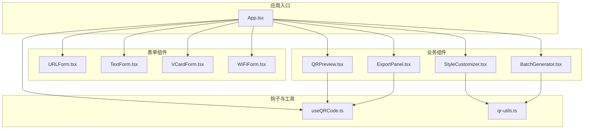
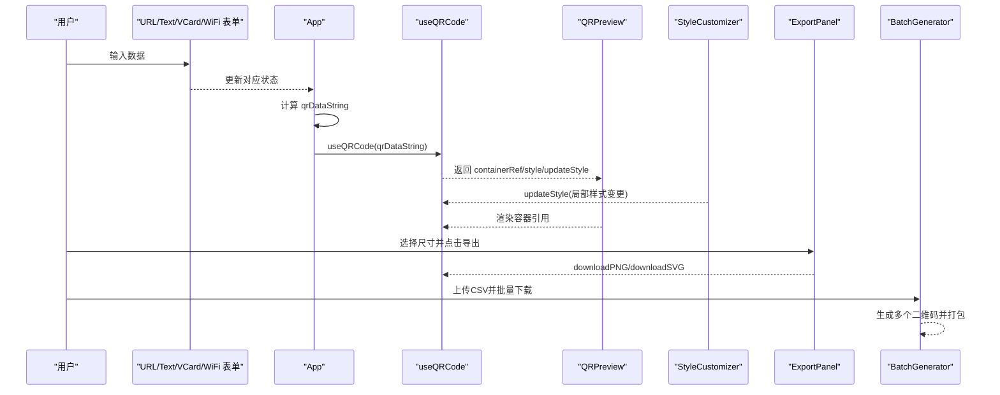
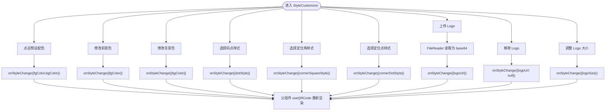
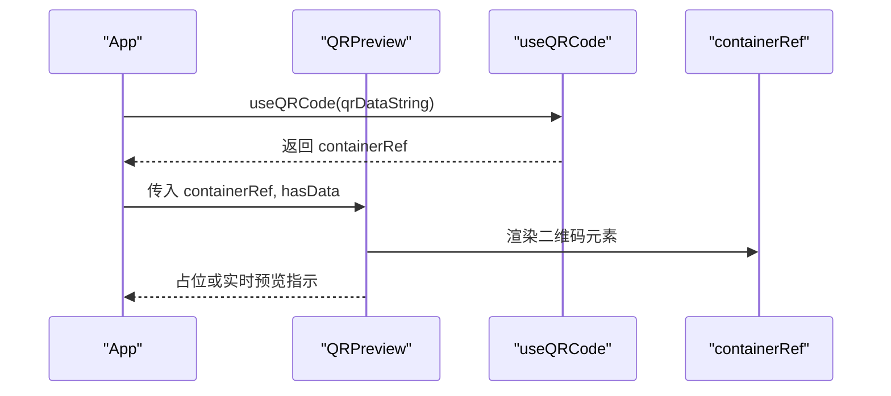
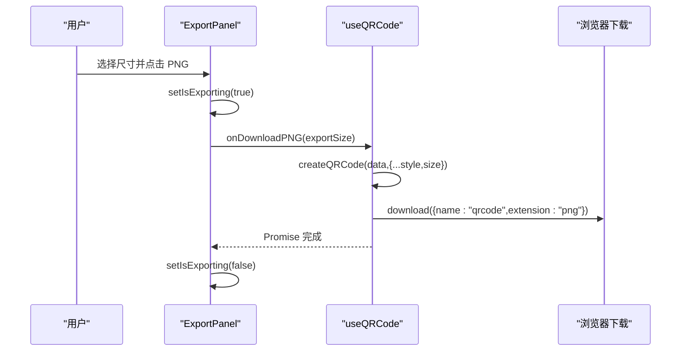
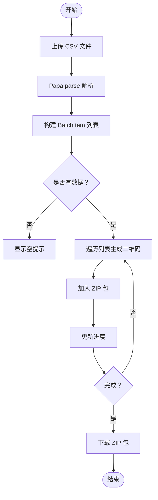
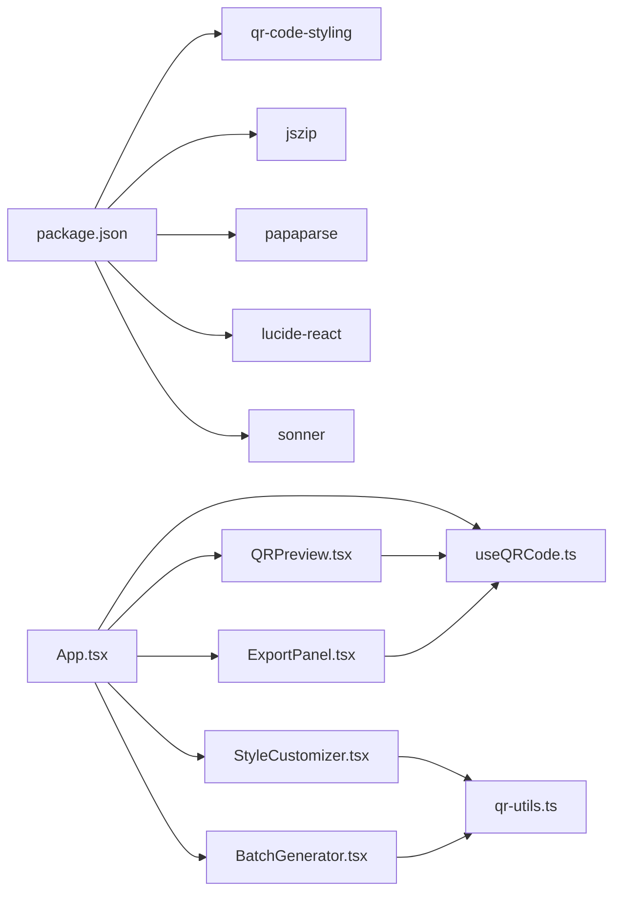

# 功能组件

<cite>
**本文引用的文件**
- [App.tsx](file://src/App.tsx)
- [StyleCustomizer.tsx](file://src/components/StyleCustomizer.tsx)
- [QRPreview.tsx](file://src/components/QRPreview.tsx)
- [ExportPanel.tsx](file://src/components/ExportPanel.tsx)
- [BatchGenerator.tsx](file://src/components/BatchGenerator.tsx)
- [useQRCode.ts](file://src/hooks/useQRCode.ts)
- [qr-utils.ts](file://src/lib/qr-utils.ts)
- [URLForm.tsx](file://src/components/forms/URLForm.tsx)
- [TextForm.tsx](file://src/components/forms/TextForm.tsx)
- [VCardForm.tsx](file://src/components/forms/VCardForm.tsx)
- [WiFiForm.tsx](file://src/components/forms/WiFiForm.tsx)
- [select.tsx](file://src/components/ui/select.tsx)
- [button.tsx](file://src/components/ui/button.tsx)
- [package.json](file://package.json)
</cite>

## 目录
1. [简介](#简介)
2. [项目结构](#项目结构)
3. [核心组件](#核心组件)
4. [架构总览](#架构总览)
5. [详细组件分析](#详细组件分析)
6. [依赖分析](#依赖分析)
7. [性能考虑](#性能考虑)
8. [故障排除指南](#故障排除指南)
9. [结论](#结论)
10. [附录](#附录)

## 简介
本文件面向“功能组件”的综合技术文档，重点解析以下四个核心组件：
- StyleCustomizer 样式定制器：负责二维码外观（颜色、形状、Logo）的可视化定制与状态更新。
- QRPreview 二维码预览：在容器内渲染实时二维码，并在无数据时提示输入。
- ExportPanel 导出面板：提供 PNG/SVG 下载能力及导出尺寸选择。
- BatchGenerator 批量生成器：从 CSV 导入多条数据，批量生成二维码并打包下载。

文档将从系统架构、组件关系、数据流、状态管理、用户交互、事件通信、API 接口、配置项与扩展点等维度进行深入剖析，并给出使用场景与集成示例。

## 项目结构
项目采用按功能分层的组织方式：
- 组件层：页面布局、通用 UI、业务组件（表单、预览、导出、批量生成）
- 钩子层：useQRCode 提供二维码生成与导出的逻辑封装
- 工具层：qr-utils 封装 QRCodeStyling 的配置、格式化与默认值
- 应用入口：App 负责状态聚合、Tab 切换、数据拼装与组件编排

图表来源
- [App.tsx:1-173](file://src/App.tsx#L1-L173)
- [StyleCustomizer.tsx:1-193](file://src/components/StyleCustomizer.tsx#L1-L193)
- [QRPreview.tsx:1-45](file://src/components/QRPreview.tsx#L1-L45)
- [ExportPanel.tsx:1-83](file://src/components/ExportPanel.tsx#L1-L83)
- [BatchGenerator.tsx:1-180](file://src/components/BatchGenerator.tsx#L1-L180)
- [useQRCode.ts:1-75](file://src/hooks/useQRCode.ts#L1-L75)
- [qr-utils.ts:1-151](file://src/lib/qr-utils.ts#L1-L151)

章节来源
- [App.tsx:1-173](file://src/App.tsx#L1-L173)

## 核心组件
- StyleCustomizer：提供预设配色、自定义颜色、码点样式、定位角样式、定位点样式、Logo 上传与大小调节。
- QRPreview：根据容器引用渲染二维码，无数据时显示占位提示。
- ExportPanel：选择导出尺寸，触发 PNG/SVG 下载。
- BatchGenerator：CSV 导入、列表管理、批量生成与 ZIP 下载。

章节来源
- [StyleCustomizer.tsx:15-193](file://src/components/StyleCustomizer.tsx#L15-L193)
- [QRPreview.tsx:4-45](file://src/components/QRPreview.tsx#L4-L45)
- [ExportPanel.tsx:7-83](file://src/components/ExportPanel.tsx#L7-L83)
- [BatchGenerator.tsx:9-180](file://src/components/BatchGenerator.tsx#L9-L180)

## 架构总览
整体采用“状态驱动 + 钩子封装”的设计：
- App 负责聚合表单状态与 Tab 切换，计算最终的二维码数据字符串。
- useQRCode 钩子基于数据与样式生成 QRCodeStyling 实例，负责渲染与导出。
- 各业务组件通过 props 与回调与钩子交互，形成单向数据流与事件向上冒泡。

图表来源
- [App.tsx:46-65](file://src/App.tsx#L46-L65)
- [useQRCode.ts:5-75](file://src/hooks/useQRCode.ts#L5-L75)
- [QRPreview.tsx:9-45](file://src/components/QRPreview.tsx#L9-L45)
- [StyleCustomizer.tsx:20-36](file://src/components/StyleCustomizer.tsx#L20-L36)
- [ExportPanel.tsx:13-83](file://src/components/ExportPanel.tsx#L13-L83)
- [BatchGenerator.tsx:15-80](file://src/components/BatchGenerator.tsx#L15-L80)

## 详细组件分析

### StyleCustomizer 样式定制器
- 核心职责
  - 提供预设配色一键切换
  - 自定义前景/背景色（颜色选择器 + 文本输入）
  - 设置码点样式、定位角样式、定位点样式
  - 中心 Logo 上传、移除与大小调节
- 状态管理
  - 通过 onStyleChange 回调向上游传递局部样式更新
  - 内部不维护全局状态，保持纯展示与事件转发
- 数据处理
  - Logo 上传使用 FileReader 转为 base64，回传给父组件
  - 颜色输入支持色板与文本两种方式，统一写入 fgColor/bgColor
- 交互与事件
  - 预设配色按钮：点击即更新颜色组合
  - Select 下拉：选择样式类型
  - 颜色输入：受控组件双向绑定
  - Logo 上传：隐藏 input 触发与移除按钮
  - Logo 大小：范围滑块控制比例

图表来源
- [StyleCustomizer.tsx:20-193](file://src/components/StyleCustomizer.tsx#L20-L193)
- [qr-utils.ts:14-23](file://src/lib/qr-utils.ts#L14-L23)

章节来源
- [StyleCustomizer.tsx:15-193](file://src/components/StyleCustomizer.tsx#L15-L193)
- [qr-utils.ts:14-23](file://src/lib/qr-utils.ts#L14-L23)

### QRPreview 二维码预览
- 核心职责
  - 在容器内渲染二维码 SVG/Canvas
  - 无数据时显示占位提示与样式
- 状态与数据
  - hasData 控制占位与渲染显隐
  - containerRef 由 useQRCode 提供，用于挂载 QRCodeStyling 实例
- 交互
  - 仅接收只读 props，不产生副作用
  - 通过容器引用与外部渲染解耦

图表来源
- [App.tsx:142-145](file://src/App.tsx#L142-L145)
- [QRPreview.tsx:9-45](file://src/components/QRPreview.tsx#L9-L45)
- [useQRCode.ts:8-29](file://src/hooks/useQRCode.ts#L8-L29)

章节来源
- [QRPreview.tsx:4-45](file://src/components/QRPreview.tsx#L4-L45)
- [useQRCode.ts:5-75](file://src/hooks/useQRCode.ts#L5-L75)

### ExportPanel 导出面板
- 核心职责
  - 选择导出尺寸（256/512/1024/2048）
  - 触发 PNG/SVG 下载
- 状态与数据
  - exportSize 受控状态
  - isExporting 控制按钮禁用与加载态
- 事件与回调
  - onDownloadPNG/onDownloadSVG 由父组件注入，内部负责下载流程
  - 导出前设置 isExporting，完成后恢复

图表来源
- [ExportPanel.tsx:13-83](file://src/components/ExportPanel.tsx#L13-L83)
- [useQRCode.ts:35-51](file://src/hooks/useQRCode.ts#L35-L51)

章节来源
- [ExportPanel.tsx:7-83](file://src/components/ExportPanel.tsx#L7-L83)
- [qr-utils.ts:134-139](file://src/lib/qr-utils.ts#L134-L139)
- [useQRCode.ts:35-51](file://src/hooks/useQRCode.ts#L35-L51)

### BatchGenerator 批量生成器
- 核心职责
  - CSV 导入（自动识别 data/url/text/content 或首列）
  - 可选 label/name/title 作为文件名
  - 批量生成 PNG 并打包为 ZIP 下载
- 状态与流程
  - items 列表管理待生成项
  - isGenerating/progress 控制生成状态与进度条
  - 使用 PapaParse 解析 CSV，JSZip 生成压缩包
- 数据处理
  - 默认样式 size=1024，确保高质量导出
  - 对文件名进行安全字符替换，避免非法文件名

图表来源
- [BatchGenerator.tsx:15-80](file://src/components/BatchGenerator.tsx#L15-L80)
- [qr-utils.ts:63-101](file://src/lib/qr-utils.ts#L63-L101)

章节来源
- [BatchGenerator.tsx:9-180](file://src/components/BatchGenerator.tsx#L9-L180)
- [qr-utils.ts:63-101](file://src/lib/qr-utils.ts#L63-L101)

## 依赖分析
- 外部依赖
  - qr-code-styling：二维码渲染与导出核心库
  - jszip：批量导出 ZIP 包
  - papaparse：CSV 解析
  - lucide-react：图标
  - sonner：通知提示
- 内部依赖
  - App 依赖 useQRCode 钩子与各业务组件
  - StyleCustomizer/ExportPanel/QRPreview 依赖 qr-utils 的样式与默认值
  - BatchGenerator 依赖 qr-utils 的 createQRCode 与导出尺寸

图表来源
- [package.json:11-24](file://package.json#L11-L24)
- [App.tsx:1-25](file://src/App.tsx#L1-L25)
- [qr-utils.ts:1-151](file://src/lib/qr-utils.ts#L1-L151)

章节来源
- [package.json:11-24](file://package.json#L11-L24)
- [qr-utils.ts:1-151](file://src/lib/qr-utils.ts#L1-L151)

## 性能考虑
- 渲染优化
  - useQRCode 基于数据与样式变化触发重渲染，避免不必要的重复创建
  - QRPreview 仅在有数据时渲染容器内容，无数据时显示占位
- 导出性能
  - 批量生成时使用 1024×1024 尺寸保证质量，ZIP 生成异步进行
  - 进度条基于循环索引计算百分比，避免频繁重绘
- 交互体验
  - 导出按钮在导出过程中禁用，防止重复触发
  - 预设配色与颜色选择器即时反馈，提升定制效率

## 故障排除指南
- 无法生成二维码
  - 检查 qrDataString 是否为空（Tab 切换后是否正确计算）
  - 确认 containerRef 是否正确传递给 QRPreview
- Logo 未显示
  - 确认 logoUrl 已通过 onStyleChange 设置
  - 检查二维码容错级别是否因 logo 而提升（自动设置为 H）
- 导出失败
  - 确保 hasData 为真，导出按钮未被禁用
  - 检查浏览器下载权限与弹窗拦截
- 批量导出 ZIP 为空
  - 检查 CSV 列是否包含 data/url/text/content 或首列
  - 确认 items 列表非空且每个项都有有效数据

章节来源
- [App.tsx:46-65](file://src/App.tsx#L46-L65)
- [QRPreview.tsx:9-45](file://src/components/QRPreview.tsx#L9-L45)
- [StyleCustomizer.tsx:20-36](file://src/components/StyleCustomizer.tsx#L20-L36)
- [ExportPanel.tsx:13-83](file://src/components/ExportPanel.tsx#L13-L83)
- [BatchGenerator.tsx:15-80](file://src/components/BatchGenerator.tsx#L15-L80)

## 结论
本项目通过清晰的组件边界与钩子封装，实现了从数据输入、样式定制、实时预览到导出与批量生成的完整工作流。StyleCustomizer、QRPreview、ExportPanel、BatchGenerator 各司其职，配合 useQRCode 钩子与 qr-utils 工具层，形成了高内聚、低耦合的架构。该设计便于扩展新数据类型、新增样式选项与导出格式，同时保持良好的用户体验与性能表现。

## 附录

### 组件 API 与配置项
- StyleCustomizer
  - Props
    - style: QRStyleOptions 当前样式
    - onStyleChange: (updates: Partial<QRStyleOptions>) => void
  - 关键样式字段
    - fgColor/bgColor：前景/背景色
    - dotStyle/cornerSquareStyle/cornerDotStyle：样式枚举
    - logoUrl/logoSize：Logo 地址与大小比例
    - size：渲染尺寸
- QRPreview
  - Props
    - containerRef: React.RefObject<HTMLDivElement>
    - hasData: boolean
- ExportPanel
  - Props
    - hasData: boolean
    - onDownloadPNG: (size: number) => Promise<void>
    - onDownloadSVG: () => Promise<void>
  - 配置
    - exportSizes：导出尺寸选项
- BatchGenerator
  - CSV 列映射
    - data/url/text/content 任一作为二维码数据
    - label/name/title 任一作为文件名
  - 导出
    - 默认 size=1024，PNG 格式
    - ZIP 包含所有二维码 PNG

章节来源
- [StyleCustomizer.tsx:15-193](file://src/components/StyleCustomizer.tsx#L15-L193)
- [QRPreview.tsx:4-45](file://src/components/QRPreview.tsx#L4-L45)
- [ExportPanel.tsx:7-83](file://src/components/ExportPanel.tsx#L7-L83)
- [BatchGenerator.tsx:9-180](file://src/components/BatchGenerator.tsx#L9-L180)
- [qr-utils.ts:134-151](file://src/lib/qr-utils.ts#L134-L151)

### 使用场景与集成示例
- 单个二维码定制与导出
  - 在 App 中切换 Tab 至 url/text/vcard/wifi，输入数据
  - 使用 StyleCustomizer 调整颜色与样式
  - 在 QRPreview 查看实时效果
  - 通过 ExportPanel 导出 PNG/SVG
- 批量生成与分发
  - 在 BatchGenerator 中上传 CSV
  - 确认 items 列表与文件名
  - 点击“全部下载 (ZIP)”获取压缩包
- 扩展点建议
  - 新增数据类型：在 App 中添加新的表单组件与格式化函数
  - 新增样式：在 qr-utils 中扩展样式枚举与默认值
  - 新增导出格式：在 ExportPanel 中增加回调与尺寸选项

章节来源
- [App.tsx:24-173](file://src/App.tsx#L24-L173)
- [BatchGenerator.tsx:15-80](file://src/components/BatchGenerator.tsx#L15-L80)
- [qr-utils.ts:14-151](file://src/lib/qr-utils.ts#L14-L151)