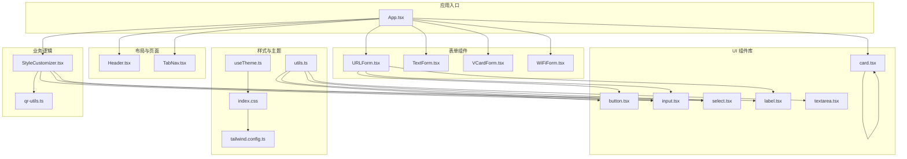
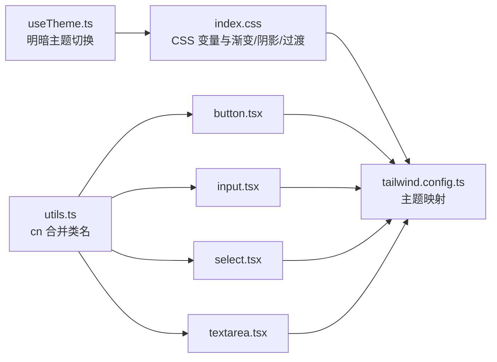
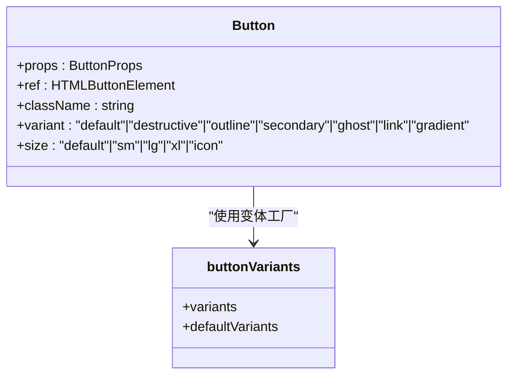
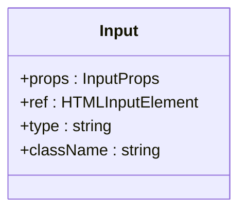
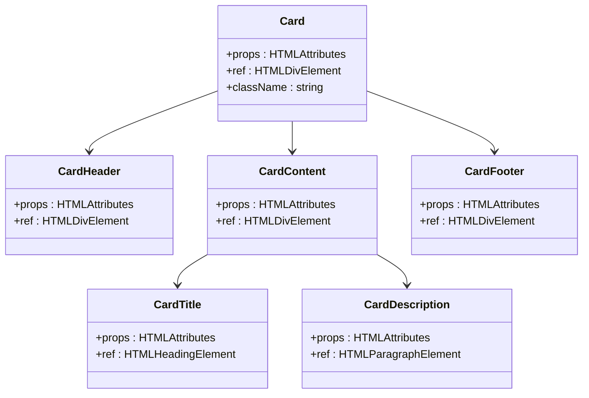
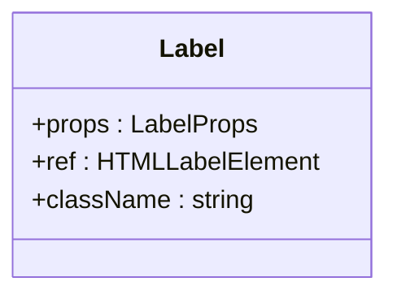
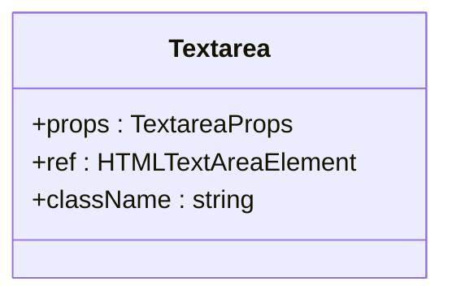
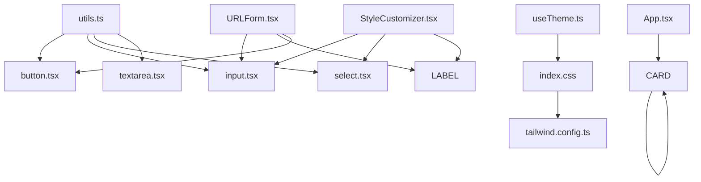
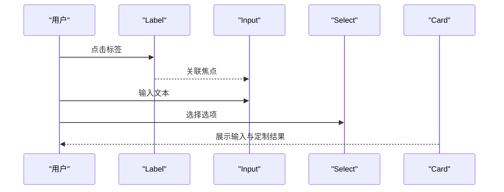

# 基础UI组件

<cite>
**本文引用的文件**
- [button.tsx](file://src/components/ui/button.tsx)
- [input.tsx](file://src/components/ui/input.tsx)
- [select.tsx](file://src/components/ui/select.tsx)
- [card.tsx](file://src/components/ui/card.tsx)
- [label.tsx](file://src/components/ui/label.tsx)
- [textarea.tsx](file://src/components/ui/textarea.tsx)
- [utils.ts](file://src/lib/utils.ts)
- [index.css](file://src/index.css)
- [tailwind.config.ts](file://tailwind.config.ts)
- [App.tsx](file://src/App.tsx)
- [StyleCustomizer.tsx](file://src/components/StyleCustomizer.tsx)
- [URLForm.tsx](file://src/components/forms/URLForm.tsx)
- [useTheme.ts](file://src/hooks/useTheme.ts)
- [qr-utils.ts](file://src/lib/qr-utils.ts)
- [package.json](file://package.json)
</cite>

## 目录
1. [简介](#简介)
2. [项目结构](#项目结构)
3. [核心组件](#核心组件)
4. [架构总览](#架构总览)
5. [组件详解](#组件详解)
6. [依赖关系分析](#依赖关系分析)
7. [性能考量](#性能考量)
8. [故障排查指南](#故障排查指南)
9. [结论](#结论)
10. [附录](#附录)

## 简介
本文件系统化梳理本项目的“基础UI组件库”，覆盖 button、input、select、card、label、textarea 六大通用组件。文档从设计原则、实现方式、props 接口、样式变体、状态管理、无障碍支持、主题适配、响应式设计与跨浏览器兼容性等方面进行深入解析，并结合实际业务场景（如表单与二维码样式定制）给出使用示例、最佳实践与自定义样式指导。

## 项目结构
该组件库采用按功能域分层的组织方式：ui 目录集中存放基础 UI 组件；forms 目录承载业务表单；layout 目录包含页面级布局组件；hooks 提供主题与二维码逻辑；lib 提供工具与样式常量；样式通过 TailwindCSS 与自定义 CSS 变量统一治理。



图表来源
- [App.tsx:1-173](file://src/App.tsx#L1-L173)
- [URLForm.tsx:1-33](file://src/components/forms/URLForm.tsx#L1-L33)
- [StyleCustomizer.tsx:1-193](file://src/components/StyleCustomizer.tsx#L1-L193)
- [button.tsx:1-51](file://src/components/ui/button.tsx#L1-L51)
- [input.tsx:1-25](file://src/components/ui/input.tsx#L1-L25)
- [select.tsx:1-31](file://src/components/ui/select.tsx#L1-L31)
- [card.tsx:1-86](file://src/components/ui/card.tsx#L1-L86)
- [label.tsx:1-24](file://src/components/ui/label.tsx#L1-L24)
- [textarea.tsx:1-24](file://src/components/ui/textarea.tsx#L1-L24)
- [utils.ts:1-7](file://src/lib/utils.ts#L1-L7)
- [index.css:1-148](file://src/index.css#L1-L148)
- [tailwind.config.ts:1-107](file://tailwind.config.ts#L1-L107)
- [useTheme.ts:1-26](file://src/hooks/useTheme.ts#L1-L26)
- [qr-utils.ts:1-151](file://src/lib/qr-utils.ts#L1-L151)

章节来源
- [App.tsx:1-173](file://src/App.tsx#L1-L173)
- [index.css:1-148](file://src/index.css#L1-L148)
- [tailwind.config.ts:1-107](file://tailwind.config.ts#L1-L107)

## 核心组件
本节概览六大基础组件的职责与共性：
- button：提供多变体与尺寸的按钮，统一聚焦态与禁用态样式，支持渐变风格。
- input：统一输入框边框、内边距、聚焦态与禁用态，支持类型扩展。
- select：统一下拉选择外观与交互，内置选项渲染。
- card：卡片容器及其子块（头、标题、描述、内容、底部），统一阴影与悬停效果。
- label：统一标签样式，配合表单控件的可访问性与禁用态。
- textarea：统一多行文本域外观与禁用态，支持无自动调整大小。

章节来源
- [button.tsx:1-51](file://src/components/ui/button.tsx#L1-L51)
- [input.tsx:1-25](file://src/components/ui/input.tsx#L1-L25)
- [select.tsx:1-31](file://src/components/ui/select.tsx#L1-L31)
- [card.tsx:1-86](file://src/components/ui/card.tsx#L1-L86)
- [label.tsx:1-24](file://src/components/ui/label.tsx#L1-L24)
- [textarea.tsx:1-24](file://src/components/ui/textarea.tsx#L1-L24)

## 架构总览
组件库围绕“样式合并 + 主题变量 + 变体系统”的架构展开：
- 样式合并：通过工具函数统一合并类名，避免冲突。
- 主题变量：CSS 变量集中于根节点，明暗主题切换由 useTheme 驱动。
- 变体系统：button 使用变体工厂生成不同风格与尺寸，其他组件通过类名组合实现一致风格。



图表来源
- [utils.ts:1-7](file://src/lib/utils.ts#L1-L7)
- [button.tsx:1-51](file://src/components/ui/button.tsx#L1-L51)
- [input.tsx:1-25](file://src/components/ui/input.tsx#L1-L25)
- [select.tsx:1-31](file://src/components/ui/select.tsx#L1-L31)
- [textarea.tsx:1-24](file://src/components/ui/textarea.tsx#L1-L24)
- [index.css:1-148](file://src/index.css#L1-L148)
- [tailwind.config.ts:1-107](file://tailwind.config.ts#L1-L107)
- [useTheme.ts:1-26](file://src/hooks/useTheme.ts#L1-L26)

## 组件详解

### Button 按钮
- 设计原则
  - 语义化：继承原生 button 行为，支持禁用与聚焦态。
  - 视觉一致性：通过变体工厂统一边框、阴影、渐变与过渡。
  - 可访问性：保留原生焦点环与键盘可达性。
- Props 接口
  - 继承原生 button 属性，新增变体与尺寸两类变体参数。
- 样式变体
  - 变体：默认、破坏性、描边、次级、幽灵、链接、渐变。
  - 尺寸：默认、小、大、超大、图标。
- 状态管理
  - 禁用态：禁用指针事件与透明度控制。
  - 聚焦态：可见焦点环与轻微位移。
- 无障碍支持
  - 保留原生属性，确保键盘操作与屏幕阅读器可用。
- 主题适配
  - 使用主题色变量与渐变变量，明暗主题自动切换。
- 响应式与兼容性
  - 统一过渡动画，适配现代浏览器；图标按钮在旧版浏览器中保持可用。
- 使用示例
  - 在表单中作为提交按钮或操作按钮使用。
- 最佳实践
  - 优先使用语义化变体表达意图；图标按钮需提供替代文本。
- 自定义样式
  - 通过传入额外类名覆盖局部样式；避免直接修改变体内部类。



图表来源
- [button.tsx:1-51](file://src/components/ui/button.tsx#L1-L51)

章节来源
- [button.tsx:1-51](file://src/components/ui/button.tsx#L1-L51)
- [index.css:1-148](file://src/index.css#L1-L148)
- [tailwind.config.ts:1-107](file://tailwind.config.ts#L1-L107)

### Input 输入框
- 设计原则
  - 一致的圆角、边框与内边距；聚焦态清晰可见。
- Props 接口
  - 继承原生 input 属性，支持 type、placeholder 等。
- 样式变体
  - 统一边框、背景、占位符与禁用态。
- 状态管理
  - 禁用态：禁用光标与透明度。
- 无障碍支持
  - 与 label 组合使用，确保可访问性。
- 主题适配
  - 使用主题变量，随主题切换自动更新。
- 响应式与兼容性
  - 通过 appearance 控制原生样式，保证跨浏览器一致性。
- 使用示例
  - 在 URL 表单中作为受控输入使用。
- 最佳实践
  - 与 Label 明确关联；提供占位提示。
- 自定义样式
  - 通过传入类名微调内边距或字体。



图表来源
- [input.tsx:1-25](file://src/components/ui/input.tsx#L1-L25)

章节来源
- [input.tsx:1-25](file://src/components/ui/input.tsx#L1-L25)
- [URLForm.tsx:1-33](file://src/components/forms/URLForm.tsx#L1-L33)

### Select 下拉选择
- 设计原则
  - 统一圆角、边框与聚焦态；隐藏系统默认下拉箭头，自定义指针样式。
- Props 接口
  - 继承原生 select 属性，并增加选项数组参数。
- 样式变体
  - 统一外观与禁用态。
- 状态管理
  - 禁用态：禁用光标与透明度。
- 无障碍支持
  - 与 label 绑定；建议提供默认选项或占位项。
- 主题适配
  - 使用主题变量，随主题切换更新。
- 响应式与兼容性
  - 通过 appearance 控制外观，保证跨浏览器一致性。
- 使用示例
  - 在样式定制器中用于选择二维码点样式与角样式。
- 最佳实践
  - 选项列表清晰；提供默认值或占位提示。
- 自定义样式
  - 通过传入类名微调宽度或内边距。

```mermaid
classDiagram
class Select {
+props : SelectProps
+ref : HTMLSelectElement
+options : {value : string, label : string}[]
+className : string
}
```

图表来源
- [select.tsx:1-31](file://src/components/ui/select.tsx#L1-L31)

章节来源
- [select.tsx:1-31](file://src/components/ui/select.tsx#L1-L31)
- [StyleCustomizer.tsx:1-193](file://src/components/StyleCustomizer.tsx#L1-L193)

### Card 卡片
- 设计原则
  - 统一圆角、边框与阴影；悬停增强视觉反馈。
- 子组件
  - Card、CardHeader、CardTitle、CardDescription、CardContent、CardFooter。
- 样式变体
  - 统一背景、前景色与阴影；悬停放大阴影。
- 状态管理
  - 悬停态：阴影增强。
- 无障碍支持
  - 语义化结构，适合内容分组。
- 主题适配
  - 使用主题变量，随主题切换更新。
- 响应式与兼容性
  - 通过过渡动画提升交互体验。
- 使用示例
  - 在主界面中作为数据输入与样式定制的容器。
- 最佳实践
  - 合理划分头部、内容与底部区域；避免过度嵌套。
- 自定义样式
  - 通过传入类名微调内边距或阴影。



图表来源
- [card.tsx:1-86](file://src/components/ui/card.tsx#L1-L86)

章节来源
- [card.tsx:1-86](file://src/components/ui/card.tsx#L1-L86)
- [App.tsx:1-173](file://src/App.tsx#L1-L173)

### Label 标签
- 设计原则
  - 与表单控件绑定，禁用态下保持可读性。
- Props 接口
  - 继承原生 label 属性。
- 样式变体
  - 统一字号、字重与禁用态样式。
- 状态管理
  - 禁用态：禁用光标与透明度。
- 无障碍支持
  - 与控件 id 对应，提升可访问性。
- 主题适配
  - 使用主题变量，随主题切换更新。
- 响应式与兼容性
  - 保持简单样式，跨浏览器稳定。
- 使用示例
  - 在 URL 表单中与输入框配对使用。
- 最佳实践
  - 明确关联控件 id；避免隐藏标签文字。
- 自定义样式
  - 通过传入类名微调字体或间距。



图表来源
- [label.tsx:1-24](file://src/components/ui/label.tsx#L1-L24)

章节来源
- [label.tsx:1-24](file://src/components/ui/label.tsx#L1-L24)
- [URLForm.tsx:1-33](file://src/components/forms/URLForm.tsx#L1-L33)

### Textarea 多行输入
- 设计原则
  - 一致的圆角、边框与内边距；聚焦态清晰可见。
- Props 接口
  - 继承原生 textarea 属性。
- 样式变体
  - 统一边框、背景、占位符与禁用态。
- 状态管理
  - 禁用态：禁用光标与透明度。
- 无障碍支持
  - 与 label 绑定；提供占位提示。
- 主题适配
  - 使用主题变量，随主题切换更新。
- 响应式与兼容性
  - 通过过渡动画与禁用态控制，保证跨浏览器一致性。
- 使用示例
  - 在文本表单中作为受控输入使用。
- 最佳实践
  - 与 Label 明确关联；提供占位提示。
- 自定义样式
  - 通过传入类名微调内边距或字体。



图表来源
- [textarea.tsx:1-24](file://src/components/ui/textarea.tsx#L1-L24)

章节来源
- [textarea.tsx:1-24](file://src/components/ui/textarea.tsx#L1-L24)

## 依赖关系分析
- 组件依赖
  - 所有 UI 组件均依赖工具函数进行类名合并。
  - 样式依赖 CSS 变量与 Tailwind 主题映射。
  - 主题切换由 useTheme 驱动，影响全局 CSS 变量。
- 组件间协作
  - 表单组件（如 URLForm）组合使用 Label、Input、Button。
  - 样式定制器（StyleCustomizer）组合使用 Label、Select、Input。
  - 应用主界面（App）组合使用卡片、导航与二维码预览。



图表来源
- [utils.ts:1-7](file://src/lib/utils.ts#L1-L7)
- [button.tsx:1-51](file://src/components/ui/button.tsx#L1-L51)
- [input.tsx:1-25](file://src/components/ui/input.tsx#L1-L25)
- [select.tsx:1-31](file://src/components/ui/select.tsx#L1-L31)
- [textarea.tsx:1-24](file://src/components/ui/textarea.tsx#L1-L24)
- [index.css:1-148](file://src/index.css#L1-L148)
- [tailwind.config.ts:1-107](file://tailwind.config.ts#L1-L107)
- [useTheme.ts:1-26](file://src/hooks/useTheme.ts#L1-L26)
- [URLForm.tsx:1-33](file://src/components/forms/URLForm.tsx#L1-L33)
- [StyleCustomizer.tsx:1-193](file://src/components/StyleCustomizer.tsx#L1-L193)
- [App.tsx:1-173](file://src/App.tsx#L1-L173)
- [card.tsx:1-86](file://src/components/ui/card.tsx#L1-L86)

章节来源
- [package.json:1-37](file://package.json#L1-L37)
- [utils.ts:1-7](file://src/lib/utils.ts#L1-L7)
- [index.css:1-148](file://src/index.css#L1-L148)
- [tailwind.config.ts:1-107](file://tailwind.config.ts#L1-L107)
- [useTheme.ts:1-26](file://src/hooks/useTheme.ts#L1-L26)
- [URLForm.tsx:1-33](file://src/components/forms/URLForm.tsx#L1-L33)
- [StyleCustomizer.tsx:1-193](file://src/components/StyleCustomizer.tsx#L1-L193)
- [App.tsx:1-173](file://src/App.tsx#L1-L173)
- [card.tsx:1-86](file://src/components/ui/card.tsx#L1-L86)

## 性能考量
- 类名合并
  - 使用工具函数合并类名，减少重复与冲突，降低样式计算开销。
- 动画与阴影
  - 统一过渡时间曲线，避免过长动画影响首屏渲染。
- 主题切换
  - 通过 CSS 变量与类名切换，避免全量重绘。
- 组件复用
  - 通过变体工厂与组合子模式，减少重复实现，提升维护效率。

## 故障排查指南
- 样式未生效
  - 检查是否正确引入基础样式与 Tailwind 配置。
  - 确认主题类名是否正确添加至根元素。
- 焦点环不可见
  - 确保保留原生聚焦态相关类名，避免被覆盖。
- 下拉选择外观异常
  - 确认是否正确隐藏系统默认样式并应用自定义外观。
- 明暗主题切换无效
  - 检查主题钩子是否正确设置根元素类名，以及 CSS 变量是否更新。

章节来源
- [index.css:1-148](file://src/index.css#L1-L148)
- [tailwind.config.ts:1-107](file://tailwind.config.ts#L1-L107)
- [useTheme.ts:1-26](file://src/hooks/useTheme.ts#L1-L26)

## 结论
本基础 UI 组件库以“统一的样式体系 + 主题变量 + 变体系统”为核心，实现了高内聚、低耦合的组件设计。通过与表单与二维码业务模块的组合，组件在真实场景中展现了良好的可访问性、可维护性与可扩展性。建议在后续迭代中持续完善无障碍细节与跨浏览器兼容测试，进一步提升用户体验。

## 附录

### 组件组合模式与表单应用场景
- 表单组合
  - Label + Input：用于受控输入与可访问性绑定。
  - Label + Select：用于选项选择与可访问性绑定。
  - Button：用于提交、重置或辅助操作。
- 业务场景
  - URL 表单：输入链接并生成二维码。
  - 样式定制：通过 Select 与 Input 调整二维码配色与样式。
  - 卡片容器：将输入与定制区域进行模块化展示。



图表来源
- [URLForm.tsx:1-33](file://src/components/forms/URLForm.tsx#L1-L33)
- [StyleCustomizer.tsx:1-193](file://src/components/StyleCustomizer.tsx#L1-L193)
- [card.tsx:1-86](file://src/components/ui/card.tsx#L1-L86)

### props 接口速览
- Button
  - 继承原生 ButtonHTMLAttributes，新增变体与尺寸参数。
- Input
  - 继承原生 InputHTMLAttributes。
- Select
  - 继承原生 SelectHTMLAttributes，并增加选项数组。
- Label
  - 继承原生 LabelHTMLAttributes。
- Textarea
  - 继承原生 TextareaHTMLAttributes。

章节来源
- [button.tsx:33-35](file://src/components/ui/button.tsx#L33-L35)
- [input.tsx:4-5](file://src/components/ui/input.tsx#L4-L5)
- [select.tsx:4-6](file://src/components/ui/select.tsx#L4-L6)
- [label.tsx:4-5](file://src/components/ui/label.tsx#L4-L5)
- [textarea.tsx:4-5](file://src/components/ui/textarea.tsx#L4-L5)