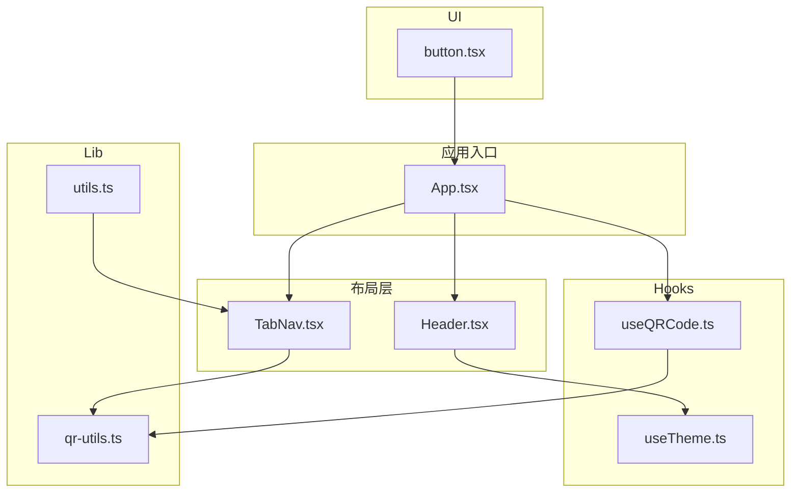
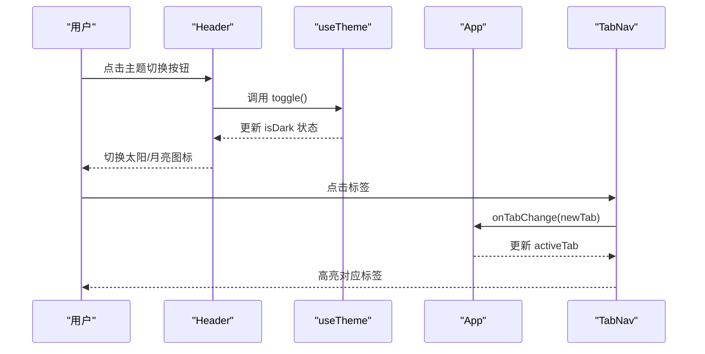
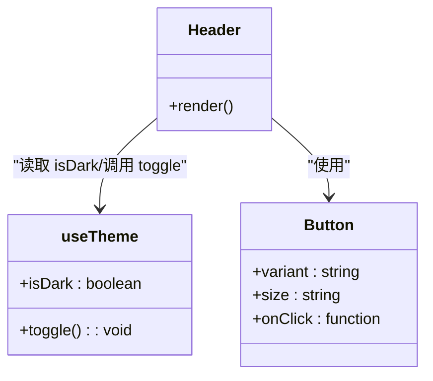
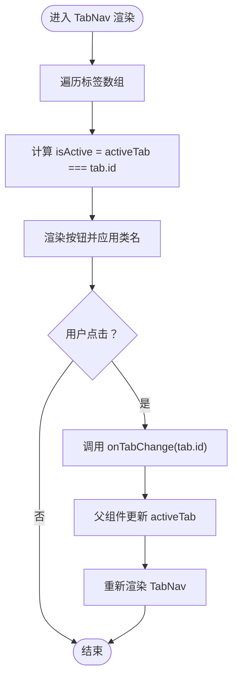
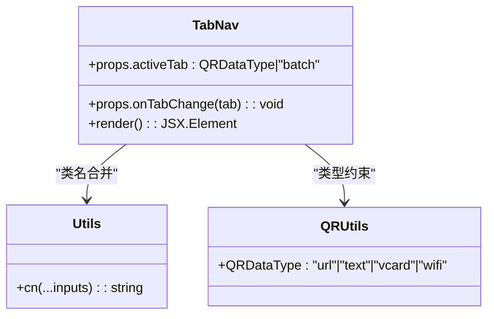
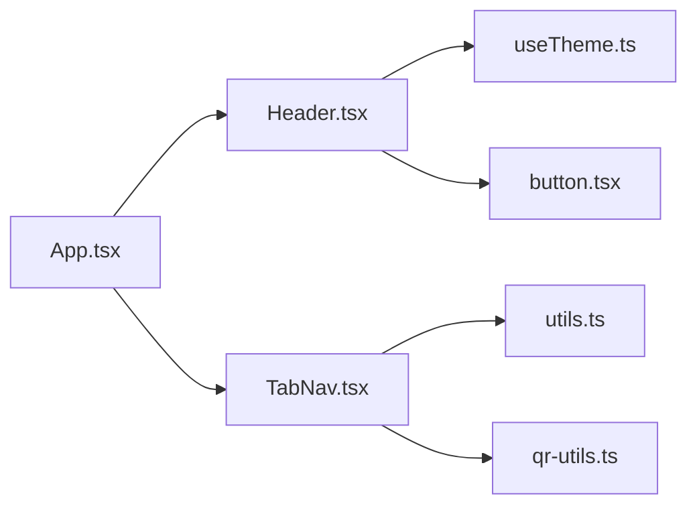

# 布局组件

<cite>
**本文引用的文件**
- [Header.tsx](file://src/components/layout/Header.tsx)
- [TabNav.tsx](file://src/components/layout/TabNav.tsx)
- [useTheme.ts](file://src/hooks/useTheme.ts)
- [App.tsx](file://src/App.tsx)
- [qr-utils.ts](file://src/lib/qr-utils.ts)
- [utils.ts](file://src/lib/utils.ts)
- [useQRCode.ts](file://src/hooks/useQRCode.ts)
- [button.tsx](file://src/components/ui/button.tsx)
- [index.css](file://src/index.css)
</cite>

## 目录
1. [简介](#简介)
2. [项目结构](#项目结构)
3. [核心组件](#核心组件)
4. [架构总览](#架构总览)
5. [详细组件分析](#详细组件分析)
6. [依赖关系分析](#依赖关系分析)
7. [性能考量](#性能考量)
8. [故障排查指南](#故障排查指南)
9. [结论](#结论)
10. [附录](#附录)

## 简介
本文件聚焦于布局层的两个关键组件：Header 头部组件与 TabNav 标签导航组件。前者负责品牌展示、主题切换与响应式布局；后者负责在不同二维码数据类型之间进行切换，并与全局状态协同工作。文档将从设计理念、数据流、状态管理、事件处理、样式定制到集成方式给出系统化说明，并提供可直接参考的代码片段路径。

## 项目结构
布局组件位于 src/components/layout 目录下，配合 hooks、lib 工具与 UI 组件库共同构成完整的页面骨架与交互控制。

图表来源
- [Header.tsx:1-41](file://src/components/layout/Header.tsx#L1-L41)
- [TabNav.tsx:1-47](file://src/components/layout/TabNav.tsx#L1-L47)
- [useTheme.ts:1-26](file://src/hooks/useTheme.ts#L1-L26)
- [useQRCode.ts:1-75](file://src/hooks/useQRCode.ts#L1-L75)
- [qr-utils.ts:1-151](file://src/lib/qr-utils.ts#L1-L151)
- [utils.ts:1-7](file://src/lib/utils.ts#L1-L7)
- [button.tsx:1-51](file://src/components/ui/button.tsx#L1-L51)
- [App.tsx:1-173](file://src/App.tsx#L1-L173)

章节来源
- [App.tsx:1-173](file://src/App.tsx#L1-L173)
- [Header.tsx:1-41](file://src/components/layout/Header.tsx#L1-L41)
- [TabNav.tsx:1-47](file://src/components/layout/TabNav.tsx#L1-L47)

## 核心组件
- Header 头部组件：展示品牌标识与名称、副标题，右侧提供主题切换按钮（亮/暗），采用粘性定位与玻璃效果，确保在滚动场景下仍保持可见。
- TabNav 标签导航组件：提供五种标签（URL、文本、联系人、WiFi、批量生成），支持通过 props 接收当前激活标签与切换回调，内部维护标签列表与图标映射，动态渲染激活态样式。

章节来源
- [Header.tsx:5-40](file://src/components/layout/Header.tsx#L5-L40)
- [TabNav.tsx:5-46](file://src/components/layout/TabNav.tsx#L5-L46)

## 架构总览
Header 与 TabNav 在 App 中被组合使用，Header 负责全局主题控制，TabNav 负责内容区域的标签切换。两者通过状态提升与回调协作，形成“头部控制主题，标签控制内容”的清晰职责分工。

图表来源
- [Header.tsx:25-36](file://src/components/layout/Header.tsx#L25-L36)
- [useTheme.ts:22-25](file://src/hooks/useTheme.ts#L22-L25)
- [App.tsx:24-25](file://src/App.tsx#L24-L25)
- [TabNav.tsx:22-46](file://src/components/layout/TabNav.tsx#L22-L46)

## 详细组件分析

### Header 头部组件
- 设计理念
  - 品牌展示：左侧包含品牌图标与名称、副标题，统一使用渐变色与字体层级，突出产品定位。
  - 主题切换：右侧使用 Button 组件，根据 isDark 状态显示太阳或月亮图标，点击触发 toggle 切换。
  - 响应式布局：容器采用 flex 布局，两端对齐，适配移动端与桌面端的宽度变化；粘性定位保证在长页面中始终可见。
  - 视觉风格：使用 glass 类实现毛玻璃背景与模糊效果，结合边框与阴影，增强层次感。
- Props 接口
  - 无外部 props，内部通过 useTheme 获取 isDark 与 toggle。
- 事件处理机制
  - onClick={toggle} 将主题切换委托给 useTheme，实现全局深浅色模式切换。
- 样式定制方案
  - 可通过修改 CSS 变量与类名（如 glass、gradient-primary）调整品牌色、背景透明度与阴影。
  - 按钮样式由 UI Button 提供，支持 variant/size 等变体，便于在不同场景复用。
- 代码示例路径
  - [Header 组件实现:5-40](file://src/components/layout/Header.tsx#L5-L40)
  - [主题 Hook 使用:3-25](file://src/hooks/useTheme.ts#L3-L25)
  - [UI Button 组件:33-51](file://src/components/ui/button.tsx#L33-L51)
  - [CSS 变量与 glass 效果:118-129](file://src/index.css#L118-L129)

章节来源
- [Header.tsx:5-40](file://src/components/layout/Header.tsx#L5-L40)
- [useTheme.ts:3-25](file://src/hooks/useTheme.ts#L3-L25)
- [button.tsx:33-51](file://src/components/ui/button.tsx#L33-L51)
- [index.css:118-129](file://src/index.css#L118-L129)

#### Header 类图

图表来源
- [Header.tsx:5-40](file://src/components/layout/Header.tsx#L5-L40)
- [useTheme.ts:3-25](file://src/hooks/useTheme.ts#L3-L25)
- [button.tsx:33-51](file://src/components/ui/button.tsx#L33-L51)

### TabNav 标签导航组件
- 功能概述
  - 标签集合：包含 URL、文本、联系人、WiFi、批量生成五类标签，每类对应一个图标与本地化标签文案。
  - 切换逻辑：通过 onTabChange 回调接收新标签，内部根据 activeTab 计算激活态样式，实现视觉反馈。
  - 状态管理：由父组件 App 维护 activeTab 并传入，TabNav 不持有状态，符合受控组件模式。
- Props 接口
  - activeTab: 当前激活标签，类型为 QRDataType 或 'batch'
  - onTabChange: 切换回调，参数为新的标签值
- 事件处理机制
  - 每个标签按钮绑定 onClick，触发 onTabChange(tab.id)，父组件更新状态后重新渲染。
- 样式定制方案
  - 使用 cn 合并类名，激活态与悬停态通过条件类名切换，支持主题色与透明度变化。
  - 内置标签数组与图标映射，便于扩展更多标签类型。
- 代码示例路径
  - [TabNav 组件实现:22-46](file://src/components/layout/TabNav.tsx#L22-L46)
  - [标签类型定义:8-8](file://src/lib/qr-utils.ts#L8-L8)
  - [类名合并工具:4-6](file://src/lib/utils.ts#L4-L6)

章节来源
- [TabNav.tsx:5-46](file://src/components/layout/TabNav.tsx#L5-L46)
- [qr-utils.ts:8-8](file://src/lib/qr-utils.ts#L8-L8)
- [utils.ts:4-6](file://src/lib/utils.ts#L4-L6)

#### TabNav 流程图

图表来源
- [TabNav.tsx:22-46](file://src/components/layout/TabNav.tsx#L22-L46)

#### TabNav 类图

图表来源
- [TabNav.tsx:1-8](file://src/components/layout/TabNav.tsx#L1-L8)
- [utils.ts:4-6](file://src/lib/utils.ts#L4-L6)
- [qr-utils.ts:8-8](file://src/lib/qr-utils.ts#L8-L8)

### 与 App 的集成
- Header 集成：直接在 App 的顶部渲染 Header，用于全局主题控制。
- TabNav 集成：居中放置于主内容区上方，作为内容切换入口；activeTab 由 App 状态驱动，切换后决定渲染哪个表单卡片与右侧预览区域。
- 状态管理：App 维护 activeTab 与各表单数据状态，TabNav 仅负责 UI 交互与回调传递。
- 代码示例路径
  - [App 中的 Header 与 TabNav 使用:72-89](file://src/App.tsx#L72-L89)
  - [App 中的 activeTab 状态与切换:24-25](file://src/App.tsx#L24-L25)
  - [App 中的条件渲染与布局网格:91-157](file://src/App.tsx#L91-L157)

章节来源
- [App.tsx:72-89](file://src/App.tsx#L72-L89)
- [App.tsx:24-25](file://src/App.tsx#L24-L25)
- [App.tsx:91-157](file://src/App.tsx#L91-L157)

## 依赖关系分析
- Header 依赖
  - useTheme：提供 isDark 与 toggle，实现主题切换。
  - UI Button：提供按钮样式与交互能力。
- TabNav 依赖
  - utils.cn：类名合并，保证样式组合灵活可控。
  - qr-utils.QRDataType：约束标签类型，确保类型安全。
- App 与布局组件的关系
  - App 作为状态中心，向 Header 与 TabNav 注入 props 与回调，形成单向数据流。

图表来源
- [App.tsx:1-173](file://src/App.tsx#L1-L173)
- [Header.tsx:1-41](file://src/components/layout/Header.tsx#L1-L41)
- [TabNav.tsx:1-47](file://src/components/layout/TabNav.tsx#L1-L47)
- [useTheme.ts:1-26](file://src/hooks/useTheme.ts#L1-L26)
- [button.tsx:1-51](file://src/components/ui/button.tsx#L1-L51)
- [utils.ts:1-7](file://src/lib/utils.ts#L1-L7)
- [qr-utils.ts:1-151](file://src/lib/qr-utils.ts#L1-L151)

章节来源
- [App.tsx:1-173](file://src/App.tsx#L1-L173)
- [Header.tsx:1-41](file://src/components/layout/Header.tsx#L1-L41)
- [TabNav.tsx:1-47](file://src/components/layout/TabNav.tsx#L1-L47)

## 性能考量
- Header
  - 仅在主题状态变化时重渲染，避免不必要的 DOM 更新。
  - 使用粘性定位与轻量级样式，不影响滚动性能。
- TabNav
  - 受控组件，每次切换通过回调更新父组件状态，避免内部状态冗余。
  - 标签列表较小，map 渲染开销低，适合频繁切换场景。
- App
  - 使用 useMemo 缓存 qrDataString，减少 QR 生成与预览刷新频率。
  - 条件渲染 batch 与表单区域，避免不必要子树渲染。

章节来源
- [Header.tsx:5-40](file://src/components/layout/Header.tsx#L5-L40)
- [TabNav.tsx:22-46](file://src/components/layout/TabNav.tsx#L22-L46)
- [App.tsx:47-62](file://src/App.tsx#L47-L62)
- [useQRCode.ts:11-29](file://src/hooks/useQRCode.ts#L11-L29)

## 故障排查指南
- 主题切换无效
  - 检查 useTheme 是否在浏览器环境中运行，确认 documentElement 上的 dark 类是否正确添加/移除。
  - 参考路径：[useTheme 实现:14-20](file://src/hooks/useTheme.ts#L14-L20)
- 标签切换不生效
  - 确认 onTabChange 回调已正确传入 App，并且 activeTab 状态被更新。
  - 参考路径：[TabNav 回调调用:31-31](file://src/components/layout/TabNav.tsx#L31-L31)、[App 状态更新:24-25](file://src/App.tsx#L24-L25)
- 样式异常
  - 检查 glass、gradient-* 等类名是否正确引入，CSS 变量是否覆盖。
  - 参考路径：[CSS 变量与类定义:6-76](file://src/index.css#L6-L76)、[glass 类:118-129](file://src/index.css#L118-L129)
- 图标未显示
  - 确认 lucide-react 图标导入正确，且图标尺寸类名一致。
  - 参考路径：[Header 中图标使用:12-35](file://src/components/layout/Header.tsx#L12-L35)、[TabNav 中图标使用:26-41](file://src/components/layout/TabNav.tsx#L26-L41)

章节来源
- [useTheme.ts:14-20](file://src/hooks/useTheme.ts#L14-L20)
- [TabNav.tsx:31-31](file://src/components/layout/TabNav.tsx#L31-L31)
- [App.tsx:24-25](file://src/App.tsx#L24-L25)
- [index.css:6-76](file://src/index.css#L6-L76)
- [index.css:118-129](file://src/index.css#L118-L129)
- [Header.tsx:12-35](file://src/components/layout/Header.tsx#L12-L35)
- [TabNav.tsx:26-41](file://src/components/layout/TabNav.tsx#L26-L41)

## 结论
Header 与 TabNav 通过简洁的 props 与回调机制实现了清晰的职责分离：Header 负责全局主题控制，TabNav 负责内容切换入口。二者与 App 的状态管理形成稳定的单向数据流，配合 UI 组件库与样式系统，构建了具有良好可扩展性与可维护性的布局层。

## 附录
- 使用建议
  - 在需要新增标签时，遵循 TabNav 的标签数组与图标映射约定，保持类型一致。
  - 如需自定义 Header 样式，优先通过 CSS 变量与类名覆盖，避免硬编码样式。
  - 对于复杂交互，建议将状态提升至 App 层，保持子组件的纯函数特性。
- 相关实现路径
  - [Header 组件:5-40](file://src/components/layout/Header.tsx#L5-L40)
  - [TabNav 组件:22-46](file://src/components/layout/TabNav.tsx#L22-L46)
  - [useTheme Hook:3-25](file://src/hooks/useTheme.ts#L3-L25)
  - [App 集成示例:72-89](file://src/App.tsx#L72-L89)