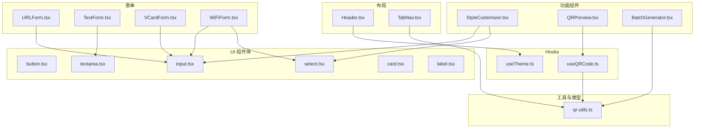
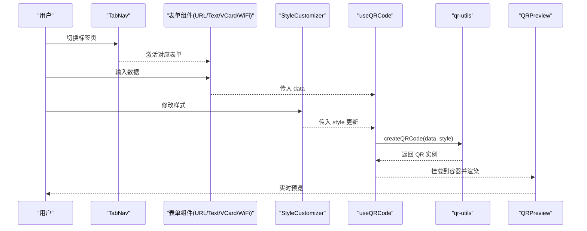
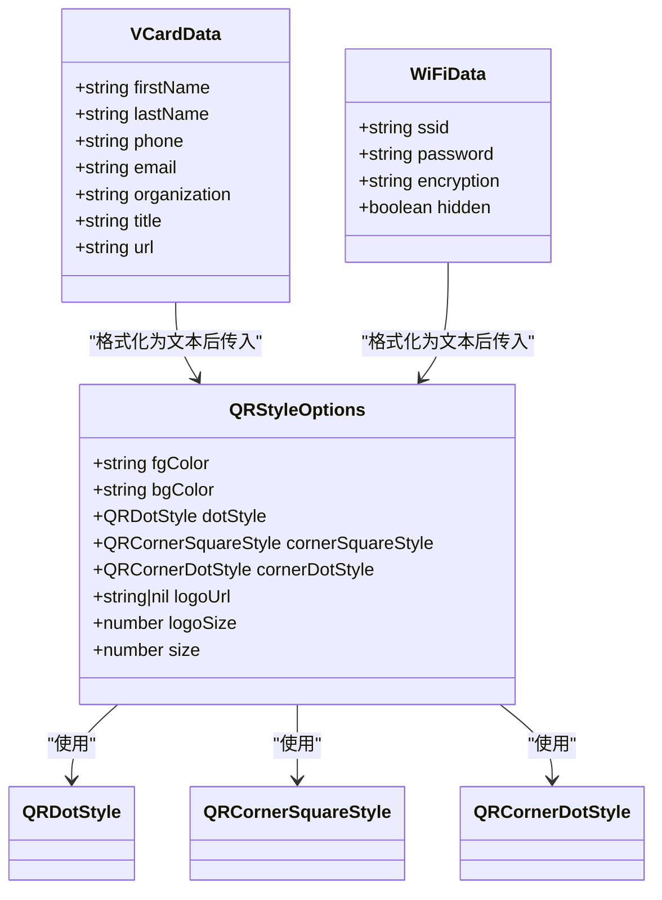
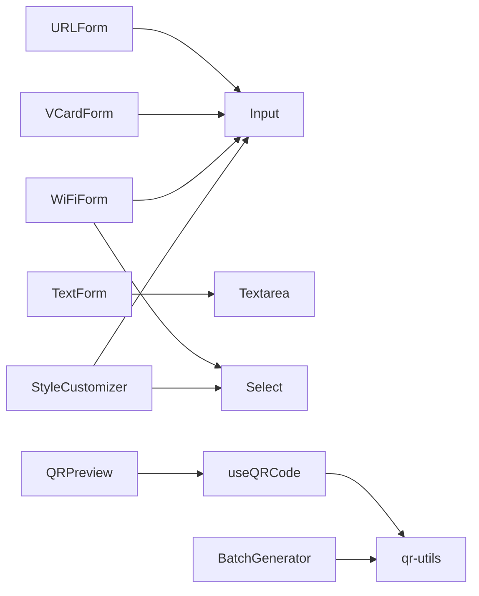

# 组件架构

<cite>
**本文引用的文件**
- [src/components/layout/Header.tsx](file://src/components/layout/Header.tsx)
- [src/components/layout/TabNav.tsx](file://src/components/layout/TabNav.tsx)
- [src/components/forms/URLForm.tsx](file://src/components/forms/URLForm.tsx)
- [src/components/forms/TextForm.tsx](file://src/components/forms/TextForm.tsx)
- [src/components/forms/VCardForm.tsx](file://src/components/forms/VCardForm.tsx)
- [src/components/forms/WiFiForm.tsx](file://src/components/forms/WiFiForm.tsx)
- [src/components/ui/button.tsx](file://src/components/ui/button.tsx)
- [src/components/ui/input.tsx](file://src/components/ui/input.tsx)
- [src/components/ui/select.tsx](file://src/components/ui/select.tsx)
- [src/components/ui/textarea.tsx](file://src/components/ui/textarea.tsx)
- [src/components/ui/card.tsx](file://src/components/ui/card.tsx)
- [src/components/ui/label.tsx](file://src/components/ui/label.tsx)
- [src/components/StyleCustomizer.tsx](file://src/components/StyleCustomizer.tsx)
- [src/components/QRPreview.tsx](file://src/components/QRPreview.tsx)
- [src/components/BatchGenerator.tsx](file://src/components/BatchGenerator.tsx)
- [src/hooks/useQRCode.ts](file://src/hooks/useQRCode.ts)
- [src/hooks/useTheme.ts](file://src/hooks/useTheme.ts)
- [src/lib/qr-utils.ts](file://src/lib/qr-utils.ts)
</cite>

## 目录
1. [简介](#简介)
2. [项目结构](#项目结构)
3. [核心组件](#核心组件)
4. [架构总览](#架构总览)
5. [详细组件分析](#详细组件分析)
6. [依赖分析](#依赖分析)
7. [性能考虑](#性能考虑)
8. [故障排查指南](#故障排查指南)
9. [结论](#结论)
10. [附录](#附录)

## 简介
本文件系统性梳理 QR Studio 的组件架构，覆盖布局组件（Header、TabNav）、表单组件（URLForm、TextForm、VCardForm、WiFiForm）、UI 组件库（button、input、select、textarea、card、label）以及功能组件（StyleCustomizer、QRPreview、BatchGenerator、ExportPanel）。文档重点阐述组件间依赖关系、props 传递模式与事件处理机制，总结组件复用策略、样式定制方案与响应式设计实现，并提供最佳实践与排错建议。

## 项目结构
项目采用按功能域分层的组织方式：components 下细分 layout、forms、ui 与功能组件；hooks 提供跨组件的状态与副作用抽象；lib 聚合业务工具与类型定义；入口文件负责应用装配与主题初始化。

图表来源
- [src/components/layout/Header.tsx:1-41](file://src/components/layout/Header.tsx#L1-L41)
- [src/components/layout/TabNav.tsx:1-47](file://src/components/layout/TabNav.tsx#L1-L47)
- [src/components/forms/URLForm.tsx:1-33](file://src/components/forms/URLForm.tsx#L1-L33)
- [src/components/forms/TextForm.tsx:1-28](file://src/components/forms/TextForm.tsx#L1-L28)
- [src/components/forms/VCardForm.tsx:1-92](file://src/components/forms/VCardForm.tsx#L1-L92)
- [src/components/forms/WiFiForm.tsx:1-67](file://src/components/forms/WiFiForm.tsx#L1-L67)
- [src/components/ui/button.tsx:1-51](file://src/components/ui/button.tsx#L1-L51)
- [src/components/ui/input.tsx:1-25](file://src/components/ui/input.tsx#L1-L25)
- [src/components/ui/select.tsx:1-31](file://src/components/ui/select.tsx#L1-L31)
- [src/components/ui/textarea.tsx:1-24](file://src/components/ui/textarea.tsx#L1-L24)
- [src/components/ui/card.tsx:1-86](file://src/components/ui/card.tsx#L1-L86)
- [src/components/ui/label.tsx:1-24](file://src/components/ui/label.tsx#L1-L24)
- [src/components/StyleCustomizer.tsx:1-193](file://src/components/StyleCustomizer.tsx#L1-L193)
- [src/components/QRPreview.tsx:1-45](file://src/components/QRPreview.tsx#L1-L45)
- [src/components/BatchGenerator.tsx:1-180](file://src/components/BatchGenerator.tsx#L1-L180)
- [src/hooks/useQRCode.ts:1-75](file://src/hooks/useQRCode.ts#L1-L75)
- [src/hooks/useTheme.ts:1-26](file://src/hooks/useTheme.ts#L1-L26)
- [src/lib/qr-utils.ts:1-151](file://src/lib/qr-utils.ts#L1-L151)

章节来源
- [src/components/layout/Header.tsx:1-41](file://src/components/layout/Header.tsx#L1-L41)
- [src/components/layout/TabNav.tsx:1-47](file://src/components/layout/TabNav.tsx#L1-L47)
- [src/components/forms/URLForm.tsx:1-33](file://src/components/forms/URLForm.tsx#L1-L33)
- [src/components/forms/TextForm.tsx:1-28](file://src/components/forms/TextForm.tsx#L1-L28)
- [src/components/forms/VCardForm.tsx:1-92](file://src/components/forms/VCardForm.tsx#L1-L92)
- [src/components/forms/WiFiForm.tsx:1-67](file://src/components/forms/WiFiForm.tsx#L1-L67)
- [src/components/ui/button.tsx:1-51](file://src/components/ui/button.tsx#L1-L51)
- [src/components/ui/input.tsx:1-25](file://src/components/ui/input.tsx#L1-L25)
- [src/components/ui/select.tsx:1-31](file://src/components/ui/select.tsx#L1-L31)
- [src/components/ui/textarea.tsx:1-24](file://src/components/ui/textarea.tsx#L1-L24)
- [src/components/ui/card.tsx:1-86](file://src/components/ui/card.tsx#L1-L86)
- [src/components/ui/label.tsx:1-24](file://src/components/ui/label.tsx#L1-L24)
- [src/components/StyleCustomizer.tsx:1-193](file://src/components/StyleCustomizer.tsx#L1-L193)
- [src/components/QRPreview.tsx:1-45](file://src/components/QRPreview.tsx#L1-L45)
- [src/components/BatchGenerator.tsx:1-180](file://src/components/BatchGenerator.tsx#L1-L180)
- [src/hooks/useQRCode.ts:1-75](file://src/hooks/useQRCode.ts#L1-L75)
- [src/hooks/useTheme.ts:1-26](file://src/hooks/useTheme.ts#L1-L26)
- [src/lib/qr-utils.ts:1-151](file://src/lib/qr-utils.ts#L1-L151)

## 核心组件
- 布局组件
  - Header：顶部导航栏，集成暗色模式切换与品牌标识。
  - TabNav：数据类型标签页导航，驱动主界面内容切换。
- 表单组件
  - URLForm、TextForm、VCardForm、WiFiForm：分别对应不同 QR 数据类型的输入表单，统一通过 onChange 回调向上游传递状态。
- UI 组件库
  - button、input、select、textarea、card、label：基于 Tailwind 与 class-variance-authority 的可变样式组件，提供一致的交互与视觉体验。
- 功能组件
  - StyleCustomizer：二维码样式自定义面板，支持颜色、形状、Logo 上传与尺寸调节。
  - QRPreview：二维码预览容器，根据是否有有效数据动态渲染。
  - BatchGenerator：CSV 批量导入与导出 ZIP 的生成器。
  - ExportPanel：导出面板（在当前仓库未找到该文件，将在“附录”中说明）。

章节来源
- [src/components/layout/Header.tsx:1-41](file://src/components/layout/Header.tsx#L1-L41)
- [src/components/layout/TabNav.tsx:1-47](file://src/components/layout/TabNav.tsx#L1-L47)
- [src/components/forms/URLForm.tsx:1-33](file://src/components/forms/URLForm.tsx#L1-L33)
- [src/components/forms/TextForm.tsx:1-28](file://src/components/forms/TextForm.tsx#L1-L28)
- [src/components/forms/VCardForm.tsx:1-92](file://src/components/forms/VCardForm.tsx#L1-L92)
- [src/components/forms/WiFiForm.tsx:1-67](file://src/components/forms/WiFiForm.tsx#L1-L67)
- [src/components/ui/button.tsx:1-51](file://src/components/ui/button.tsx#L1-L51)
- [src/components/ui/input.tsx:1-25](file://src/components/ui/input.tsx#L1-L25)
- [src/components/ui/select.tsx:1-31](file://src/components/ui/select.tsx#L1-L31)
- [src/components/ui/textarea.tsx:1-24](file://src/components/ui/textarea.tsx#L1-L24)
- [src/components/ui/card.tsx:1-86](file://src/components/ui/card.tsx#L1-L86)
- [src/components/ui/label.tsx:1-24](file://src/components/ui/label.tsx#L1-L24)
- [src/components/StyleCustomizer.tsx:1-193](file://src/components/StyleCustomizer.tsx#L1-L193)
- [src/components/QRPreview.tsx:1-45](file://src/components/QRPreview.tsx#L1-L45)
- [src/components/BatchGenerator.tsx:1-180](file://src/components/BatchGenerator.tsx#L1-L180)

## 架构总览
整体采用“表单输入 → 业务格式化 → 二维码渲染 → 预览与导出”的数据流。useQRCode 抽象了 QR 渲染与导出能力，StyleCustomizer 通过受控 props 更新样式，TabNav 控制表单类型切换，Header 提供主题控制。

图表来源
- [src/components/layout/TabNav.tsx:1-47](file://src/components/layout/TabNav.tsx#L1-L47)
- [src/components/forms/URLForm.tsx:1-33](file://src/components/forms/URLForm.tsx#L1-L33)
- [src/components/forms/TextForm.tsx:1-28](file://src/components/forms/TextForm.tsx#L1-L28)
- [src/components/forms/VCardForm.tsx:1-92](file://src/components/forms/VCardForm.tsx#L1-L92)
- [src/components/forms/WiFiForm.tsx:1-67](file://src/components/forms/WiFiForm.tsx#L1-L67)
- [src/components/StyleCustomizer.tsx:1-193](file://src/components/StyleCustomizer.tsx#L1-L193)
- [src/hooks/useQRCode.ts:1-75](file://src/hooks/useQRCode.ts#L1-L75)
- [src/lib/qr-utils.ts:1-151](file://src/lib/qr-utils.ts#L1-L151)
- [src/components/QRPreview.tsx:1-45](file://src/components/QRPreview.tsx#L1-L45)

## 详细组件分析

### 布局组件

#### Header 分析
- 设计要点
  - 集成 useTheme，读取当前主题状态并提供切换回调。
  - 使用 Button 变体与尺寸，保持与 UI 库一致的交互语义。
- Props 与事件
  - 无外部 props；通过 onClick 触发 toggle。
- 样式与响应式
  - 使用 glass 边框与容器约束宽度，适配移动端与桌面端。
- 最佳实践
  - 将主题切换逻辑集中于 useTheme，避免在多处重复判断系统偏好。

章节来源
- [src/components/layout/Header.tsx:1-41](file://src/components/layout/Header.tsx#L1-L41)
- [src/hooks/useTheme.ts:1-26](file://src/hooks/useTheme.ts#L1-L26)
- [src/components/ui/button.tsx:1-51](file://src/components/ui/button.tsx#L1-L51)

#### TabNav 分析
- 设计要点
  - 以配置数组定义标签页，支持扩展新类型。
  - 通过 activeTab 与 onTabChange 实现受控切换。
- Props 与事件
  - activeTab: 当前激活标签页标识。
  - onTabChange: 切换回调，参数为 QRDataType | 'batch'。
- 样式与响应式
  - 使用圆角边框与阴影，激活态高亮，hover 有反馈。
- 最佳实践
  - 新增标签页时仅需扩展 tabs 配置与渲染分支，无需修改布局。

章节来源
- [src/components/layout/TabNav.tsx:1-47](file://src/components/layout/TabNav.tsx#L1-L47)
- [src/lib/qr-utils.ts:1-151](file://src/lib/qr-utils.ts#L1-L151)

### 表单组件

#### URLForm 分析
- 设计要点
  - 输入类型为 url，带前缀提示与图标装饰。
  - 通过 onChange(value) 向上游传递字符串。
- Props 与事件
  - value: 输入值。
  - onChange: 字符串变更回调。
- 最佳实践
  - 在父级进行校验与格式化，确保协议前缀完整。

章节来源
- [src/components/forms/URLForm.tsx:1-33](file://src/components/forms/URLForm.tsx#L1-L33)
- [src/components/ui/input.tsx:1-25](file://src/components/ui/input.tsx#L1-L25)
- [src/components/ui/label.tsx:1-24](file://src/components/ui/label.tsx#L1-L24)

#### TextForm 分析
- 设计要点
  - 多行文本输入，显示字符计数上限。
  - 支持自定义行数与占位符。
- Props 与事件
  - value: 文本内容。
  - onChange: 文本变更回调。
- 最佳实践
  - 对长文本进行节流或防抖处理，避免频繁重渲染。

章节来源
- [src/components/forms/TextForm.tsx:1-28](file://src/components/forms/TextForm.tsx#L1-L28)
- [src/components/ui/textarea.tsx:1-24](file://src/components/ui/textarea.tsx#L1-L24)
- [src/components/ui/label.tsx:1-24](file://src/components/ui/label.tsx#L1-L24)

#### VCardForm 分析
- 设计要点
  - 结构化联系人字段，使用网格布局提升可读性。
  - 通过局部更新函数 update(field, val) 合并对象。
- Props 与事件
  - value: VCardData。
  - onChange: VCardData 变更回调。
- 最佳实践
  - 在父级将 VCardData 格式化为 vCard 文本后传入 QR 渲染。

章节来源
- [src/components/forms/VCardForm.tsx:1-92](file://src/components/forms/VCardForm.tsx#L1-L92)
- [src/lib/qr-utils.ts:25-56](file://src/lib/qr-utils.ts#L25-L56)
- [src/components/ui/input.tsx:1-25](file://src/components/ui/input.tsx#L1-L25)
- [src/components/ui/label.tsx:1-24](file://src/components/ui/label.tsx#L1-L24)

#### WiFiForm 分析
- 设计要点
  - 加密方式下拉选择，密码输入根据禁用状态联动。
  - 支持隐藏网络选项。
- Props 与事件
  - value: WiFiData。
  - onChange: WiFiData 变更回调。
- 最佳实践
  - 在导出前对 WiFiData 进行格式化，确保字段齐全。

章节来源
- [src/components/forms/WiFiForm.tsx:1-67](file://src/components/forms/WiFiForm.tsx#L1-L67)
- [src/lib/qr-utils.ts:35-61](file://src/lib/qr-utils.ts#L35-L61)
- [src/components/ui/input.tsx:1-25](file://src/components/ui/input.tsx#L1-L25)
- [src/components/ui/select.tsx:1-31](file://src/components/ui/select.tsx#L1-L31)
- [src/components/ui/label.tsx:1-24](file://src/components/ui/label.tsx#L1-L24)

### UI 组件库

#### Button 分析
- 设计要点
  - 基于 class-variance-authority 定义变体与尺寸，支持渐变、阴影等视觉效果。
- Props 与事件
  - variant/size/className 透传至原生 button。
- 最佳实践
  - 优先使用渐变与优雅阴影变体，保持一致的品牌风格。

章节来源
- [src/components/ui/button.tsx:1-51](file://src/components/ui/button.tsx#L1-L51)

#### Input/Select/Textarea/Label/Card 分析
- 设计要点
  - 统一的焦点态、禁用态与过渡动画，遵循无障碍与可用性规范。
  - Card 提供标题、描述、内容区的语义化封装。
- 最佳实践
  - 为每个表单元素绑定 Label，提升可访问性。

章节来源
- [src/components/ui/input.tsx:1-25](file://src/components/ui/input.tsx#L1-L25)
- [src/components/ui/select.tsx:1-31](file://src/components/ui/select.tsx#L1-L31)
- [src/components/ui/textarea.tsx:1-24](file://src/components/ui/textarea.tsx#L1-L24)
- [src/components/ui/label.tsx:1-24](file://src/components/ui/label.tsx#L1-L24)
- [src/components/ui/card.tsx:1-86](file://src/components/ui/card.tsx#L1-L86)

### 功能组件

#### StyleCustomizer 分析
- 设计要点
  - 颜色选择支持预设与自定义；Logo 支持上传与尺寸调节；样式选项映射到 QR 配置。
- Props 与事件
  - style: QRStyleOptions。
  - onStyleChange: 部分更新回调。
- 事件处理机制
  - 文件读取使用 FileReader；颜色输入双向绑定；范围输入用于 Logo 尺寸。
- 最佳实践
  - 在存在 Logo 时提高容错级别（如错误纠正等级），保证可扫描性。

章节来源
- [src/components/StyleCustomizer.tsx:1-193](file://src/components/StyleCustomizer.tsx#L1-L193)
- [src/lib/qr-utils.ts:14-151](file://src/lib/qr-utils.ts#L14-L151)

#### QRPreview 分析
- 设计要点
  - 条件渲染：无数据时展示占位图与提示；有数据时挂载 QR 容器。
  - 容器尺寸固定，内部 SVG/Canvas 自适应。
- Props 与事件
  - containerRef: DOM 引用，用于挂载 QR 实例。
  - hasData: 是否有有效数据。
- 最佳实践
  - 预留最小尺寸保障在窄屏下的可读性。

章节来源
- [src/components/QRPreview.tsx:1-45](file://src/components/QRPreview.tsx#L1-L45)

#### BatchGenerator 分析
- 设计要点
  - CSV 解析与批量化生成，支持进度条与 ZIP 打包下载。
  - 通过默认样式与大尺寸导出保证质量。
- 事件与流程
  - CSV 上传 → 解析 → 构建待生成列表 → 逐项生成 PNG → 打包下载。
- 最佳实践
  - 对 CSV 列名进行宽松匹配，避免严格依赖列名顺序。

章节来源
- [src/components/BatchGenerator.tsx:1-180](file://src/components/BatchGenerator.tsx#L1-L180)
- [src/lib/qr-utils.ts:103-151](file://src/lib/qr-utils.ts#L103-L151)

### 类关系与数据模型

图表来源
- [src/lib/qr-utils.ts:14-61](file://src/lib/qr-utils.ts#L14-L61)

## 依赖分析
- 组件内聚与耦合
  - 表单组件与 UI 组件库强耦合，但通过受控 props 与回调解耦上游逻辑。
  - StyleCustomizer 与 useQRCode 通过样式对象进行松耦合通信。
- 外部依赖
  - qr-code-styling：二维码渲染核心库。
  - class-variance-authority：UI 组件变体与尺寸管理。
  - PapaParse：CSV 解析。
  - JSZip：批量导出打包。
- 潜在循环依赖
  - 未发现直接循环依赖；若后续引入更多共享逻辑，建议通过 lib 层收敛。

图表来源
- [src/components/forms/URLForm.tsx:1-33](file://src/components/forms/URLForm.tsx#L1-L33)
- [src/components/forms/TextForm.tsx:1-28](file://src/components/forms/TextForm.tsx#L1-L28)
- [src/components/forms/VCardForm.tsx:1-92](file://src/components/forms/VCardForm.tsx#L1-L92)
- [src/components/forms/WiFiForm.tsx:1-67](file://src/components/forms/WiFiForm.tsx#L1-L67)
- [src/components/StyleCustomizer.tsx:1-193](file://src/components/StyleCustomizer.tsx#L1-L193)
- [src/components/QRPreview.tsx:1-45](file://src/components/QRPreview.tsx#L1-L45)
- [src/components/BatchGenerator.tsx:1-180](file://src/components/BatchGenerator.tsx#L1-L180)
- [src/hooks/useQRCode.ts:1-75](file://src/hooks/useQRCode.ts#L1-L75)
- [src/lib/qr-utils.ts:1-151](file://src/lib/qr-utils.ts#L1-L151)

章节来源
- [src/components/forms/URLForm.tsx:1-33](file://src/components/forms/URLForm.tsx#L1-L33)
- [src/components/forms/TextForm.tsx:1-28](file://src/components/forms/TextForm.tsx#L1-L28)
- [src/components/forms/VCardForm.tsx:1-92](file://src/components/forms/VCardForm.tsx#L1-L92)
- [src/components/forms/WiFiForm.tsx:1-67](file://src/components/forms/WiFiForm.tsx#L1-L67)
- [src/components/StyleCustomizer.tsx:1-193](file://src/components/StyleCustomizer.tsx#L1-L193)
- [src/components/QRPreview.tsx:1-45](file://src/components/QRPreview.tsx#L1-L45)
- [src/components/BatchGenerator.tsx:1-180](file://src/components/BatchGenerator.tsx#L1-L180)
- [src/hooks/useQRCode.ts:1-75](file://src/hooks/useQRCode.ts#L1-L75)
- [src/lib/qr-utils.ts:1-151](file://src/lib/qr-utils.ts#L1-L151)

## 性能考虑
- 渲染优化
  - useQRCode 仅在 data 或 style 变化时重建 QR 实例，避免不必要的重绘。
  - QRPreview 条件渲染，空数据时不挂载容器。
- 导出性能
  - 批量导出使用异步生成与进度条，避免阻塞主线程。
  - 默认导出尺寸较大，保证打印与高分辨率场景清晰度。
- 内存管理
  - 上传 Logo 后及时清理 FileReader 与临时 URL，防止内存泄漏。
- 建议
  - 对高频输入（如颜色、Logo 尺寸）增加节流/防抖。
  - 对 CSV 导入进行分块解析，避免大文件卡顿。

## 故障排查指南
- 主题切换无效
  - 检查 useTheme 是否正确写入/移除 dark 类名。
- 二维码不显示
  - 确认 data 非空且已传入 useQRCode；检查容器引用是否正确。
- 样式不生效
  - 确认 onStyleChange 传入的是部分更新对象；检查 QR 渲染是否重新执行。
- 批量导出失败
  - 检查 CSV 列名映射与数据清洗逻辑；确认 ZIP 打包与下载触发。
- Logo 无法上传
  - 确认文件类型限制与 FileReader 成功回调；检查样式覆盖与尺寸范围。

章节来源
- [src/hooks/useTheme.ts:1-26](file://src/hooks/useTheme.ts#L1-L26)
- [src/hooks/useQRCode.ts:1-75](file://src/hooks/useQRCode.ts#L1-L75)
- [src/components/StyleCustomizer.tsx:1-193](file://src/components/StyleCustomizer.tsx#L1-L193)
- [src/components/BatchGenerator.tsx:1-180](file://src/components/BatchGenerator.tsx#L1-L180)

## 结论
本架构以清晰的职责划分与受控数据流为核心，通过 UI 组件库与 hooks 抽象实现高复用与可维护性。表单组件专注于输入，样式与渲染分离，便于扩展新数据类型与导出格式。建议持续完善导出面板与国际化支持，进一步提升用户体验。

## 附录

### 组件复用策略
- UI 组件库：通过变体与尺寸参数化，统一交互与视觉语言。
- 表单组件：以受控 props 与回调模式解耦输入与业务逻辑。
- Hooks：useQRCode 与 useTheme 将状态与副作用抽取为可复用模块。

### 样式定制方案
- 颜色：支持预设与自定义，结合透明度与对比度保障可读性。
- 形状：点样式、定位角与定位点三类可独立定制，满足品牌一致性。
- Logo：支持上传与尺寸调节，自动计算容错等级以保证可扫描性。

### 响应式设计实现
- 容器尺寸固定，内部元素自适应；标签页与卡片在窄屏下自动换行。
- 按钮与输入框在移动端具备合适的触控目标尺寸与间距。

### 代码示例路径
- 表单组件示例路径
  - [URLForm:1-33](file://src/components/forms/URLForm.tsx#L1-L33)
  - [TextForm:1-28](file://src/components/forms/TextForm.tsx#L1-L28)
  - [VCardForm:1-92](file://src/components/forms/VCardForm.tsx#L1-L92)
  - [WiFiForm:1-67](file://src/components/forms/WiFiForm.tsx#L1-L67)
- UI 组件示例路径
  - [Button:1-51](file://src/components/ui/button.tsx#L1-L51)
  - [Input:1-25](file://src/components/ui/input.tsx#L1-L25)
  - [Select:1-31](file://src/components/ui/select.tsx#L1-L31)
  - [Textarea:1-24](file://src/components/ui/textarea.tsx#L1-L24)
  - [Card:1-86](file://src/components/ui/card.tsx#L1-L86)
  - [Label:1-24](file://src/components/ui/label.tsx#L1-L24)
- 功能组件示例路径
  - [StyleCustomizer:1-193](file://src/components/StyleCustomizer.tsx#L1-L193)
  - [QRPreview:1-45](file://src/components/QRPreview.tsx#L1-L45)
  - [BatchGenerator:1-180](file://src/components/BatchGenerator.tsx#L1-L180)
- 工具与钩子示例路径
  - [useQRCode:1-75](file://src/hooks/useQRCode.ts#L1-L75)
  - [useTheme:1-26](file://src/hooks/useTheme.ts#L1-L26)
  - [qr-utils:1-151](file://src/lib/qr-utils.ts#L1-L151)

### 关于 ExportPanel
- 在当前仓库未找到 ExportPanel.tsx 文件。若需要导出面板功能，请在组件目录新增该文件，并参考以下接口约定：
  - 接收 data 与 style，提供 PNG/SVG 导出按钮与尺寸选择。
  - 可复用 useQRCode 的导出方法，或直接调用 qr-utils 的 createQRCode 并触发下载。
- 若已有导出逻辑，可将其迁移至 ExportPanel 并由上层组件统一调度。