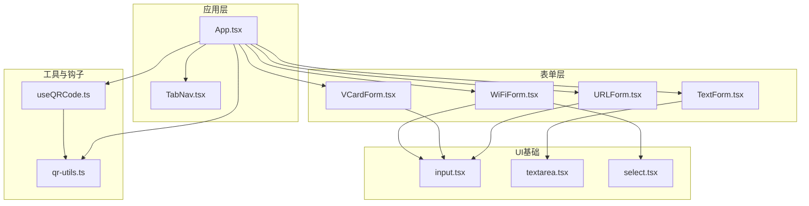
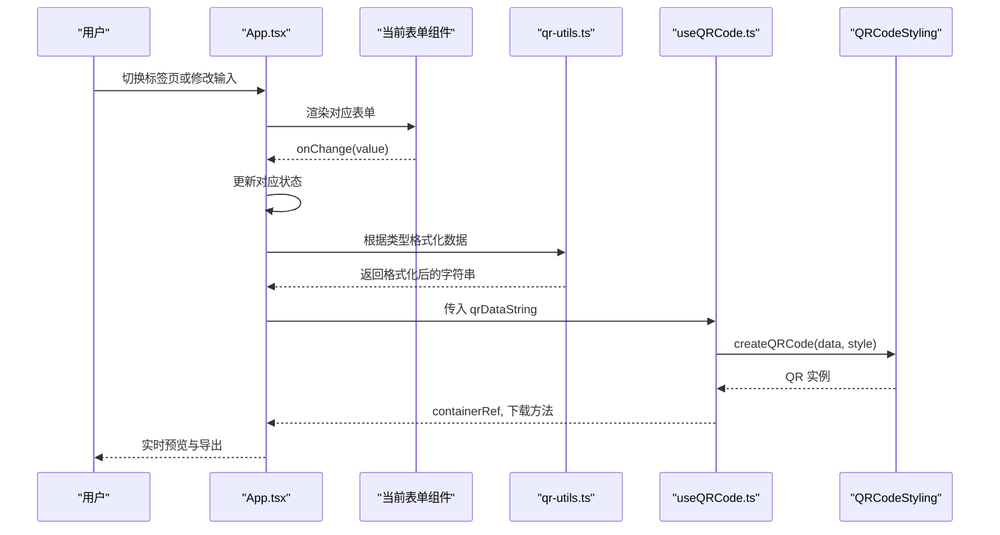
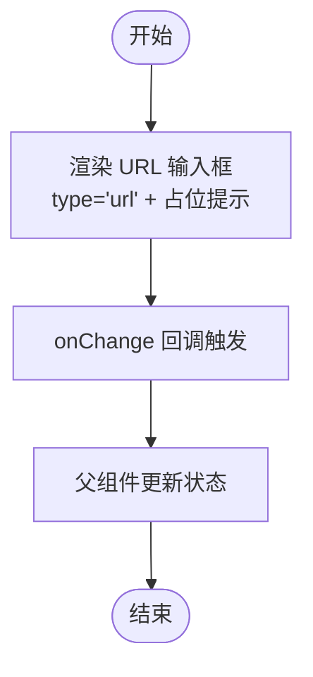
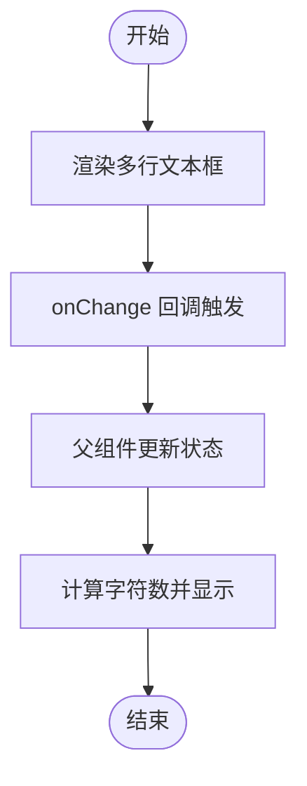
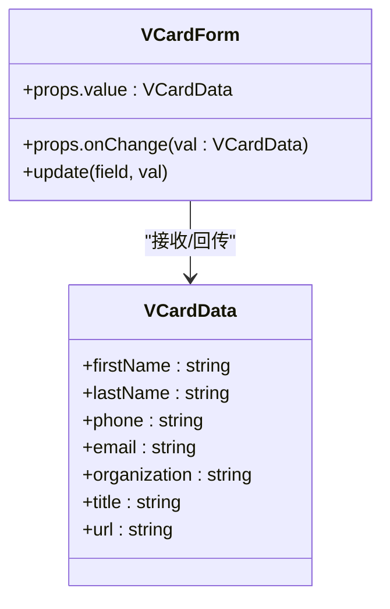
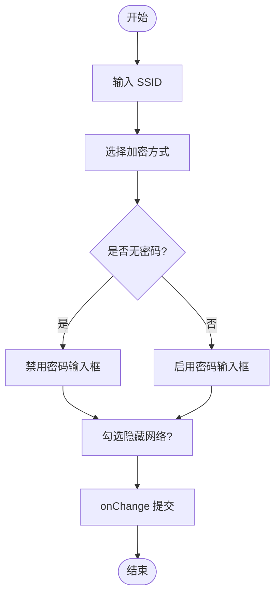
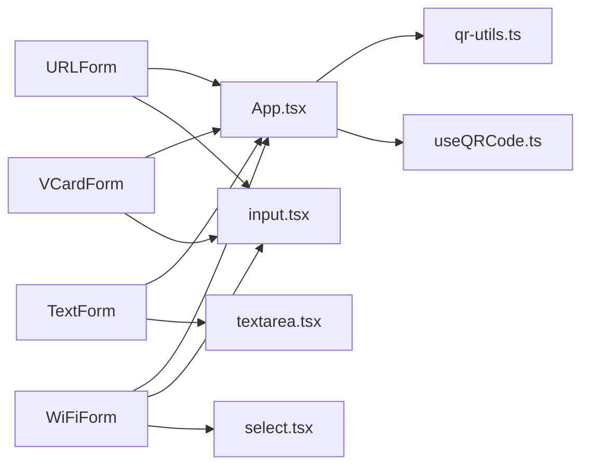

# 表单组件

<cite>
**本文引用的文件**
- [App.tsx](file://src/App.tsx)
- [URLForm.tsx](file://src/components/forms/URLForm.tsx)
- [TextForm.tsx](file://src/components/forms/TextForm.tsx)
- [VCardForm.tsx](file://src/components/forms/VCardForm.tsx)
- [WiFiForm.tsx](file://src/components/forms/WiFiForm.tsx)
- [qr-utils.ts](file://src/lib/qr-utils.ts)
- [useQRCode.ts](file://src/hooks/useQRCode.ts)
- [TabNav.tsx](file://src/components/layout/TabNav.tsx)
- [BatchGenerator.tsx](file://src/components/BatchGenerator.tsx)
- [input.tsx](file://src/components/ui/input.tsx)
- [textarea.tsx](file://src/components/ui/textarea.tsx)
- [select.tsx](file://src/components/ui/select.tsx)
</cite>

## 目录
1. [简介](#简介)
2. [项目结构](#项目结构)
3. [核心组件](#核心组件)
4. [架构总览](#架构总览)
5. [详细组件分析](#详细组件分析)
6. [依赖分析](#依赖分析)
7. [性能考虑](#性能考虑)
8. [故障排除指南](#故障排除指南)
9. [结论](#结论)
10. [附录](#附录)

## 简介
本文件系统性梳理并解读四个表单组件：URLForm、TextForm、VCardForm、WiFiForm 的设计模式与实现细节。重点覆盖：
- 数据验证规则与输入处理策略
- 状态管理机制与共享逻辑
- 数据格式化方法（如 vCard/wiFi 规范）
- 错误处理与边界条件
- 组件 props 接口、事件回调与样式定制
- 实际使用示例与常见问题排查

## 项目结构
四个表单组件位于 src/components/forms 目录，配合 App.tsx 进行状态聚合与数据格式化，最终通过 useQRCode 钩子渲染二维码并支持导出。

图表来源
- [App.tsx:1-173](file://src/App.tsx#L1-L173)
- [URLForm.tsx:1-33](file://src/components/forms/URLForm.tsx#L1-L33)
- [TextForm.tsx:1-28](file://src/components/forms/TextForm.tsx#L1-L28)
- [VCardForm.tsx:1-92](file://src/components/forms/VCardForm.tsx#L1-L92)
- [WiFiForm.tsx:1-67](file://src/components/forms/WiFiForm.tsx#L1-L67)
- [qr-utils.ts:1-151](file://src/lib/qr-utils.ts#L1-L151)
- [useQRCode.ts:1-75](file://src/hooks/useQRCode.ts#L1-L75)
- [input.tsx:1-25](file://src/components/ui/input.tsx#L1-L25)
- [textarea.tsx:1-24](file://src/components/ui/textarea.tsx#L1-L24)
- [select.tsx:1-31](file://src/components/ui/select.tsx#L1-L31)

章节来源
- [App.tsx:1-173](file://src/App.tsx#L1-L173)
- [TabNav.tsx:1-47](file://src/components/layout/TabNav.tsx#L1-L47)

## 核心组件
- URLForm：单字段 URL 输入，带前缀提示与图标装饰。
- TextForm：多行文本输入，字符计数提示。
- VCardForm：联系人 vCard 多字段表单，组合更新策略。
- WiFiForm：WiFi 配置表单，含加密方式选择、密码禁用联动与隐藏网络复选框。

章节来源
- [URLForm.tsx:1-33](file://src/components/forms/URLForm.tsx#L1-L33)
- [TextForm.tsx:1-28](file://src/components/forms/TextForm.tsx#L1-L28)
- [VCardForm.tsx:1-92](file://src/components/forms/VCardForm.tsx#L1-L92)
- [WiFiForm.tsx:1-67](file://src/components/forms/WiFiForm.tsx#L1-L67)

## 架构总览
四个表单组件通过 App.tsx 的状态驱动，按当前标签页切换渲染对应表单。App.tsx 使用 useMemo 计算当前二维码数据字符串，其中：
- URL 文本直接使用
- 文本内容直接使用
- vCard 仅当存在姓名字段时才格式化为 vCard
- WiFi 仅当 SSID 存在时才格式化为 WiFi 规范字符串

useQRCode 钩子根据数据与样式实时创建 QRCode 并注入容器，同时提供导出 PNG/SVG 的能力。

图表来源
- [App.tsx:47-65](file://src/App.tsx#L47-L65)
- [qr-utils.ts:42-61](file://src/lib/qr-utils.ts#L42-L61)
- [useQRCode.ts:11-29](file://src/hooks/useQRCode.ts#L11-L29)

章节来源
- [App.tsx:24-65](file://src/App.tsx#L24-L65)
- [qr-utils.ts:42-61](file://src/lib/qr-utils.ts#L42-L61)
- [useQRCode.ts:1-75](file://src/hooks/useQRCode.ts#L1-L75)

## 详细组件分析

### URLForm 分析
- 设计模式：受控组件模式，props 传入 value 与 onChange，内部不持有本地状态。
- 输入处理：使用带 URL 类型的输入框，自动提示 URL 前缀要求；左侧内置图标增强可识别度。
- 样式与交互：左侧装饰图标 + 左侧内边距，提供简短说明文案。
- 数据验证：未实现前端正则校验，但通过输入类型与占位提示引导用户输入完整 URL。
- 错误处理：无显式错误反馈，建议在上层结合业务需求增加校验与提示。

图表来源
- [URLForm.tsx:10-32](file://src/components/forms/URLForm.tsx#L10-L32)

章节来源
- [URLForm.tsx:1-33](file://src/components/forms/URLForm.tsx#L1-L33)
- [input.tsx:1-25](file://src/components/ui/input.tsx#L1-L25)

### TextForm 分析
- 设计模式：受控组件，多行文本区域，支持字符计数。
- 输入处理：Textarea 组件，rows=5，支持换行输入；底部显示已输入字符数与上限。
- 数据验证：未实现前端校验，字符计数用于用户提示。
- 错误处理：无显式错误处理，建议在上层限制长度并给出提示。

图表来源
- [TextForm.tsx:9-27](file://src/components/forms/TextForm.tsx#L9-L27)

章节来源
- [TextForm.tsx:1-28](file://src/components/forms/TextForm.tsx#L1-L28)
- [textarea.tsx:1-24](file://src/components/ui/textarea.tsx#L1-L24)

### VCardForm 分析
- 设计模式：组合式受控组件，内部维护 update 辅助函数，按字段键值更新。
- 输入处理：两列网格布局，分别包含姓名、电话、邮箱、公司、职位、网站等字段。
- 数据验证：未实现前端校验，格式化依赖 formatVCard。
- 共享逻辑：通过 onChange 将整个 VCardData 对象回传给父组件，确保字段一致性。
- 错误处理：无显式错误处理，建议在上层对必填字段进行校验。

图表来源
- [VCardForm.tsx:5-13](file://src/components/forms/VCardForm.tsx#L5-L13)
- [qr-utils.ts:25-33](file://src/lib/qr-utils.ts#L25-L33)

章节来源
- [VCardForm.tsx:1-92](file://src/components/forms/VCardForm.tsx#L1-L92)
- [qr-utils.ts:25-56](file://src/lib/qr-utils.ts#L25-L56)

### WiFiForm 分析
- 设计模式：组合式受控组件，内部维护 update 辅助函数，按字段键值更新。
- 输入处理：SSID 必填；加密方式下拉选择；密码输入框根据加密方式禁用/启用；隐藏网络复选框。
- 数据验证：未实现前端校验，加密方式限定为 WPA/WEP/nopass；密码在 nopass 时禁用。
- 共享逻辑：通过 onChange 将整个 WiFiData 对象回传给父组件。
- 错误处理：无显式错误处理，建议在上层对必填字段进行校验。

图表来源
- [WiFiForm.tsx:17-66](file://src/components/forms/WiFiForm.tsx#L17-L66)

章节来源
- [WiFiForm.tsx:1-67](file://src/components/forms/WiFiForm.tsx#L1-L67)
- [qr-utils.ts:35-40](file://src/lib/qr-utils.ts#L35-L40)

## 依赖分析
- 组件间耦合：表单组件均为纯展示与受控输入，耦合度低，通过 props 与回调与 App.tsx 交互。
- 外部依赖：依赖 qr-utils.ts 中的格式化函数与样式配置；依赖 useQRCode 钩子进行渲染与导出。
- 数据流：App.tsx 聚合各表单状态，计算 qrDataString，useQRCode 钩子消费该字符串并渲染 QR。

图表来源
- [App.tsx:103-114](file://src/App.tsx#L103-L114)
- [qr-utils.ts:42-61](file://src/lib/qr-utils.ts#L42-L61)
- [useQRCode.ts:11-29](file://src/hooks/useQRCode.ts#L11-L29)
- [input.tsx:1-25](file://src/components/ui/input.tsx#L1-L25)
- [textarea.tsx:1-24](file://src/components/ui/textarea.tsx#L1-L24)
- [select.tsx:1-31](file://src/components/ui/select.tsx#L1-L31)

章节来源
- [App.tsx:103-114](file://src/App.tsx#L103-L114)
- [qr-utils.ts:42-61](file://src/lib/qr-utils.ts#L42-L61)
- [useQRCode.ts:11-29](file://src/hooks/useQRCode.ts#L11-L29)

## 性能考虑
- 渲染优化：App.tsx 使用 useMemo 计算 qrDataString，避免不必要的重渲染。
- 依赖稳定：useQRCode 钩子基于 data 与 style 变更重建 QR 实例，减少重复初始化。
- 导出性能：批量导出使用 JSZip 与异步生成，进度条反馈用户体验。

章节来源
- [App.tsx:47-62](file://src/App.tsx#L47-L62)
- [useQRCode.ts:11-29](file://src/hooks/useQRCode.ts#L11-L29)
- [BatchGenerator.tsx:52-79](file://src/components/BatchGenerator.tsx#L52-L79)

## 故障排除指南
- 二维码为空
  - 检查当前标签页是否选择了有效数据类型。
  - 确认 vCard 与 WiFi 的关键字段是否满足格式化条件（例如 vCard 需要至少包含姓名之一，WiFi 需要 SSID）。
- 导出失败
  - 确保数据非空且格式正确。
  - 检查浏览器下载权限与弹窗拦截设置。
- 输入异常
  - URLForm 未强制校验，建议在上层添加校验与提示。
  - TextForm 未限制长度，建议在上层限制并提示。
  - WiFiForm 在“无密码”时禁用密码输入框，确保逻辑一致。

章节来源
- [App.tsx:54-58](file://src/App.tsx#L54-L58)
- [qr-utils.ts:42-61](file://src/lib/qr-utils.ts#L42-L61)
- [useQRCode.ts:35-51](file://src/hooks/useQRCode.ts#L35-L51)

## 结论
四个表单组件采用统一的受控组件模式，通过 App.tsx 聚合状态与格式化逻辑，结合 useQRCode 钩子完成实时渲染与导出。组件职责清晰、耦合度低，便于扩展与维护。建议在上层增加必要的输入校验与错误提示，以提升用户体验与数据质量。

## 附录

### 组件 Props 接口与事件回调
- URLForm
  - props: { value: string; onChange: (val: string) => void }
  - 事件：onChange(value)
  - 样式：通过 className 扩展（如左侧图标内边距）
- TextForm
  - props: { value: string; onChange: (val: string) => void }
  - 事件：onChange(value)
  - 样式：Textarea 默认样式与字符计数提示
- VCardForm
  - props: { value: VCardData; onChange: (val: VCardData) => void }
  - 事件：onChange(VCardData)
  - 样式：网格布局与字段分组
- WiFiForm
  - props: { value: WiFiData; onChange: (val: WiFiData) => void }
  - 事件：onChange(WiFiData)
  - 样式：网格布局、下拉选择、复选框禁用联动

章节来源
- [URLForm.tsx:5-8](file://src/components/forms/URLForm.tsx#L5-L8)
- [TextForm.tsx:4-7](file://src/components/forms/TextForm.tsx#L4-L7)
- [VCardForm.tsx:5-8](file://src/components/forms/VCardForm.tsx#L5-L8)
- [WiFiForm.tsx:6-9](file://src/components/forms/WiFiForm.tsx#L6-L9)

### 数据格式化方法
- vCard 格式化：当存在姓名字段时，生成标准 vCard 文本。
- WiFi 格式化：根据加密方式、SSID、密码与隐藏标志生成 WiFi 规范字符串。

章节来源
- [qr-utils.ts:42-61](file://src/lib/qr-utils.ts#L42-L61)

### 实际使用示例
- URL 输入
  - 在 URLForm 中输入完整 URL（包含协议），onChange 将值回传至 App.tsx，App.tsx 直接使用该字符串生成二维码。
- 文本输入
  - 在 TextForm 中输入任意文本，onChange 将值回传至 App.tsx，App.tsx 直接使用该字符串生成二维码。
- vCard 输入
  - 在 VCardForm 中填写姓名、电话、邮箱、公司、职位、网站等字段，onChange 将整个对象回传至 App.tsx；App.tsx 仅在存在姓名字段时调用 formatVCard 生成 vCard 文本。
- WiFi 输入
  - 在 WiFiForm 中填写 SSID、加密方式、密码与隐藏网络选项，onChange 将整个对象回传至 App.tsx；App.tsx 仅在存在 SSID 时调用 formatWiFi 生成 WiFi 文本。

章节来源
- [App.tsx:47-62](file://src/App.tsx#L47-L62)
- [qr-utils.ts:42-61](file://src/lib/qr-utils.ts#L42-L61)