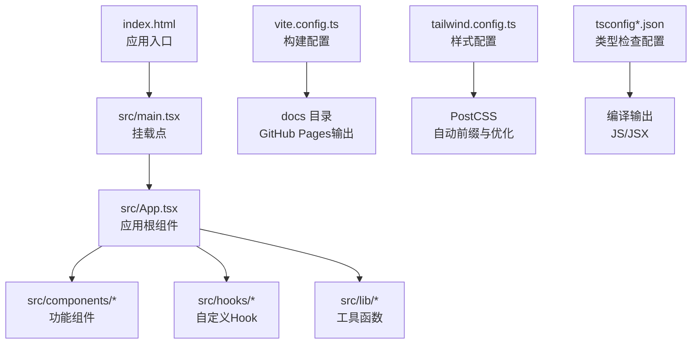
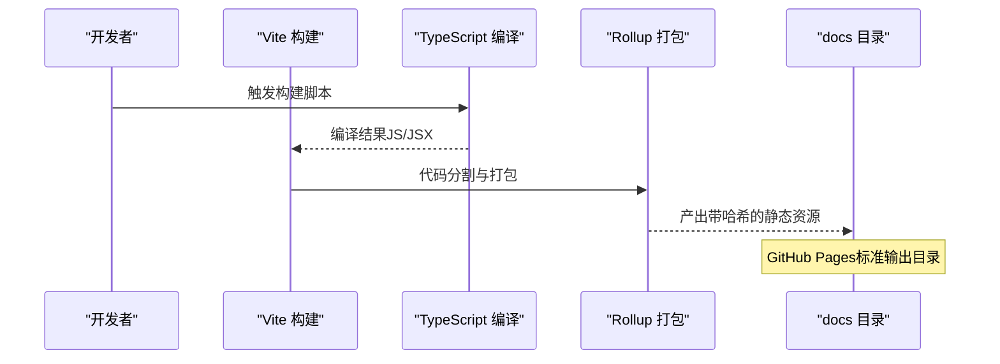
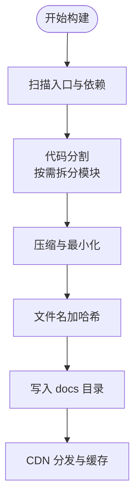
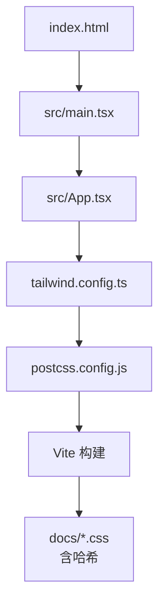
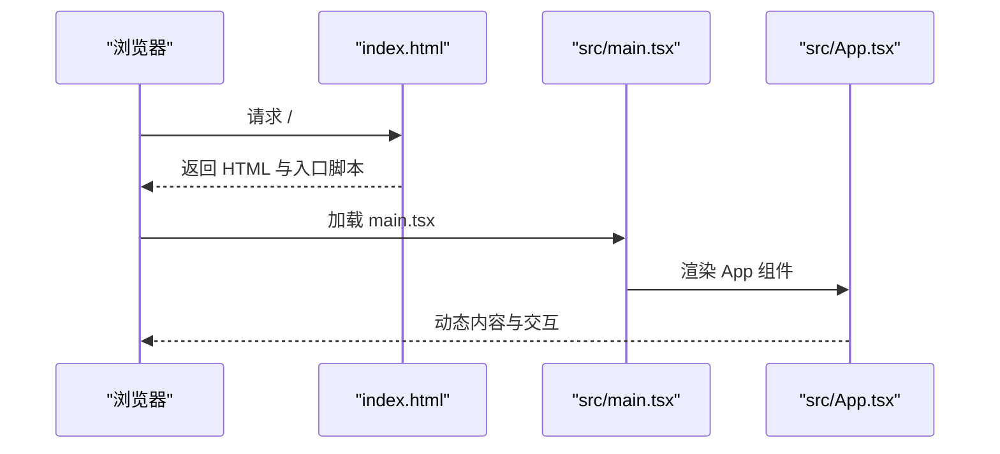
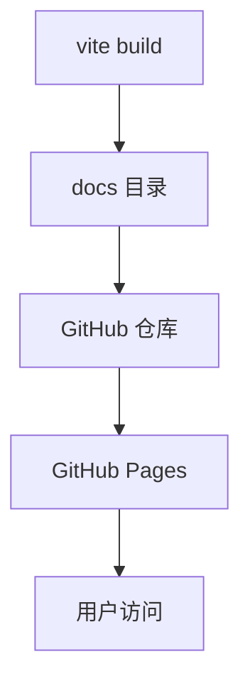
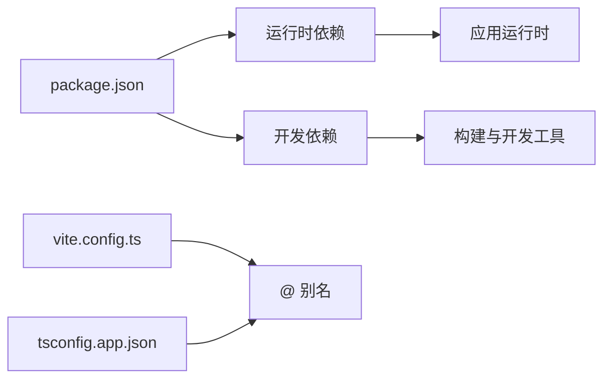

# 部署指南

<cite>
**本文引用的文件**
- [package.json](file://package.json)
- [vite.config.ts](file://vite.config.ts)
- [index.html](file://index.html)
- [tailwind.config.ts](file://tailwind.config.ts)
- [postcss.config.js](file://postcss.config.js)
- [src/main.tsx](file://src/main.tsx)
- [src/App.tsx](file://src/App.tsx)
- [tsconfig.json](file://tsconfig.json)
- [tsconfig.app.json](file://tsconfig.app.json)
</cite>

## 更新摘要
**变更内容**
- 新增GitHub Pages部署配置说明
- 更新构建配置以支持docs输出目录
- 添加base路径配置对静态托管的影响分析
- 更新多平台部署配置以包含GitHub Pages选项

## 目录
1. [简介](#简介)
2. [项目结构](#项目结构)
3. [核心组件](#核心组件)
4. [架构总览](#架构总览)
5. [详细组件分析](#详细组件分析)
6. [依赖分析](#依赖分析)
7. [性能考量](#性能考量)
8. [故障排查指南](#故障排查指南)
9. [结论](#结论)
10. [附录](#附录)

## 简介
本指南面向QR码生成器项目的生产部署，覆盖构建流程（静态资源优化、代码分割、缓存策略）、多平台部署方案（静态托管、CDN、容器化、GitHub Pages）、环境变量与域名/HTTPS配置、性能监控与错误追踪、以及CI/CD流水线与自动化部署最佳实践。项目基于Vite + React + TypeScript构建，采用TailwindCSS进行样式管理，所有业务逻辑在浏览器端执行，不涉及后端服务。

## 项目结构
项目采用前端单页应用（SPA）架构，核心由以下部分组成：
- 构建工具：Vite（开发与生产构建）
- 框架与运行时：React 18 + React Router DOM
- 样式系统：TailwindCSS + PostCSS
- 类型系统：TypeScript（严格模式）
- 资源入口：index.html + src/main.tsx
- 应用根组件：src/App.tsx

**图表来源**
- [index.html:1-18](file://index.html#L1-L18)
- [src/main.tsx:1-11](file://src/main.tsx#L1-L11)
- [src/App.tsx:1-173](file://src/App.tsx#L1-L173)
- [vite.config.ts:1-18](file://vite.config.ts#L1-L18)
- [tailwind.config.ts:1-107](file://tailwind.config.ts#L1-L107)
- [postcss.config.js:1-7](file://postcss.config.js#L1-L7)
- [tsconfig.app.json:1-33](file://tsconfig.app.json#L1-L33)

**章节来源**
- [package.json:1-37](file://package.json#L1-L37)
- [vite.config.ts:1-18](file://vite.config.ts#L1-L18)
- [index.html:1-18](file://index.html#L1-L18)
- [tailwind.config.ts:1-107](file://tailwind.config.ts#L1-L107)
- [postcss.config.js:1-7](file://postcss.config.js#L1-L7)
- [tsconfig.json:1-8](file://tsconfig.json#L1-L8)
- [tsconfig.app.json:1-33](file://tsconfig.app.json#L1-L33)

## 核心组件
- 构建与打包
  - 使用Vite进行开发与生产构建，支持TypeScript与React JSX编译。
  - 生产构建命令通过package.json中的脚本触发，先执行TypeScript增量编译，再执行Vite打包。
  - **更新**：构建输出目录已配置为docs，适用于GitHub Pages部署。
- 样式与主题
  - TailwindCSS按需扫描模板路径，结合PostCSS自动添加浏览器前缀并进行优化。
  - 主题通过CSS变量与动画扩展实现深色模式与交互效果。
- 运行时入口
  - index.html中仅包含根节点与入口脚本；实际渲染由src/main.tsx完成。
  - App组件负责组织表单、样式定制、预览与导出等模块，并使用自定义Hook处理QR数据与样式。

**章节来源**
- [package.json:6-10](file://package.json#L6-L10)
- [vite.config.ts:5-12](file://vite.config.ts#L5-L12)
- [index.html:13-16](file://index.html#L13-L16)
- [src/main.tsx:1-11](file://src/main.tsx#L1-L11)
- [src/App.tsx:24-173](file://src/App.tsx#L24-L173)
- [tailwind.config.ts:3-104](file://tailwind.config.ts#L3-L104)
- [postcss.config.js:1-7](file://postcss.config.js#L1-L7)
- [tsconfig.app.json:22-28](file://tsconfig.app.json#L22-L28)

## 架构总览
下图展示从源码到生产产物的关键流程，以及静态资源优化与缓存策略的落地位置。

**图表来源**
- [package.json:8](file://package.json#L8)
- [vite.config.ts:5-12](file://vite.config.ts#L5-L12)
- [tsconfig.app.json:10-17](file://tsconfig.app.json#L10-L17)

## 详细组件分析

### 构建与代码分割
- 代码分割
  - Vite默认对动态导入的模块进行代码分割；在路由或功能模块按需加载场景下可进一步优化。
  - 建议对大型第三方库（如二维码渲染库）采用动态导入以减少首屏体积。
- 静态资源优化
  - 启用压缩与最小化（由Vite默认行为保障），确保生产构建产物体积最小化。
  - 对字体与图标等资源建议使用现代格式（如WOFF2）并开启HTTP/2多路复用。
- 输出目录与命名
  - **更新**：默认输出至docs目录，这是GitHub Pages的标准输出目录，便于直接部署。
  - 文件名包含内容哈希，便于浏览器长期缓存与失效控制。

**图表来源**
- [package.json:8](file://package.json#L8)
- [vite.config.ts:5-12](file://vite.config.ts#L5-L12)

**章节来源**
- [package.json:6-10](file://package.json#L6-L10)
- [vite.config.ts:5-12](file://vite.config.ts#L5-L12)

### 样式与主题系统
- Tailwind配置要点
  - 内容扫描范围覆盖HTML与TSX文件，确保按需提取类名。
  - 扩展了颜色、圆角、阴影与动画，支持深色模式与交互动效。
- PostCSS链路
  - 自动前缀与优化，提升兼容性与性能。
- 最佳实践
  - 在生产环境启用purge以移除未使用样式，减小CSS体积。
  - 将关键CSS内联，非关键CSS延迟加载。

**图表来源**
- [index.html:1-18](file://index.html#L1-L18)
- [src/main.tsx:1-11](file://src/main.tsx#L1-L11)
- [src/App.tsx:1-173](file://src/App.tsx#L1-L173)
- [tailwind.config.ts:1-107](file://tailwind.config.ts#L1-L107)
- [postcss.config.js:1-7](file://postcss.config.js#L1-L7)

**章节来源**
- [tailwind.config.ts:3-104](file://tailwind.config.ts#L3-L104)
- [postcss.config.js:1-7](file://postcss.config.js#L1-L7)

### 运行时入口与路由
- 入口文件
  - index.html仅包含根节点与入口脚本；实际渲染由main.tsx完成。
- 应用根组件
  - App.tsx组织导航、表单、样式定制、预览与导出模块，使用自定义Hook处理QR数据与样式。
- 路由
  - 项目使用React Router DOM进行页面级导航；生产部署时需确保历史模式（history）回退到index.html。

**图表来源**
- [index.html:13-16](file://index.html#L13-L16)
- [src/main.tsx:1-11](file://src/main.tsx#L1-L11)
- [src/App.tsx:24-173](file://src/App.tsx#L24-L173)

**章节来源**
- [index.html:1-18](file://index.html#L1-L18)
- [src/main.tsx:1-11](file://src/main.tsx#L1-L11)
- [src/App.tsx:1-173](file://src/App.tsx#L1-L173)

### 缓存策略与CDN
- 长期缓存
  - 通过内容哈希命名文件，静态资源可长期缓存；版本更新时文件名变化，自动失效旧缓存。
- CDN分发
  - 将docs目录部署至CDN，配置合理的缓存头（如静态资源Cache-Control: public,max-age=31536000,immutable）。
- 回退机制
  - SPA路由需配置回退至index.html，确保刷新与直接访问深层链接正常工作。

**章节来源**
- [vite.config.ts:5-12](file://vite.config.ts#L5-L12)

### GitHub Pages部署配置
- **新增**：项目现已支持GitHub Pages直接部署
- Base路径配置
  - 通过`base: "/projects/generator/code/"`配置，确保资源路径正确解析
  - 适用于GitHub Pages子路径部署场景
- 输出目录配置
  - `outDir: "docs"`符合GitHub Pages要求的输出目录规范
  - GitHub Pages会自动从docs目录提供静态文件
- 部署流程
  - 构建完成后，docs目录即为可直接部署的静态资源
  - 在GitHub仓库设置中启用Pages功能并选择docs目录

**图表来源**
- [vite.config.ts:7-11](file://vite.config.ts#L7-L11)

**章节来源**
- [vite.config.ts:7-11](file://vite.config.ts#L7-L11)

## 依赖分析
- 运行时依赖
  - React、React DOM、React Router DOM：应用框架与路由。
  - 样式与UI：Tailwind相关工具与动画插件。
  - 功能库：二维码渲染、压缩与CSV解析等。
- 开发依赖
  - Vite、React插件、TypeScript、TailwindCSS、PostCSS及相关工具。
- 路径别名
  - 通过Vite与TypeScript配置统一使用@/*别名，提升可维护性。

**图表来源**
- [package.json:11-35](file://package.json#L11-L35)
- [vite.config.ts:7-10](file://vite.config.ts#L7-L10)
- [tsconfig.app.json:22-28](file://tsconfig.app.json#L22-L28)

**章节来源**
- [package.json:11-35](file://package.json#L11-L35)
- [vite.config.ts:7-10](file://vite.config.ts#L7-L10)
- [tsconfig.app.json:22-28](file://tsconfig.app.json#L22-L28)

## 性能考量
- 首屏性能
  - 将关键CSS内联，非关键CSS延迟加载；对大组件采用懒加载。
- 资源体积
  - 启用Tree Shaking与按需导入；对第三方库进行动态导入以减少首屏体积。
- 缓存与网络
  - 使用内容哈希文件名；合理设置Cache-Control与ETag；启用Gzip/Brotli压缩。
- 用户体验
  - 提供骨架屏或占位符；在导出高分辨率图片时提供进度提示与取消能力。

## 故障排查指南
- 构建失败
  - 确认TypeScript与Vite版本兼容；检查路径别名与模块解析配置。
- 样式异常
  - 检查Tailwind内容扫描路径是否包含新增组件；确认PostCSS插件顺序正确。
- 路由404
  - 确保CDN或服务器将所有未知路径回退到index.html。
- 导出功能问题
  - 检查浏览器安全策略（如跨域、下载权限）；在HTTPS环境下测试导出功能。
- **新增**：GitHub Pages访问问题
  - 确认base路径配置与GitHub Pages子路径一致
  - 检查docs目录是否正确部署且无构建错误
  - 验证GitHub Pages设置中的分支和目录配置

**章节来源**
- [tsconfig.app.json:10-17](file://tsconfig.app.json#L10-L17)
- [tailwind.config.ts:5](file://tailwind.config.ts#L5)
- [postcss.config.js:1-7](file://postcss.config.js#L1-L7)

## 结论
本指南提供了从构建到部署的全链路实践建议。由于项目为纯前端SPA，部署重点在于静态资源优化、缓存策略与CDN分发，以及路由回退与HTTPS配置。**新增的GitHub Pages支持**使得项目可以直接部署到GitHub Pages，通过docs目录提供静态托管服务。结合CI/CD流水线可实现自动化构建与发布，配合性能监控与错误追踪，可有效保障生产环境质量与用户体验。

## 附录

### 多平台部署配置要点
- 静态托管（如GitHub Pages、Vercel、Netlify）
  - **更新**：GitHub Pages部署时，构建产物指向docs目录；配置base路径确保资源正确解析。
  - 其他静态托管服务同样适用，只需调整输出目录和基础路径配置。
- CDN部署
  - 将docs目录上传至CDN；设置长缓存与压缩；配置CNAME与HTTPS证书。
- 容器化部署（可选）
  - 使用Nginx或Caddy作为反向代理，映射静态文件；配置健康检查与日志采集。

### 环境变量、域名与HTTPS
- 环境变量
  - 前端通常无需敏感变量；如需运行时配置，可通过构建时注入或外部配置文件方式提供。
- 域名与HTTPS
  - 通过CDN或反向代理配置域名与证书；确保全站HTTPS与HSTS策略。
  - **更新**：GitHub Pages已提供免费HTTPS支持，无需额外配置。

### 性能监控、错误追踪与用户反馈
- 性能监控
  - 使用Web Vitals与自定义指标（如首屏时间、交互延迟）。
- 错误追踪
  - 集成前端错误上报（如Sentry），捕获运行时异常与用户操作轨迹。
- 用户反馈
  - 在应用内集成反馈入口或引导用户提交问题，收集截图与操作步骤。

### CI/CD流水线与自动化部署最佳实践
- 流水线阶段
  - 代码检出 → 依赖安装 → 类型检查 → 单元测试（如有） → 构建 → 产物上传 → 部署 → 健康检查。
- 最佳实践
  - 分支保护与PR审查；缓存依赖以加速构建；对生产分支进行额外校验；使用蓝绿/金丝雀发布降低风险。
  - **更新**：GitHub Pages部署可直接使用GitHub Actions，简化CI/CD流程。