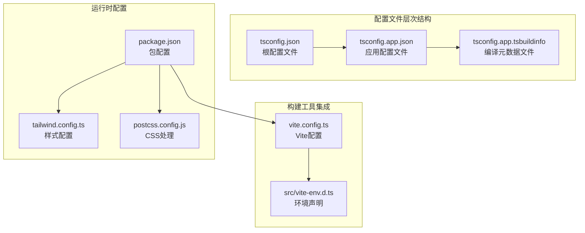
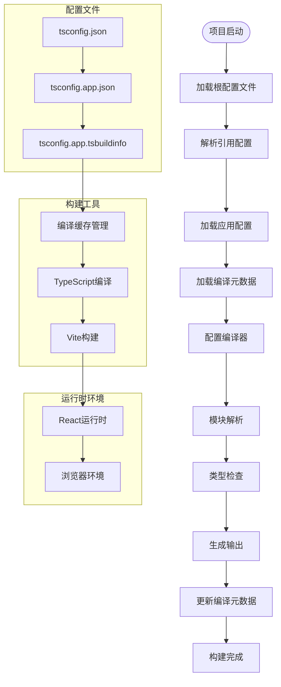
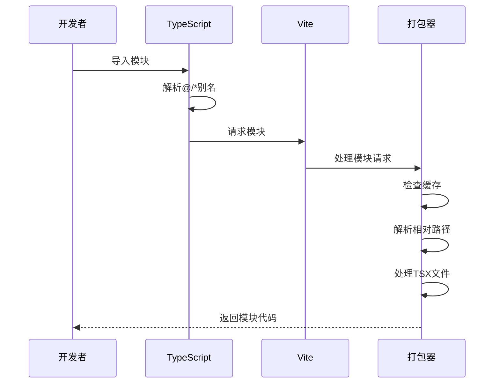
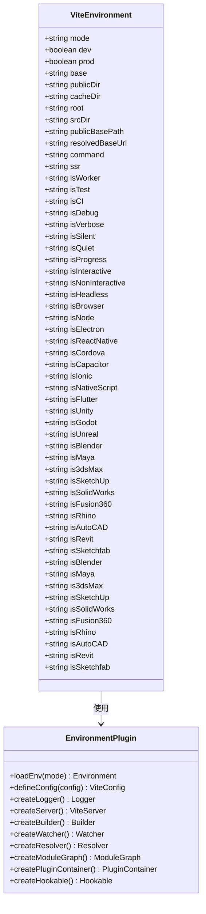
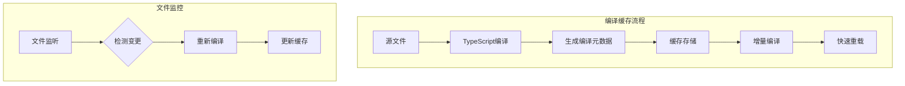

# TypeScript配置

<cite>
**本文档引用的文件**
- [tsconfig.json](file://tsconfig.json)
- [tsconfig.app.json](file://tsconfig.app.json)
- [tsconfig.app.tsbuildinfo](file://tsconfig.app.tsbuildinfo)
- [vite.config.ts](file://vite.config.ts)
- [src/vite-env.d.ts](file://src/vite-env.d.ts)
- [package.json](file://package.json)
- [tailwind.config.ts](file://tailwind.config.ts)
- [postcss.config.js](file://postcss.config.js)
- [App.tsx](file://src/App.tsx)
- [main.tsx](file://src/main.tsx)
</cite>

## 更新摘要
**变更内容**
- 新增 TypeScript 编译元数据文件 `tsconfig.app.tsbuildinfo` 的详细说明
- 更新编译缓存和增量编译机制的文档
- 补充构建信息文件在开发流程中的作用说明
- 完善 TypeScript 项目设置的完整性描述

## 目录
1. [简介](#简介)
2. [项目结构](#项目结构)
3. [核心组件](#核心组件)
4. [架构概览](#架构概览)
5. [详细组件分析](#详细组件分析)
6. [依赖关系分析](#依赖关系分析)
7. [性能考虑](#性能考虑)
8. [故障排除指南](#故障排除指南)
9. [结论](#结论)

## 简介

本文件为QR码生成器项目的TypeScript配置详细文档。该配置采用现代前端开发标准，结合Vite构建工具和React框架，实现了高效的TypeScript编译和类型检查环境。项目通过分层配置文件实现了清晰的配置管理，确保开发体验和代码质量。

**更新** 新增了完整的TypeScript编译元数据文件支持，建立了从配置到构建缓存的完整开发流水线。

## 项目结构

该项目采用双配置文件架构，通过根配置文件协调多个子配置，并通过编译元数据文件实现增量编译优化：



**图表来源**
- [tsconfig.json:1-8](file://tsconfig.json#L1-L8)
- [tsconfig.app.json:1-33](file://tsconfig.app.json#L1-L33)
- [tsconfig.app.tsbuildinfo:1-1](file://tsconfig.app.tsbuildinfo#L1-L1)
- [vite.config.ts:1-13](file://vite.config.ts#L1-L13)

**章节来源**
- [tsconfig.json:1-8](file://tsconfig.json#L1-L8)
- [tsconfig.app.json:1-33](file://tsconfig.app.json#L1-L33)
- [tsconfig.app.tsbuildinfo:1-1](file://tsconfig.app.tsbuildinfo#L1-L1)
- [vite.config.ts:1-13](file://vite.config.ts#L1-L13)

## 核心组件

### 根配置文件 (tsconfig.json)

根配置文件采用引用式配置结构，通过references字段协调多个子配置文件：

- **配置类型**: 引用式配置
- **文件管理**: files数组为空，完全依赖references
- **子配置引用**: 指向tsconfig.app.json
- **工作空间管理**: 支持多项目协作开发

### 应用配置文件 (tsconfig.app.json)

应用配置文件是项目的核心TypeScript配置，包含以下关键设置：

#### 编译目标配置
- **目标版本**: ES2020
- **模块系统**: ESNext
- **库支持**: ES2020、DOM、DOM.Iterable
- **输出目标**: 面向现代浏览器优化

#### 类型检查严格性
- **严格模式**: 启用完整严格模式
- **未使用检查**: 
  - noUnusedLocals: 启用
  - noUnusedParameters: 启用
- **控制流检查**: 
  - noFallthroughCasesInSwitch: 启用
  - noUncheckedSideEffectImports: 启用

#### 模块解析策略
- **解析器**: bundler (Vite推荐)
- **模块检测**: force (强制模块检测)
- **导入扩展**: 允许TS扩展名导入
- **路径映射**: 基于baseUrl的别名系统

#### JSX处理配置
- **JSX语法**: react-jsx
- **React集成**: 专为React开发优化

### 编译元数据文件 (tsconfig.app.tsbuildinfo)

**新增** 编译元数据文件是TypeScript增量编译的关键组件，包含以下重要信息：

- **构建版本**: TypeScript版本号 (5.6.3)
- **项目根文件**: 包含所有源代码文件的完整列表
- **编译缓存**: 支持快速增量编译和热重载
- **依赖跟踪**: 跟踪模块间的依赖关系
- **类型检查状态**: 维护类型检查的上下文信息

**章节来源**
- [tsconfig.app.json:1-33](file://tsconfig.app.json#L1-L33)
- [tsconfig.app.tsbuildinfo:1-1](file://tsconfig.app.tsbuildinfo#L1-L1)

## 架构概览

TypeScript配置架构展示了从配置到构建的完整流程，包括编译元数据的管理：



**图表来源**
- [tsconfig.json:1-8](file://tsconfig.json#L1-L8)
- [tsconfig.app.json:1-33](file://tsconfig.app.json#L1-L33)
- [tsconfig.app.tsbuildinfo:1-1](file://tsconfig.app.tsbuildinfo#L1-L1)
- [vite.config.ts:1-13](file://vite.config.ts#L1-L13)

## 详细组件分析

### 路径映射系统

项目实现了基于baseUrl的路径映射机制，提供统一的模块导入规范：

```mermaid
graph LR
subgraph "源代码结构"
Src[src/] --> Components[components/]
Src --> Hooks[hooks/]
Src --> Lib[lib/]
Src --> Types[types/]
end
subgraph "路径映射规则"
Alias[@/*] --> MapSrc[src/*]
MapComponents[components/*] --> ActualComponents[src/components/*]
MapHooks[hooks/*] --> ActualHooks[src/hooks/*]
MapLib[lib/*] --> ActualLib[src/lib/*]
end
Components -.-> MapComponents
Hooks -.-> MapHooks
Lib -.-> MapLib
```

**图表来源**
- [tsconfig.app.json:24-28](file://tsconfig.app.json#L24-L28)
- [vite.config.ts:7-11](file://vite.config.ts#L7-L11)

#### 路径映射配置细节

- **基础路径**: baseUrl设置为项目根目录
- **别名规则**: @/* 映射到 ./src/*
- **构建工具同步**: Vite配置保持一致的别名映射
- **IDE支持**: VS Code等编辑器自动识别路径映射

### 模块解析策略

项目采用现代化的模块解析策略，确保最佳的开发体验：



**图表来源**
- [tsconfig.app.json:12-15](file://tsconfig.app.json#L12-L15)
- [vite.config.ts:7-11](file://vite.config.ts#L7-L11)

#### 关键解析特性

- **bundler解析器**: 专门为打包器优化的解析策略
- **模块检测**: 强制模块检测确保正确的模块类型推断
- **TS扩展名支持**: 允许直接导入.tsx文件
- **跳过库检查**: 提升编译速度，避免第三方库的类型检查

### 类型声明文件

src/vite-env.d.ts提供了Vite环境的类型声明：



**图表来源**
- [src/vite-env.d.ts:1-2](file://src/vite-env.d.ts#L1-L2)

**章节来源**
- [src/vite-env.d.ts:1-2](file://src/vite-env.d.ts#L1-L2)

### 严格模式配置

项目启用了全面的TypeScript严格模式，确保代码质量：

#### 严格模式特性

| 特性名称 | 配置值 | 作用描述 |
|---------|--------|----------|
| strict | true | 启用所有严格类型检查 |
| noUnusedLocals | true | 报告未使用的局部变量 |
| noUnusedParameters | true | 报告未使用的函数参数 |
| noFallthroughCasesInSwitch | true | 检测switch中的遗漏break |
| noUncheckedSideEffectImports | true | 检测未检查的副作用导入 |

#### 类型安全增强

- **React集成**: 专为React开发优化的类型检查
- **JSX处理**: react-jsx语法的完整类型支持
- **DOM类型**: 完整的Web API类型定义
- **模块系统**: ESNext模块系统的类型推断

**章节来源**
- [tsconfig.app.json:18-22](file://tsconfig.app.json#L18-L22)

### 编译元数据管理

**新增** TypeScript编译元数据文件管理系统：

#### 元数据文件结构

tsconfig.app.tsbuildinfo文件包含以下关键信息：

- **root属性**: 列出项目中包含的所有源文件
- **version属性**: TypeScript编译器版本信息
- **增量编译支持**: 支持快速增量编译和热重载
- **依赖跟踪**: 跟踪模块间的依赖关系变化

#### 编译缓存机制



**图表来源**
- [tsconfig.app.tsbuildinfo:1-1](file://tsconfig.app.tsbuildinfo#L1-L1)

**章节来源**
- [tsconfig.app.tsbuildinfo:1-1](file://tsconfig.app.tsbuildinfo#L1-L1)

## 依赖关系分析

TypeScript配置与构建工具的依赖关系展现了完整的开发链路，包括编译元数据的管理：

```mermaid
graph TB
subgraph "TypeScript配置"
TSConfig[tsconfig.app.json]
RootConfig[tsconfig.json]
BuildInfo[tsconfig.app.tsbuildinfo]
TypeDeclarations[src/vite-env.d.ts]
end
subgraph "构建工具"
ViteConfig[vite.config.ts]
PackageJSON[package.json]
end
subgraph "运行时依赖"
React[React 18.3.1]
Tailwind[Tailwind CSS]
PostCSS[PostCSS]
end
subgraph "开发依赖"
TS[TypeScript ~5.6.2]
Vite[Vite ^6.0.5]
TSReact[@vitejs/plugin-react]
end
RootConfig --> TSConfig
TSConfig --> BuildInfo
BuildInfo --> ViteConfig
TypeDeclarations --> ViteConfig
ViteConfig --> PackageJSON
PackageJSON --> React
PackageJSON --> Tailwind
PackageJSON --> PostCSS
PackageJSON --> TS
PackageJSON --> Vite
PackageJSON --> TSReact
```

**图表来源**
- [tsconfig.app.json:1-33](file://tsconfig.app.json#L1-L33)
- [tsconfig.app.tsbuildinfo:1-1](file://tsconfig.app.tsbuildinfo#L1-L1)
- [vite.config.ts:1-13](file://vite.config.ts#L1-L13)
- [package.json:1-37](file://package.json#L1-L37)

**章节来源**
- [package.json:1-37](file://package.json#L1-L37)
- [vite.config.ts:1-13](file://vite.config.ts#L1-L13)

## 性能考虑

### 编译性能优化

项目通过以下配置提升编译性能：

- **skipLibCheck**: 跳过第三方库的类型检查，显著提升编译速度
- **isolatedModules**: 独立模块编译，支持快速增量编译
- **noEmit**: 在开发环境中不生成输出文件，减少I/O操作
- **bundler解析器**: 专门为打包器优化的解析策略

### 编译元数据优化

**新增** 编译元数据文件对性能的贡献：

- **增量编译**: 通过tsbuildinfo文件实现快速增量编译
- **缓存管理**: 维护编译状态，避免不必要的全量编译
- **依赖跟踪**: 精确跟踪模块依赖变化，只重新编译受影响的模块
- **热重载支持**: 支持快速的开发服务器热重载功能

### 构建优化策略

- **模块检测**: 强制模块检测确保正确的模块类型推断
- **路径映射**: 统一的路径映射减少模块解析时间
- **类型声明**: 精确的类型声明提升IDE性能

## 故障排除指南

### 常见配置问题

#### 路径映射问题
**症状**: 导入模块时报错，提示无法找到模块
**解决方案**:
1. 检查tsconfig.app.json中的baseUrl配置
2. 确认@/*路径映射是否正确
3. 验证Vite配置中的alias设置

#### 类型检查错误
**症状**: 编译时报类型相关错误
**解决方案**:
1. 检查严格模式下的类型检查配置
2. 确认React组件的props类型定义
3. 验证第三方库的类型声明

#### 模块解析失败
**症状**: 导入TSX文件时报模块解析错误
**解决方案**:
1. 确认allowImportingTsExtensions配置
2. 检查moduleResolution设置为bundler
3. 验证文件扩展名是否正确

#### 编译元数据问题
**症状**: 增量编译失效或编译速度异常
**解决方案**:
1. 清理tsconfig.app.tsbuildinfo文件
2. 重新初始化TypeScript编译缓存
3. 检查项目文件结构是否发生变化

### 最佳实践建议

#### 类型安全最佳实践
1. **明确类型注解**: 为函数参数和返回值添加明确的类型注解
2. **使用接口**: 为对象结构定义接口，提升类型安全性
3. **枚举类型**: 使用枚举定义有限的选择集合
4. **泛型约束**: 合理使用泛型确保类型安全

#### 配置维护建议
1. **定期更新**: 跟随TypeScript版本更新配置
2. **团队一致性**: 确保团队成员使用相同的配置
3. **文档记录**: 记录配置变更的原因和影响
4. **性能监控**: 定期检查编译性能指标

**章节来源**
- [tsconfig.app.json:12-15](file://tsconfig.app.json#L12-L15)
- [vite.config.ts:7-11](file://vite.config.ts#L7-L11)

## 结论

QR码生成器项目的TypeScript配置展现了现代前端开发的最佳实践。通过分层配置架构、严格的类型检查、优化的模块解析策略以及完整的编译元数据管理，项目实现了高质量的开发体验和可靠的代码质量保证。

**更新** 新增的编译元数据文件进一步完善了项目设置，建立了从配置到构建缓存的完整开发流水线，显著提升了开发效率和编译性能。

关键优势包括：
- **清晰的配置层次**: 根配置文件协调多个子配置
- **严格的类型安全**: 全面的严格模式配置
- **高效的模块解析**: 专为Vite优化的解析策略
- **现代化的开发体验**: 支持最新的TypeScript特性和React开发模式
- **完整的编译管理**: 通过tsbuildinfo文件实现增量编译优化

这套配置体系为类似项目提供了可复用的模板，确保了开发效率和代码质量的双重保障。