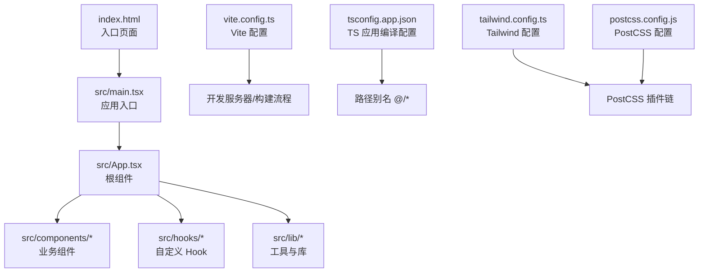
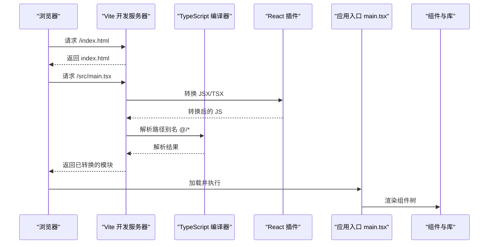
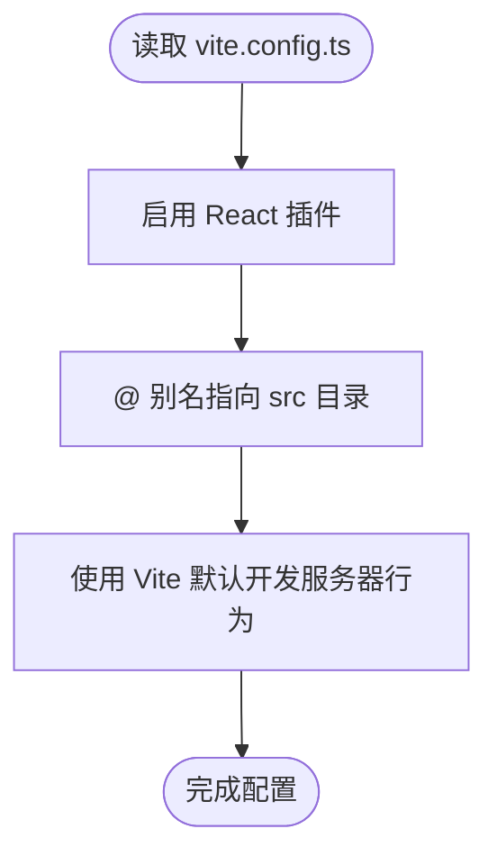
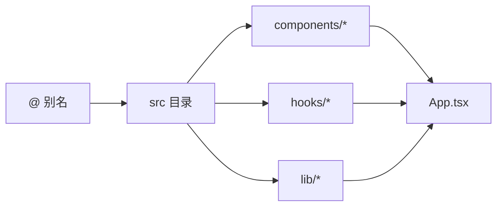
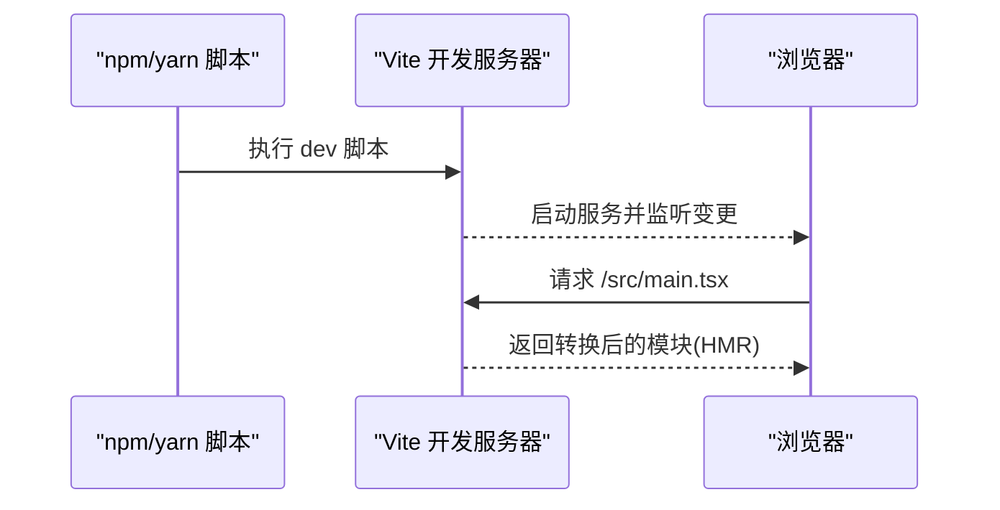
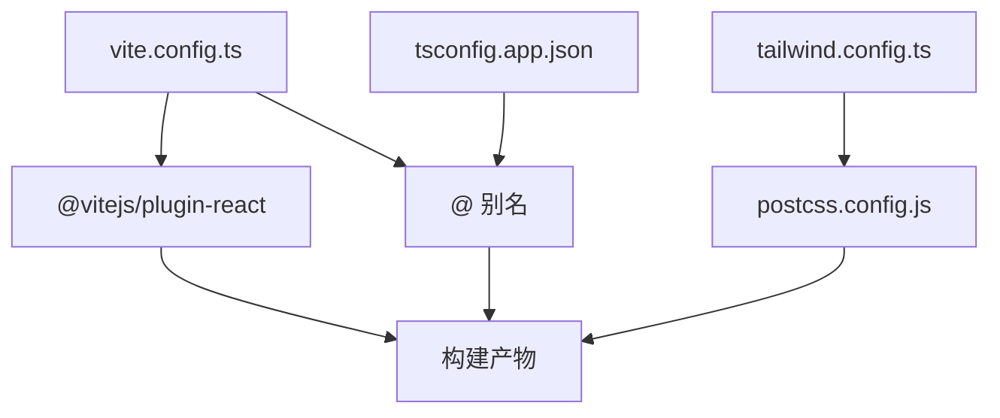

# 构建配置

<cite>
**本文引用的文件**
- [vite.config.ts](file://vite.config.ts)
- [package.json](file://package.json)
- [tsconfig.json](file://tsconfig.json)
- [tsconfig.app.json](file://tsconfig.app.json)
- [postcss.config.js](file://postcss.config.js)
- [tailwind.config.ts](file://tailwind.config.ts)
- [index.html](file://index.html)
- [src/main.tsx](file://src/main.tsx)
- [src/App.tsx](file://src/App.tsx)
- [src/components/layout/Header.tsx](file://src/components/layout/Header.tsx)
- [src/hooks/useQRCode.ts](file://src/hooks/useQRCode.ts)
- [src/lib/qr-utils.ts](file://src/lib/qr-utils.ts)
</cite>

## 目录
1. [简介](#简介)
2. [项目结构](#项目结构)
3. [核心组件](#核心组件)
4. [架构总览](#架构总览)
5. [详细组件分析](#详细组件分析)
6. [依赖关系分析](#依赖关系分析)
7. [性能考虑](#性能考虑)
8. [故障排查指南](#故障排查指南)
9. [结论](#结论)
10. [附录](#附录)

## 简介
本文件系统性梳理 QR 码生成器项目的构建配置，重点围绕 Vite 配置文件（vite.config.ts）展开，详细说明：
- 插件设置：React 插件的作用与配置要点
- 路径别名配置：'@' 别名的设置与在项目中的使用方式
- 开发服务器选项：默认行为与可扩展方向
- 构建优化与生产环境配置：结合 TypeScript、TailwindCSS、PostCSS 的协同
- 开发服务器启动、热重载与代理设置：当前配置与建议
- 构建流程说明与性能优化建议

## 项目结构
该项目采用 Vite + React + TypeScript + TailwindCSS 技术栈，源代码位于 src 目录，入口 HTML 中通过模块脚本加载 src/main.tsx。TypeScript 使用工作区配置，分别包含应用编译配置与根引用配置。

图表来源
- [index.html:1-18](file://index.html#L1-L18)
- [src/main.tsx:1-11](file://src/main.tsx#L1-L11)
- [vite.config.ts:1-13](file://vite.config.ts#L1-L13)
- [tsconfig.app.json:24-28](file://tsconfig.app.json#L24-L28)
- [tailwind.config.ts:1-107](file://tailwind.config.ts#L1-L107)
- [postcss.config.js:1-7](file://postcss.config.js#L1-L7)

章节来源
- [index.html:1-18](file://index.html#L1-L18)
- [src/main.tsx:1-11](file://src/main.tsx#L1-L11)
- [vite.config.ts:1-13](file://vite.config.ts#L1-L13)
- [tsconfig.app.json:24-28](file://tsconfig.app.json#L24-L28)
- [tailwind.config.ts:1-107](file://tailwind.config.ts#L1-L107)
- [postcss.config.js:1-7](file://postcss.config.js#L1-L7)

## 核心组件
- Vite 配置文件（vite.config.ts）
  - 插件：仅启用 React 插件，用于 JSX 转换与开发体验增强
  - 路径别名：将 '@' 指向 src 目录，便于模块导入
- TypeScript 编译配置（tsconfig.app.json）
  - 路径映射：与 Vite 别名保持一致，确保 TS 编译器识别 '@/*'
- CSS 工具链（TailwindCSS + PostCSS）
  - Tailwind 配置：内容扫描范围、主题扩展、动画等
  - PostCSS 配置：启用 TailwindCSS 与 Autoprefixer 插件
- 包管理与脚本（package.json）
  - 开发：vite
  - 构建：先执行 tsc -b 进行类型检查，再执行 vite build
  - 预览：vite preview

章节来源
- [vite.config.ts:1-13](file://vite.config.ts#L1-L13)
- [tsconfig.app.json:24-28](file://tsconfig.app.json#L24-L28)
- [tailwind.config.ts:1-107](file://tailwind.config.ts#L1-L107)
- [postcss.config.js:1-7](file://postcss.config.js#L1-L7)
- [package.json:6-10](file://package.json#L6-L10)

## 架构总览
下图展示从浏览器请求到应用渲染的关键路径，以及构建与开发流程中的关键节点。

图表来源
- [index.html:15](file://index.html#L15)
- [src/main.tsx:1-11](file://src/main.tsx#L1-L11)
- [vite.config.ts:6-12](file://vite.config.ts#L6-L12)
- [tsconfig.app.json:24-28](file://tsconfig.app.json#L24-L28)

## 详细组件分析

### Vite 配置文件（vite.config.ts）
- 插件设置
  - React 插件：负责 JSX/TSX 的开发时转换与 HMR 支持，提升开发效率
- 路径别名配置
  - 将 '@' 映射到项目根目录下的 src，便于在组件中以 '@/xxx' 形式导入
- 开发服务器选项
  - 当前配置未显式声明 devServer 选项，因此使用 Vite 默认行为（端口、热重载、中间件等）

图表来源
- [vite.config.ts:5-12](file://vite.config.ts#L5-L12)

章节来源
- [vite.config.ts:1-13](file://vite.config.ts#L1-L13)

### React 插件配置与作用
- 作用
  - 在开发阶段对 JSX/TSX 文件进行快速转换，支持 HMR（热模块替换），提升迭代速度
  - 与 Vite 的按需打包机制配合，减少不必要的编译开销
- 建议
  - 如需更精细控制（如宏处理、实验性特性），可在插件参数中进一步配置（当前项目未启用）

章节来源
- [vite.config.ts:2](file://vite.config.ts#L2)

### 路径别名 '@' 的设置与使用
- Vite 层面
  - 通过 resolve.alias 将 '@' 指向 __dirname 下的 src 目录
- TypeScript 层面
  - tsconfig.app.json 的 paths 字段同样配置 '@/*' -> './src/*'，保证编译器识别
- 项目中的使用
  - 组件与库文件广泛使用 '@/' 导入，例如：
    - App.tsx 导入 '@/components/layout/Header'、'@/hooks/useQRCode' 等
    - Header.tsx 导入 '@/components/ui/button'、'@/hooks/useTheme'
    - useQRCode.ts 导入 '@/lib/qr-utils'

图表来源
- [vite.config.ts:7-11](file://vite.config.ts#L7-L11)
- [tsconfig.app.json:24-28](file://tsconfig.app.json#L24-L28)
- [src/App.tsx:2-21](file://src/App.tsx#L2-L21)
- [src/components/layout/Header.tsx:1-41](file://src/components/layout/Header.tsx#L1-L41)
- [src/hooks/useQRCode.ts:1-75](file://src/hooks/useQRCode.ts#L1-L75)

章节来源
- [vite.config.ts:7-11](file://vite.config.ts#L7-L11)
- [tsconfig.app.json:24-28](file://tsconfig.app.json#L24-L28)
- [src/App.tsx:2-21](file://src/App.tsx#L2-L21)
- [src/components/layout/Header.tsx:1-41](file://src/components/layout/Header.tsx#L1-L41)
- [src/hooks/useQRCode.ts:1-75](file://src/hooks/useQRCode.ts#L1-L75)

### 构建优化与生产环境配置
- TypeScript 类型检查
  - package.json 的 build 脚本先执行 tsc -b，确保类型安全后再进行构建
- Vite 生产构建
  - 默认启用代码分割、Tree-shaking、压缩等优化；可通过 Vite 配置进一步细化
- CSS 工具链
  - TailwindCSS 内容扫描范围覆盖 src 下的 TS/TSX 文件，确保按需生成样式
  - PostCSS 启用 TailwindCSS 与 Autoprefixer，自动添加浏览器前缀
- 资源处理
  - 图片、字体等静态资源由 Vite 默认处理；如需自定义可扩展 Vite 的 optimizeDeps 或 build.rollupOptions

章节来源
- [package.json:8](file://package.json#L8)
- [tailwind.config.ts:5](file://tailwind.config.ts#L5)
- [postcss.config.js:1-7](file://postcss.config.js#L1-L7)

### 开发服务器启动、热重载与代理设置
- 启动与热重载
  - 开发脚本直接运行 vite，默认启用 HMR；当前未配置 devServer 代理或额外中间件
- 代理设置
  - 当前未配置 devServer.proxy；如需代理后端 API，可在 vite.config.ts 中添加相应配置
- 入口与加载
  - index.html 通过模块脚本加载 src/main.tsx，Vite 在开发时动态解析模块与别名

图表来源
- [package.json:7](file://package.json#L7)
- [index.html:15](file://index.html#L15)
- [vite.config.ts:6-12](file://vite.config.ts#L6-L12)

章节来源
- [package.json:7](file://package.json#L7)
- [index.html:15](file://index.html#L15)
- [vite.config.ts:6-12](file://vite.config.ts#L6-L12)

### 构建流程说明
- 开发流程
  - npm run dev 启动 Vite 开发服务器，自动监听文件变更并进行热更新
- 构建流程
  - npm run build 先执行 tsc -b 完成类型检查，再执行 vite build 产出生产包
- 预览流程
  - npm run preview 启动本地预览服务器，验证生产构建效果

章节来源
- [package.json:6-10](file://package.json#L6-L10)

## 依赖关系分析
- Vite 与 React 插件
  - Vite 通过 @vitejs/plugin-react 对 JSX/TSX 进行转换，实现快速开发与 HMR
- 路径别名一致性
  - Vite 的 alias 与 tsconfig.app.json 的 paths 必须保持一致，否则会出现运行时导入错误
- CSS 工具链
  - TailwindCSS 与 PostCSS 协同工作，Tailwind 生成类名，PostCSS 添加兼容性前缀

图表来源
- [vite.config.ts:2](file://vite.config.ts#L2)
- [vite.config.ts:7-11](file://vite.config.ts#L7-L11)
- [tsconfig.app.json:24-28](file://tsconfig.app.json#L24-L28)
- [tailwind.config.ts:1-107](file://tailwind.config.ts#L1-L107)
- [postcss.config.js:1-7](file://postcss.config.js#L1-L7)

章节来源
- [vite.config.ts:2](file://vite.config.ts#L2)
- [vite.config.ts:7-11](file://vite.config.ts#L7-L11)
- [tsconfig.app.json:24-28](file://tsconfig.app.json#L24-L28)
- [tailwind.config.ts:1-107](file://tailwind.config.ts#L1-L107)
- [postcss.config.js:1-7](file://postcss.config.js#L1-L7)

## 性能考虑
- 代码分割与 Tree-shaking
  - Vite 默认启用，无需额外配置即可获得良好体积表现
- 路径别名与模块解析
  - 使用 '@' 可减少相对路径层级，提升可维护性；同时确保别名与 TS 路径一致，避免重复解析
- CSS 体积控制
  - Tailwind 的 content 扫描范围应尽量精确，避免收集无关文件导致样式膨胀
- 开发体验
  - 合理利用 HMR，避免在开发时引入重型预处理逻辑
- 生产优化建议
  - 可在 Vite 配置中增加 rollupOptions.external 以排除不参与打包的依赖
  - 对第三方库进行按需引入，减少冗余代码

## 故障排查指南
- 导入路径错误
  - 症状：运行时报错找不到模块或路径解析失败
  - 排查：确认 Vite 的 alias 与 tsconfig.app.json 的 paths 是否一致
- 类型检查失败
  - 症状：构建前 tsc -b 报错
  - 排查：修复类型错误或调整严格模式相关配置
- 样式未生效
  - 症状：Tailwind 类名无效
  - 排查：检查 tailwind.config.ts 的 content 范围是否包含对应文件
- 开发服务器无法访问
  - 症状：浏览器无法连接到开发服务器
  - 排查：确认端口占用、防火墙设置或网络配置

章节来源
- [vite.config.ts:7-11](file://vite.config.ts#L7-L11)
- [tsconfig.app.json:24-28](file://tsconfig.app.json#L24-L28)
- [tailwind.config.ts:5](file://tailwind.config.ts#L5)
- [package.json:8](file://package.json#L8)

## 结论
本项目构建配置简洁高效：通过最小化的 Vite 配置与 React 插件，结合 TypeScript 路径别名与 TailwindCSS/PostCSS 工具链，实现了良好的开发体验与生产构建质量。建议在后续演进中根据实际需求逐步扩展代理、构建优化与性能监控策略，以满足更复杂的业务场景。

## 附录
- 关键文件与职责
  - vite.config.ts：插件与别名配置
  - tsconfig.app.json：TS 路径别名与编译选项
  - tailwind.config.ts：Tailwind 主题与内容扫描
  - postcss.config.js：PostCSS 插件链
  - package.json：脚本与依赖