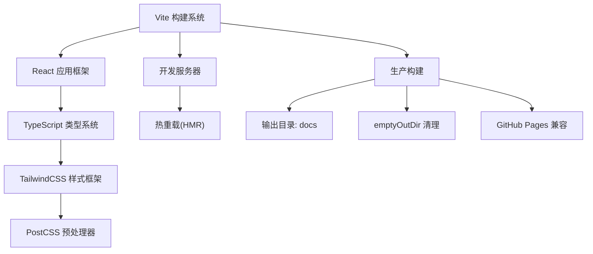
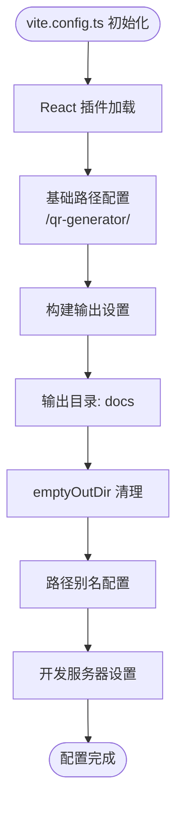
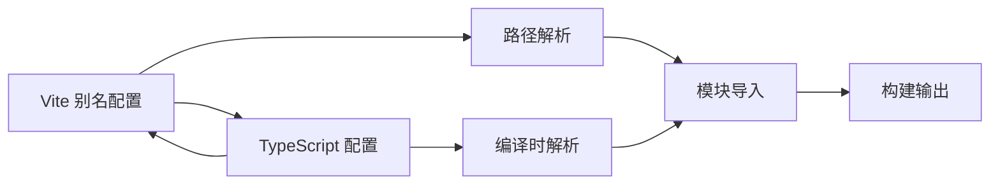
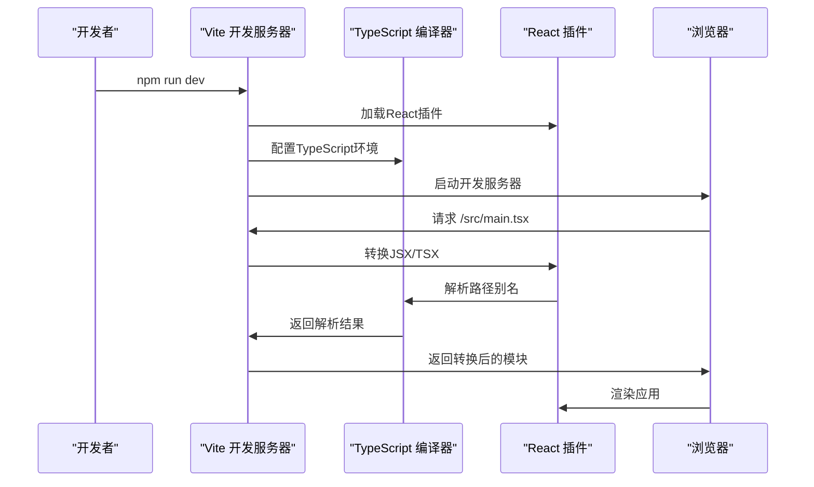
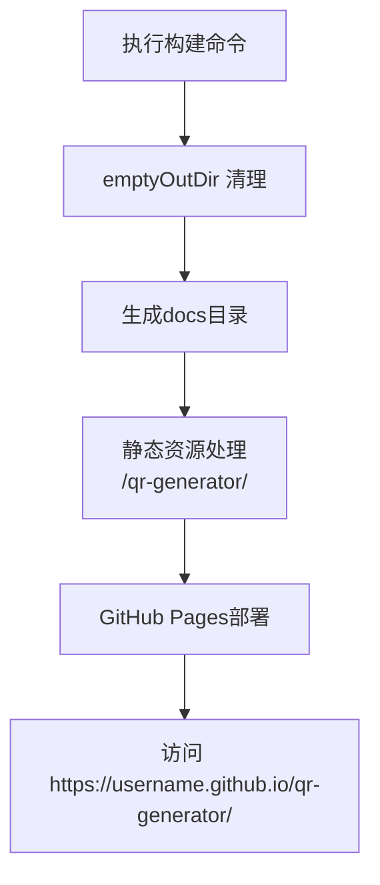

# 构建配置

<cite>
**本文引用的文件**
- [vite.config.ts](file://vite.config.ts)
- [package.json](file://package.json)
- [tsconfig.app.json](file://tsconfig.app.json)
- [postcss.config.js](file://postcss.config.js)
- [tailwind.config.ts](file://tailwind.config.ts)
- [index.html](file://index.html)
- [src/main.tsx](file://src/main.tsx)
- [src/App.tsx](file://src/App.tsx)
- [docs/index.html](file://docs/index.html)
</cite>

## 更新摘要
**变更内容**
- 更新Vite基础路径配置：从 `/projects/generator/code/` 更改为 `/qr-generator/`，以适应新的部署环境要求
- 更新docs/index.html中的静态资源引用路径，确保生产环境正确加载
- 保持构建输出目录配置不变，继续使用docs目录
- 保持emptyOutDir清理功能不变
- 保持GitHub Pages部署支持配置不变

## 目录
1. [简介](#简介)
2. [项目技术栈概览](#项目技术栈概览)
3. [核心配置文件详解](#核心配置文件详解)
4. [路径别名系统](#路径别名系统)
5. [开发服务器与热重载](#开发服务器与热重载)
6. [构建流程与优化](#构建流程与优化)
7. [GitHub Pages部署配置](#github-pages部署配置)
8. [TypeScript集成配置](#typescript集成配置)
9. [CSS工具链配置](#css工具链配置)
10. [性能优化建议](#性能优化建议)
11. [故障排查指南](#故障排查指南)
12. [总结](#总结)

## 简介
本文件系统性梳理QR码生成器项目的完整构建配置体系，基于现代化的Vite + React + TypeScript + TailwindCSS技术栈。项目采用最小化但功能完备的配置方案，通过精心设计的路径别名系统、高效的开发服务器和优化的构建流程，为用户提供流畅的开发体验和高质量的生产构建。

**更新** 本版本重点分析了构建配置的重要变更：将Vite基础路径从 `/projects/generator/code/` 更新为 `/qr-generator/`，以适应新的部署环境要求。同时更新了docs/index.html中的静态资源引用路径，确保生产环境正确加载。

## 项目技术栈概览
项目采用现代化前端技术栈组合，各组件协同工作形成完整的开发与构建体系：



**图表来源**
- [vite.config.ts:8-11](file://vite.config.ts#L8-L11)
- [package.json:11-35](file://package.json#L11-L35)
- [tsconfig.app.json:2-28](file://tsconfig.app.json#L2-L28)
- [tailwind.config.ts:1-107](file://tailwind.config.ts#L1-L107)
- [postcss.config.js:1-7](file://postcss.config.js#L1-L7)

**章节来源**
- [vite.config.ts:1-18](file://vite.config.ts#L1-L18)
- [package.json:11-35](file://package.json#L11-L35)
- [tsconfig.app.json:2-28](file://tsconfig.app.json#L2-L28)
- [tailwind.config.ts:1-107](file://tailwind.config.ts#L1-L107)
- [postcss.config.js:1-7](file://postcss.config.js#L1-L7)

## 核心配置文件详解

### Vite配置文件（vite.config.ts）
项目的核心构建配置文件，经过重要更新以支持新的部署环境：

**插件系统**
- React插件：`@vitejs/plugin-react` 提供JSX/TSX转换和开发时HMR支持
- 插件初始化：通过`defineConfig`函数创建配置对象

**构建输出配置**
- 输出目录：`outDir: "docs"` - 将构建产物输出到docs目录
- 清理功能：`emptyOutDir: true` - 构建前自动清理输出目录
- GitHub Pages兼容：通过base路径配置支持子路径部署

**基础路径配置**
- `base: "/qr-generator/"` - 设置新的GitHub Pages基础URL路径
- 支持GitHub Pages的子路径部署模式
- 确保静态资源的正确引用路径

**路径别名配置**
- 别名设置：`'@': path.resolve(__dirname, './src')`
- 路径解析：使用Node.js的path模块进行绝对路径解析
- 配置位置：在`resolve.alias`对象中定义

**开发服务器配置**
- 默认行为：未显式配置devServer选项，使用Vite默认设置
- 端口与热重载：由Vite自动管理
- 中间件扩展：可根据需要添加自定义中间件



**图表来源**
- [vite.config.ts:5-17](file://vite.config.ts#L5-L17)

**章节来源**
- [vite.config.ts:1-18](file://vite.config.ts#L1-L18)

### 包管理配置（package.json）
项目依赖管理与脚本配置，体现了完整的开发工作流：

**依赖管理**
- 运行时依赖：React生态系统的完整套件
- 开发依赖：构建工具链和类型定义
- 版本管理：精确的版本锁定确保构建稳定性

**构建脚本**
- 开发脚本：`vite` 启动开发服务器
- 构建脚本：`tsc -b && vite build` 类型检查后构建
- 预览脚本：`vite preview` 本地预览生产构建

**章节来源**
- [package.json:6-10](file://package.json#L6-L10)
- [package.json:11-35](file://package.json#L11-L35)

## 路径别名系统

### 别名配置原理
项目采用统一的路径别名系统，通过Vite和TypeScript双重配置确保开发体验的一致性：

**Vite层面配置**
- 路径解析：`'@'` 指向项目根目录下的`src`目录
- 绝对路径：使用`path.resolve`确保跨平台兼容性
- 模块解析：Vite在开发时优先解析别名路径

**TypeScript层面配置**
- 路径映射：`'@/*'` -> `'./src/*'`
- 编译时解析：TypeScript编译器识别别名路径
- 类型检查：确保导入语句的类型安全性

### 路径别名使用示例
项目广泛使用`@`别名简化模块导入，提高代码可读性和维护性：

**组件导入示例**
- `import { Header } from '@/components/layout/Header'`
- `import { Button } from '@/components/ui/button'`
- `import { useTheme } from '@/hooks/useTheme'`

**库文件导入示例**
- `import { createQRCode } from '@/lib/qr-utils'`
- `import { useQRCode } from '@/hooks/useQRCode'`



**图表来源**
- [vite.config.ts:12-16](file://vite.config.ts#L12-L16)
- [tsconfig.app.json:24-28](file://tsconfig.app.json#L24-L28)
- [src/App.tsx:2-21](file://src/App.tsx#L2-L21)

**章节来源**
- [vite.config.ts:12-16](file://vite.config.ts#L12-L16)
- [tsconfig.app.json:24-28](file://tsconfig.app.json#L24-L28)
- [src/App.tsx:2-21](file://src/App.tsx#L2-L21)

## 开发服务器与热重载

### 开发服务器启动流程
项目采用Vite的开发服务器提供快速的开发体验：

**启动过程**
1. 执行`npm run dev`或`yarn dev`
2. Vite解析配置文件和插件
3. 启动本地开发服务器（默认端口3000）
4. 监听文件变化并触发热重载

**热重载机制**
- 文件变更检测：实时监控src目录下的文件变化
- 模块热替换：仅更新变更的模块，保持应用状态
- CSS热更新：支持样式文件的无刷新更新
- 错误处理：编译错误时显示友好的错误界面

### 代理设置与扩展
当前配置未设置代理，但Vite提供了灵活的代理配置选项：

**代理配置示例**
```javascript
// 可选：API代理配置
export default defineConfig({
  server: {
    proxy: {
      '/api': {
        target: 'http://localhost:3000',
        changeOrigin: true,
        rewrite: (path) => path.replace(/^\/api/, '')
      }
    }
  }
})
```

**章节来源**
- [package.json:7](file://package.json#L7)
- [index.html:15](file://index.html#L15)
- [vite.config.ts:5-17](file://vite.config.ts#L5-L17)

## 构建流程与优化

### 开发构建流程
项目采用渐进式的开发构建流程，确保开发效率和质量：



**图表来源**
- [package.json:7](file://package.json#L7)
- [vite.config.ts:2](file://vite.config.ts#L2)
- [tsconfig.app.json:24-28](file://tsconfig.app.json#L24-L28)

### 生产构建流程
生产构建采用多步骤流程确保代码质量和构建效率：

**构建步骤**
1. **类型检查**：`tsc -b` 执行TypeScript类型检查
2. **代码转换**：Vite处理JSX/TSX转换和模块打包
3. **资源优化**：代码分割、Tree-shaking、压缩
4. **静态资源处理**：图片、字体等资源优化
5. **输出生成**：构建产物输出到docs目录

**构建优化特性**
- **代码分割**：按需加载组件和路由
- **Tree-shaking**：移除未使用的代码
- **压缩优化**：JavaScript和CSS压缩
- **资源缓存**：生成稳定的文件哈希
- **emptyOutDir**：构建前自动清理输出目录

### 构建配置扩展
可根据项目需求扩展构建配置：

**Rollup选项配置**
```javascript
export default defineConfig({
  build: {
    rollupOptions: {
      external: ['react', 'react-dom'], // 排除外部依赖
      output: {
        manualChunks: {
          vendor: ['react', 'react-router-dom', 'react-dom'],
          ui: ['@radix-ui/react-*', 'lucide-react'],
          utils: ['qr-code-styling', 'jszip', 'papaparse']
        }
      }
    }
  }
})
```

**章节来源**
- [package.json:8](file://package.json#L8)
- [vite.config.ts:8-11](file://vite.config.ts#L8-L11)

## GitHub Pages部署配置

### 子路径部署支持
项目已配置为支持GitHub Pages的子路径部署模式，现已更新为基础路径配置：

**基础路径配置**
- `base: "/qr-generator/"` - 设置新的GitHub Pages子路径
- 确保所有静态资源使用正确的相对路径
- 支持GitHub Pages的自定义域名和子域部署

**输出目录配置**
- `outDir: "docs"` - 将构建产物输出到docs目录
- 符合GitHub Pages的部署要求
- 便于版本控制和CI/CD集成

**emptyOutDir清理功能**
- `emptyOutDir: true` - 构建前自动清理docs目录
- 防止旧文件残留影响部署
- 确保部署的纯净性

**部署流程**
1. 执行`npm run build`生成生产构建
2. 构建产物位于docs目录
3. 将docs目录推送到GitHub Pages分支
4. GitHub Pages自动部署到指定子路径

**更新** 基础路径已从 `/projects/generator/code/` 更新为 `/qr-generator/`，以适应新的部署环境要求。



**图表来源**
- [vite.config.ts:7](file://vite.config.ts#L7)
- [vite.config.ts:9](file://vite.config.ts#L9)
- [vite.config.ts:10](file://vite.config.ts#L10)

**章节来源**
- [vite.config.ts:7-11](file://vite.config.ts#L7-L11)
- [docs/index.html:12-13](file://docs/index.html#L12-L13)

## TypeScript集成配置

### 编译配置详解
项目采用工作区配置确保TypeScript的正确编译：

**应用编译配置（tsconfig.app.json）**
- **目标平台**：ES2020，支持现代JavaScript特性
- **模块系统**：ESNext，与Vite的模块解析兼容
- **严格模式**：启用严格类型检查
- **路径映射**：与Vite别名完全一致

**编译选项分析**
- `moduleResolution: "bundler"`：与Vite的模块打包器兼容
- `jsx: "react-jsx"`：支持新的JSX转换语法
- `skipLibCheck: true`：加速编译过程
- `noEmit: true`：仅进行类型检查，不生成输出文件

**工作区配置（tsconfig.json）**
- **引用管理**：通过references关联应用配置
- **文件管理**：files数组为空，使用references引用
- **配置继承**：确保TypeScript编译器识别所有配置

**章节来源**
- [tsconfig.app.json:1-33](file://tsconfig.app.json#L1-L33)

## CSS工具链配置

### TailwindCSS配置
项目采用TailwindCSS作为主要样式框架，配置了丰富的主题和功能：

**内容扫描配置**
- `content: ['./index.html', './src/**/*.{ts,tsx}']`
- 确保所有TS/TSX文件都被扫描
- 支持动态类名生成

**主题扩展**
- **颜色系统**：基于CSS变量的主题色
- **圆角半径**：多种尺寸的圆角样式
- **阴影效果**：自定义阴影和动画效果
- **动画系统**：丰富的CSS动画定义

**插件集成**
- `tailwindcss-animate`：提供CSS动画插件
- 支持渐变、玻璃效果等高级样式

### PostCSS配置
PostCSS配置与TailwindCSS无缝集成：

**插件链配置**
- `tailwindcss: {}`：TailwindCSS预处理器
- `autoprefixer: {}`：自动添加浏览器前缀

**配置优势**
- **按需生成**：只生成使用的CSS类
- **浏览器兼容**：自动添加必要的前缀
- **性能优化**：减少CSS文件大小

**章节来源**
- [tailwind.config.ts:1-107](file://tailwind.config.ts#L1-L107)
- [postcss.config.js:1-7](file://postcss.config.js#L1-L7)

## 性能优化建议

### 代码分割策略
**按路由分割**
- 将大型组件按路由进行分割
- 使用React.lazy和Suspense实现懒加载

**第三方库分离**
- 将常用第三方库分离到独立chunk
- 利用浏览器缓存提高加载速度

### 构建优化配置
**Vite优化选项**
```javascript
export default defineConfig({
  build: {
    minify: 'terser', // 使用Terser进行JavaScript压缩
    terserOptions: {
      compress: {
        drop_console: true, // 移除console.log
        drop_debugger: true // 移除debugger
      }
    },
    rollupOptions: {
      output: {
        compact: true, // 生成紧凑的代码
        // 手动分块策略
        manualChunks: {
          vendor: ['react', 'react-dom', 'react-router-dom'],
          ui: ['@radix-ui/react-*', 'lucide-react'],
          utils: ['qr-code-styling', 'jszip', 'papaparse']
        }
      }
    }
  }
})
```

### 开发体验优化
**TypeScript编译优化**
- 使用`skipLibCheck: true`跳过库文件检查
- 启用增量编译提高编译速度
- 合理配置`moduleResolution`避免解析冲突

**热重载优化**
- 避免在开发时引入重型预处理逻辑
- 合理使用CSS模块化减少样式冲突
- 优化组件结构减少不必要的重渲染

## 故障排查指南

### 常见问题诊断

**路径别名解析失败**
- **症状**：模块导入报错，提示找不到模块
- **排查**：检查Vite和TypeScript配置中的别名是否一致
- **解决方案**：确保`vite.config.ts`和`tsconfig.app.json`中的路径映射完全相同

**TypeScript编译错误**
- **症状**：构建时TypeScript编译失败
- **排查**：检查类型定义文件是否存在，类型注解是否正确
- **解决方案**：修复类型错误或调整编译选项

**样式未生效**
- **症状**：TailwindCSS类名无效
- **排查**：检查tailwind.config.ts的content配置是否包含相关文件
- **解决方案**：更新content扫描范围或重启开发服务器

**开发服务器连接问题**
- **症状**：浏览器无法连接到开发服务器
- **排查**：检查端口占用、防火墙设置或网络配置
- **解决方案**：修改端口或检查系统防火墙设置

**GitHub Pages部署问题**
- **症状**：页面空白或资源404
- **排查**：检查base路径配置和输出目录设置
- **解决方案**：确认docs目录包含完整构建产物，base路径与GitHub Pages设置匹配

**更新** 对于新的基础路径配置，需要特别注意：
- 确认docs/index.html中的静态资源路径已更新为 `/qr-generator/` 前缀
- 验证GitHub Pages的自定义域名设置
- 检查CI/CD部署脚本中的路径配置

### 性能问题诊断

**构建速度慢**
- **症状**：开发服务器启动缓慢或热重载延迟
- **排查**：检查依赖数量、第三方库大小、构建配置
- **解决方案**：优化依赖、使用CDN、调整构建配置

**内存使用过高**
- **症状**：开发服务器占用大量内存
- **排查**：检查是否有循环依赖、大型文件引用
- **解决方案**：重构代码结构、移除不必要的依赖

**章节来源**
- [vite.config.ts:12-16](file://vite.config.ts#L12-L16)
- [tsconfig.app.json:24-28](file://tsconfig.app.json#L24-L28)
- [tailwind.config.ts:5](file://tailwind.config.ts#L5)
- [package.json:8](file://package.json#L8)

## 总结

本项目构建配置展现了现代化前端开发的最佳实践：通过简洁高效的Vite配置、完善的React插件集成、统一的路径别名系统、严格的TypeScript类型检查和强大的CSS工具链，为QR码生成器应用提供了优质的开发体验和高质量的生产构建。

**核心优势**
- **开发效率**：快速的热重载和错误反馈
- **代码质量**：严格的类型检查和代码规范
- **构建性能**：智能的代码分割和资源优化
- **部署友好**：专门针对GitHub Pages的优化配置
- **维护性**：清晰的配置结构和文档化

**重大变更**
- **基础路径更新**：从 `/projects/generator/code/` 更新为 `/qr-generator/`，以适应新的部署环境要求
- **静态资源路径**：docs/index.html中的静态资源引用已更新为使用新的基础路径前缀
- **输出目录**：从默认的dist改为docs，符合GitHub Pages部署要求
- **清理功能**：启用emptyOutDir确保构建输出整洁
- **子路径支持**：配置base路径支持GitHub Pages子域部署
- **部署优化**：完整的GitHub Pages部署配置

**未来发展方向**
- 根据项目规模增长考虑更精细的构建优化
- 探索更多Vite生态插件提升开发体验
- 实施自动化测试和持续集成流程
- 考虑服务端渲染(SSR)以提升SEO和首屏性能
- 优化GitHub Pages的CDN和缓存策略

通过这套完整的构建配置体系，开发者可以专注于业务逻辑的实现，而不必担心底层构建工具的复杂性，真正实现"开箱即用"的开发体验。特别是针对GitHub Pages的优化配置，使得项目能够直接部署到GitHub Pages上，无需额外的配置即可获得专业的在线展示效果。

**更新** 最新的配置确保了新基础路径 `/qr-generator/` 的正确使用，为项目的GitHub Pages部署提供了稳定可靠的基础。