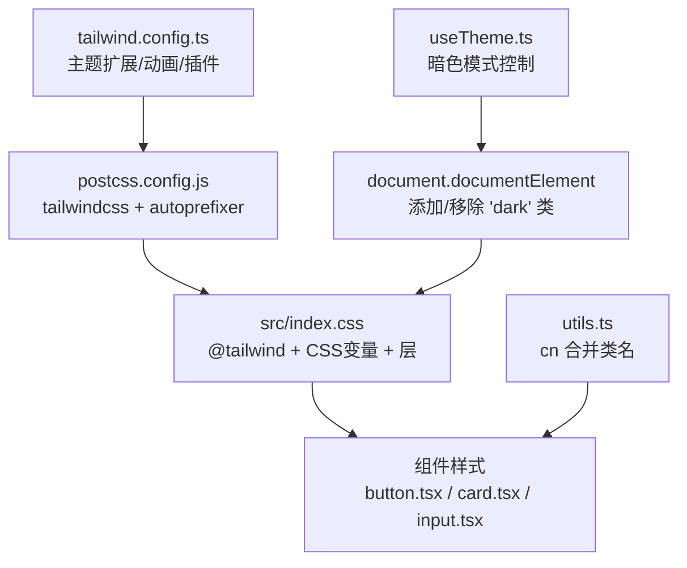
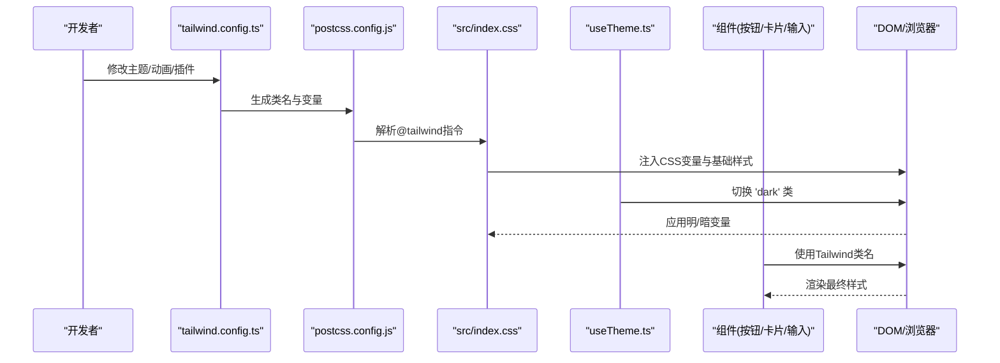
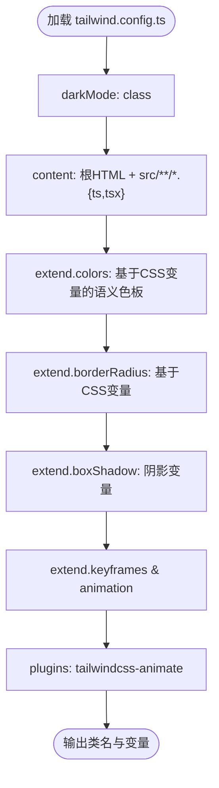
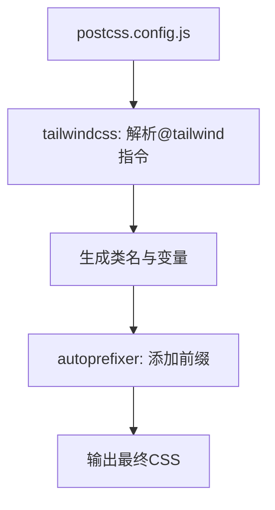
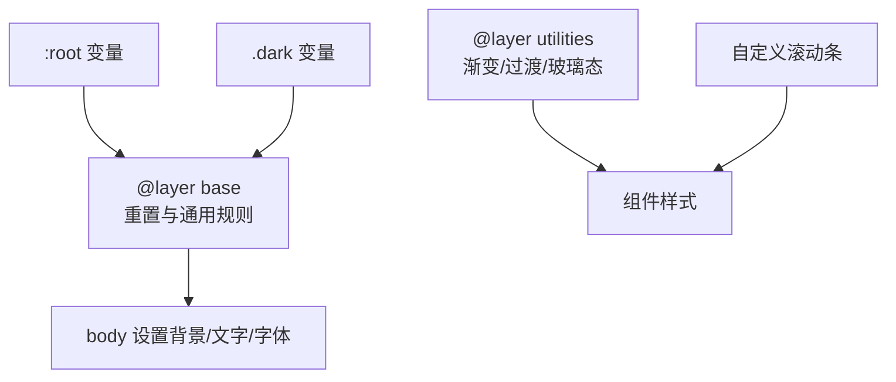
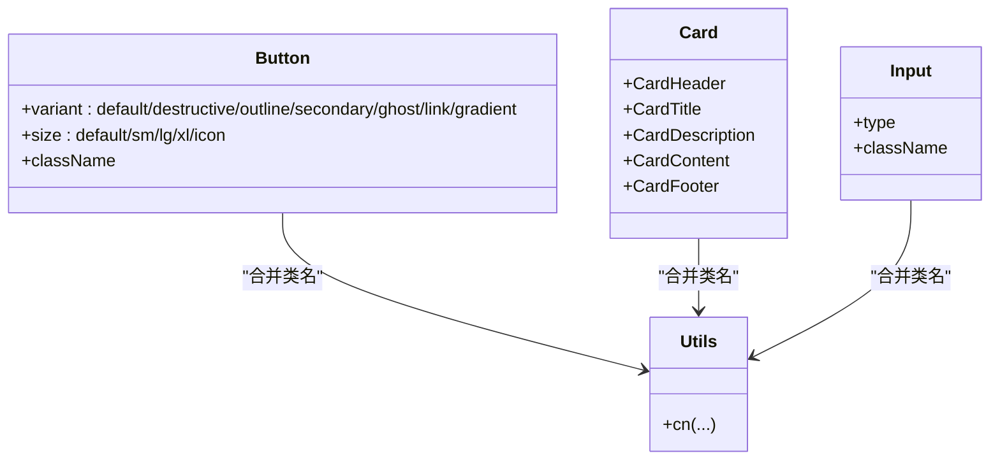
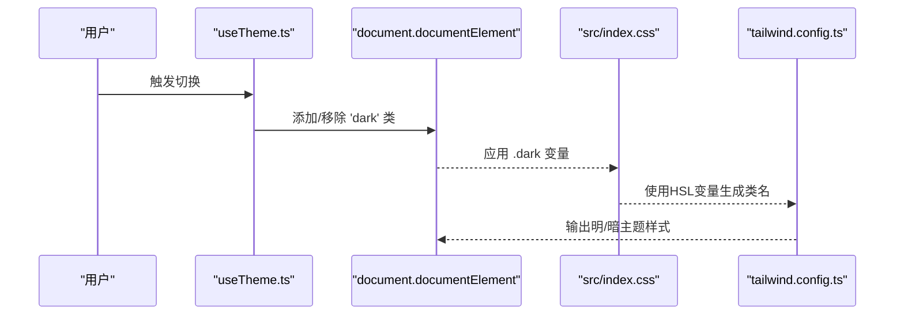
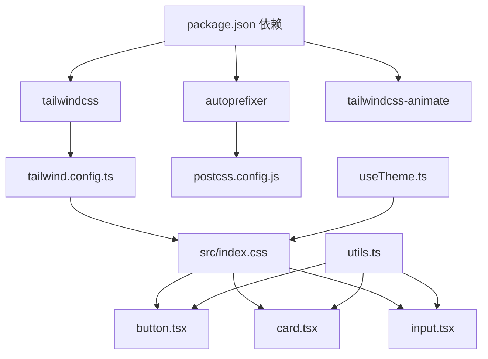

# 样式配置

<cite>
**本文档引用的文件**
- [tailwind.config.ts](file://tailwind.config.ts)
- [postcss.config.js](file://postcss.config.js)
- [src/index.css](file://src/index.css)
- [package.json](file://package.json)
- [src/components/ui/button.tsx](file://src/components/ui/button.tsx)
- [src/components/ui/card.tsx](file://src/components/ui/card.tsx)
- [src/components/ui/input.tsx](file://src/components/ui/input.tsx)
- [src/hooks/useTheme.ts](file://src/hooks/useTheme.ts)
- [src/lib/utils.ts](file://src/lib/utils.ts)
- [vite.config.ts](file://vite.config.ts)
</cite>

## 目录
1. [简介](#简介)
2. [项目结构](#项目结构)
3. [核心组件](#核心组件)
4. [架构总览](#架构总览)
5. [详细组件分析](#详细组件分析)
6. [依赖关系分析](#依赖关系分析)
7. [性能考虑](#性能考虑)
8. [故障排除指南](#故障排除指南)
9. [结论](#结论)

## 简介
本文件面向QR码生成器项目的样式配置，系统性地文档化Tailwind CSS配置、PostCSS处理流程、全局样式与主题系统，并结合实际组件使用示例，说明颜色系统、字体设置、组件扩展、响应式断点、暗色主题支持与动画配置。同时提供样式优化策略、性能考量与自定义样式的实现方法，帮助开发者在保持一致视觉风格的同时提升开发效率与运行性能。

## 项目结构
样式相关的核心文件分布如下：
- Tailwind 配置：tailwind.config.ts
- PostCSS 插件链：postcss.config.js
- 全局样式入口：src/index.css
- 主题与变量：通过CSS自定义属性在全局层中定义
- 组件样式：各UI组件通过Tailwind类名组合与变体系统实现
- 主题切换：useTheme Hook 控制暗色模式类名
- 工具函数：cn 合并类名，确保冲突类名被正确合并

图表来源
- [tailwind.config.ts:1-107](file://tailwind.config.ts#L1-L107)
- [postcss.config.js:1-7](file://postcss.config.js#L1-L7)
- [src/index.css:1-148](file://src/index.css#L1-L148)
- [src/components/ui/button.tsx:1-51](file://src/components/ui/button.tsx#L1-L51)
- [src/components/ui/card.tsx:1-86](file://src/components/ui/card.tsx#L1-L86)
- [src/components/ui/input.tsx:1-25](file://src/components/ui/input.tsx#L1-L25)
- [src/hooks/useTheme.ts:1-26](file://src/hooks/useTheme.ts#L1-L26)
- [src/lib/utils.ts:1-7](file://src/lib/utils.ts#L1-L7)

章节来源
- [tailwind.config.ts:1-107](file://tailwind.config.ts#L1-L107)
- [postcss.config.js:1-7](file://postcss.config.js#L1-L7)
- [src/index.css:1-148](file://src/index.css#L1-L148)
- [package.json:1-37](file://package.json#L1-L37)

## 核心组件
本节聚焦样式配置的关键要素：Tailwind主题扩展、PostCSS处理链、全局样式与主题系统、组件样式实践以及工具函数。

- Tailwind 主题扩展
  - 容器与断点：容器居中、默认内边距、2xl屏断点
  - 颜色系统：基于CSS变量的语义化命名，支持明/暗两套调色板
  - 圆角半径：基于CSS变量，提供lg/md/sm/xl/2xl等规格
  - 阴影：优雅阴影、发光阴影、卡片悬停阴影
  - 动画：手风琴展开/收起、淡入、缩放、滑入右侧、脉冲发光
  - 插件：tailwindcss-animate 提供动画类

- PostCSS 处理链
  - tailwindcss：解析@tailwind指令并生成所需类
  - autoprefixer：自动添加浏览器前缀

- 全局样式与主题系统
  - CSS变量：在:root与.dark中分别定义明/暗两套变量
  - 渐变与阴影：通过变量统一管理渐变与阴影效果
  - 字体：系统字体栈，保证跨平台一致性
  - 基础层：重置与通用规则
  - 工具层：常用工具类如渐变背景、平滑过渡、玻璃态等
  - 自定义滚动条：轻量级滚动条样式

- 组件样式实践
  - Button：使用变体系统与cva，支持多种外观与尺寸，结合阴影与过渡
  - Card：圆角、边框、背景、阴影与悬停效果
  - Input：边框、背景、焦点环、占位符与过渡

- 主题切换
  - useTheme Hook：检测系统偏好或手动切换，向html元素添加/移除'dark'类
  - Tailwind darkMode：class 模式，与useTheme联动

- 工具函数
  - cn：使用clsx与tailwind-merge合并类名，避免重复与冲突

章节来源
- [tailwind.config.ts:1-107](file://tailwind.config.ts#L1-L107)
- [postcss.config.js:1-7](file://postcss.config.js#L1-L7)
- [src/index.css:1-148](file://src/index.css#L1-L148)
- [src/components/ui/button.tsx:1-51](file://src/components/ui/button.tsx#L1-L51)
- [src/components/ui/card.tsx:1-86](file://src/components/ui/card.tsx#L1-L86)
- [src/components/ui/input.tsx:1-25](file://src/components/ui/input.tsx#L1-L25)
- [src/hooks/useTheme.ts:1-26](file://src/hooks/useTheme.ts#L1-L26)
- [src/lib/utils.ts:1-7](file://src/lib/utils.ts#L1-L7)

## 架构总览
下图展示从配置到组件渲染的完整样式管线，包括Tailwind编译、PostCSS处理、主题切换与组件应用。

图表来源
- [tailwind.config.ts:1-107](file://tailwind.config.ts#L1-L107)
- [postcss.config.js:1-7](file://postcss.config.js#L1-L7)
- [src/index.css:1-148](file://src/index.css#L1-L148)
- [src/hooks/useTheme.ts:1-26](file://src/hooks/useTheme.ts#L1-L26)
- [src/components/ui/button.tsx:1-51](file://src/components/ui/button.tsx#L1-L51)
- [src/components/ui/card.tsx:1-86](file://src/components/ui/card.tsx#L1-L86)
- [src/components/ui/input.tsx:1-25](file://src/components/ui/input.tsx#L1-L25)

## 详细组件分析

### Tailwind 配置分析
- 内容扫描路径：根HTML与src目录下的TS/TSX文件，确保按需生成类
- 暗色模式：class 模式，与useTheme Hook配合
- 主题扩展
  - colors：基于CSS变量的语义化命名，覆盖border/input/ring/background/foreground/primary/secondary/destructive/muted/accent/popover/card/surface
  - borderRadius：基于CSS变量，提供多级圆角规格
  - boxShadow：提供优雅阴影、发光阴影、卡片悬停阴影
  - keyframes/animation：手风琴、淡入、缩放、滑入右侧、脉冲发光
- 插件：tailwindcss-animate 提供动画类

图表来源
- [tailwind.config.ts:1-107](file://tailwind.config.ts#L1-L107)

章节来源
- [tailwind.config.ts:1-107](file://tailwind.config.ts#L1-L107)

### PostCSS 配置分析
- 插件链：tailwindcss 负责解析@tailwind指令；autoprefixer 自动补全浏览器前缀
- 作用：将Tailwind生成的类名与变量注入到最终CSS中，并确保兼容性

图表来源
- [postcss.config.js:1-7](file://postcss.config.js#L1-L7)

章节来源
- [postcss.config.js:1-7](file://postcss.config.js#L1-L7)

### 全局样式与主题系统
- 变量定义
  - :root：明色主题变量，包含背景、前景、卡片、弹出层、主色、次色、柔和、强调、表面、破坏色、边框、输入、环形高亮、圆角半径以及渐变与阴影
  - .dark：暗色主题变量，调整色调与透明度，适配深色环境
- 基础层(base)
  - 重置通用边框，设置body的背景与文字颜色，并应用抗锯齿
  - 字体采用系统字体栈，保证跨平台一致性
- 工具层(utilities)
  - 渐变类：gradient-primary/hero/surface/card
  - 文本渐变：text-gradient
  - 过渡：transition-smooth
  - 玻璃态：glass/glass-dark，结合backdrop-blur与半透明背景
- 自定义滚动条：针对Webkit内核的滚动条进行美化

图表来源
- [src/index.css:1-148](file://src/index.css#L1-L148)

章节来源
- [src/index.css:1-148](file://src/index.css#L1-L148)

### 组件样式实践
- Button
  - 使用cva变体系统，支持default/destructive/outline/secondary/ghost/link/gradient等外观
  - 尺寸：default/sm/lg/xl/icon
  - 结合阴影与过渡类，实现优雅交互
- Card
  - 圆角、边框、背景、阴影与悬停效果
  - 支持头部、标题、描述、内容、底部等子组件
- Input
  - 边框、背景、焦点环、占位符与过渡
  - 与Card/Label等组件协同使用

图表来源
- [src/components/ui/button.tsx:1-51](file://src/components/ui/button.tsx#L1-L51)
- [src/components/ui/card.tsx:1-86](file://src/components/ui/card.tsx#L1-L86)
- [src/components/ui/input.tsx:1-25](file://src/components/ui/input.tsx#L1-L25)
- [src/lib/utils.ts:1-7](file://src/lib/utils.ts#L1-L7)

章节来源
- [src/components/ui/button.tsx:1-51](file://src/components/ui/button.tsx#L1-L51)
- [src/components/ui/card.tsx:1-86](file://src/components/ui/card.tsx#L1-L86)
- [src/components/ui/input.tsx:1-25](file://src/components/ui/input.tsx#L1-L25)
- [src/lib/utils.ts:1-7](file://src/lib/utils.ts#L1-L7)

### 主题切换与暗色模式
- useTheme Hook
  - 初始化：检测html元素是否已包含'dark'类或系统偏好
  - 切换：向document.documentElement添加/移除'dark'类
  - 与Tailwind darkMode: 'class' 配合，实现明/暗主题无缝切换
- Tailwind darkMode
  - 通过CSS变量在明/暗主题间切换，确保颜色与阴影的一致性

图表来源
- [src/hooks/useTheme.ts:1-26](file://src/hooks/useTheme.ts#L1-L26)
- [src/index.css:1-148](file://src/index.css#L1-L148)
- [tailwind.config.ts:1-107](file://tailwind.config.ts#L1-L107)

章节来源
- [src/hooks/useTheme.ts:1-26](file://src/hooks/useTheme.ts#L1-L26)
- [src/index.css:1-148](file://src/index.css#L1-L148)
- [tailwind.config.ts:1-107](file://tailwind.config.ts#L1-L107)

## 依赖关系分析
- Tailwind 与 PostCSS
  - tailwind.config.ts 生成类名与变量
  - postcss.config.js 解析@tailwind指令并自动补全前缀
- 组件与工具
  - 组件通过cn合并类名，避免冲突
  - 主题切换影响CSS变量，进而影响所有基于变量的样式
- 构建与别名
  - Vite配置提供@别名，便于导入src目录下的模块

图表来源
- [package.json:1-37](file://package.json#L1-L37)
- [tailwind.config.ts:1-107](file://tailwind.config.ts#L1-L107)
- [postcss.config.js:1-7](file://postcss.config.js#L1-L7)
- [src/index.css:1-148](file://src/index.css#L1-L148)
- [src/components/ui/button.tsx:1-51](file://src/components/ui/button.tsx#L1-L51)
- [src/components/ui/card.tsx:1-86](file://src/components/ui/card.tsx#L1-L86)
- [src/components/ui/input.tsx:1-25](file://src/components/ui/input.tsx#L1-L25)
- [src/hooks/useTheme.ts:1-26](file://src/hooks/useTheme.ts#L1-L26)
- [src/lib/utils.ts:1-7](file://src/lib/utils.ts#L1-L7)

章节来源
- [package.json:1-37](file://package.json#L1-L37)
- [vite.config.ts:1-13](file://vite.config.ts#L1-L13)

## 性能考虑
- 按需生成类
  - Tailwind content配置仅扫描根HTML与src目录，减少无关类生成
- CSS变量驱动
  - 明/暗主题通过CSS变量切换，避免重复样式块，降低CSS体积
- 动画与阴影
  - 使用变量化的阴影与动画，避免硬编码值导致的重复
- 类名合并
  - 使用twMerge与clsx合并类名，避免重复与冲突，减少DOM复杂度
- 构建优化
  - PostCSS自动前缀减少手动维护成本，提高兼容性
- 响应式与断点
  - 容器居中与2xl断点适合现代桌面布局，建议在移动端使用Tailwind内置断点

## 故障排除指南
- 暗色主题不生效
  - 检查useTheme Hook是否向document.documentElement添加了'dark'类
  - 确认Tailwind配置中的darkMode为'class'
  - 确保CSS变量在:root与.dark中均存在
- 类名冲突或样式异常
  - 使用cn合并类名，确保twMerge与clsx正确引入
  - 避免在同一元素上重复设置相同属性的不同类
- 动画不生效
  - 确认tailwindcss-animate插件已安装并启用
  - 检查keyframes与animation名称是否一致
- PostCSS处理失败
  - 确认tailwindcss与autoprefixer版本兼容
  - 检查postcss.config.js中插件顺序与配置

章节来源
- [src/hooks/useTheme.ts:1-26](file://src/hooks/useTheme.ts#L1-L26)
- [tailwind.config.ts:1-107](file://tailwind.config.ts#L1-L107)
- [src/lib/utils.ts:1-7](file://src/lib/utils.ts#L1-L7)
- [postcss.config.js:1-7](file://postcss.config.js#L1-L7)

## 结论
本项目的样式体系以Tailwind CSS为核心，结合PostCSS与CSS变量，实现了可维护、可扩展且高性能的样式架构。通过语义化颜色系统、统一的圆角与阴影变量、丰富的动画与过渡，以及完善的明/暗主题支持，为QR码生成器提供了清晰一致的视觉体验。组件层采用变体系统与类名合并策略，既保证了灵活性，又避免了样式冲突。建议在后续迭代中持续关注按需生成与变量复用，进一步优化构建与运行时性能。