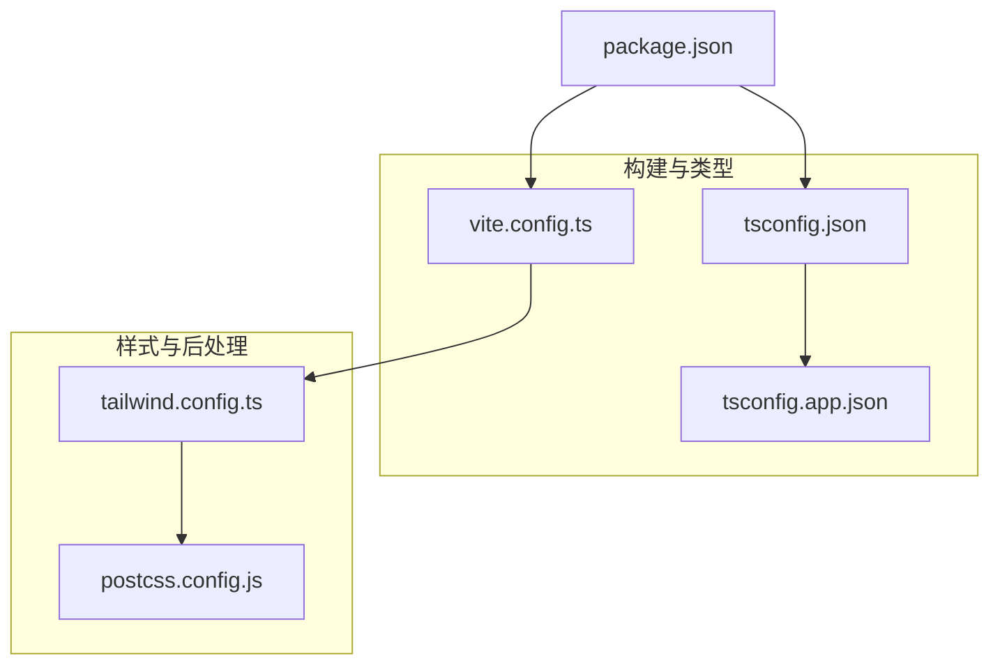
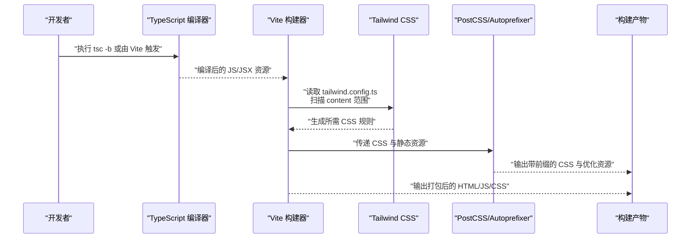
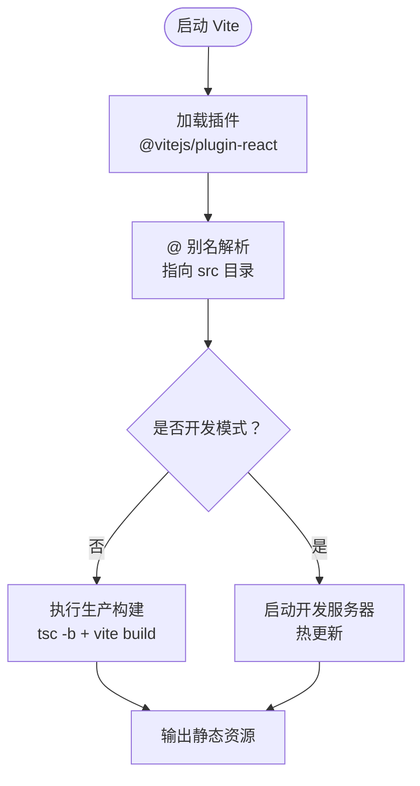
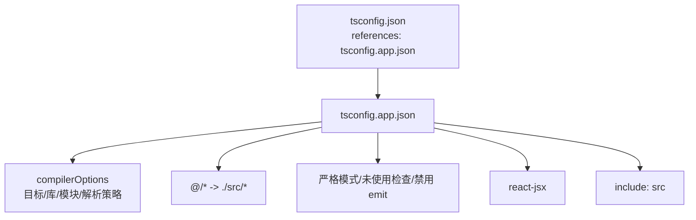
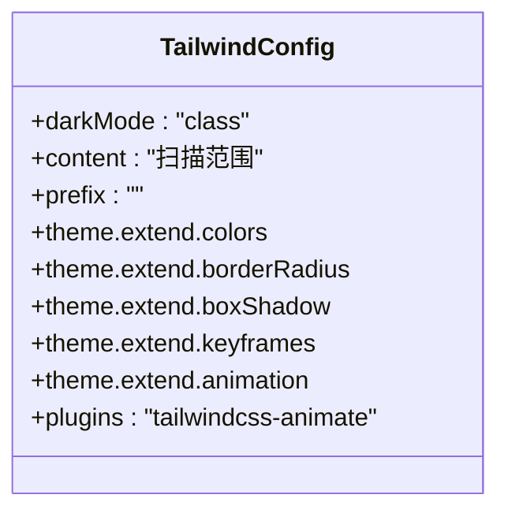
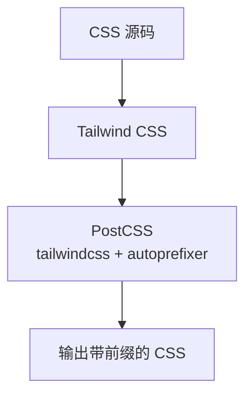
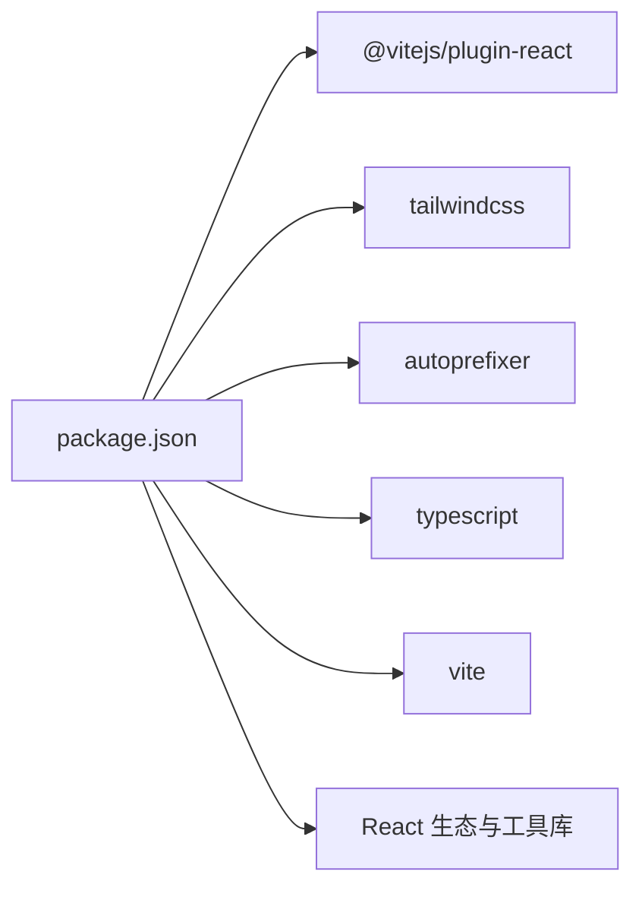

# 配置系统

<cite>
**本文引用的文件**
- [vite.config.ts](file://vite.config.ts)
- [tsconfig.json](file://tsconfig.json)
- [tsconfig.app.json](file://tsconfig.app.json)
- [tailwind.config.ts](file://tailwind.config.ts)
- [postcss.config.js](file://postcss.config.js)
- [package.json](file://package.json)
</cite>

## 目录
1. [简介](#简介)
2. [项目结构](#项目结构)
3. [核心组件](#核心组件)
4. [架构总览](#架构总览)
5. [详细组件分析](#详细组件分析)
6. [依赖关系分析](#依赖关系分析)
7. [性能考量](#性能考量)
8. [故障排查指南](#故障排查指南)
9. [结论](#结论)
10. [附录](#附录)

## 简介
本文件系统性地文档化 QR 码生成器项目的配置体系，覆盖以下方面：
- 构建配置：Vite 开发服务器与构建优化、插件与别名配置
- 类型系统：TypeScript 多项目配置、路径映射与严格类型检查
- 样式系统：Tailwind CSS 主题扩展、动画与暗色模式、PostCSS 与 Autoprefixer
- 开发与生产最佳实践：脚本命令、构建流程与部署建议

## 项目结构
该项目采用现代前端工程化标准，使用 Vite 作为构建工具，TypeScript 进行类型检查，Tailwind CSS 提供原子化样式，PostCSS 负责后处理与浏览器兼容。

图表来源
- [vite.config.ts:1-13](file://vite.config.ts#L1-L13)
- [tsconfig.json:1-8](file://tsconfig.json#L1-L8)
- [tsconfig.app.json:1-33](file://tsconfig.app.json#L1-L33)
- [tailwind.config.ts:1-107](file://tailwind.config.ts#L1-L107)
- [postcss.config.js:1-7](file://postcss.config.js#L1-L7)
- [package.json:1-37](file://package.json#L1-L37)

章节来源
- [vite.config.ts:1-13](file://vite.config.ts#L1-L13)
- [tsconfig.json:1-8](file://tsconfig.json#L1-L8)
- [tsconfig.app.json:1-33](file://tsconfig.app.json#L1-L33)
- [tailwind.config.ts:1-107](file://tailwind.config.ts#L1-L107)
- [postcss.config.js:1-7](file://postcss.config.js#L1-L7)
- [package.json:1-37](file://package.json#L1-L37)

## 核心组件
- Vite 构建配置：启用 React 插件、配置路径别名 @ 指向 src 目录，提供开发服务器与打包能力
- TypeScript 多项目配置：根 tsconfig.json 引用 app 子配置；app 配置启用严格模式、路径映射、ESNext 模块解析
- Tailwind CSS：启用类名驱动的暗色模式、内容扫描范围、主题扩展（颜色、圆角、阴影、动画）、插件 tailwindcss-animate
- PostCSS：集成 Tailwind 与 Autoprefixer，自动添加浏览器前缀
- 包管理与脚本：统一管理依赖与开发/构建/预览命令

章节来源
- [vite.config.ts:5-12](file://vite.config.ts#L5-L12)
- [tsconfig.app.json:2-28](file://tsconfig.app.json#L2-L28)
- [tailwind.config.ts:3-104](file://tailwind.config.ts#L3-L104)
- [postcss.config.js:1-7](file://postcss.config.js#L1-L7)
- [package.json:6-10](file://package.json#L6-L10)

## 架构总览
下图展示从源代码到最终产物的关键流程：TypeScript 编译与 Vite 打包、Tailwind 内容扫描与样式生成、PostCSS 后处理与浏览器兼容。

图表来源
- [tsconfig.app.json:1-33](file://tsconfig.app.json#L1-L33)
- [vite.config.ts:1-13](file://vite.config.ts#L1-L13)
- [tailwind.config.ts:1-107](file://tailwind.config.ts#L1-L107)
- [postcss.config.js:1-7](file://postcss.config.js#L1-L7)
- [package.json:8](file://package.json#L8)

## 详细组件分析

### Vite 构建配置
- 插件配置
  - React 插件：启用 JSX 转换与热更新等 React 开发体验相关功能
- 路径别名
  - 将 @ 映射到 src 目录，便于在组件中使用相对路径导入
- 开发服务器与构建
  - 开发脚本通过 Vite 启动本地服务
  - 生产构建先触发 TypeScript 增量编译，再由 Vite 打包

图表来源
- [vite.config.ts:5-12](file://vite.config.ts#L5-L12)
- [package.json:7-9](file://package.json#L7-L9)

章节来源
- [vite.config.ts:5-12](file://vite.config.ts#L5-L12)
- [package.json:7-9](file://package.json#L7-L9)

### TypeScript 配置
- 根配置
  - 通过 references 引用 app 子配置，实现多项目联合编译
- app 子配置
  - 目标与模块：ES2020 + ESNext 模块
  - 库与运行时：包含 DOM/DOM.Iterable
  - 解析策略：bundler + bundler 检测
  - 路径映射：@/* -> ./src/*
  - 严格性：开启严格模式与未使用项检查
  - JSX：使用 react-jsx
  - 入口：仅包含 src 目录

图表来源
- [tsconfig.json:1-8](file://tsconfig.json#L1-L8)
- [tsconfig.app.json:1-33](file://tsconfig.app.json#L1-L33)

章节来源
- [tsconfig.json:1-8](file://tsconfig.json#L1-L8)
- [tsconfig.app.json:2-28](file://tsconfig.app.json#L2-L28)

### Tailwind CSS 配置
- 内容扫描
  - 扫描 index.html 与 src 下的 ts/tsx 文件，确保按需生成样式
- 暗色模式
  - 使用类名驱动的暗色模式开关
- 主题扩展
  - 容器居中与内边距、自定义颜色体系（基于 CSS 变量）
  - 圆角、阴影、动画键帧与动画别名
- 插件
  - tailwindcss-animate：提供丰富的开箱即用动画类

图表来源
- [tailwind.config.ts:3-104](file://tailwind.config.ts#L3-L104)

章节来源
- [tailwind.config.ts:3-104](file://tailwind.config.ts#L3-L104)

### PostCSS 与 CSS 预处理器
- PostCSS 配置
  - 启用 tailwindcss 与 autoprefixer，自动注入浏览器前缀
- CSS 预处理器
  - 项目未显式配置 Sass/Less 等预处理器，使用原生 CSS 与 Tailwind 原子类

图表来源
- [postcss.config.js:1-7](file://postcss.config.js#L1-L7)
- [tailwind.config.ts:5](file://tailwind.config.ts#L5)

章节来源
- [postcss.config.js:1-7](file://postcss.config.js#L1-L7)

## 依赖关系分析
- 依赖与脚本
  - 开发依赖：Vite、React 插件、Tailwind、Autoprefixer、PostCSS、TypeScript
  - 运行时依赖：React 生态、路由、UI 工具集、QR 生成与导出工具
  - 脚本：dev、build、preview，构建链路先 tsc -b 再 vite build

图表来源
- [package.json:11-35](file://package.json#L11-L35)

章节来源
- [package.json:6-10](file://package.json#L6-L10)
- [package.json:11-35](file://package.json#L11-L35)

## 性能考量
- 构建性能
  - 使用 tsc -b 增量编译，减少重复类型检查时间
  - Vite 的快速冷启动与热更新提升开发效率
- 样式体积
  - Tailwind 内容扫描仅生成实际使用的类，避免无用 CSS
  - 动画与阴影等扩展按需引入，保持较小体积
- 浏览器兼容
  - Autoprefixer 自动添加必要前缀，降低手动维护成本

[本节为通用性能建议，不直接分析具体文件]

## 故障排查指南
- TypeScript 路径别名无效
  - 确认 tsconfig.app.json 中 baseUrl 与 paths 设置正确，并与 Vite 别名一致
- Tailwind 未生成样式
  - 检查 tailwind.config.ts 的 content 范围是否包含当前文件
  - 确保未被 Purge/Tree-shaking 过滤
- PostCSS 插件未生效
  - 确认 postcss.config.js 正确启用了 tailwindcss 与 autoprefixer
- 构建失败或产物异常
  - 先执行 tsc -b 检查类型错误，再执行 vite build
  - 清理缓存与 node_modules 后重装依赖

章节来源
- [tsconfig.app.json:23-28](file://tsconfig.app.json#L23-L28)
- [tailwind.config.ts:5](file://tailwind.config.ts#L5)
- [postcss.config.js:1-7](file://postcss.config.js#L1-L7)
- [package.json:8](file://package.json#L8)

## 结论
该配置体系以 Vite 为核心，结合 TypeScript 的严格类型检查与 Tailwind 的原子化样式，辅以 PostCSS 的浏览器兼容处理，形成高效、可维护且可扩展的前端工程化方案。通过合理的路径映射、内容扫描与增量编译，既保证了开发体验，也兼顾了生产环境的体积与性能。

[本节为总结性内容，不直接分析具体文件]

## 附录
- 开发环境
  - 使用 npm run dev 启动本地开发服务器
  - 通过 @ 别名进行模块导入，提升可读性与可迁移性
- 生产构建
  - 使用 npm run build 执行类型检查与打包
  - 输出目录由 Vite 默认配置生成
- 部署建议
  - 将构建产物部署至静态站点或 CDN
  - 确保服务器支持现代浏览器特性与必要的 MIME 类型

章节来源
- [package.json:7-9](file://package.json#L7-L9)
- [vite.config.ts:7-11](file://vite.config.ts#L7-L11)
- [tsconfig.app.json:24-28](file://tsconfig.app.json#L24-L28)