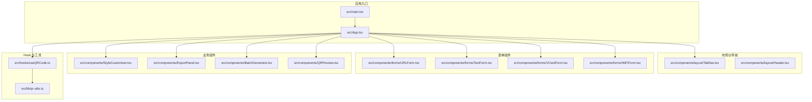
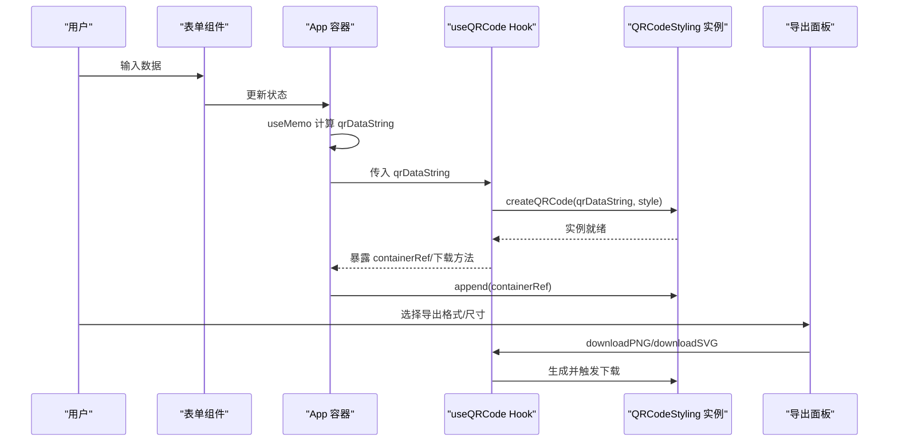
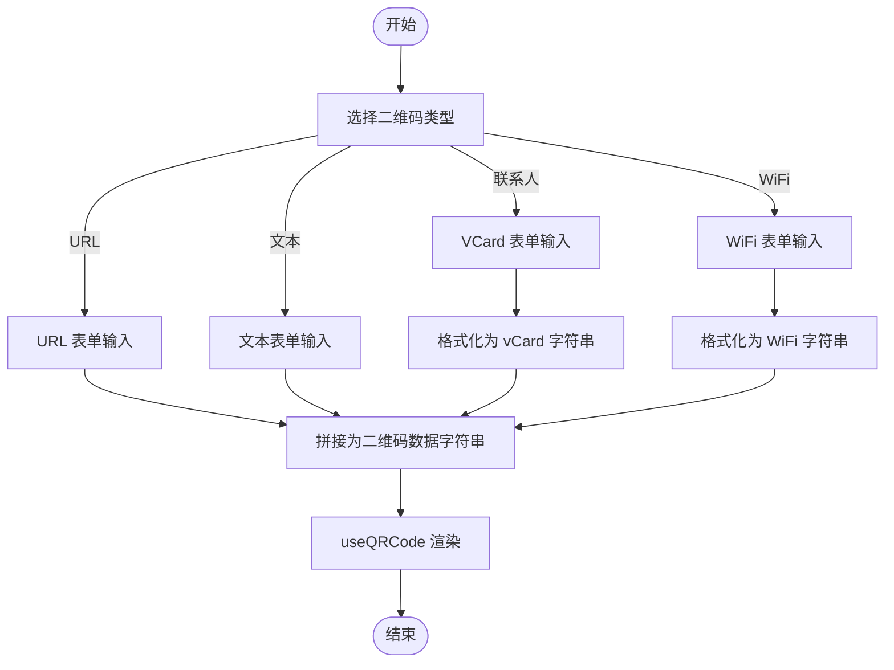
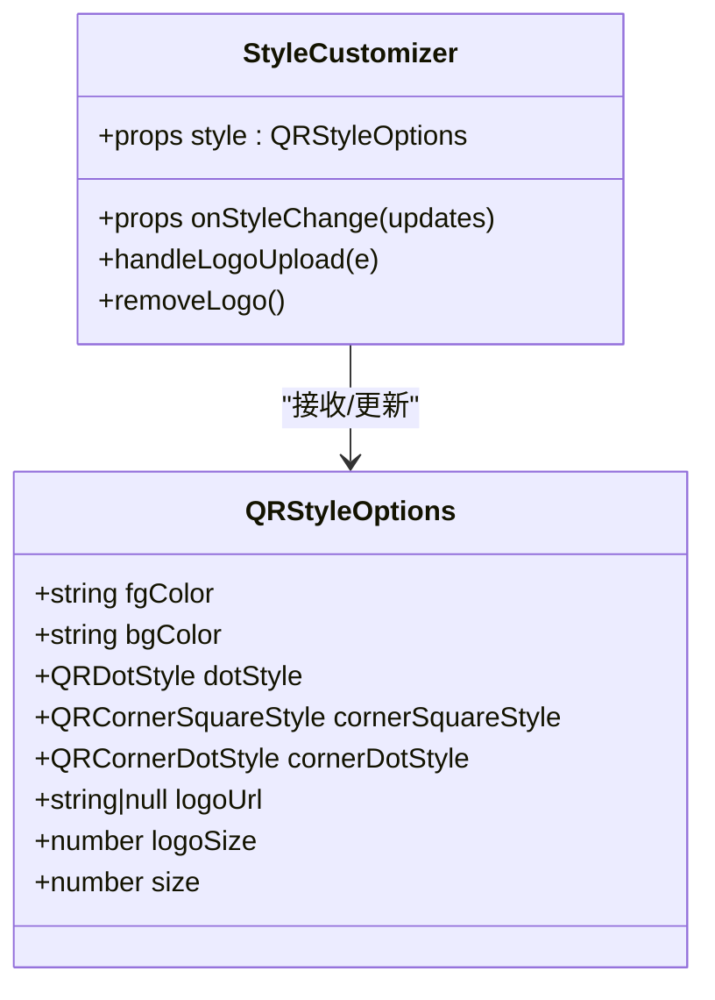
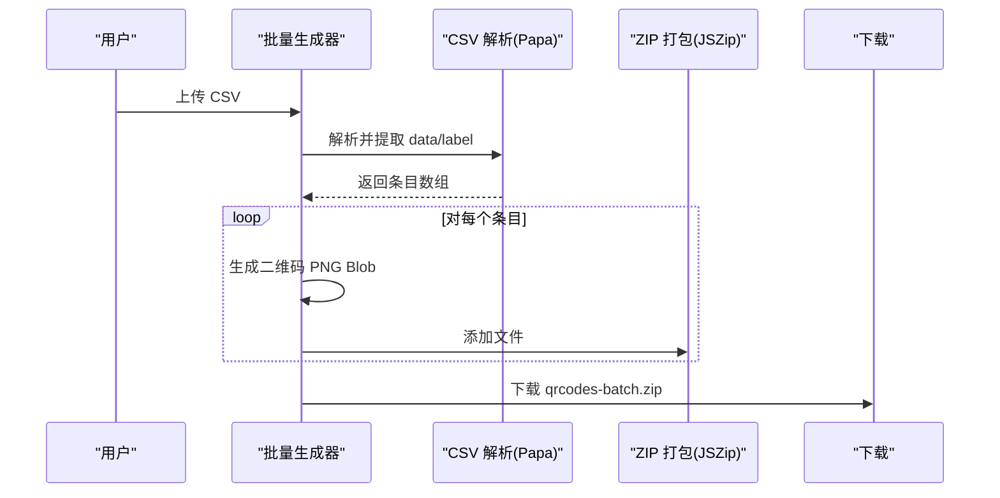
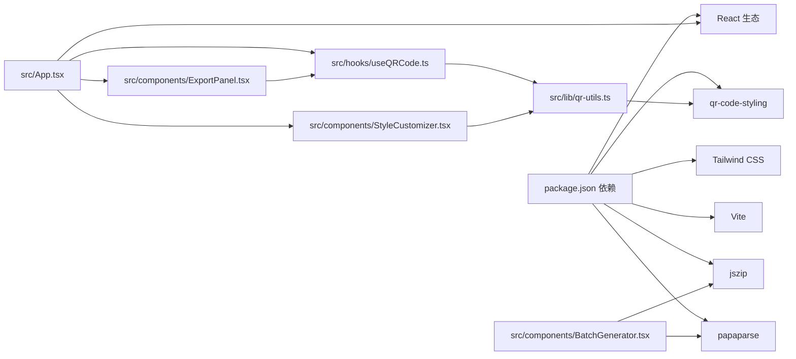

# 项目概述

<cite>
**本文档引用的文件**
- [package.json](file://package.json)
- [src/App.tsx](file://src/App.tsx)
- [src/main.tsx](file://src/main.tsx)
- [tailwind.config.ts](file://tailwind.config.ts)
- [vite.config.ts](file://vite.config.ts)
- [src/components/forms/URLForm.tsx](file://src/components/forms/URLForm.tsx)
- [src/components/forms/TextForm.tsx](file://src/components/forms/TextForm.tsx)
- [src/components/forms/VCardForm.tsx](file://src/components/forms/VCardForm.tsx)
- [src/components/forms/WiFiForm.tsx](file://src/components/forms/WiFiForm.tsx)
- [src/components/layout/TabNav.tsx](file://src/components/layout/TabNav.tsx)
- [src/components/StyleCustomizer.tsx](file://src/components/StyleCustomizer.tsx)
- [src/components/ExportPanel.tsx](file://src/components/ExportPanel.tsx)
- [src/components/BatchGenerator.tsx](file://src/components/BatchGenerator.tsx)
- [src/hooks/useQRCode.ts](file://src/hooks/useQRCode.ts)
- [src/lib/qr-utils.ts](file://src/lib/qr-utils.ts)
</cite>

## 目录
1. [简介](#简介)
2. [项目结构](#项目结构)
3. [核心组件](#核心组件)
4. [架构总览](#架构总览)
5. [详细组件分析](#详细组件分析)
6. [依赖关系分析](#依赖关系分析)
7. [性能考虑](#性能考虑)
8. [故障排除指南](#故障排除指南)
9. [结论](#结论)

## 简介
本项目是一个现代化的本地二维码生成器，专注于在浏览器端完成所有处理，确保用户数据不离开设备。系统支持四种二维码类型：URL 链接、纯文本、VCard 联系人名片、WiFi 凭证；提供丰富的样式定制能力（颜色、形状、Logo 中心图）；支持批量导入 CSV 并导出为 ZIP 包含的 PNG/SVG 图片；采用 React 18 + TypeScript + Tailwind CSS + Vite 的现代前端技术栈，注重用户体验与安全性。

## 项目结构
项目采用按功能域分层的组织方式，核心目录如下：
- src/components：UI 组件与业务组件（表单、布局、样式定制、导出面板、批量生成）
- src/hooks：自定义 Hook（如二维码逻辑封装）
- src/lib：通用工具与类型定义（二维码生成、格式化、默认样式等）
- 根配置：package.json、vite.config.ts、tailwind.config.ts 等

**图表来源**
- [src/main.tsx:1-11](file://src/main.tsx#L1-L11)
- [src/App.tsx:1-173](file://src/App.tsx#L1-L173)
- [src/components/layout/TabNav.tsx:1-47](file://src/components/layout/TabNav.tsx#L1-L47)
- [src/components/forms/URLForm.tsx:1-33](file://src/components/forms/URLForm.tsx#L1-L33)
- [src/components/forms/TextForm.tsx:1-28](file://src/components/forms/TextForm.tsx#L1-L28)
- [src/components/forms/VCardForm.tsx:1-92](file://src/components/forms/VCardForm.tsx#L1-L92)
- [src/components/forms/WiFiForm.tsx:1-67](file://src/components/forms/WiFiForm.tsx#L1-L67)
- [src/components/StyleCustomizer.tsx:1-193](file://src/components/StyleCustomizer.tsx#L1-L193)
- [src/components/ExportPanel.tsx:1-83](file://src/components/ExportPanel.tsx#L1-L83)
- [src/components/BatchGenerator.tsx:1-180](file://src/components/BatchGenerator.tsx#L1-L180)
- [src/hooks/useQRCode.ts:1-75](file://src/hooks/useQRCode.ts#L1-L75)
- [src/lib/qr-utils.ts:1-151](file://src/lib/qr-utils.ts#L1-L151)

**章节来源**
- [package.json:1-37](file://package.json#L1-L37)
- [vite.config.ts:1-13](file://vite.config.ts#L1-L13)
- [tailwind.config.ts:1-107](file://tailwind.config.ts#L1-L107)

## 核心组件
- 应用主容器与状态管理：负责切换四种二维码类型与“批量生成”模式，聚合表单输入与样式定制结果，驱动二维码渲染与导出。
- 表单组件：分别为 URL、文本、VCard、WiFi 提供输入界面，内置基础校验提示与交互反馈。
- 样式定制器：提供颜色、点/角样式、Logo 上传与大小调节等选项，并与 Hook 同步更新。
- 导出面板：支持 PNG 尺寸选择与 SVG 导出，提供一键下载。
- 批量生成器：通过 CSV 导入多条数据，逐条生成 PNG 并打包为 ZIP 下载。
- Hook 与工具：useQRCode 封装 QRCodeStyling 的实例化、渲染、下载与 Blob 获取；qr-utils 定义类型、格式化方法与默认样式。

**章节来源**
- [src/App.tsx:24-173](file://src/App.tsx#L24-L173)
- [src/hooks/useQRCode.ts:1-75](file://src/hooks/useQRCode.ts#L1-L75)
- [src/lib/qr-utils.ts:1-151](file://src/lib/qr-utils.ts#L1-L151)

## 架构总览
系统采用“组件驱动 + Hook 抽象”的架构，数据流从表单输入经 useMemo 计算得到二维码数据字符串，再由 useQRCode Hook 基于该字符串与样式配置创建 QRCodeStyling 实例并挂载到 DOM；导出时根据目标格式与尺寸调用下载或返回 Blob。

**图表来源**
- [src/App.tsx:47-65](file://src/App.tsx#L47-L65)
- [src/hooks/useQRCode.ts:20-51](file://src/hooks/useQRCode.ts#L20-L51)
- [src/components/ExportPanel.tsx:21-37](file://src/components/ExportPanel.tsx#L21-L37)

## 详细组件分析

### 四种二维码类型与表单
- URL 类型：输入完整 URL，自动带前缀提示，适合跳转链接场景。
- 文本类型：支持长文本输入与字符计数，适合任意文本内容。
- VCard 类型：支持姓名、电话、邮箱、公司、职位、网站等字段，最终格式化为 vCard 规范字符串。
- WiFi 类型：支持 SSID、加密方式（WPA/WPA2、WEP、无密码）、密码与隐藏网络标记，最终格式化为 WiFi 规范字符串。

**图表来源**
- [src/App.tsx:47-62](file://src/App.tsx#L47-L62)
- [src/components/forms/URLForm.tsx:10-32](file://src/components/forms/URLForm.tsx#L10-L32)
- [src/components/forms/TextForm.tsx:9-27](file://src/components/forms/TextForm.tsx#L9-L27)
- [src/components/forms/VCardForm.tsx:10-91](file://src/components/forms/VCardForm.tsx#L10-L91)
- [src/components/forms/WiFiForm.tsx:17-66](file://src/components/forms/WiFiForm.tsx#L17-L66)
- [src/lib/qr-utils.ts:42-61](file://src/lib/qr-utils.ts#L42-L61)

**章节来源**
- [src/components/forms/URLForm.tsx:1-33](file://src/components/forms/URLForm.tsx#L1-L33)
- [src/components/forms/TextForm.tsx:1-28](file://src/components/forms/TextForm.tsx#L1-L28)
- [src/components/forms/VCardForm.tsx:1-92](file://src/components/forms/VCardForm.tsx#L1-L92)
- [src/components/forms/WiFiForm.tsx:1-67](file://src/components/forms/WiFiForm.tsx#L1-L67)
- [src/lib/qr-utils.ts:25-61](file://src/lib/qr-utils.ts#L25-L61)

### 样式定制与主题
- 颜色：支持前景色与背景色的预设与自定义，使用颜色选择器与输入框联动。
- 点样式：提供多种点样式选项，影响二维码“点”的视觉效果。
- 角样式：分别控制三个定位角的方形、圆点、超圆角等风格。
- Logo：支持上传图片作为中心 Logo，可调节大小比例。
- 主题：Tailwind CSS 提供暗色模式与丰富的动画与阴影效果。

**图表来源**
- [src/lib/qr-utils.ts:14-23](file://src/lib/qr-utils.ts#L14-L23)
- [src/components/StyleCustomizer.tsx:15-193](file://src/components/StyleCustomizer.tsx#L15-L193)

**章节来源**
- [src/components/StyleCustomizer.tsx:1-193](file://src/components/StyleCustomizer.tsx#L1-L193)
- [src/lib/qr-utils.ts:103-151](file://src/lib/qr-utils.ts#L103-L151)
- [tailwind.config.ts:1-107](file://tailwind.config.ts#L1-L107)

### 导出功能与批量处理
- 单个导出：支持 PNG（可选尺寸）与 SVG 导出，导出前会根据目标尺寸重新生成实例以保证清晰度。
- 批量导出：通过 CSV 导入多条数据，逐条生成 PNG 并打包为 ZIP 下载，包含进度条与列表展示。
- 数据来源：批量模式下支持列名 data/url/text/content 与可选 label/name，自动清洗与去空白。

**图表来源**
- [src/components/BatchGenerator.tsx:21-79](file://src/components/BatchGenerator.tsx#L21-L79)
- [src/lib/qr-utils.ts:134-139](file://src/lib/qr-utils.ts#L134-L139)

**章节来源**
- [src/components/ExportPanel.tsx:1-83](file://src/components/ExportPanel.tsx#L1-L83)
- [src/components/BatchGenerator.tsx:1-180](file://src/components/BatchGenerator.tsx#L1-L180)
- [src/hooks/useQRCode.ts:35-62](file://src/hooks/useQRCode.ts#L35-L62)

### 技术架构与实现要点
- 前端技术栈：React 18（严格模式）、TypeScript（强类型）、Tailwind CSS（原子化样式与暗色支持）、Vite（快速开发与构建）。
- 二维码引擎：基于 qr-code-styling，支持 SVG 渲染、错误纠正等级、Logo 叠加与尺寸控制。
- 本地处理：所有计算与导出均在浏览器端完成，无后端依赖，保障隐私与离线可用性。
- 组件化设计：表单、布局、样式、导出、批量等模块职责清晰，便于扩展与维护。

**章节来源**
- [package.json:11-35](file://package.json#L11-L35)
- [src/lib/qr-utils.ts:63-101](file://src/lib/qr-utils.ts#L63-L101)
- [src/main.tsx:1-11](file://src/main.tsx#L1-L11)

## 依赖关系分析
- 应用层依赖：App 依赖布局、表单、样式、导出、批量组件与 Hook。
- Hook 依赖：useQRCode 依赖 qr-utils 的类型与工厂方法。
- 工具层依赖：qr-utils 依赖 qr-code-styling 进行渲染，依赖 jszip/papaparse 进行批量导出与 CSV 解析。
- 样式与构建：Tailwind CSS 提供设计系统，Vite 提供开发与构建环境，别名 @ 指向 src。

**图表来源**
- [package.json:11-35](file://package.json#L11-L35)
- [src/App.tsx:1-22](file://src/App.tsx#L1-L22)
- [src/hooks/useQRCode.ts:1-3](file://src/hooks/useQRCode.ts#L1-L3)
- [src/lib/qr-utils.ts:1-6](file://src/lib/qr-utils.ts#L1-L6)
- [src/components/BatchGenerator.tsx:1-8](file://src/components/BatchGenerator.tsx#L1-L8)

**章节来源**
- [package.json:1-37](file://package.json#L1-L37)
- [vite.config.ts:1-13](file://vite.config.ts#L1-L13)
- [tailwind.config.ts:1-107](file://tailwind.config.ts#L1-L107)

## 性能考虑
- 渲染优化：useMemo 在 App 层对 qrDataString 进行缓存，避免重复计算；useQRCode 在数据或样式变化时才重建实例并重绘。
- 导出优化：导出时按目标尺寸临时创建实例，避免污染当前预览尺寸；SVG 默认使用较高分辨率以保证矢量质量。
- 批量导出：使用 JSZip 流式写入与对象 URL 下载，减少内存峰值；提供进度条反馈。
- 样式与动画：Tailwind 动画与阴影在移动端可能带来额外开销，建议在低端设备上适度关闭复杂阴影或动画。

[本节为通用性能建议，无需特定文件引用]

## 故障排除指南
- 无法生成二维码
  - 检查是否选择了有效数据（如 WiFi 需要 SSID；VCard 至少需要姓名之一；URL 需要完整链接）。
  - 确认样式配置未导致错误纠正等级过高而无法渲染。
- 导出失败或空白图片
  - 确保已输入数据且导出尺寸非零；尝试降低 Logo 大小或移除 Logo 再导出。
  - 若为 SVG 导出，请确认浏览器允许下载并检查控制台是否有跨域限制。
- 批量导出 ZIP 为空
  - 检查 CSV 列名是否包含 data/url/text/content；确保每行至少有一列包含有效数据。
  - 确认浏览器允许弹窗与下载。
- 性能问题
  - 移动端预览卡顿：降低二维码尺寸或禁用复杂阴影/Logo；减少同时打开的标签页。
  - 批量导出耗时：适当减少一次性导出数量或提高设备性能。

**章节来源**
- [src/App.tsx:47-67](file://src/App.tsx#L47-L67)
- [src/hooks/useQRCode.ts:35-62](file://src/hooks/useQRCode.ts#L35-L62)
- [src/components/BatchGenerator.tsx:21-79](file://src/components/BatchGenerator.tsx#L21-L79)

## 结论
本项目以“本地安全、易用、可定制”为核心目标，结合现代前端技术栈实现了高质量的二维码生成体验。通过清晰的组件划分与 Hook 抽象，系统既适合初学者快速上手，也为进阶开发者提供了良好的扩展空间。未来可在以下方向持续演进：增加更多二维码类型与样式选项、支持服务端导出模板、引入 Web Workers 优化批量导出性能、增强无障碍访问与国际化支持。